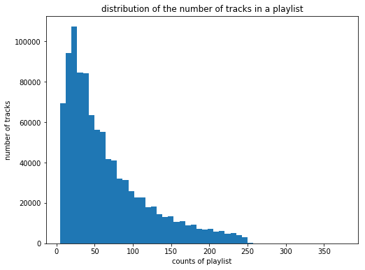
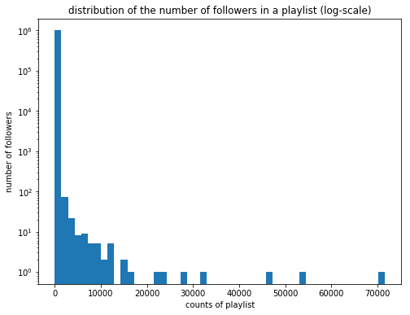

## Contents
{:.no_toc}
*  
{: toc}


## 1. Research on Available Databases

### (1) Million Playlist Dataset

- Million Playlist Dataset is a very large playlist dataset provided by Spotify, particularly prepared for RecSys Challenge 2018 (https://recsys-challenge.spotify.com/). It consists of 1000 files in .json format, and each file contains 1000 user-created playlists, which makes 1 million playlists in 5.4 GB. The dataset was generated in December, 2017.


- Data format:
    - For each playlist, available data are:
        - `name` (string): The name of the playlist.
        - `collaborative` (Boolean): `true` if the owner allows other users to modify the playlist.
        - `pid` (int): Position ID number of the playlist in the dataset (0 - 999999).
        - `modified_at` (timestamp): The timestamp when the playlist was list modified.
        - `num_tracks` (int): The number of tracks in the playlist.
        - `num_albums` (int): The number of unique albums in the playlist.
        - `num_followers` (int): The number of followers of the playlist.
        - `tracks` (dictionary): The list of tracks in the playlist (see below).
        - `num_edits` (int): The number of edits that has been made so far.
        - `duration_ms` (int): The total duration of the playlist in milliseconds.
        - `num_artists` (int): The number of unique artists in the playlist.
    - For each track in a playlist, available data are:
        - `pos` (int): Position ID number of the track in the playlist.
        - `artist_name` (string): The name of the artist of the track.
        - `track_uri` (uri): The URI for the track.
        - `artist_uri` (uri): The URI for the artist of the track.
        - `track_name` (string): The name of the track.
        - `album_uri` (uri): The URI for the album of the track.
        - `duration_ms` (int): The duration of the track in milliseconds.
        - `album_name` (string): The name of the album of the track.


- Below will show an example data format for the 0th playlist in the 0th file (output hidden):


```python
FILENAME = 'data/mpd.slice.0-999.json'
with open(FILENAME, "r") as fd:
    playlist_data = json.load(fd)
    
playlist_data['playlists'][0]
```


- Notes:
    - As the entire dataset is too large, data resizing (resampling) is required.
    - Although not many types of data are available in the dataset, but it does provide URIs for track, artist, and album for each track, which can be used in Spotify API to query more data (see below).

### (2) Spotify Web API

- Spotify Web API (https://developer.spotify.com/documentation/web-api/) is a developer's tool provided by Spotify, particularly for developing web applications related to Spotify. Based on simple REST principles, the Spotify Web API endpoints return JSON metadata about music artists, albums, and tracks, directly from the Spotify Data Catalogue. Web API also provides access to user related data, like playlists and music that the user saves in the Your Music library. Such access is enabled through selective authorization, by the user. The API provides a set of endpoints, each with its own unique path. To access private data through the Web API, such as user profiles and playlists, an application must get the user's permission to access the data. Authorization is via the Spotify Accounts service.


- For this project, we have used Spotipy (https://spotipy.readthedocs.io/), which is a lightweight Python library for the Spotify Web API. With Spotipy we can get full access to all of the music data provided by the Spotify platform. Below we list some key function endpoints provided by Spotipy.

- `spotipy.Spotify().track(track_uri)`: Get Spotify catalog information for a single track identified by its unique Spotify ID. (https://developer.spotify.com/documentation/web-api/reference/tracks/get-track/)
    - `album` (a simplified `album object`): The album on which the track appears. The album object includes a link in `href` to full information about the album.
    - `artists` (an array of simplified `artist objects`): The artists who performed the track. Each artist object includes a link in `href` to more detailed information about the artist.
    - `available_markets` (array of strings): A list of the countries in which the track can be played, identified by their `ISO 3166-1 alpha-2 code`.
    - `disc_number` (int): 	The disc number (usually `1` unless the album consists of more than one disc).
    - `duration_ms` (int): The track length in milliseconds.
    - `explicit` (Boolean): Whether or not the track has explicit lyrics (`true` = yes it does; `false` = no it does not OR unknown).
    - `external_ids` (an `external ID object`): Known external IDs for the track.
    - `external_urls` (an `external URL object`): Known external URLs for this track.
    - `href` (string): A link to the Web API endpoint providing full details of the track.
    - `id` (string): The `Spotify ID` for the track.
    - `name` (string): The name of the track.
    - `popularity` (int): The popularity of the track. The value will be between 0 and 100, with 100 being the most popular. The popularity of a track is a value between 0 and 100, with 100 being the most popular. The popularity is calculated by algorithm and is based, in the most part, on the total number of plays the track has had and how recent those plays are. Generally speaking, songs that are being played a lot now will have a higher popularity than songs that were played a lot in the past. Duplicate tracks (e.g. the same track from a single and an album) are rated independently. Artist and album popularity is derived mathematically from track popularity. Note that the popularity value may lag actual popularity by a few days: the value is not updated in real time.
    - `preview_url` (string): A link to a 30 second preview (MP3 format) of the track. Can be `null`.
    - `track_number` (int): The number of the track. If an album has several discs, the track number is the number on the specified disc.
    - `type` (string): The object type, `track`.
    - `uri` (string): The `Spotify URI` for the track.
    
    
- Below will show an example data provided by `spotipy.Spotify().track(track_uri)` for the 0th track in the 0th playlist in the 0th file (output hidden):


```python
TRACK_URI = playlist_data['playlists'][0]['tracks'][0]['track_uri']
sp.track(TRACK_URI)
```


- `spotipy.Spotify().artist(artist_uri)`: Get Spotify catalog information for a single artist identified by their unique Spotify ID. (https://developer.spotify.com/documentation/web-api/reference/artists/get-artist/)
    - `external_urls` (an `external URL object`): Known external URLs for this artist.
    - `followers` (a `followers object`): Information about the followers of the artist.
    - `genres` (array of strings): A list of the genres the artist is associated with. For example: `Prog Rock`, `Post-Grunge`. (If not yet classified, the array is empty.)
    - `href` (string): A link to the Web API endpoint providing full details of the artist.
    - `id` (string): The `Spotify ID` for the artist.
    - `images` (array of `image objects`): Images of the artist in various sizes, widest first.
    - `name` (string): The name of the artist.
    - `popularity` (int): The popularity of the artist. The value will be between 0 and 100, with 100 being the most popular. The artist's popularity is calculated from the popularity of all the artist's tracks.
    - `type` (string): The object type, `artist`.
    - `uri` (string): The `Spotify URI` for the artist.


- Below shows an example data provided by `spotipy.Spotify().artist(artist_uri)` for the artist of the 0th track in the 0th playlist in the 0th file:


```python
ARTIST_URI = playlist_data['playlists'][0]['tracks'][0]['artist_uri']
sp.artist(ARTIST_URI)
```


    {'external_urls': {'spotify': 'https://open.spotify.com/artist/2wIVse2owClT7go1WT98tk'},
     'followers': {'href': None, 'total': 909727},
     'genres': ['dance pop',
      'hip hop',
      'hip pop',
      'pop',
      'pop rap',
      'r&b',
      'rap',
      'southern hip hop',
      'urban contemporary'],
     'href': 'https://api.spotify.com/v1/artists/2wIVse2owClT7go1WT98tk',
     'id': '2wIVse2owClT7go1WT98tk',
     'images': [{'height': 640,
       'url': 'https://i.scdn.co/image/055260c034b93dae018b8cd70bc9f1acc2843af3',
       'width': 640},
      {'height': 320,
       'url': 'https://i.scdn.co/image/2642935f38deb4f2305cabfd996babec8796d469',
       'width': 320},
      {'height': 160,
       'url': 'https://i.scdn.co/image/11323b9db35fb2b10c1676a0eeeb5ff8a4ed32e8',
       'width': 160}],
     'name': 'Missy Elliott',
     'popularity': 76,
     'type': 'artist',
     'uri': 'spotify:artist:2wIVse2owClT7go1WT98tk'}


- `spotipy.Spotify().album(album_uri)`: Get Spotify catalog information for a single album. (https://developer.spotify.com/documentation/web-api/reference/albums/get-album/)
    - `album_type` (string): The type of the album, one of `album`, `single`, or `compilation`.
    - `artists` (array of simplified `artist objects`): The artists of the album. Each artist object includes a link in `href` to more detailed information about the artist.
    - `available_markets` (array of strings): The markets in which the album is available in `ISO 3166-1 alpha-2 country codes`. Note that an album is considered available in a market when at least 1 of its tracks is available in that market.
    - `copyrights` (array of copyright objects): The copyright statements of the album.
    - `external_ids` (an `external ID object`): Known external IDs for the album.
    - `external_urls` (an `external URL object`): Known external URLs for this album.
    - `followers` (a `followers object`): Information about the followers of the artist.
    - `genres` (array of strings): A list of the genres used to classify the album. For example: `Prog Rock`, `Post-Grunge`. (If not yet classified, the array is empty.)
    - `href` (string): A link to the Web API endpoint providing full details of the album.
    - `id` (string): The `Spotify ID` for the album.
    - `images` (array of `image objects`): The cover art for the album in various sizes, widest first.
    - `label` (string): The label for the album.
    - `name` (string): The name of the album. In case of an album takedown, the value may be an empty string.
    - `popularity` (int): The popularity of the album. The value will be between 0 and 100, with 100 being the most popular. The popularity is calculated from the popularity of the album’s individual tracks.
    - `release_date` (string): The date the album was first released, for example `1981-12-15`. Depending on the precision, it might be shown as `1981` or `1981-12`.
    - `release_date_precision` (string): The precision with which release_date value is known, `year`, `month`, or `day`.
    - `tracks` (array of simplified `track objects` inside a `paging object`): The tracks of the album.
    - `type` (string): The object type, `album`.
    - `uri` (string): The `Spotify URI` for the album.


- Below will show an example data provided by `spotipy.Spotify().album(album_uri)` for the album of the 0th track in the 0th playlist in the 0th file (output hidden):


```python
ALBUM_URI = playlist_data['playlists'][0]['tracks'][0]['album_uri']
sp.album(ALBUM_URI)
```


- `spotipy.Spotify().audio_features(track_uri)`: Get audio feature information for a single track identified by its unique Spotify ID. (https://developer.spotify.com/documentation/web-api/reference/tracks/get-audio-features/)
    - `danceability` (float): Danceability describes how suitable a track is for dancing based on a combination of musical elements including tempo, rhythm stability, beat strength, and overall regularity. A value of 0.0 is least danceable and 1.0 is most danceable.
    
    
    
    - `energy` (float): Energy is a measure from 0.0 to 1.0 and represents a perceptual measure of intensity and activity. Typically, energetic tracks feel fast, loud, and noisy. For example, death metal has high energy, while a Bach prelude scores low on the scale. Perceptual features contributing to this attribute include dynamic range, perceived loudness, timbre, onset rate, and general entropy.
    
    
    
    - `Key` (int): The estimated overall key of the track. Integers map to pitches using standard `Pitch Class notation`. E.g. 0 = C, 1 = C♯/D♭, 2 = D, and so on. If no key was detected, the value is -1.
    - `loudness` (float): The overall loudness of a track in decibels (dB). Loudness values are averaged across the entire track and are useful for comparing relative loudness of tracks. Loudness is the quality of a sound that is the primary psychological correlate of physical strength (amplitude). Values typical range between -60 and 0 db.
    
    
    
    - `mode` (int): Mode indicates the modality (major or minor) of a track, the type of scale from which its melodic content is derived. Major is represented by 1 and minor is 0.
    - `speechiness` (float): Speechiness detects the presence of spoken words in a track. The more exclusively speech-like the recording (e.g. talk show, audio book, poetry), the closer to 1.0 the attribute value. Values above 0.66 describe tracks that are probably made entirely of spoken words. Values between 0.33 and 0.66 describe tracks that may contain both music and speech, either in sections or layered, including such cases as rap music. Values below 0.33 most likely represent music and other non-speech-like tracks.
    
    
    
    - `acousticness` (float): A confidence measure from 0.0 to 1.0 of whether the track is acoustic. 1.0 represents high confidence the track is acoustic.
    
    
    
    - `instrumentalness` (float): Predicts whether a track contains no vocals. “Ooh” and “aah” sounds are treated as instrumental in this context. Rap or spoken word tracks are clearly “vocal”. The closer the instrumentalness value is to 1.0, the greater likelihood the track contains no vocal content. Values above 0.5 are intended to represent instrumental tracks, but confidence is higher as the value approaches 1.0.
    
    
    
    - `liveness` (float): Detects the presence of an audience in the recording. Higher liveness values represent an increased probability that the track was performed live. A value above 0.8 provides strong likelihood that the track is live.
    
    
    
    - `valence` (float): A measure from 0.0 to 1.0 describing the musical positiveness conveyed by a track. Tracks with high valence sound more positive (e.g. happy, cheerful, euphoric), while tracks with low valence sound more negative (e.g. sad, depressed, angry).
    
    
    
    - `tempo` (float): The overall estimated tempo of a track in beats per minute (BPM). In musical terminology, tempo is the speed or pace of a given piece and derives directly from the average beat duration.
    
    
    
    - `type` (string): The object type, `audio_features`.
    - `id` (string): The `Spotify ID` for the track.
    - `uri` (string): The `Spotify URI` for the track.
    - `track_href` (string): A link to the Web API endpoint providing full details of the track.
    - `analysis_url` (string): An HTTP URL to access the full audio analysis of this track. An access token is required to access this data.
    - `duration_ms` (int): The duration of the track in milliseconds.
    - `time_signature` (int): An estimated overall time signature of a track. The time signature (meter) is a notational convention to specify how many beats are in each bar (or measure).


- Below shows an example data provided by `spotipy.Spotify().audio_features(track_uri)` for the 0th track in the 0th playlist in the 0th file:


```python
TRACK_URI = playlist_data['playlists'][0]['tracks'][0]['track_uri']
sp.audio_features(TRACK_URI)
```


    [{'danceability': 0.904,
      'energy': 0.813,
      'key': 4,
      'loudness': -7.105,
      'mode': 0,
      'speechiness': 0.121,
      'acousticness': 0.0311,
      'instrumentalness': 0.00697,
      'liveness': 0.0471,
      'valence': 0.81,
      'tempo': 125.461,
      'type': 'audio_features',
      'id': '0UaMYEvWZi0ZqiDOoHU3YI',
      'uri': 'spotify:track:0UaMYEvWZi0ZqiDOoHU3YI',
      'track_href': 'https://api.spotify.com/v1/tracks/0UaMYEvWZi0ZqiDOoHU3YI',
      'analysis_url': 'https://api.spotify.com/v1/audio-analysis/0UaMYEvWZi0ZqiDOoHU3YI',
      'duration_ms': 226864,
      'time_signature': 4}]


- `spotipy.Spotify().artist_related_artists(artist_uri)`: Get Spotify catalog information about artists similar to a given artist. Similarity is based on analysis of the Spotify community's listening history.
(https://developer.spotify.com/documentation/web-api/reference/artists/get-related-artists/)
    - `artists` (array of `artist objects`): Up to 20 related artists to the artist.


- Below shows an example data provided by `spotipy.Spotify().artist_related_artists(artist_uri)` for the artist of the 0th track in the 0th playlist in the 0th file:


```python
ARTIST_URI = playlist_data['playlists'][0]['tracks'][0]['artist_uri']
sp.artist_related_artists(ARTIST_URI)
```


- `spotipy.Spotify().artist_top_tracks(artist_uri)`: Get Spotify catalog information about an artist’s top tracks by country.
(https://developer.spotify.com/documentation/web-api/reference/artists/get-artists-top-tracks)
    - `tracks` (array of `track objects`): Up to 10 top tracks of the artist.


- Below shows an example data provided by `spotipy.Spotify().artist_top_tracks(artist_uri)` for the artist of the 0th track in the 0th playlist in the 0th file:


```python
ARTIST_URI = playlist_data['playlists'][0]['tracks'][0]['artist_uri']
sp.artist_top_tracks(ARTIST_URI)
```


- Notes:
  - There may be high multicollinearity in these data, as these are a mix of primary and secondary information. For example, Spotify Web API explains that the danceability is based on other primary data including tempo, while the energy is based on some other primary data including loudness. Therefore, it would be important to find a method that are insensitive to the multicollinearity among columns.

### (3) Genius API

- Genius (https://genius.com/) is an American digital media library, particularly specialized for song lyrics and musical knowledge. Genius provides public Genius API where we can access lyrics data for songs.


- Below shows a screen capture of https://genius.com/Missy-elliott-lose-control-lyrics, which is the 0th track in the 0th playlist in the 0th file, along with the developer tool.


- Below shows a html-parsed result of this page by using `requests` and `BeautifulSoup`:


```python
GeniusURL = "https://genius.com/Missy-elliott-lose-control-lyrics"
BeautifulSoup(requests.get(GeniusURL).text,'html.parser')
```


- Using Genius API, this information is more easily accessible.


```python
requests.get('https://api.genius.com', data={'q': 'Lose Control Missy Elliott'}, headers={'Authorization': 'Bearer ' + Genius_TOKEN}).text
```


    '{"meta":{"status":403,"message":"Action forbidden for current scope"}}'


### (4) Lyrics Wiki

- Lyrics Wiki (http://lyrics.wikia.com/wiki/LyricWiki) is a large database for lyrics. Lyrics for a certain song can be scraped at http://lyrics.wikia.com/wiki/[artist_name]:[track_name].


- Below shows a screen capture of http://lyrics.wikia.com/wiki/Missy_Elliott:Lose_Control, which is the 0th track in the 0th playlist in the 0th file, along with the developer tool.


- Below shows a html-parsed result of this page by using `requests` and `BeautifulSoup`:


```python
LyricsWikiURL = "http://lyrics.wikia.com/wiki/Missy_Elliott:Lose_Control"
BeautifulSoup(requests.get(LyricsWikiURL).text,'html.parser')
```


## 2. Data Resampling

- As mentioned earlier, the Million Playlist Dataset is too large to handle, we have decided to resize/resample the data.

- We have decided to sample 1000 playlists among the 1 million playlists, and the selection criteria were as follows:
    - The number of followers should be equal or greater than 20.
        - If the number of followers is too few, e.g. 1 only the person who created the playlist, the taste of the playlist might be highly biased and/or inconsistent. To ensure the consistency and generalizability, we set a lower bound to the number of followers.
    - The number of tracks should be greater than 55.
        - If there are too few number of tracks in a playlist, it would be very hard to split the train and test sets, preventing meaningful predictions. We set the minimum size of both training and test sets as 25, with margin 5, so the minimum number of tracks was determined as 55.
    - Among the playlists that meets the criteria above, randomly sample 1000 playlists.
        - We may select 1000 playlists in the order of the number of followers, but in this way, the samples may also be biased by having too popular musics only.

- The `playlist_stat.npy` below contains pre-prepared data (separate ipynb and pdf are attached) for the number of followers and the number of tracks in the Million Playlist:


```python
playlist_stat = np.load('data/playlist_stat.npy')
```


- The distribution of the number of tracks in a playlist for the Million Playlist Dataset is like below:


```python
plt.figure(figsize=[8,6])
plt.hist(playlist_stat[:,4],bins=50)
plt.title('distribution of the number of tracks in a playlist')
plt.xlabel('counts of playlist')
plt.ylabel('number of tracks')
plt.show()

from statistics import mode
mode(playlist_stat[:,4])
```





    20.0


- Thus, the number of tracks in a playlist shows a right-skewed distribution and the most fequent number is 20.

- Similarly, the distribution of the number of followers of a playlists for the Million Playlist Dataset is like below:


```python
plt.figure(figsize=[8,6])
plt.hist(playlist_stat[:,3], bins=50, log=True)
plt.title('distribution of the number of followers in a playlist (log-scale)')
plt.xlabel('counts of playlist')
plt.ylabel('number of followers')
plt.show()
```





- Note that, this is in log scale. As shown, a majority of the playlists has 1 follower (the creater of the playlist themselves), and only few playlists has 10000+ followers.

- Based on the criteria above, we've sampled playlists that have 55+ tracks, and eligible playlists are 447703 playlists out of 1 million.


```python
playlist_stat_55 = playlist_stat[playlist_stat[:,4]>55,:]
playlist_stat_55.shape[0]
```


    447703


- Among the 447703 playlists selected, depending on the number of followers that we select as the lower bound, the final number of eligible playlists is like below:


```python
print('[followers]\t[playlists]')
print(40, '\t\t', sum(playlist_stat_55[:,3]>=40))
print(30, '\t\t', sum(playlist_stat_55[:,3]>=30))
print(20, '\t\t', sum(playlist_stat_55[:,3]>=20))
print(10, '\t\t', sum(playlist_stat_55[:,3]>=10))
print(5, '\t\t', sum(playlist_stat_55[:,3]>=5))
```


    [followers]	[playlists]
    40 		 919
    30 		 1211
    20 		 1852
    10 		 5070
    5 		 20726
    


- This indicates that, if we select the lower bound of the number of followers as 20 based on the criteria above, 1852 playlists out of 1 million will be eligible. We believe 1852 to 1000 is a reasonable down-sampling rate, so we sampled 1000 playlists among these 1852 playlists by using `np.random.seed(0)` and `np.random.choice` (separate ipynb and pdf are attached).

## 3. Scaping and Constructing Data Structure

### (1) Initial Data Structure from Million Playlist Dataset

- After sampling 1000 playlists out of eligible 1852 playlists, we constructed initial data structure as a Pandas DataFrame. The initial data structure contains all the information provided by the Million Playlist Dataset.
    - For each playlist, available data are:
        - `name` (string): The name of the playlist.
        - `collaborative` (Boolean): `true` if the owner allows other users to modify the playlist.
        - `pid` (int): Position ID number of the playlist in the dataset (0 - 999999).
        - `modified_at` (timestamp): The timestamp when the playlist was list modified.
        - `num_tracks` (int): The number of tracks in the playlist.
        - `num_albums` (int): The number of unique albums in the playlist.
        - `num_followers` (int): The number of followers of the playlist.
        - `tracks` (dictionary): The list of tracks in the playlist (see below).
        - `num_edits` (int): The number of edits that has been made so far.
        - `duration_ms` (int): The total duration of the playlist in milliseconds.
        - `num_artists` (int): The number of unique artists in the playlist.
    - For each track in a playlist, available data are:
        - `pos` (int): Position ID number of the track in the playlist.
        - `artist_name` (string): The name of the artist of the track.
        - `track_uri` (uri): The URI for the track.
        - `artist_uri` (uri): The URI for the artist of the track.
        - `track_name` (string): The name of the track.
        - `album_uri` (uri): The URI for the album of the track.
        - `duration_ms` (int): The duration of the track in milliseconds.
        - `album_name` (string): The name of the album of the track.
- For each playlist, we select the first 55 tracks, so that all playlists have the same contribution to the model. This will makes the number of tracks 550000.

- The `playlists_df_sort.pkl` below contains pre-prepared data (separate ipynb and pdf are attached) for initial data structure contains 550000 tracks from the 1000 playlists.


```python
playlists_df_sort = pd.read_pickle('data/playlists_df_sort.pkl')
display(playlists_df_sort.head())
display(playlists_df_sort.describe())
display(playlists_df_sort.shape)
```


<div>
<style scoped>
    .dataframe tbody tr th:only-of-type {
        vertical-align: middle;
    }

    .dataframe tbody tr th {
        vertical-align: top;
    }

    .dataframe thead th {
        text-align: right;
    }
</style>
<table border="1" class="dataframe">
  <thead>
    <tr style="text-align: right;">
      <th></th>
      <th>album_name</th>
      <th>album_uri</th>
      <th>artist_name</th>
      <th>artist_uri</th>
      <th>collaborative</th>
      <th>description</th>
      <th>duration_ms</th>
      <th>modified_at</th>
      <th>name</th>
      <th>num_albums</th>
      <th>num_artists</th>
      <th>num_edits</th>
      <th>num_followers</th>
      <th>num_tracks</th>
      <th>pid</th>
      <th>playlist_duration_ms</th>
      <th>pos</th>
      <th>track_name</th>
      <th>track_uri</th>
    </tr>
  </thead>
  <tbody>
    <tr>
      <th>0</th>
      <td>127 Hours</td>
      <td>spotify:album:70wOJPVD0SKMn0DtddtZP3</td>
      <td>Free Blood</td>
      <td>spotify:artist:58cwi0vXDQEihBLREQTBGG</td>
      <td>false</td>
      <td></td>
      <td>351640</td>
      <td>1492992000</td>
      <td>BIKING</td>
      <td>97</td>
      <td>93</td>
      <td>67</td>
      <td>31</td>
      <td>100</td>
      <td>391407</td>
      <td>24415031</td>
      <td>0</td>
      <td>Never Hear Surf Music Again</td>
      <td>spotify:track:0PxPcrfAXNu0MpKRwdlbuc</td>
    </tr>
    <tr>
      <th>1</th>
      <td>Waves</td>
      <td>spotify:album:2R6wefBXnMzCkRoqD7FdNk</td>
      <td>Joey Bada$$</td>
      <td>spotify:artist:2P5sC9cVZDToPxyomzF1UH</td>
      <td>false</td>
      <td></td>
      <td>213333</td>
      <td>1492992000</td>
      <td>BIKING</td>
      <td>97</td>
      <td>93</td>
      <td>67</td>
      <td>31</td>
      <td>100</td>
      <td>391407</td>
      <td>24415031</td>
      <td>1</td>
      <td>Waves</td>
      <td>spotify:track:1fb6b2Mas9q2mWxJazzeRI</td>
    </tr>
    <tr>
      <th>2</th>
      <td>Every Kingdom</td>
      <td>spotify:album:2MxcbOGFi99D9JACvj74AH</td>
      <td>Ben Howard</td>
      <td>spotify:artist:5schNIzWdI9gJ1QRK8SBnc</td>
      <td>false</td>
      <td></td>
      <td>309346</td>
      <td>1492992000</td>
      <td>BIKING</td>
      <td>97</td>
      <td>93</td>
      <td>67</td>
      <td>31</td>
      <td>100</td>
      <td>391407</td>
      <td>24415031</td>
      <td>2</td>
      <td>The Wolves</td>
      <td>spotify:track:3gqP2hxwgi6mb8FhtEe4zU</td>
    </tr>
    <tr>
      <th>3</th>
      <td>Wasting Light</td>
      <td>spotify:album:5lnQLEUiVDkLbFJHXHQu9m</td>
      <td>Foo Fighters</td>
      <td>spotify:artist:7jy3rLJdDQY21OgRLCZ9sD</td>
      <td>false</td>
      <td></td>
      <td>286466</td>
      <td>1492992000</td>
      <td>BIKING</td>
      <td>97</td>
      <td>93</td>
      <td>67</td>
      <td>31</td>
      <td>100</td>
      <td>391407</td>
      <td>24415031</td>
      <td>3</td>
      <td>Bridge Burning</td>
      <td>spotify:track:0bHD1nLe7Nhw55ZGJ92332</td>
    </tr>
    <tr>
      <th>4</th>
      <td>Sweet Disarray</td>
      <td>spotify:album:2qg3JERQKBjZXvMBtvKR0y</td>
      <td>Dan Croll</td>
      <td>spotify:artist:5Rr15NSbi1Xjno1AEP9u21</td>
      <td>false</td>
      <td></td>
      <td>196848</td>
      <td>1492992000</td>
      <td>BIKING</td>
      <td>97</td>
      <td>93</td>
      <td>67</td>
      <td>31</td>
      <td>100</td>
      <td>391407</td>
      <td>24415031</td>
      <td>4</td>
      <td>From Nowhere</td>
      <td>spotify:track:5c9YHjSjEZxaCxsF1Gy5Jt</td>
    </tr>
  </tbody>
</table>
</div>


<div>
<style scoped>
    .dataframe tbody tr th:only-of-type {
        vertical-align: middle;
    }

    .dataframe tbody tr th {
        vertical-align: top;
    }

    .dataframe thead th {
        text-align: right;
    }
</style>
<table border="1" class="dataframe">
  <thead>
    <tr style="text-align: right;">
      <th></th>
      <th>duration_ms</th>
      <th>modified_at</th>
      <th>num_albums</th>
      <th>num_artists</th>
      <th>num_edits</th>
      <th>num_followers</th>
      <th>num_tracks</th>
      <th>pid</th>
      <th>playlist_duration_ms</th>
      <th>pos</th>
    </tr>
  </thead>
  <tbody>
    <tr>
      <th>count</th>
      <td>5.500000e+04</td>
      <td>5.500000e+04</td>
      <td>55000.000000</td>
      <td>55000.00000</td>
      <td>55000.000000</td>
      <td>55000.000000</td>
      <td>55000.000000</td>
      <td>55000.000000</td>
      <td>5.500000e+04</td>
      <td>55000.000000</td>
    </tr>
    <tr>
      <th>mean</th>
      <td>2.350665e+05</td>
      <td>1.481653e+09</td>
      <td>88.700000</td>
      <td>64.90000</td>
      <td>38.719000</td>
      <td>471.814000</td>
      <td>126.793000</td>
      <td>497957.939000</td>
      <td>2.964576e+07</td>
      <td>27.000000</td>
    </tr>
    <tr>
      <th>std</th>
      <td>7.615811e+04</td>
      <td>3.638871e+07</td>
      <td>46.491755</td>
      <td>37.78886</td>
      <td>32.297601</td>
      <td>2867.397217</td>
      <td>53.436149</td>
      <td>287955.184373</td>
      <td>1.318153e+07</td>
      <td>15.874652</td>
    </tr>
    <tr>
      <th>min</th>
      <td>2.060000e+02</td>
      <td>1.298765e+09</td>
      <td>4.000000</td>
      <td>3.00000</td>
      <td>2.000000</td>
      <td>20.000000</td>
      <td>56.000000</td>
      <td>1923.000000</td>
      <td>9.243679e+06</td>
      <td>0.000000</td>
    </tr>
    <tr>
      <th>25%</th>
      <td>1.968930e+05</td>
      <td>1.468260e+09</td>
      <td>55.000000</td>
      <td>40.00000</td>
      <td>12.000000</td>
      <td>25.000000</td>
      <td>81.000000</td>
      <td>256333.750000</td>
      <td>1.872908e+07</td>
      <td>13.000000</td>
    </tr>
    <tr>
      <th>50%</th>
      <td>2.251460e+05</td>
      <td>1.498046e+09</td>
      <td>81.000000</td>
      <td>60.00000</td>
      <td>32.000000</td>
      <td>39.000000</td>
      <td>115.500000</td>
      <td>495125.000000</td>
      <td>2.681876e+07</td>
      <td>27.000000</td>
    </tr>
    <tr>
      <th>75%</th>
      <td>2.611548e+05</td>
      <td>1.507615e+09</td>
      <td>117.000000</td>
      <td>86.25000</td>
      <td>54.000000</td>
      <td>104.000000</td>
      <td>166.000000</td>
      <td>742869.750000</td>
      <td>3.841217e+07</td>
      <td>41.000000</td>
    </tr>
    <tr>
      <th>max</th>
      <td>4.504400e+06</td>
      <td>1.509494e+09</td>
      <td>234.000000</td>
      <td>194.00000</td>
      <td>179.000000</td>
      <td>53519.000000</td>
      <td>250.000000</td>
      <td>997547.000000</td>
      <td>9.654618e+07</td>
      <td>54.000000</td>
    </tr>
  </tbody>
</table>
</div>


    (55000, 19)


- As shown, the initial data structure contains 55000 track data (1000 playlists * 55 tracks/playlist), and the number of columns is 19, but only 10 of them are numeric, indicating there are not enough numeric data to build model and make prediction.

### (2) Data Scraping from Spotify API

- As mentioned above, by using `album_uri`, `artist_uri`, and `track_uri` in the intial data structure, we can scrape more data using Spotify API. We have created custom python functions to scrape information using different Spotify API function endpoints.

- `AddAudioFeatures`: adds `danceability`, `energy`, `key`, `loudness`, `mode`, `speechiness`, `acousticness`, `instrumentalness`, `liveness`, `valence`, `tempo`, and `time_signature` of the track by using `spotipy.Spotify().audio_features(track_uri)`:


```python
def AddAudioFeatures(df, ind, sp):
    try:
        audio_feature = sp.audio_features(df.loc[ind]['track_uri'])[0]
    except:
        print('No ID at ' + str(ind))
    else:
        feature_list = ['danceability','energy','key','loudness','mode','speechiness','acousticness',
                        'instrumentalness','liveness','valence','tempo','time_signature']

        for feature in feature_list:
            df.at[ind, feature] = audio_feature[feature]
```


- `AddTrackPopularity`: adds `popularity` of the track by using `spotipy.Spotify().track(track_uri)`:


```python
def AddTrackPopularity(df, ind, sp):
    try:
        track_info = sp.track(df.loc[ind]['track_uri'])
    except:
        print('No ID at ' + str(ind))
    else:
        df.at[ind, 'popularity'] = track_info['popularity']
```


- `AddArtistGenres`: adds genres of the artist with one-hot encoding using `spotipy.Spotify().artist(artist_uri)`. Note that this is genres of the artist, not of the track, as the Spotify API doesn't provide genre for each track. Also, note that as a list of genres, we used `spotipy.Spotify().recommendation_genre_seeds()['genres']`, which contains names of 126 basic genres.


```python
def AddArtistGenres(df, ind, sp):
    try:
        artist_info = sp.artist(df.loc[ind]['artist_uri'])
    except:
        print('No ID at ' + str(ind))
    else:
        genre_list = sp.recommendation_genre_seeds()['genres']

        for gen in genre_list:
            if gen in artist_info['genres']:
                df.at[ind, gen] = 1
            else:
                df.at[ind, gen] = 0
```


- `AddAlbumYear`: adds the year when the album came out using `spotipy.Spotify().album(album_uri)`. Note that Spotify API provides the `release_date` in `YYYY-MM-DD` form, so the first part of the string is converted into an integer.


```python
def AddAlbumYear(df, ind, sp):
    try:
        album_info = sp.album(df.loc[ind]['album_uri'])
    except:
        print('No ID at ' + str(ind))
    else:
        df.at[ind, 'year'] = int(album_info['release_date'].split('-')[0])
```


- `AddTopTracks`: adds the number of top tracks of the artist as well as URIs of all of the top tracks using `spotipy.Spotify().artist_top_tracks(artist_uri)`. If the number of top tracks is less than 10, the remainings will be filled with blank.


```python
def AddTopTracks(df, ind, sp):    
    try:
        top_track_info = sp.artist_top_tracks(df.loc[ind]['artist_uri'])['tracks']
    except:
        print('\n No ID at ' + str(ind) + '\n')
        print(df.loc[ind]['artist_uri'])
    else:
        n = len(top_track_info)
        df.at[ind, 'top_track_n'] = n
        
        for i in range(10):
            if i in range(n):
                df.at[ind, 'top_track_'+str(i)] = top_track_info[i]['uri']
            else:
                df.at[ind, 'top_track_'+str(i)] = ''
```


- AddRelatedArtists: adds the number of related artists of the artist as well as URIs of all of the related artists using `spotipy.Spotify().artist_related_artists(artist_uri)`. If the number of related artists is less than 20, the remainings will be filled with blank.


```python
def AddRelatedArtists(df, ind, sp):
    try:
        related_artist_info = sp.artist_related_artists(df.loc[ind]['artist_uri'])['artists']
    except:
        print('\n No ID at ' + str(ind) + '\n')
        print(df.loc[ind]['artist_uri'])
    else:
        n = len(related_artist_info)
        df.at[ind, 'related_artist_n'] = n
        
        for i in range(20):
            if i in range(n):
                df.at[ind, 'related_artist_'+str(i)] = related_artist_info[i]['uri']
            else:
                df.at[ind, 'related_artist_'+str(i)] = ''
```


### (3) Data Scraping from Genius API and Lyrics Wiki

- As mentioned above, by scraping Genius API and Lyrics Wiki, we can get lyrics data where we can get more information by using natural language processing. As both database have many missing data, we have used both databases to minimize the possibility of missing data.


- Of note, unlike Spotify API where we can directly use the URIs for the track, artist, and albums, for lyrics we had to rely on search query given to the databases. Thus, we have tried as many as possible combinations of the search terms and have tried to deal with special cases (special letters, languages other than English, etc.). Thus, this part of the code is quite long and messy, so we decide to not include here, but we attach as separate files.


- The `playlists_df_full_part2.pkl` below contains pre-prepared data (separate ipynb and pdf are attached) for final data structure contains 550000 tracks with all scraped data.


```python
playlists_df_full_part2 = pd.read_pickle('data/playlists_df_full_part2.pkl')
display(playlists_df_full_part2.head())
display(playlists_df_full_part2.describe())
display(playlists_df_full_part2.shape)
```


<div>
<style scoped>
    .dataframe tbody tr th:only-of-type {
        vertical-align: middle;
    }

    .dataframe tbody tr th {
        vertical-align: top;
    }

    .dataframe thead th {
        text-align: right;
    }
</style>
<table border="1" class="dataframe">
  <thead>
    <tr style="text-align: right;">
      <th></th>
      <th>acoustic</th>
      <th>acousticness</th>
      <th>afrobeat</th>
      <th>album_name</th>
      <th>album_uri</th>
      <th>alt-rock</th>
      <th>alternative</th>
      <th>ambient</th>
      <th>anime</th>
      <th>artist_name</th>
      <th>artist_uri</th>
      <th>black-metal</th>
      <th>bluegrass</th>
      <th>blues</th>
      <th>bossanova</th>
      <th>brazil</th>
      <th>breakbeat</th>
      <th>british</th>
      <th>cantopop</th>
      <th>chicago-house</th>
      <th>children</th>
      <th>chill</th>
      <th>classical</th>
      <th>club</th>
      <th>collaborative</th>
      <th>comedy</th>
      <th>country</th>
      <th>dance</th>
      <th>danceability</th>
      <th>dancehall</th>
      <th>death-metal</th>
      <th>deep-house</th>
      <th>description</th>
      <th>detroit-techno</th>
      <th>disco</th>
      <th>disney</th>
      <th>drum-and-bass</th>
      <th>dub</th>
      <th>dubstep</th>
      <th>duration_ms</th>
      <th>edm</th>
      <th>electro</th>
      <th>electronic</th>
      <th>emo</th>
      <th>energy</th>
      <th>folk</th>
      <th>forro</th>
      <th>french</th>
      <th>funk</th>
      <th>garage</th>
      <th>...</th>
      <th>related_artist_9</th>
      <th>related_artist_n</th>
      <th>road-trip</th>
      <th>rock</th>
      <th>rock-n-roll</th>
      <th>rockabilly</th>
      <th>romance</th>
      <th>sad</th>
      <th>salsa</th>
      <th>samba</th>
      <th>sertanejo</th>
      <th>show-tunes</th>
      <th>singer-songwriter</th>
      <th>ska</th>
      <th>sleep</th>
      <th>songwriter</th>
      <th>soul</th>
      <th>soundtracks</th>
      <th>spanish</th>
      <th>speechiness</th>
      <th>study</th>
      <th>summer</th>
      <th>swedish</th>
      <th>synth-pop</th>
      <th>tango</th>
      <th>techno</th>
      <th>tempo</th>
      <th>time_signature</th>
      <th>top_track_0</th>
      <th>top_track_1</th>
      <th>top_track_2</th>
      <th>top_track_3</th>
      <th>top_track_4</th>
      <th>top_track_5</th>
      <th>top_track_6</th>
      <th>top_track_7</th>
      <th>top_track_8</th>
      <th>top_track_9</th>
      <th>top_track_n</th>
      <th>track_name</th>
      <th>track_uri</th>
      <th>trance</th>
      <th>trial</th>
      <th>trip-hop</th>
      <th>try_idx</th>
      <th>turkish</th>
      <th>valence</th>
      <th>work-out</th>
      <th>world-music</th>
      <th>year</th>
    </tr>
  </thead>
  <tbody>
    <tr>
      <th>0</th>
      <td>0.0</td>
      <td>0.011400</td>
      <td>0.0</td>
      <td>127 Hours</td>
      <td>spotify:album:70wOJPVD0SKMn0DtddtZP3</td>
      <td>0.0</td>
      <td>0.0</td>
      <td>0.0</td>
      <td>0.0</td>
      <td>Free Blood</td>
      <td>spotify:artist:58cwi0vXDQEihBLREQTBGG</td>
      <td>0.0</td>
      <td>0.0</td>
      <td>0.0</td>
      <td>0.0</td>
      <td>0.0</td>
      <td>0.0</td>
      <td>0.0</td>
      <td>0.0</td>
      <td>0.0</td>
      <td>0.0</td>
      <td>0.0</td>
      <td>0.0</td>
      <td>0.0</td>
      <td>false</td>
      <td>0.0</td>
      <td>0.0</td>
      <td>0.0</td>
      <td>0.775</td>
      <td>0.0</td>
      <td>0.0</td>
      <td>0.0</td>
      <td></td>
      <td>0.0</td>
      <td>0.0</td>
      <td>0.0</td>
      <td>0.0</td>
      <td>0.0</td>
      <td>0.0</td>
      <td>351640</td>
      <td>0.0</td>
      <td>0.0</td>
      <td>0.0</td>
      <td>0.0</td>
      <td>0.828</td>
      <td>0.0</td>
      <td>0.0</td>
      <td>0.0</td>
      <td>0.0</td>
      <td>0.0</td>
      <td>...</td>
      <td>spotify:artist:6P4lf0XbkcwHMRlkTI5ACo</td>
      <td>20.0</td>
      <td>0.0</td>
      <td>0.0</td>
      <td>0.0</td>
      <td>0.0</td>
      <td>0.0</td>
      <td>0.0</td>
      <td>0.0</td>
      <td>0.0</td>
      <td>0.0</td>
      <td>0.0</td>
      <td>0.0</td>
      <td>0.0</td>
      <td>0.0</td>
      <td>0.0</td>
      <td>0.0</td>
      <td>0.0</td>
      <td>0.0</td>
      <td>0.0503</td>
      <td>0.0</td>
      <td>0.0</td>
      <td>0.0</td>
      <td>0.0</td>
      <td>0.0</td>
      <td>0.0</td>
      <td>108.016</td>
      <td>4.0</td>
      <td>spotify:track:3ihS3VFJaMoOiGnqNQkofK</td>
      <td>spotify:track:2cAlHfVD1Q2wEU6uwipRvc</td>
      <td>spotify:track:3PVBYmDOolNqNWQcrY85zn</td>
      <td>spotify:track:6eqyr38v77Y13G2EPX2Njl</td>
      <td>spotify:track:09H8bis4vzY3jEsVy5KYfF</td>
      <td>spotify:track:4GRLoSad0HeAkdKuysxZ87</td>
      <td>spotify:track:2C9UMgOxNro5N97v2ytzZu</td>
      <td></td>
      <td></td>
      <td></td>
      <td>7.0</td>
      <td>Never Hear Surf Music Again</td>
      <td>spotify:track:0PxPcrfAXNu0MpKRwdlbuc</td>
      <td>0.0</td>
      <td>0.0</td>
      <td>0.0</td>
      <td>0.0</td>
      <td>0.0</td>
      <td>0.531</td>
      <td>0.0</td>
      <td>0.0</td>
      <td>2010.0</td>
    </tr>
    <tr>
      <th>1</th>
      <td>0.0</td>
      <td>0.094400</td>
      <td>0.0</td>
      <td>Waves</td>
      <td>spotify:album:2R6wefBXnMzCkRoqD7FdNk</td>
      <td>0.0</td>
      <td>0.0</td>
      <td>0.0</td>
      <td>0.0</td>
      <td>Joey Bada$$</td>
      <td>spotify:artist:2P5sC9cVZDToPxyomzF1UH</td>
      <td>0.0</td>
      <td>0.0</td>
      <td>0.0</td>
      <td>0.0</td>
      <td>0.0</td>
      <td>0.0</td>
      <td>0.0</td>
      <td>0.0</td>
      <td>0.0</td>
      <td>0.0</td>
      <td>0.0</td>
      <td>0.0</td>
      <td>0.0</td>
      <td>false</td>
      <td>0.0</td>
      <td>0.0</td>
      <td>0.0</td>
      <td>0.591</td>
      <td>0.0</td>
      <td>0.0</td>
      <td>0.0</td>
      <td></td>
      <td>0.0</td>
      <td>0.0</td>
      <td>0.0</td>
      <td>0.0</td>
      <td>0.0</td>
      <td>0.0</td>
      <td>213333</td>
      <td>0.0</td>
      <td>0.0</td>
      <td>0.0</td>
      <td>0.0</td>
      <td>0.892</td>
      <td>0.0</td>
      <td>0.0</td>
      <td>0.0</td>
      <td>0.0</td>
      <td>0.0</td>
      <td>...</td>
      <td>spotify:artist:7BMccF0hQFBpP6417k1OtQ</td>
      <td>20.0</td>
      <td>0.0</td>
      <td>0.0</td>
      <td>0.0</td>
      <td>0.0</td>
      <td>0.0</td>
      <td>0.0</td>
      <td>0.0</td>
      <td>0.0</td>
      <td>0.0</td>
      <td>0.0</td>
      <td>0.0</td>
      <td>0.0</td>
      <td>0.0</td>
      <td>0.0</td>
      <td>0.0</td>
      <td>0.0</td>
      <td>0.0</td>
      <td>0.2930</td>
      <td>0.0</td>
      <td>0.0</td>
      <td>0.0</td>
      <td>0.0</td>
      <td>0.0</td>
      <td>0.0</td>
      <td>89.849</td>
      <td>4.0</td>
      <td>spotify:track:4ntsD33Pgsgk8rUyZLLiUV</td>
      <td>spotify:track:4txpZk7WSjV1dsZAw5WYcT</td>
      <td>spotify:track:7L9g4cPfohScjJ8mGwLQWr</td>
      <td>spotify:track:2ZVRyUFQTI5K99wpJElGrD</td>
      <td>spotify:track:6xz04ypw5JsqiyityCASG1</td>
      <td>spotify:track:6lM1G8kF3xCUW20lIRfoBm</td>
      <td>spotify:track:5URYXSFGks9Q8eYePlgVdL</td>
      <td>spotify:track:7g8rz7xe0G4Go0tTZAXcOx</td>
      <td>spotify:track:2DP3SfAM8g1hKPXKWyDptv</td>
      <td>spotify:track:5csdNgCD64XzhsyoRlhzsa</td>
      <td>10.0</td>
      <td>Waves</td>
      <td>spotify:track:1fb6b2Mas9q2mWxJazzeRI</td>
      <td>0.0</td>
      <td>0.0</td>
      <td>0.0</td>
      <td>0.0</td>
      <td>0.0</td>
      <td>0.712</td>
      <td>0.0</td>
      <td>0.0</td>
      <td>2012.0</td>
    </tr>
    <tr>
      <th>2</th>
      <td>0.0</td>
      <td>0.312000</td>
      <td>0.0</td>
      <td>Every Kingdom</td>
      <td>spotify:album:2MxcbOGFi99D9JACvj74AH</td>
      <td>0.0</td>
      <td>0.0</td>
      <td>0.0</td>
      <td>0.0</td>
      <td>Ben Howard</td>
      <td>spotify:artist:5schNIzWdI9gJ1QRK8SBnc</td>
      <td>0.0</td>
      <td>0.0</td>
      <td>0.0</td>
      <td>0.0</td>
      <td>0.0</td>
      <td>0.0</td>
      <td>0.0</td>
      <td>0.0</td>
      <td>0.0</td>
      <td>0.0</td>
      <td>0.0</td>
      <td>0.0</td>
      <td>0.0</td>
      <td>false</td>
      <td>0.0</td>
      <td>0.0</td>
      <td>0.0</td>
      <td>0.496</td>
      <td>0.0</td>
      <td>0.0</td>
      <td>0.0</td>
      <td></td>
      <td>0.0</td>
      <td>0.0</td>
      <td>0.0</td>
      <td>0.0</td>
      <td>0.0</td>
      <td>0.0</td>
      <td>309346</td>
      <td>0.0</td>
      <td>0.0</td>
      <td>0.0</td>
      <td>0.0</td>
      <td>0.531</td>
      <td>0.0</td>
      <td>0.0</td>
      <td>0.0</td>
      <td>0.0</td>
      <td>0.0</td>
      <td>...</td>
      <td>spotify:artist:2LSJrlndCuTpdEluvYHc2E</td>
      <td>20.0</td>
      <td>0.0</td>
      <td>0.0</td>
      <td>0.0</td>
      <td>0.0</td>
      <td>0.0</td>
      <td>0.0</td>
      <td>0.0</td>
      <td>0.0</td>
      <td>0.0</td>
      <td>0.0</td>
      <td>0.0</td>
      <td>0.0</td>
      <td>0.0</td>
      <td>0.0</td>
      <td>0.0</td>
      <td>0.0</td>
      <td>0.0</td>
      <td>0.0325</td>
      <td>0.0</td>
      <td>0.0</td>
      <td>0.0</td>
      <td>0.0</td>
      <td>0.0</td>
      <td>0.0</td>
      <td>119.159</td>
      <td>4.0</td>
      <td>spotify:track:2uhEKg8kIzpdvz4gyy6x8W</td>
      <td>spotify:track:3CAX47TnPqTujLIQTw8nwI</td>
      <td>spotify:track:5fpEDGQX0Ah3utGnFYulQZ</td>
      <td>spotify:track:4qyfir5Yr7nfo05g6cyFMT</td>
      <td>spotify:track:7gYwIAHB6VxzLJFSZMMv8i</td>
      <td>spotify:track:5eSH7Aubn6Ol80ynF4MV2L</td>
      <td>spotify:track:2zKoA5gp5Xaw3mrp45XIrR</td>
      <td>spotify:track:5RySo0AAUR0reTHSCvb6HC</td>
      <td>spotify:track:2Viw81MZJPsOjODAz4A5nW</td>
      <td>spotify:track:2Yu0AtCUsskiFKqtLCm0zc</td>
      <td>10.0</td>
      <td>The Wolves</td>
      <td>spotify:track:3gqP2hxwgi6mb8FhtEe4zU</td>
      <td>0.0</td>
      <td>0.0</td>
      <td>0.0</td>
      <td>0.0</td>
      <td>0.0</td>
      <td>0.507</td>
      <td>0.0</td>
      <td>0.0</td>
      <td>2011.0</td>
    </tr>
    <tr>
      <th>3</th>
      <td>0.0</td>
      <td>0.000029</td>
      <td>0.0</td>
      <td>Wasting Light</td>
      <td>spotify:album:5lnQLEUiVDkLbFJHXHQu9m</td>
      <td>0.0</td>
      <td>0.0</td>
      <td>0.0</td>
      <td>0.0</td>
      <td>Foo Fighters</td>
      <td>spotify:artist:7jy3rLJdDQY21OgRLCZ9sD</td>
      <td>0.0</td>
      <td>0.0</td>
      <td>0.0</td>
      <td>0.0</td>
      <td>0.0</td>
      <td>0.0</td>
      <td>0.0</td>
      <td>0.0</td>
      <td>0.0</td>
      <td>0.0</td>
      <td>0.0</td>
      <td>0.0</td>
      <td>0.0</td>
      <td>false</td>
      <td>0.0</td>
      <td>0.0</td>
      <td>0.0</td>
      <td>0.420</td>
      <td>0.0</td>
      <td>0.0</td>
      <td>0.0</td>
      <td></td>
      <td>0.0</td>
      <td>0.0</td>
      <td>0.0</td>
      <td>0.0</td>
      <td>0.0</td>
      <td>0.0</td>
      <td>286466</td>
      <td>0.0</td>
      <td>0.0</td>
      <td>0.0</td>
      <td>0.0</td>
      <td>0.914</td>
      <td>0.0</td>
      <td>0.0</td>
      <td>0.0</td>
      <td>0.0</td>
      <td>0.0</td>
      <td>...</td>
      <td>spotify:artist:0XHiH53dHrvbwfjYM7en7I</td>
      <td>20.0</td>
      <td>0.0</td>
      <td>1.0</td>
      <td>0.0</td>
      <td>0.0</td>
      <td>0.0</td>
      <td>0.0</td>
      <td>0.0</td>
      <td>0.0</td>
      <td>0.0</td>
      <td>0.0</td>
      <td>0.0</td>
      <td>0.0</td>
      <td>0.0</td>
      <td>0.0</td>
      <td>0.0</td>
      <td>0.0</td>
      <td>0.0</td>
      <td>0.0431</td>
      <td>0.0</td>
      <td>0.0</td>
      <td>0.0</td>
      <td>0.0</td>
      <td>0.0</td>
      <td>0.0</td>
      <td>170.199</td>
      <td>4.0</td>
      <td>spotify:track:5UWwZ5lm5PKu6eKsHAGxOk</td>
      <td>spotify:track:7x8dCjCr0x6x2lXKujYD34</td>
      <td>spotify:track:5FZxsHWIvUsmSK1IAvm2pp</td>
      <td>spotify:track:5OQsiBsky2k2kDKy2bX2eT</td>
      <td>spotify:track:3kdMzXOcrDIdSWLdONHNK5</td>
      <td>spotify:track:6tsojOQ5wHaIjKqIryLZK6</td>
      <td>spotify:track:3QmesrvdbPjwf7i40nht1D</td>
      <td>spotify:track:4dVbhS6OiYvFikshyaQaCN</td>
      <td>spotify:track:76Je5Wklky23mVoxiRszcN</td>
      <td>spotify:track:1wLQwg0mloy3yXjL0jPE0N</td>
      <td>10.0</td>
      <td>Bridge Burning</td>
      <td>spotify:track:0bHD1nLe7Nhw55ZGJ92332</td>
      <td>0.0</td>
      <td>0.0</td>
      <td>0.0</td>
      <td>0.0</td>
      <td>0.0</td>
      <td>0.301</td>
      <td>0.0</td>
      <td>0.0</td>
      <td>2011.0</td>
    </tr>
    <tr>
      <th>4</th>
      <td>0.0</td>
      <td>0.024500</td>
      <td>0.0</td>
      <td>Sweet Disarray</td>
      <td>spotify:album:2qg3JERQKBjZXvMBtvKR0y</td>
      <td>0.0</td>
      <td>0.0</td>
      <td>0.0</td>
      <td>0.0</td>
      <td>Dan Croll</td>
      <td>spotify:artist:5Rr15NSbi1Xjno1AEP9u21</td>
      <td>0.0</td>
      <td>0.0</td>
      <td>0.0</td>
      <td>0.0</td>
      <td>0.0</td>
      <td>0.0</td>
      <td>0.0</td>
      <td>0.0</td>
      <td>0.0</td>
      <td>0.0</td>
      <td>0.0</td>
      <td>0.0</td>
      <td>0.0</td>
      <td>false</td>
      <td>0.0</td>
      <td>0.0</td>
      <td>0.0</td>
      <td>0.633</td>
      <td>0.0</td>
      <td>0.0</td>
      <td>0.0</td>
      <td></td>
      <td>0.0</td>
      <td>0.0</td>
      <td>0.0</td>
      <td>0.0</td>
      <td>0.0</td>
      <td>0.0</td>
      <td>196848</td>
      <td>0.0</td>
      <td>0.0</td>
      <td>0.0</td>
      <td>0.0</td>
      <td>0.881</td>
      <td>0.0</td>
      <td>0.0</td>
      <td>0.0</td>
      <td>0.0</td>
      <td>0.0</td>
      <td>...</td>
      <td>spotify:artist:4wYk01oPJNfaEssVFL46oQ</td>
      <td>20.0</td>
      <td>0.0</td>
      <td>0.0</td>
      <td>0.0</td>
      <td>0.0</td>
      <td>0.0</td>
      <td>0.0</td>
      <td>0.0</td>
      <td>0.0</td>
      <td>0.0</td>
      <td>0.0</td>
      <td>0.0</td>
      <td>0.0</td>
      <td>0.0</td>
      <td>0.0</td>
      <td>0.0</td>
      <td>0.0</td>
      <td>0.0</td>
      <td>0.1540</td>
      <td>0.0</td>
      <td>0.0</td>
      <td>0.0</td>
      <td>0.0</td>
      <td>0.0</td>
      <td>0.0</td>
      <td>87.920</td>
      <td>4.0</td>
      <td>spotify:track:5c9YHjSjEZxaCxsF1Gy5Jt</td>
      <td>spotify:track:0pYIbG6swaHaf4oTvZnRfQ</td>
      <td>spotify:track:2DYlCu6ENt9HzutTsHtYxe</td>
      <td>spotify:track:2D68vwpabaYmUoyphL54ny</td>
      <td>spotify:track:6DNBziEP6Vd7J3OY9Xgp22</td>
      <td>spotify:track:0KGiUCH6bBSkM8SRUjGkTF</td>
      <td>spotify:track:49VLbSKExInHdbdOlnMLb8</td>
      <td>spotify:track:7iinsa3IGXuQL9cpb6n3Hy</td>
      <td>spotify:track:7nNfHmDyY9WlnBzUP2kgaf</td>
      <td>spotify:track:4YybVZDC1aBlNCnOuKygMo</td>
      <td>10.0</td>
      <td>From Nowhere</td>
      <td>spotify:track:5c9YHjSjEZxaCxsF1Gy5Jt</td>
      <td>0.0</td>
      <td>0.0</td>
      <td>0.0</td>
      <td>0.0</td>
      <td>0.0</td>
      <td>0.622</td>
      <td>0.0</td>
      <td>0.0</td>
      <td>2014.0</td>
    </tr>
  </tbody>
</table>
<p>5 rows × 185 columns</p>
</div>


<div>
<style scoped>
    .dataframe tbody tr th:only-of-type {
        vertical-align: middle;
    }

    .dataframe tbody tr th {
        vertical-align: top;
    }

    .dataframe thead th {
        text-align: right;
    }
</style>
<table border="1" class="dataframe">
  <thead>
    <tr style="text-align: right;">
      <th></th>
      <th>acoustic</th>
      <th>acousticness</th>
      <th>afrobeat</th>
      <th>alt-rock</th>
      <th>alternative</th>
      <th>ambient</th>
      <th>anime</th>
      <th>black-metal</th>
      <th>bluegrass</th>
      <th>blues</th>
      <th>bossanova</th>
      <th>brazil</th>
      <th>breakbeat</th>
      <th>british</th>
      <th>cantopop</th>
      <th>chicago-house</th>
      <th>children</th>
      <th>chill</th>
      <th>classical</th>
      <th>club</th>
      <th>comedy</th>
      <th>country</th>
      <th>dance</th>
      <th>danceability</th>
      <th>dancehall</th>
      <th>death-metal</th>
      <th>deep-house</th>
      <th>detroit-techno</th>
      <th>disco</th>
      <th>disney</th>
      <th>drum-and-bass</th>
      <th>dub</th>
      <th>dubstep</th>
      <th>duration_ms</th>
      <th>edm</th>
      <th>electro</th>
      <th>electronic</th>
      <th>emo</th>
      <th>energy</th>
      <th>folk</th>
      <th>forro</th>
      <th>french</th>
      <th>funk</th>
      <th>garage</th>
      <th>german</th>
      <th>gospel</th>
      <th>goth</th>
      <th>grindcore</th>
      <th>groove</th>
      <th>grunge</th>
      <th>...</th>
      <th>pop-film</th>
      <th>popularity</th>
      <th>pos</th>
      <th>post-dubstep</th>
      <th>power-pop</th>
      <th>progressive-house</th>
      <th>psych-rock</th>
      <th>punk</th>
      <th>punk-rock</th>
      <th>r-n-b</th>
      <th>rainy-day</th>
      <th>reggae</th>
      <th>reggaeton</th>
      <th>related_artist_n</th>
      <th>road-trip</th>
      <th>rock</th>
      <th>rock-n-roll</th>
      <th>rockabilly</th>
      <th>romance</th>
      <th>sad</th>
      <th>salsa</th>
      <th>samba</th>
      <th>sertanejo</th>
      <th>show-tunes</th>
      <th>singer-songwriter</th>
      <th>ska</th>
      <th>sleep</th>
      <th>songwriter</th>
      <th>soul</th>
      <th>soundtracks</th>
      <th>spanish</th>
      <th>speechiness</th>
      <th>study</th>
      <th>summer</th>
      <th>swedish</th>
      <th>synth-pop</th>
      <th>tango</th>
      <th>techno</th>
      <th>tempo</th>
      <th>time_signature</th>
      <th>top_track_n</th>
      <th>trance</th>
      <th>trial</th>
      <th>trip-hop</th>
      <th>try_idx</th>
      <th>turkish</th>
      <th>valence</th>
      <th>work-out</th>
      <th>world-music</th>
      <th>year</th>
    </tr>
  </thead>
  <tbody>
    <tr>
      <th>count</th>
      <td>55000.0</td>
      <td>55000.000000</td>
      <td>55000.000000</td>
      <td>55000.0</td>
      <td>55000.0</td>
      <td>55000.000000</td>
      <td>55000.000000</td>
      <td>55000.0</td>
      <td>55000.000000</td>
      <td>55000.000000</td>
      <td>55000.0</td>
      <td>55000.0</td>
      <td>55000.000000</td>
      <td>55000.0</td>
      <td>55000.0</td>
      <td>55000.0</td>
      <td>55000.0</td>
      <td>55000.0</td>
      <td>55000.000000</td>
      <td>55000.0</td>
      <td>55000.000000</td>
      <td>55000.000000</td>
      <td>55000.0</td>
      <td>55000.000000</td>
      <td>55000.000000</td>
      <td>55000.0</td>
      <td>55000.0</td>
      <td>55000.0</td>
      <td>55000.000000</td>
      <td>55000.000000</td>
      <td>55000.0</td>
      <td>55000.000000</td>
      <td>55000.000000</td>
      <td>5.500000e+04</td>
      <td>55000.000000</td>
      <td>55000.000000</td>
      <td>55000.000000</td>
      <td>55000.000000</td>
      <td>55000.000000</td>
      <td>55000.000000</td>
      <td>55000.000000</td>
      <td>55000.0</td>
      <td>55000.000000</td>
      <td>55000.0</td>
      <td>55000.0</td>
      <td>55000.000000</td>
      <td>55000.0</td>
      <td>55000.0</td>
      <td>55000.0</td>
      <td>55000.000000</td>
      <td>...</td>
      <td>55000.0</td>
      <td>54999.000000</td>
      <td>55000.000000</td>
      <td>55000.0</td>
      <td>55000.0</td>
      <td>55000.0</td>
      <td>55000.0</td>
      <td>55000.000000</td>
      <td>55000.0</td>
      <td>55000.0</td>
      <td>55000.0</td>
      <td>55000.000000</td>
      <td>55000.000000</td>
      <td>55000.000000</td>
      <td>55000.0</td>
      <td>55000.000000</td>
      <td>55000.0</td>
      <td>55000.000000</td>
      <td>55000.0</td>
      <td>55000.0</td>
      <td>55000.000000</td>
      <td>55000.000000</td>
      <td>55000.000000</td>
      <td>55000.0</td>
      <td>55000.000000</td>
      <td>55000.000000</td>
      <td>55000.000000</td>
      <td>55000.0</td>
      <td>55000.000000</td>
      <td>55000.0</td>
      <td>55000.0</td>
      <td>55000.000000</td>
      <td>55000.0</td>
      <td>55000.0</td>
      <td>55000.0</td>
      <td>55000.0</td>
      <td>55000.000000</td>
      <td>55000.000000</td>
      <td>55000.000000</td>
      <td>55000.000000</td>
      <td>54995.000000</td>
      <td>55000.000000</td>
      <td>55000.000000</td>
      <td>55000.0</td>
      <td>55000.000000</td>
      <td>55000.0</td>
      <td>55000.000000</td>
      <td>55000.0</td>
      <td>55000.0</td>
      <td>54999.000000</td>
    </tr>
    <tr>
      <th>mean</th>
      <td>0.0</td>
      <td>0.257011</td>
      <td>0.000509</td>
      <td>0.0</td>
      <td>0.0</td>
      <td>0.001945</td>
      <td>0.000836</td>
      <td>0.0</td>
      <td>0.002709</td>
      <td>0.001418</td>
      <td>0.0</td>
      <td>0.0</td>
      <td>0.000418</td>
      <td>0.0</td>
      <td>0.0</td>
      <td>0.0</td>
      <td>0.0</td>
      <td>0.0</td>
      <td>0.000782</td>
      <td>0.0</td>
      <td>0.001236</td>
      <td>0.031745</td>
      <td>0.0</td>
      <td>0.596193</td>
      <td>0.003436</td>
      <td>0.0</td>
      <td>0.0</td>
      <td>0.0</td>
      <td>0.008545</td>
      <td>0.002345</td>
      <td>0.0</td>
      <td>0.000891</td>
      <td>0.000491</td>
      <td>2.350665e+05</td>
      <td>0.045982</td>
      <td>0.001618</td>
      <td>0.007636</td>
      <td>0.015345</td>
      <td>0.632996</td>
      <td>0.011345</td>
      <td>0.000055</td>
      <td>0.0</td>
      <td>0.015473</td>
      <td>0.0</td>
      <td>0.0</td>
      <td>0.003509</td>
      <td>0.0</td>
      <td>0.0</td>
      <td>0.0</td>
      <td>0.002127</td>
      <td>...</td>
      <td>0.0</td>
      <td>41.108784</td>
      <td>27.000000</td>
      <td>0.0</td>
      <td>0.0</td>
      <td>0.0</td>
      <td>0.0</td>
      <td>0.007600</td>
      <td>0.0</td>
      <td>0.0</td>
      <td>0.0</td>
      <td>0.001891</td>
      <td>0.020982</td>
      <td>19.883436</td>
      <td>0.0</td>
      <td>0.076909</td>
      <td>0.0</td>
      <td>0.004891</td>
      <td>0.0</td>
      <td>0.0</td>
      <td>0.002255</td>
      <td>0.000073</td>
      <td>0.000055</td>
      <td>0.0</td>
      <td>0.013527</td>
      <td>0.001091</td>
      <td>0.002436</td>
      <td>0.0</td>
      <td>0.015945</td>
      <td>0.0</td>
      <td>0.0</td>
      <td>0.091508</td>
      <td>0.0</td>
      <td>0.0</td>
      <td>0.0</td>
      <td>0.0</td>
      <td>0.000055</td>
      <td>0.000018</td>
      <td>121.494737</td>
      <td>3.930564</td>
      <td>9.852059</td>
      <td>0.001018</td>
      <td>0.142473</td>
      <td>0.0</td>
      <td>0.069236</td>
      <td>0.0</td>
      <td>0.483090</td>
      <td>0.0</td>
      <td>0.0</td>
      <td>2007.687376</td>
    </tr>
    <tr>
      <th>std</th>
      <td>0.0</td>
      <td>0.292838</td>
      <td>0.022558</td>
      <td>0.0</td>
      <td>0.0</td>
      <td>0.044065</td>
      <td>0.028908</td>
      <td>0.0</td>
      <td>0.051979</td>
      <td>0.037632</td>
      <td>0.0</td>
      <td>0.0</td>
      <td>0.020445</td>
      <td>0.0</td>
      <td>0.0</td>
      <td>0.0</td>
      <td>0.0</td>
      <td>0.0</td>
      <td>0.027950</td>
      <td>0.0</td>
      <td>0.035141</td>
      <td>0.175323</td>
      <td>0.0</td>
      <td>0.164534</td>
      <td>0.058520</td>
      <td>0.0</td>
      <td>0.0</td>
      <td>0.0</td>
      <td>0.092047</td>
      <td>0.048374</td>
      <td>0.0</td>
      <td>0.029835</td>
      <td>0.022151</td>
      <td>7.615811e+04</td>
      <td>0.209448</td>
      <td>0.040194</td>
      <td>0.087053</td>
      <td>0.122924</td>
      <td>0.220453</td>
      <td>0.105910</td>
      <td>0.007385</td>
      <td>0.0</td>
      <td>0.123424</td>
      <td>0.0</td>
      <td>0.0</td>
      <td>0.059134</td>
      <td>0.0</td>
      <td>0.0</td>
      <td>0.0</td>
      <td>0.046074</td>
      <td>...</td>
      <td>0.0</td>
      <td>22.979208</td>
      <td>15.874652</td>
      <td>0.0</td>
      <td>0.0</td>
      <td>0.0</td>
      <td>0.0</td>
      <td>0.086847</td>
      <td>0.0</td>
      <td>0.0</td>
      <td>0.0</td>
      <td>0.043444</td>
      <td>0.143325</td>
      <td>1.484048</td>
      <td>0.0</td>
      <td>0.266450</td>
      <td>0.0</td>
      <td>0.069764</td>
      <td>0.0</td>
      <td>0.0</td>
      <td>0.047429</td>
      <td>0.008528</td>
      <td>0.007385</td>
      <td>0.0</td>
      <td>0.115519</td>
      <td>0.033011</td>
      <td>0.049300</td>
      <td>0.0</td>
      <td>0.125266</td>
      <td>0.0</td>
      <td>0.0</td>
      <td>0.101790</td>
      <td>0.0</td>
      <td>0.0</td>
      <td>0.0</td>
      <td>0.0</td>
      <td>0.007385</td>
      <td>0.004264</td>
      <td>29.023314</td>
      <td>0.364217</td>
      <td>1.048314</td>
      <td>0.031893</td>
      <td>0.589390</td>
      <td>0.0</td>
      <td>0.434857</td>
      <td>0.0</td>
      <td>0.246394</td>
      <td>0.0</td>
      <td>0.0</td>
      <td>11.824445</td>
    </tr>
    <tr>
      <th>min</th>
      <td>0.0</td>
      <td>0.000000</td>
      <td>0.000000</td>
      <td>0.0</td>
      <td>0.0</td>
      <td>0.000000</td>
      <td>0.000000</td>
      <td>0.0</td>
      <td>0.000000</td>
      <td>0.000000</td>
      <td>0.0</td>
      <td>0.0</td>
      <td>0.000000</td>
      <td>0.0</td>
      <td>0.0</td>
      <td>0.0</td>
      <td>0.0</td>
      <td>0.0</td>
      <td>0.000000</td>
      <td>0.0</td>
      <td>0.000000</td>
      <td>0.000000</td>
      <td>0.0</td>
      <td>0.000000</td>
      <td>0.000000</td>
      <td>0.0</td>
      <td>0.0</td>
      <td>0.0</td>
      <td>0.000000</td>
      <td>0.000000</td>
      <td>0.0</td>
      <td>0.000000</td>
      <td>0.000000</td>
      <td>2.060000e+02</td>
      <td>0.000000</td>
      <td>0.000000</td>
      <td>0.000000</td>
      <td>0.000000</td>
      <td>0.000000</td>
      <td>0.000000</td>
      <td>0.000000</td>
      <td>0.0</td>
      <td>0.000000</td>
      <td>0.0</td>
      <td>0.0</td>
      <td>0.000000</td>
      <td>0.0</td>
      <td>0.0</td>
      <td>0.0</td>
      <td>0.000000</td>
      <td>...</td>
      <td>0.0</td>
      <td>0.000000</td>
      <td>0.000000</td>
      <td>0.0</td>
      <td>0.0</td>
      <td>0.0</td>
      <td>0.0</td>
      <td>0.000000</td>
      <td>0.0</td>
      <td>0.0</td>
      <td>0.0</td>
      <td>0.000000</td>
      <td>0.000000</td>
      <td>0.000000</td>
      <td>0.0</td>
      <td>0.000000</td>
      <td>0.0</td>
      <td>0.000000</td>
      <td>0.0</td>
      <td>0.0</td>
      <td>0.000000</td>
      <td>0.000000</td>
      <td>0.000000</td>
      <td>0.0</td>
      <td>0.000000</td>
      <td>0.000000</td>
      <td>0.000000</td>
      <td>0.0</td>
      <td>0.000000</td>
      <td>0.0</td>
      <td>0.0</td>
      <td>0.000000</td>
      <td>0.0</td>
      <td>0.0</td>
      <td>0.0</td>
      <td>0.0</td>
      <td>0.000000</td>
      <td>0.000000</td>
      <td>0.000000</td>
      <td>0.000000</td>
      <td>0.000000</td>
      <td>0.000000</td>
      <td>-1.000000</td>
      <td>0.0</td>
      <td>-1.000000</td>
      <td>0.0</td>
      <td>0.000000</td>
      <td>0.0</td>
      <td>0.0</td>
      <td>1900.000000</td>
    </tr>
    <tr>
      <th>25%</th>
      <td>0.0</td>
      <td>0.022400</td>
      <td>0.000000</td>
      <td>0.0</td>
      <td>0.0</td>
      <td>0.000000</td>
      <td>0.000000</td>
      <td>0.0</td>
      <td>0.000000</td>
      <td>0.000000</td>
      <td>0.0</td>
      <td>0.0</td>
      <td>0.000000</td>
      <td>0.0</td>
      <td>0.0</td>
      <td>0.0</td>
      <td>0.0</td>
      <td>0.0</td>
      <td>0.000000</td>
      <td>0.0</td>
      <td>0.000000</td>
      <td>0.000000</td>
      <td>0.0</td>
      <td>0.489000</td>
      <td>0.000000</td>
      <td>0.0</td>
      <td>0.0</td>
      <td>0.0</td>
      <td>0.000000</td>
      <td>0.000000</td>
      <td>0.0</td>
      <td>0.000000</td>
      <td>0.000000</td>
      <td>1.968930e+05</td>
      <td>0.000000</td>
      <td>0.000000</td>
      <td>0.000000</td>
      <td>0.000000</td>
      <td>0.486000</td>
      <td>0.000000</td>
      <td>0.000000</td>
      <td>0.0</td>
      <td>0.000000</td>
      <td>0.0</td>
      <td>0.0</td>
      <td>0.000000</td>
      <td>0.0</td>
      <td>0.0</td>
      <td>0.0</td>
      <td>0.000000</td>
      <td>...</td>
      <td>0.0</td>
      <td>23.000000</td>
      <td>13.000000</td>
      <td>0.0</td>
      <td>0.0</td>
      <td>0.0</td>
      <td>0.0</td>
      <td>0.000000</td>
      <td>0.0</td>
      <td>0.0</td>
      <td>0.0</td>
      <td>0.000000</td>
      <td>0.000000</td>
      <td>20.000000</td>
      <td>0.0</td>
      <td>0.000000</td>
      <td>0.0</td>
      <td>0.000000</td>
      <td>0.0</td>
      <td>0.0</td>
      <td>0.000000</td>
      <td>0.000000</td>
      <td>0.000000</td>
      <td>0.0</td>
      <td>0.000000</td>
      <td>0.000000</td>
      <td>0.000000</td>
      <td>0.0</td>
      <td>0.000000</td>
      <td>0.0</td>
      <td>0.0</td>
      <td>0.035500</td>
      <td>0.0</td>
      <td>0.0</td>
      <td>0.0</td>
      <td>0.0</td>
      <td>0.000000</td>
      <td>0.000000</td>
      <td>98.869000</td>
      <td>4.000000</td>
      <td>10.000000</td>
      <td>0.000000</td>
      <td>0.000000</td>
      <td>0.0</td>
      <td>0.000000</td>
      <td>0.0</td>
      <td>0.285000</td>
      <td>0.0</td>
      <td>0.0</td>
      <td>2006.000000</td>
    </tr>
    <tr>
      <th>50%</th>
      <td>0.0</td>
      <td>0.123000</td>
      <td>0.000000</td>
      <td>0.0</td>
      <td>0.0</td>
      <td>0.000000</td>
      <td>0.000000</td>
      <td>0.0</td>
      <td>0.000000</td>
      <td>0.000000</td>
      <td>0.0</td>
      <td>0.0</td>
      <td>0.000000</td>
      <td>0.0</td>
      <td>0.0</td>
      <td>0.0</td>
      <td>0.0</td>
      <td>0.0</td>
      <td>0.000000</td>
      <td>0.0</td>
      <td>0.000000</td>
      <td>0.000000</td>
      <td>0.0</td>
      <td>0.607000</td>
      <td>0.000000</td>
      <td>0.0</td>
      <td>0.0</td>
      <td>0.0</td>
      <td>0.000000</td>
      <td>0.000000</td>
      <td>0.0</td>
      <td>0.000000</td>
      <td>0.000000</td>
      <td>2.251460e+05</td>
      <td>0.000000</td>
      <td>0.000000</td>
      <td>0.000000</td>
      <td>0.000000</td>
      <td>0.666000</td>
      <td>0.000000</td>
      <td>0.000000</td>
      <td>0.0</td>
      <td>0.000000</td>
      <td>0.0</td>
      <td>0.0</td>
      <td>0.000000</td>
      <td>0.0</td>
      <td>0.0</td>
      <td>0.0</td>
      <td>0.000000</td>
      <td>...</td>
      <td>0.0</td>
      <td>44.000000</td>
      <td>27.000000</td>
      <td>0.0</td>
      <td>0.0</td>
      <td>0.0</td>
      <td>0.0</td>
      <td>0.000000</td>
      <td>0.0</td>
      <td>0.0</td>
      <td>0.0</td>
      <td>0.000000</td>
      <td>0.000000</td>
      <td>20.000000</td>
      <td>0.0</td>
      <td>0.000000</td>
      <td>0.0</td>
      <td>0.000000</td>
      <td>0.0</td>
      <td>0.0</td>
      <td>0.000000</td>
      <td>0.000000</td>
      <td>0.000000</td>
      <td>0.0</td>
      <td>0.000000</td>
      <td>0.000000</td>
      <td>0.000000</td>
      <td>0.0</td>
      <td>0.000000</td>
      <td>0.0</td>
      <td>0.0</td>
      <td>0.049400</td>
      <td>0.0</td>
      <td>0.0</td>
      <td>0.0</td>
      <td>0.0</td>
      <td>0.000000</td>
      <td>0.000000</td>
      <td>120.095000</td>
      <td>4.000000</td>
      <td>10.000000</td>
      <td>0.000000</td>
      <td>0.000000</td>
      <td>0.0</td>
      <td>0.000000</td>
      <td>0.0</td>
      <td>0.473000</td>
      <td>0.0</td>
      <td>0.0</td>
      <td>2012.000000</td>
    </tr>
    <tr>
      <th>75%</th>
      <td>0.0</td>
      <td>0.423250</td>
      <td>0.000000</td>
      <td>0.0</td>
      <td>0.0</td>
      <td>0.000000</td>
      <td>0.000000</td>
      <td>0.0</td>
      <td>0.000000</td>
      <td>0.000000</td>
      <td>0.0</td>
      <td>0.0</td>
      <td>0.000000</td>
      <td>0.0</td>
      <td>0.0</td>
      <td>0.0</td>
      <td>0.0</td>
      <td>0.0</td>
      <td>0.000000</td>
      <td>0.0</td>
      <td>0.000000</td>
      <td>0.000000</td>
      <td>0.0</td>
      <td>0.716000</td>
      <td>0.000000</td>
      <td>0.0</td>
      <td>0.0</td>
      <td>0.0</td>
      <td>0.000000</td>
      <td>0.000000</td>
      <td>0.0</td>
      <td>0.000000</td>
      <td>0.000000</td>
      <td>2.611548e+05</td>
      <td>0.000000</td>
      <td>0.000000</td>
      <td>0.000000</td>
      <td>0.000000</td>
      <td>0.808000</td>
      <td>0.000000</td>
      <td>0.000000</td>
      <td>0.0</td>
      <td>0.000000</td>
      <td>0.0</td>
      <td>0.0</td>
      <td>0.000000</td>
      <td>0.0</td>
      <td>0.0</td>
      <td>0.0</td>
      <td>0.000000</td>
      <td>...</td>
      <td>0.0</td>
      <td>60.000000</td>
      <td>41.000000</td>
      <td>0.0</td>
      <td>0.0</td>
      <td>0.0</td>
      <td>0.0</td>
      <td>0.000000</td>
      <td>0.0</td>
      <td>0.0</td>
      <td>0.0</td>
      <td>0.000000</td>
      <td>0.000000</td>
      <td>20.000000</td>
      <td>0.0</td>
      <td>0.000000</td>
      <td>0.0</td>
      <td>0.000000</td>
      <td>0.0</td>
      <td>0.0</td>
      <td>0.000000</td>
      <td>0.000000</td>
      <td>0.000000</td>
      <td>0.0</td>
      <td>0.000000</td>
      <td>0.000000</td>
      <td>0.000000</td>
      <td>0.0</td>
      <td>0.000000</td>
      <td>0.0</td>
      <td>0.0</td>
      <td>0.096700</td>
      <td>0.0</td>
      <td>0.0</td>
      <td>0.0</td>
      <td>0.0</td>
      <td>0.000000</td>
      <td>0.000000</td>
      <td>139.982000</td>
      <td>4.000000</td>
      <td>10.000000</td>
      <td>0.000000</td>
      <td>0.000000</td>
      <td>0.0</td>
      <td>0.000000</td>
      <td>0.0</td>
      <td>0.677000</td>
      <td>0.0</td>
      <td>0.0</td>
      <td>2015.000000</td>
    </tr>
    <tr>
      <th>max</th>
      <td>0.0</td>
      <td>0.996000</td>
      <td>1.000000</td>
      <td>0.0</td>
      <td>0.0</td>
      <td>1.000000</td>
      <td>1.000000</td>
      <td>0.0</td>
      <td>1.000000</td>
      <td>1.000000</td>
      <td>0.0</td>
      <td>0.0</td>
      <td>1.000000</td>
      <td>0.0</td>
      <td>0.0</td>
      <td>0.0</td>
      <td>0.0</td>
      <td>0.0</td>
      <td>1.000000</td>
      <td>0.0</td>
      <td>1.000000</td>
      <td>1.000000</td>
      <td>0.0</td>
      <td>0.986000</td>
      <td>1.000000</td>
      <td>0.0</td>
      <td>0.0</td>
      <td>0.0</td>
      <td>1.000000</td>
      <td>1.000000</td>
      <td>0.0</td>
      <td>1.000000</td>
      <td>1.000000</td>
      <td>4.504400e+06</td>
      <td>1.000000</td>
      <td>1.000000</td>
      <td>1.000000</td>
      <td>1.000000</td>
      <td>0.999000</td>
      <td>1.000000</td>
      <td>1.000000</td>
      <td>0.0</td>
      <td>1.000000</td>
      <td>0.0</td>
      <td>0.0</td>
      <td>1.000000</td>
      <td>0.0</td>
      <td>0.0</td>
      <td>0.0</td>
      <td>1.000000</td>
      <td>...</td>
      <td>0.0</td>
      <td>92.000000</td>
      <td>54.000000</td>
      <td>0.0</td>
      <td>0.0</td>
      <td>0.0</td>
      <td>0.0</td>
      <td>1.000000</td>
      <td>0.0</td>
      <td>0.0</td>
      <td>0.0</td>
      <td>1.000000</td>
      <td>1.000000</td>
      <td>20.000000</td>
      <td>0.0</td>
      <td>1.000000</td>
      <td>0.0</td>
      <td>1.000000</td>
      <td>0.0</td>
      <td>0.0</td>
      <td>1.000000</td>
      <td>1.000000</td>
      <td>1.000000</td>
      <td>0.0</td>
      <td>1.000000</td>
      <td>1.000000</td>
      <td>1.000000</td>
      <td>0.0</td>
      <td>1.000000</td>
      <td>0.0</td>
      <td>0.0</td>
      <td>0.964000</td>
      <td>0.0</td>
      <td>0.0</td>
      <td>0.0</td>
      <td>0.0</td>
      <td>1.000000</td>
      <td>1.000000</td>
      <td>232.690000</td>
      <td>5.000000</td>
      <td>10.000000</td>
      <td>1.000000</td>
      <td>3.000000</td>
      <td>0.0</td>
      <td>5.000000</td>
      <td>0.0</td>
      <td>0.995000</td>
      <td>0.0</td>
      <td>0.0</td>
      <td>2018.000000</td>
    </tr>
  </tbody>
</table>
<p>8 rows × 154 columns</p>
</div>


    (55000, 185)


- As shown, the final scraped data structure contains 55000 track data (1000 playlists * 55 tracks/playlist), and the number of columns is 185 and 154 of them are numeric.

### (4) Add Secondary Variables (Top Tracks of an Artist)

- A group of the metrics that we added in Section 3-(2) was the list of top tracks of the artist (track URI in String), and this has to be converted into numeric form to run models. We encoded this information by using one-hot encoding, so that:
    - If the track is the 0th top track of the artist, `is_top_track_0` will be 1, and all the others will be 0.
    - If the track is the 1th top track of the artist, `is_top_track_1` will be 1, and all the others will be 0.
    - ...
    - If the track is not in the top 10 track of the artist, all `is_top_track_#` will be 0.


- The partial code below runs only for the 0th track, and it can be run for all 55000 tracks.


```python
playlists_df = pd.read_pickle('data/playlists_df_full_part2.pkl')
for i in range(1): #55000 for running all 55000 tracks
    playlists_df.at[i, 'is_top_track'] = 10
    
    for j in range(10):
        if playlists_df.loc[i]['track_uri'] == playlists_df.loc[i]['top_track_'+str(j)]:
            playlists_df.at[i, 'is_top_track_'+str(j)] = 1
            playlists_df.at[i, 'is_top_track'] = j
        else:
            playlists_df.at[i, 'is_top_track_'+str(j)] = 0
```


- The `playlists_df_full_part3.pkl` below contains pre-prepared data (separate ipynb and pdf are attached) for final data structure contains 550000 tracks with additional secondary variables.


```python
playlists_df_full_part3 = pd.read_pickle('data/playlists_df_full_part3.pkl')
display(playlists_df_full_part3.head())
display(playlists_df_full_part3.describe())
display(playlists_df_full_part3.shape)
```


<div>
<style scoped>
    .dataframe tbody tr th:only-of-type {
        vertical-align: middle;
    }

    .dataframe tbody tr th {
        vertical-align: top;
    }

    .dataframe thead th {
        text-align: right;
    }
</style>
<table border="1" class="dataframe">
  <thead>
    <tr style="text-align: right;">
      <th></th>
      <th>acoustic</th>
      <th>acousticness</th>
      <th>afrobeat</th>
      <th>album_name</th>
      <th>album_uri</th>
      <th>alt-rock</th>
      <th>alternative</th>
      <th>ambient</th>
      <th>anime</th>
      <th>artist_name</th>
      <th>artist_uri</th>
      <th>black-metal</th>
      <th>bluegrass</th>
      <th>blues</th>
      <th>bossanova</th>
      <th>brazil</th>
      <th>breakbeat</th>
      <th>british</th>
      <th>cantopop</th>
      <th>chicago-house</th>
      <th>children</th>
      <th>chill</th>
      <th>classical</th>
      <th>club</th>
      <th>collaborative</th>
      <th>comedy</th>
      <th>country</th>
      <th>dance</th>
      <th>danceability</th>
      <th>dancehall</th>
      <th>death-metal</th>
      <th>deep-house</th>
      <th>description</th>
      <th>detroit-techno</th>
      <th>disco</th>
      <th>disney</th>
      <th>drum-and-bass</th>
      <th>dub</th>
      <th>dubstep</th>
      <th>duration_ms</th>
      <th>edm</th>
      <th>electro</th>
      <th>electronic</th>
      <th>emo</th>
      <th>energy</th>
      <th>folk</th>
      <th>forro</th>
      <th>french</th>
      <th>funk</th>
      <th>garage</th>
      <th>...</th>
      <th>show-tunes</th>
      <th>singer-songwriter</th>
      <th>ska</th>
      <th>sleep</th>
      <th>songwriter</th>
      <th>soul</th>
      <th>soundtracks</th>
      <th>spanish</th>
      <th>speechiness</th>
      <th>study</th>
      <th>summer</th>
      <th>swedish</th>
      <th>synth-pop</th>
      <th>tango</th>
      <th>techno</th>
      <th>tempo</th>
      <th>time_signature</th>
      <th>top_track_0</th>
      <th>top_track_1</th>
      <th>top_track_2</th>
      <th>top_track_3</th>
      <th>top_track_4</th>
      <th>top_track_5</th>
      <th>top_track_6</th>
      <th>top_track_7</th>
      <th>top_track_8</th>
      <th>top_track_9</th>
      <th>top_track_n</th>
      <th>track_name</th>
      <th>track_uri</th>
      <th>trance</th>
      <th>trial</th>
      <th>trip-hop</th>
      <th>try_idx</th>
      <th>turkish</th>
      <th>valence</th>
      <th>work-out</th>
      <th>world-music</th>
      <th>year</th>
      <th>is_top_track</th>
      <th>is_top_track_0</th>
      <th>is_top_track_1</th>
      <th>is_top_track_2</th>
      <th>is_top_track_3</th>
      <th>is_top_track_4</th>
      <th>is_top_track_5</th>
      <th>is_top_track_6</th>
      <th>is_top_track_7</th>
      <th>is_top_track_8</th>
      <th>is_top_track_9</th>
    </tr>
  </thead>
  <tbody>
    <tr>
      <th>0</th>
      <td>0.0</td>
      <td>0.011400</td>
      <td>0.0</td>
      <td>127 Hours</td>
      <td>spotify:album:70wOJPVD0SKMn0DtddtZP3</td>
      <td>0.0</td>
      <td>0.0</td>
      <td>0.0</td>
      <td>0.0</td>
      <td>Free Blood</td>
      <td>spotify:artist:58cwi0vXDQEihBLREQTBGG</td>
      <td>0.0</td>
      <td>0.0</td>
      <td>0.0</td>
      <td>0.0</td>
      <td>0.0</td>
      <td>0.0</td>
      <td>0.0</td>
      <td>0.0</td>
      <td>0.0</td>
      <td>0.0</td>
      <td>0.0</td>
      <td>0.0</td>
      <td>0.0</td>
      <td>false</td>
      <td>0.0</td>
      <td>0.0</td>
      <td>0.0</td>
      <td>0.775</td>
      <td>0.0</td>
      <td>0.0</td>
      <td>0.0</td>
      <td></td>
      <td>0.0</td>
      <td>0.0</td>
      <td>0.0</td>
      <td>0.0</td>
      <td>0.0</td>
      <td>0.0</td>
      <td>351640</td>
      <td>0.0</td>
      <td>0.0</td>
      <td>0.0</td>
      <td>0.0</td>
      <td>0.828</td>
      <td>0.0</td>
      <td>0.0</td>
      <td>0.0</td>
      <td>0.0</td>
      <td>0.0</td>
      <td>...</td>
      <td>0.0</td>
      <td>0.0</td>
      <td>0.0</td>
      <td>0.0</td>
      <td>0.0</td>
      <td>0.0</td>
      <td>0.0</td>
      <td>0.0</td>
      <td>0.0503</td>
      <td>0.0</td>
      <td>0.0</td>
      <td>0.0</td>
      <td>0.0</td>
      <td>0.0</td>
      <td>0.0</td>
      <td>108.016</td>
      <td>4.0</td>
      <td>spotify:track:3ihS3VFJaMoOiGnqNQkofK</td>
      <td>spotify:track:2cAlHfVD1Q2wEU6uwipRvc</td>
      <td>spotify:track:3PVBYmDOolNqNWQcrY85zn</td>
      <td>spotify:track:6eqyr38v77Y13G2EPX2Njl</td>
      <td>spotify:track:09H8bis4vzY3jEsVy5KYfF</td>
      <td>spotify:track:4GRLoSad0HeAkdKuysxZ87</td>
      <td>spotify:track:2C9UMgOxNro5N97v2ytzZu</td>
      <td></td>
      <td></td>
      <td></td>
      <td>7.0</td>
      <td>Never Hear Surf Music Again</td>
      <td>spotify:track:0PxPcrfAXNu0MpKRwdlbuc</td>
      <td>0.0</td>
      <td>0.0</td>
      <td>0.0</td>
      <td>0.0</td>
      <td>0.0</td>
      <td>0.531</td>
      <td>0.0</td>
      <td>0.0</td>
      <td>2010.0</td>
      <td>10.0</td>
      <td>0.0</td>
      <td>0.0</td>
      <td>0.0</td>
      <td>0.0</td>
      <td>0.0</td>
      <td>0.0</td>
      <td>0.0</td>
      <td>0.0</td>
      <td>0.0</td>
      <td>0.0</td>
    </tr>
    <tr>
      <th>1</th>
      <td>0.0</td>
      <td>0.094400</td>
      <td>0.0</td>
      <td>Waves</td>
      <td>spotify:album:2R6wefBXnMzCkRoqD7FdNk</td>
      <td>0.0</td>
      <td>0.0</td>
      <td>0.0</td>
      <td>0.0</td>
      <td>Joey Bada$$</td>
      <td>spotify:artist:2P5sC9cVZDToPxyomzF1UH</td>
      <td>0.0</td>
      <td>0.0</td>
      <td>0.0</td>
      <td>0.0</td>
      <td>0.0</td>
      <td>0.0</td>
      <td>0.0</td>
      <td>0.0</td>
      <td>0.0</td>
      <td>0.0</td>
      <td>0.0</td>
      <td>0.0</td>
      <td>0.0</td>
      <td>false</td>
      <td>0.0</td>
      <td>0.0</td>
      <td>0.0</td>
      <td>0.591</td>
      <td>0.0</td>
      <td>0.0</td>
      <td>0.0</td>
      <td></td>
      <td>0.0</td>
      <td>0.0</td>
      <td>0.0</td>
      <td>0.0</td>
      <td>0.0</td>
      <td>0.0</td>
      <td>213333</td>
      <td>0.0</td>
      <td>0.0</td>
      <td>0.0</td>
      <td>0.0</td>
      <td>0.892</td>
      <td>0.0</td>
      <td>0.0</td>
      <td>0.0</td>
      <td>0.0</td>
      <td>0.0</td>
      <td>...</td>
      <td>0.0</td>
      <td>0.0</td>
      <td>0.0</td>
      <td>0.0</td>
      <td>0.0</td>
      <td>0.0</td>
      <td>0.0</td>
      <td>0.0</td>
      <td>0.2930</td>
      <td>0.0</td>
      <td>0.0</td>
      <td>0.0</td>
      <td>0.0</td>
      <td>0.0</td>
      <td>0.0</td>
      <td>89.849</td>
      <td>4.0</td>
      <td>spotify:track:4ntsD33Pgsgk8rUyZLLiUV</td>
      <td>spotify:track:4txpZk7WSjV1dsZAw5WYcT</td>
      <td>spotify:track:7L9g4cPfohScjJ8mGwLQWr</td>
      <td>spotify:track:2ZVRyUFQTI5K99wpJElGrD</td>
      <td>spotify:track:6xz04ypw5JsqiyityCASG1</td>
      <td>spotify:track:6lM1G8kF3xCUW20lIRfoBm</td>
      <td>spotify:track:5URYXSFGks9Q8eYePlgVdL</td>
      <td>spotify:track:7g8rz7xe0G4Go0tTZAXcOx</td>
      <td>spotify:track:2DP3SfAM8g1hKPXKWyDptv</td>
      <td>spotify:track:5csdNgCD64XzhsyoRlhzsa</td>
      <td>10.0</td>
      <td>Waves</td>
      <td>spotify:track:1fb6b2Mas9q2mWxJazzeRI</td>
      <td>0.0</td>
      <td>0.0</td>
      <td>0.0</td>
      <td>0.0</td>
      <td>0.0</td>
      <td>0.712</td>
      <td>0.0</td>
      <td>0.0</td>
      <td>2012.0</td>
      <td>10.0</td>
      <td>0.0</td>
      <td>0.0</td>
      <td>0.0</td>
      <td>0.0</td>
      <td>0.0</td>
      <td>0.0</td>
      <td>0.0</td>
      <td>0.0</td>
      <td>0.0</td>
      <td>0.0</td>
    </tr>
    <tr>
      <th>2</th>
      <td>0.0</td>
      <td>0.312000</td>
      <td>0.0</td>
      <td>Every Kingdom</td>
      <td>spotify:album:2MxcbOGFi99D9JACvj74AH</td>
      <td>0.0</td>
      <td>0.0</td>
      <td>0.0</td>
      <td>0.0</td>
      <td>Ben Howard</td>
      <td>spotify:artist:5schNIzWdI9gJ1QRK8SBnc</td>
      <td>0.0</td>
      <td>0.0</td>
      <td>0.0</td>
      <td>0.0</td>
      <td>0.0</td>
      <td>0.0</td>
      <td>0.0</td>
      <td>0.0</td>
      <td>0.0</td>
      <td>0.0</td>
      <td>0.0</td>
      <td>0.0</td>
      <td>0.0</td>
      <td>false</td>
      <td>0.0</td>
      <td>0.0</td>
      <td>0.0</td>
      <td>0.496</td>
      <td>0.0</td>
      <td>0.0</td>
      <td>0.0</td>
      <td></td>
      <td>0.0</td>
      <td>0.0</td>
      <td>0.0</td>
      <td>0.0</td>
      <td>0.0</td>
      <td>0.0</td>
      <td>309346</td>
      <td>0.0</td>
      <td>0.0</td>
      <td>0.0</td>
      <td>0.0</td>
      <td>0.531</td>
      <td>0.0</td>
      <td>0.0</td>
      <td>0.0</td>
      <td>0.0</td>
      <td>0.0</td>
      <td>...</td>
      <td>0.0</td>
      <td>0.0</td>
      <td>0.0</td>
      <td>0.0</td>
      <td>0.0</td>
      <td>0.0</td>
      <td>0.0</td>
      <td>0.0</td>
      <td>0.0325</td>
      <td>0.0</td>
      <td>0.0</td>
      <td>0.0</td>
      <td>0.0</td>
      <td>0.0</td>
      <td>0.0</td>
      <td>119.159</td>
      <td>4.0</td>
      <td>spotify:track:2uhEKg8kIzpdvz4gyy6x8W</td>
      <td>spotify:track:3CAX47TnPqTujLIQTw8nwI</td>
      <td>spotify:track:5fpEDGQX0Ah3utGnFYulQZ</td>
      <td>spotify:track:4qyfir5Yr7nfo05g6cyFMT</td>
      <td>spotify:track:7gYwIAHB6VxzLJFSZMMv8i</td>
      <td>spotify:track:5eSH7Aubn6Ol80ynF4MV2L</td>
      <td>spotify:track:2zKoA5gp5Xaw3mrp45XIrR</td>
      <td>spotify:track:5RySo0AAUR0reTHSCvb6HC</td>
      <td>spotify:track:2Viw81MZJPsOjODAz4A5nW</td>
      <td>spotify:track:2Yu0AtCUsskiFKqtLCm0zc</td>
      <td>10.0</td>
      <td>The Wolves</td>
      <td>spotify:track:3gqP2hxwgi6mb8FhtEe4zU</td>
      <td>0.0</td>
      <td>0.0</td>
      <td>0.0</td>
      <td>0.0</td>
      <td>0.0</td>
      <td>0.507</td>
      <td>0.0</td>
      <td>0.0</td>
      <td>2011.0</td>
      <td>10.0</td>
      <td>0.0</td>
      <td>0.0</td>
      <td>0.0</td>
      <td>0.0</td>
      <td>0.0</td>
      <td>0.0</td>
      <td>0.0</td>
      <td>0.0</td>
      <td>0.0</td>
      <td>0.0</td>
    </tr>
    <tr>
      <th>3</th>
      <td>0.0</td>
      <td>0.000029</td>
      <td>0.0</td>
      <td>Wasting Light</td>
      <td>spotify:album:5lnQLEUiVDkLbFJHXHQu9m</td>
      <td>0.0</td>
      <td>0.0</td>
      <td>0.0</td>
      <td>0.0</td>
      <td>Foo Fighters</td>
      <td>spotify:artist:7jy3rLJdDQY21OgRLCZ9sD</td>
      <td>0.0</td>
      <td>0.0</td>
      <td>0.0</td>
      <td>0.0</td>
      <td>0.0</td>
      <td>0.0</td>
      <td>0.0</td>
      <td>0.0</td>
      <td>0.0</td>
      <td>0.0</td>
      <td>0.0</td>
      <td>0.0</td>
      <td>0.0</td>
      <td>false</td>
      <td>0.0</td>
      <td>0.0</td>
      <td>0.0</td>
      <td>0.420</td>
      <td>0.0</td>
      <td>0.0</td>
      <td>0.0</td>
      <td></td>
      <td>0.0</td>
      <td>0.0</td>
      <td>0.0</td>
      <td>0.0</td>
      <td>0.0</td>
      <td>0.0</td>
      <td>286466</td>
      <td>0.0</td>
      <td>0.0</td>
      <td>0.0</td>
      <td>0.0</td>
      <td>0.914</td>
      <td>0.0</td>
      <td>0.0</td>
      <td>0.0</td>
      <td>0.0</td>
      <td>0.0</td>
      <td>...</td>
      <td>0.0</td>
      <td>0.0</td>
      <td>0.0</td>
      <td>0.0</td>
      <td>0.0</td>
      <td>0.0</td>
      <td>0.0</td>
      <td>0.0</td>
      <td>0.0431</td>
      <td>0.0</td>
      <td>0.0</td>
      <td>0.0</td>
      <td>0.0</td>
      <td>0.0</td>
      <td>0.0</td>
      <td>170.199</td>
      <td>4.0</td>
      <td>spotify:track:5UWwZ5lm5PKu6eKsHAGxOk</td>
      <td>spotify:track:7x8dCjCr0x6x2lXKujYD34</td>
      <td>spotify:track:5FZxsHWIvUsmSK1IAvm2pp</td>
      <td>spotify:track:5OQsiBsky2k2kDKy2bX2eT</td>
      <td>spotify:track:3kdMzXOcrDIdSWLdONHNK5</td>
      <td>spotify:track:6tsojOQ5wHaIjKqIryLZK6</td>
      <td>spotify:track:3QmesrvdbPjwf7i40nht1D</td>
      <td>spotify:track:4dVbhS6OiYvFikshyaQaCN</td>
      <td>spotify:track:76Je5Wklky23mVoxiRszcN</td>
      <td>spotify:track:1wLQwg0mloy3yXjL0jPE0N</td>
      <td>10.0</td>
      <td>Bridge Burning</td>
      <td>spotify:track:0bHD1nLe7Nhw55ZGJ92332</td>
      <td>0.0</td>
      <td>0.0</td>
      <td>0.0</td>
      <td>0.0</td>
      <td>0.0</td>
      <td>0.301</td>
      <td>0.0</td>
      <td>0.0</td>
      <td>2011.0</td>
      <td>10.0</td>
      <td>0.0</td>
      <td>0.0</td>
      <td>0.0</td>
      <td>0.0</td>
      <td>0.0</td>
      <td>0.0</td>
      <td>0.0</td>
      <td>0.0</td>
      <td>0.0</td>
      <td>0.0</td>
    </tr>
    <tr>
      <th>4</th>
      <td>0.0</td>
      <td>0.024500</td>
      <td>0.0</td>
      <td>Sweet Disarray</td>
      <td>spotify:album:2qg3JERQKBjZXvMBtvKR0y</td>
      <td>0.0</td>
      <td>0.0</td>
      <td>0.0</td>
      <td>0.0</td>
      <td>Dan Croll</td>
      <td>spotify:artist:5Rr15NSbi1Xjno1AEP9u21</td>
      <td>0.0</td>
      <td>0.0</td>
      <td>0.0</td>
      <td>0.0</td>
      <td>0.0</td>
      <td>0.0</td>
      <td>0.0</td>
      <td>0.0</td>
      <td>0.0</td>
      <td>0.0</td>
      <td>0.0</td>
      <td>0.0</td>
      <td>0.0</td>
      <td>false</td>
      <td>0.0</td>
      <td>0.0</td>
      <td>0.0</td>
      <td>0.633</td>
      <td>0.0</td>
      <td>0.0</td>
      <td>0.0</td>
      <td></td>
      <td>0.0</td>
      <td>0.0</td>
      <td>0.0</td>
      <td>0.0</td>
      <td>0.0</td>
      <td>0.0</td>
      <td>196848</td>
      <td>0.0</td>
      <td>0.0</td>
      <td>0.0</td>
      <td>0.0</td>
      <td>0.881</td>
      <td>0.0</td>
      <td>0.0</td>
      <td>0.0</td>
      <td>0.0</td>
      <td>0.0</td>
      <td>...</td>
      <td>0.0</td>
      <td>0.0</td>
      <td>0.0</td>
      <td>0.0</td>
      <td>0.0</td>
      <td>0.0</td>
      <td>0.0</td>
      <td>0.0</td>
      <td>0.1540</td>
      <td>0.0</td>
      <td>0.0</td>
      <td>0.0</td>
      <td>0.0</td>
      <td>0.0</td>
      <td>0.0</td>
      <td>87.920</td>
      <td>4.0</td>
      <td>spotify:track:5c9YHjSjEZxaCxsF1Gy5Jt</td>
      <td>spotify:track:0pYIbG6swaHaf4oTvZnRfQ</td>
      <td>spotify:track:2DYlCu6ENt9HzutTsHtYxe</td>
      <td>spotify:track:2D68vwpabaYmUoyphL54ny</td>
      <td>spotify:track:6DNBziEP6Vd7J3OY9Xgp22</td>
      <td>spotify:track:0KGiUCH6bBSkM8SRUjGkTF</td>
      <td>spotify:track:49VLbSKExInHdbdOlnMLb8</td>
      <td>spotify:track:7iinsa3IGXuQL9cpb6n3Hy</td>
      <td>spotify:track:7nNfHmDyY9WlnBzUP2kgaf</td>
      <td>spotify:track:4YybVZDC1aBlNCnOuKygMo</td>
      <td>10.0</td>
      <td>From Nowhere</td>
      <td>spotify:track:5c9YHjSjEZxaCxsF1Gy5Jt</td>
      <td>0.0</td>
      <td>0.0</td>
      <td>0.0</td>
      <td>0.0</td>
      <td>0.0</td>
      <td>0.622</td>
      <td>0.0</td>
      <td>0.0</td>
      <td>2014.0</td>
      <td>0.0</td>
      <td>1.0</td>
      <td>0.0</td>
      <td>0.0</td>
      <td>0.0</td>
      <td>0.0</td>
      <td>0.0</td>
      <td>0.0</td>
      <td>0.0</td>
      <td>0.0</td>
      <td>0.0</td>
    </tr>
  </tbody>
</table>
<p>5 rows × 196 columns</p>
</div>


<div>
<style scoped>
    .dataframe tbody tr th:only-of-type {
        vertical-align: middle;
    }

    .dataframe tbody tr th {
        vertical-align: top;
    }

    .dataframe thead th {
        text-align: right;
    }
</style>
<table border="1" class="dataframe">
  <thead>
    <tr style="text-align: right;">
      <th></th>
      <th>acoustic</th>
      <th>acousticness</th>
      <th>afrobeat</th>
      <th>alt-rock</th>
      <th>alternative</th>
      <th>ambient</th>
      <th>anime</th>
      <th>black-metal</th>
      <th>bluegrass</th>
      <th>blues</th>
      <th>bossanova</th>
      <th>brazil</th>
      <th>breakbeat</th>
      <th>british</th>
      <th>cantopop</th>
      <th>chicago-house</th>
      <th>children</th>
      <th>chill</th>
      <th>classical</th>
      <th>club</th>
      <th>comedy</th>
      <th>country</th>
      <th>dance</th>
      <th>danceability</th>
      <th>dancehall</th>
      <th>death-metal</th>
      <th>deep-house</th>
      <th>detroit-techno</th>
      <th>disco</th>
      <th>disney</th>
      <th>drum-and-bass</th>
      <th>dub</th>
      <th>dubstep</th>
      <th>duration_ms</th>
      <th>edm</th>
      <th>electro</th>
      <th>electronic</th>
      <th>emo</th>
      <th>energy</th>
      <th>folk</th>
      <th>forro</th>
      <th>french</th>
      <th>funk</th>
      <th>garage</th>
      <th>german</th>
      <th>gospel</th>
      <th>goth</th>
      <th>grindcore</th>
      <th>groove</th>
      <th>grunge</th>
      <th>...</th>
      <th>reggae</th>
      <th>reggaeton</th>
      <th>related_artist_n</th>
      <th>road-trip</th>
      <th>rock</th>
      <th>rock-n-roll</th>
      <th>rockabilly</th>
      <th>romance</th>
      <th>sad</th>
      <th>salsa</th>
      <th>samba</th>
      <th>sertanejo</th>
      <th>show-tunes</th>
      <th>singer-songwriter</th>
      <th>ska</th>
      <th>sleep</th>
      <th>songwriter</th>
      <th>soul</th>
      <th>soundtracks</th>
      <th>spanish</th>
      <th>speechiness</th>
      <th>study</th>
      <th>summer</th>
      <th>swedish</th>
      <th>synth-pop</th>
      <th>tango</th>
      <th>techno</th>
      <th>tempo</th>
      <th>time_signature</th>
      <th>top_track_n</th>
      <th>trance</th>
      <th>trial</th>
      <th>trip-hop</th>
      <th>try_idx</th>
      <th>turkish</th>
      <th>valence</th>
      <th>work-out</th>
      <th>world-music</th>
      <th>year</th>
      <th>is_top_track</th>
      <th>is_top_track_0</th>
      <th>is_top_track_1</th>
      <th>is_top_track_2</th>
      <th>is_top_track_3</th>
      <th>is_top_track_4</th>
      <th>is_top_track_5</th>
      <th>is_top_track_6</th>
      <th>is_top_track_7</th>
      <th>is_top_track_8</th>
      <th>is_top_track_9</th>
    </tr>
  </thead>
  <tbody>
    <tr>
      <th>count</th>
      <td>55000.0</td>
      <td>55000.000000</td>
      <td>55000.000000</td>
      <td>55000.0</td>
      <td>55000.0</td>
      <td>55000.000000</td>
      <td>55000.000000</td>
      <td>55000.0</td>
      <td>55000.000000</td>
      <td>55000.000000</td>
      <td>55000.0</td>
      <td>55000.0</td>
      <td>55000.000000</td>
      <td>55000.0</td>
      <td>55000.0</td>
      <td>55000.0</td>
      <td>55000.0</td>
      <td>55000.0</td>
      <td>55000.000000</td>
      <td>55000.0</td>
      <td>55000.000000</td>
      <td>55000.000000</td>
      <td>55000.0</td>
      <td>55000.000000</td>
      <td>55000.000000</td>
      <td>55000.0</td>
      <td>55000.0</td>
      <td>55000.0</td>
      <td>55000.000000</td>
      <td>55000.000000</td>
      <td>55000.0</td>
      <td>55000.000000</td>
      <td>55000.000000</td>
      <td>5.500000e+04</td>
      <td>55000.000000</td>
      <td>55000.000000</td>
      <td>55000.000000</td>
      <td>55000.000000</td>
      <td>55000.000000</td>
      <td>55000.000000</td>
      <td>55000.000000</td>
      <td>55000.0</td>
      <td>55000.000000</td>
      <td>55000.0</td>
      <td>55000.0</td>
      <td>55000.000000</td>
      <td>55000.0</td>
      <td>55000.0</td>
      <td>55000.0</td>
      <td>55000.000000</td>
      <td>...</td>
      <td>55000.000000</td>
      <td>55000.000000</td>
      <td>55000.000000</td>
      <td>55000.0</td>
      <td>55000.000000</td>
      <td>55000.0</td>
      <td>55000.000000</td>
      <td>55000.0</td>
      <td>55000.0</td>
      <td>55000.000000</td>
      <td>55000.000000</td>
      <td>55000.000000</td>
      <td>55000.0</td>
      <td>55000.000000</td>
      <td>55000.000000</td>
      <td>55000.000000</td>
      <td>55000.0</td>
      <td>55000.000000</td>
      <td>55000.0</td>
      <td>55000.0</td>
      <td>55000.000000</td>
      <td>55000.0</td>
      <td>55000.0</td>
      <td>55000.0</td>
      <td>55000.0</td>
      <td>55000.000000</td>
      <td>55000.000000</td>
      <td>55000.000000</td>
      <td>55000.000000</td>
      <td>54995.000000</td>
      <td>55000.000000</td>
      <td>55000.000000</td>
      <td>55000.0</td>
      <td>55000.000000</td>
      <td>55000.0</td>
      <td>55000.000000</td>
      <td>55000.0</td>
      <td>55000.0</td>
      <td>54999.000000</td>
      <td>55000.000000</td>
      <td>55000.000000</td>
      <td>55000.000000</td>
      <td>55000.000000</td>
      <td>55000.000000</td>
      <td>55000.000000</td>
      <td>55000.000000</td>
      <td>55000.000000</td>
      <td>55000.000000</td>
      <td>55000.000000</td>
      <td>55000.000000</td>
    </tr>
    <tr>
      <th>mean</th>
      <td>0.0</td>
      <td>0.257011</td>
      <td>0.000509</td>
      <td>0.0</td>
      <td>0.0</td>
      <td>0.001945</td>
      <td>0.000836</td>
      <td>0.0</td>
      <td>0.002709</td>
      <td>0.001418</td>
      <td>0.0</td>
      <td>0.0</td>
      <td>0.000418</td>
      <td>0.0</td>
      <td>0.0</td>
      <td>0.0</td>
      <td>0.0</td>
      <td>0.0</td>
      <td>0.000782</td>
      <td>0.0</td>
      <td>0.001236</td>
      <td>0.031745</td>
      <td>0.0</td>
      <td>0.596193</td>
      <td>0.003436</td>
      <td>0.0</td>
      <td>0.0</td>
      <td>0.0</td>
      <td>0.008545</td>
      <td>0.002345</td>
      <td>0.0</td>
      <td>0.000891</td>
      <td>0.000491</td>
      <td>2.350665e+05</td>
      <td>0.045982</td>
      <td>0.001618</td>
      <td>0.007636</td>
      <td>0.015345</td>
      <td>0.632996</td>
      <td>0.011345</td>
      <td>0.000055</td>
      <td>0.0</td>
      <td>0.015473</td>
      <td>0.0</td>
      <td>0.0</td>
      <td>0.003509</td>
      <td>0.0</td>
      <td>0.0</td>
      <td>0.0</td>
      <td>0.002127</td>
      <td>...</td>
      <td>0.001891</td>
      <td>0.020982</td>
      <td>19.883436</td>
      <td>0.0</td>
      <td>0.076909</td>
      <td>0.0</td>
      <td>0.004891</td>
      <td>0.0</td>
      <td>0.0</td>
      <td>0.002255</td>
      <td>0.000073</td>
      <td>0.000055</td>
      <td>0.0</td>
      <td>0.013527</td>
      <td>0.001091</td>
      <td>0.002436</td>
      <td>0.0</td>
      <td>0.015945</td>
      <td>0.0</td>
      <td>0.0</td>
      <td>0.091508</td>
      <td>0.0</td>
      <td>0.0</td>
      <td>0.0</td>
      <td>0.0</td>
      <td>0.000055</td>
      <td>0.000018</td>
      <td>121.494737</td>
      <td>3.930564</td>
      <td>9.852059</td>
      <td>0.001018</td>
      <td>0.142473</td>
      <td>0.0</td>
      <td>0.069236</td>
      <td>0.0</td>
      <td>0.483090</td>
      <td>0.0</td>
      <td>0.0</td>
      <td>2007.687376</td>
      <td>7.305873</td>
      <td>0.112091</td>
      <td>0.060345</td>
      <td>0.042509</td>
      <td>0.034800</td>
      <td>0.027182</td>
      <td>0.021364</td>
      <td>0.020418</td>
      <td>0.017036</td>
      <td>0.014873</td>
      <td>0.014000</td>
    </tr>
    <tr>
      <th>std</th>
      <td>0.0</td>
      <td>0.292838</td>
      <td>0.022558</td>
      <td>0.0</td>
      <td>0.0</td>
      <td>0.044065</td>
      <td>0.028908</td>
      <td>0.0</td>
      <td>0.051979</td>
      <td>0.037632</td>
      <td>0.0</td>
      <td>0.0</td>
      <td>0.020445</td>
      <td>0.0</td>
      <td>0.0</td>
      <td>0.0</td>
      <td>0.0</td>
      <td>0.0</td>
      <td>0.027950</td>
      <td>0.0</td>
      <td>0.035141</td>
      <td>0.175323</td>
      <td>0.0</td>
      <td>0.164534</td>
      <td>0.058520</td>
      <td>0.0</td>
      <td>0.0</td>
      <td>0.0</td>
      <td>0.092047</td>
      <td>0.048374</td>
      <td>0.0</td>
      <td>0.029835</td>
      <td>0.022151</td>
      <td>7.615811e+04</td>
      <td>0.209448</td>
      <td>0.040194</td>
      <td>0.087053</td>
      <td>0.122924</td>
      <td>0.220453</td>
      <td>0.105910</td>
      <td>0.007385</td>
      <td>0.0</td>
      <td>0.123424</td>
      <td>0.0</td>
      <td>0.0</td>
      <td>0.059134</td>
      <td>0.0</td>
      <td>0.0</td>
      <td>0.0</td>
      <td>0.046074</td>
      <td>...</td>
      <td>0.043444</td>
      <td>0.143325</td>
      <td>1.484048</td>
      <td>0.0</td>
      <td>0.266450</td>
      <td>0.0</td>
      <td>0.069764</td>
      <td>0.0</td>
      <td>0.0</td>
      <td>0.047429</td>
      <td>0.008528</td>
      <td>0.007385</td>
      <td>0.0</td>
      <td>0.115519</td>
      <td>0.033011</td>
      <td>0.049300</td>
      <td>0.0</td>
      <td>0.125266</td>
      <td>0.0</td>
      <td>0.0</td>
      <td>0.101790</td>
      <td>0.0</td>
      <td>0.0</td>
      <td>0.0</td>
      <td>0.0</td>
      <td>0.007385</td>
      <td>0.004264</td>
      <td>29.023314</td>
      <td>0.364217</td>
      <td>1.048314</td>
      <td>0.031893</td>
      <td>0.589390</td>
      <td>0.0</td>
      <td>0.434857</td>
      <td>0.0</td>
      <td>0.246394</td>
      <td>0.0</td>
      <td>0.0</td>
      <td>11.824445</td>
      <td>3.915477</td>
      <td>0.315481</td>
      <td>0.238128</td>
      <td>0.201749</td>
      <td>0.183275</td>
      <td>0.162614</td>
      <td>0.144595</td>
      <td>0.141427</td>
      <td>0.129408</td>
      <td>0.121045</td>
      <td>0.117491</td>
    </tr>
    <tr>
      <th>min</th>
      <td>0.0</td>
      <td>0.000000</td>
      <td>0.000000</td>
      <td>0.0</td>
      <td>0.0</td>
      <td>0.000000</td>
      <td>0.000000</td>
      <td>0.0</td>
      <td>0.000000</td>
      <td>0.000000</td>
      <td>0.0</td>
      <td>0.0</td>
      <td>0.000000</td>
      <td>0.0</td>
      <td>0.0</td>
      <td>0.0</td>
      <td>0.0</td>
      <td>0.0</td>
      <td>0.000000</td>
      <td>0.0</td>
      <td>0.000000</td>
      <td>0.000000</td>
      <td>0.0</td>
      <td>0.000000</td>
      <td>0.000000</td>
      <td>0.0</td>
      <td>0.0</td>
      <td>0.0</td>
      <td>0.000000</td>
      <td>0.000000</td>
      <td>0.0</td>
      <td>0.000000</td>
      <td>0.000000</td>
      <td>2.060000e+02</td>
      <td>0.000000</td>
      <td>0.000000</td>
      <td>0.000000</td>
      <td>0.000000</td>
      <td>0.000000</td>
      <td>0.000000</td>
      <td>0.000000</td>
      <td>0.0</td>
      <td>0.000000</td>
      <td>0.0</td>
      <td>0.0</td>
      <td>0.000000</td>
      <td>0.0</td>
      <td>0.0</td>
      <td>0.0</td>
      <td>0.000000</td>
      <td>...</td>
      <td>0.000000</td>
      <td>0.000000</td>
      <td>0.000000</td>
      <td>0.0</td>
      <td>0.000000</td>
      <td>0.0</td>
      <td>0.000000</td>
      <td>0.0</td>
      <td>0.0</td>
      <td>0.000000</td>
      <td>0.000000</td>
      <td>0.000000</td>
      <td>0.0</td>
      <td>0.000000</td>
      <td>0.000000</td>
      <td>0.000000</td>
      <td>0.0</td>
      <td>0.000000</td>
      <td>0.0</td>
      <td>0.0</td>
      <td>0.000000</td>
      <td>0.0</td>
      <td>0.0</td>
      <td>0.0</td>
      <td>0.0</td>
      <td>0.000000</td>
      <td>0.000000</td>
      <td>0.000000</td>
      <td>0.000000</td>
      <td>0.000000</td>
      <td>0.000000</td>
      <td>-1.000000</td>
      <td>0.0</td>
      <td>-1.000000</td>
      <td>0.0</td>
      <td>0.000000</td>
      <td>0.0</td>
      <td>0.0</td>
      <td>1900.000000</td>
      <td>0.000000</td>
      <td>0.000000</td>
      <td>0.000000</td>
      <td>0.000000</td>
      <td>0.000000</td>
      <td>0.000000</td>
      <td>0.000000</td>
      <td>0.000000</td>
      <td>0.000000</td>
      <td>0.000000</td>
      <td>0.000000</td>
    </tr>
    <tr>
      <th>25%</th>
      <td>0.0</td>
      <td>0.022400</td>
      <td>0.000000</td>
      <td>0.0</td>
      <td>0.0</td>
      <td>0.000000</td>
      <td>0.000000</td>
      <td>0.0</td>
      <td>0.000000</td>
      <td>0.000000</td>
      <td>0.0</td>
      <td>0.0</td>
      <td>0.000000</td>
      <td>0.0</td>
      <td>0.0</td>
      <td>0.0</td>
      <td>0.0</td>
      <td>0.0</td>
      <td>0.000000</td>
      <td>0.0</td>
      <td>0.000000</td>
      <td>0.000000</td>
      <td>0.0</td>
      <td>0.489000</td>
      <td>0.000000</td>
      <td>0.0</td>
      <td>0.0</td>
      <td>0.0</td>
      <td>0.000000</td>
      <td>0.000000</td>
      <td>0.0</td>
      <td>0.000000</td>
      <td>0.000000</td>
      <td>1.968930e+05</td>
      <td>0.000000</td>
      <td>0.000000</td>
      <td>0.000000</td>
      <td>0.000000</td>
      <td>0.486000</td>
      <td>0.000000</td>
      <td>0.000000</td>
      <td>0.0</td>
      <td>0.000000</td>
      <td>0.0</td>
      <td>0.0</td>
      <td>0.000000</td>
      <td>0.0</td>
      <td>0.0</td>
      <td>0.0</td>
      <td>0.000000</td>
      <td>...</td>
      <td>0.000000</td>
      <td>0.000000</td>
      <td>20.000000</td>
      <td>0.0</td>
      <td>0.000000</td>
      <td>0.0</td>
      <td>0.000000</td>
      <td>0.0</td>
      <td>0.0</td>
      <td>0.000000</td>
      <td>0.000000</td>
      <td>0.000000</td>
      <td>0.0</td>
      <td>0.000000</td>
      <td>0.000000</td>
      <td>0.000000</td>
      <td>0.0</td>
      <td>0.000000</td>
      <td>0.0</td>
      <td>0.0</td>
      <td>0.035500</td>
      <td>0.0</td>
      <td>0.0</td>
      <td>0.0</td>
      <td>0.0</td>
      <td>0.000000</td>
      <td>0.000000</td>
      <td>98.869000</td>
      <td>4.000000</td>
      <td>10.000000</td>
      <td>0.000000</td>
      <td>0.000000</td>
      <td>0.0</td>
      <td>0.000000</td>
      <td>0.0</td>
      <td>0.285000</td>
      <td>0.0</td>
      <td>0.0</td>
      <td>2006.000000</td>
      <td>4.000000</td>
      <td>0.000000</td>
      <td>0.000000</td>
      <td>0.000000</td>
      <td>0.000000</td>
      <td>0.000000</td>
      <td>0.000000</td>
      <td>0.000000</td>
      <td>0.000000</td>
      <td>0.000000</td>
      <td>0.000000</td>
    </tr>
    <tr>
      <th>50%</th>
      <td>0.0</td>
      <td>0.123000</td>
      <td>0.000000</td>
      <td>0.0</td>
      <td>0.0</td>
      <td>0.000000</td>
      <td>0.000000</td>
      <td>0.0</td>
      <td>0.000000</td>
      <td>0.000000</td>
      <td>0.0</td>
      <td>0.0</td>
      <td>0.000000</td>
      <td>0.0</td>
      <td>0.0</td>
      <td>0.0</td>
      <td>0.0</td>
      <td>0.0</td>
      <td>0.000000</td>
      <td>0.0</td>
      <td>0.000000</td>
      <td>0.000000</td>
      <td>0.0</td>
      <td>0.607000</td>
      <td>0.000000</td>
      <td>0.0</td>
      <td>0.0</td>
      <td>0.0</td>
      <td>0.000000</td>
      <td>0.000000</td>
      <td>0.0</td>
      <td>0.000000</td>
      <td>0.000000</td>
      <td>2.251460e+05</td>
      <td>0.000000</td>
      <td>0.000000</td>
      <td>0.000000</td>
      <td>0.000000</td>
      <td>0.666000</td>
      <td>0.000000</td>
      <td>0.000000</td>
      <td>0.0</td>
      <td>0.000000</td>
      <td>0.0</td>
      <td>0.0</td>
      <td>0.000000</td>
      <td>0.0</td>
      <td>0.0</td>
      <td>0.0</td>
      <td>0.000000</td>
      <td>...</td>
      <td>0.000000</td>
      <td>0.000000</td>
      <td>20.000000</td>
      <td>0.0</td>
      <td>0.000000</td>
      <td>0.0</td>
      <td>0.000000</td>
      <td>0.0</td>
      <td>0.0</td>
      <td>0.000000</td>
      <td>0.000000</td>
      <td>0.000000</td>
      <td>0.0</td>
      <td>0.000000</td>
      <td>0.000000</td>
      <td>0.000000</td>
      <td>0.0</td>
      <td>0.000000</td>
      <td>0.0</td>
      <td>0.0</td>
      <td>0.049400</td>
      <td>0.0</td>
      <td>0.0</td>
      <td>0.0</td>
      <td>0.0</td>
      <td>0.000000</td>
      <td>0.000000</td>
      <td>120.095000</td>
      <td>4.000000</td>
      <td>10.000000</td>
      <td>0.000000</td>
      <td>0.000000</td>
      <td>0.0</td>
      <td>0.000000</td>
      <td>0.0</td>
      <td>0.473000</td>
      <td>0.0</td>
      <td>0.0</td>
      <td>2012.000000</td>
      <td>10.000000</td>
      <td>0.000000</td>
      <td>0.000000</td>
      <td>0.000000</td>
      <td>0.000000</td>
      <td>0.000000</td>
      <td>0.000000</td>
      <td>0.000000</td>
      <td>0.000000</td>
      <td>0.000000</td>
      <td>0.000000</td>
    </tr>
    <tr>
      <th>75%</th>
      <td>0.0</td>
      <td>0.423250</td>
      <td>0.000000</td>
      <td>0.0</td>
      <td>0.0</td>
      <td>0.000000</td>
      <td>0.000000</td>
      <td>0.0</td>
      <td>0.000000</td>
      <td>0.000000</td>
      <td>0.0</td>
      <td>0.0</td>
      <td>0.000000</td>
      <td>0.0</td>
      <td>0.0</td>
      <td>0.0</td>
      <td>0.0</td>
      <td>0.0</td>
      <td>0.000000</td>
      <td>0.0</td>
      <td>0.000000</td>
      <td>0.000000</td>
      <td>0.0</td>
      <td>0.716000</td>
      <td>0.000000</td>
      <td>0.0</td>
      <td>0.0</td>
      <td>0.0</td>
      <td>0.000000</td>
      <td>0.000000</td>
      <td>0.0</td>
      <td>0.000000</td>
      <td>0.000000</td>
      <td>2.611548e+05</td>
      <td>0.000000</td>
      <td>0.000000</td>
      <td>0.000000</td>
      <td>0.000000</td>
      <td>0.808000</td>
      <td>0.000000</td>
      <td>0.000000</td>
      <td>0.0</td>
      <td>0.000000</td>
      <td>0.0</td>
      <td>0.0</td>
      <td>0.000000</td>
      <td>0.0</td>
      <td>0.0</td>
      <td>0.0</td>
      <td>0.000000</td>
      <td>...</td>
      <td>0.000000</td>
      <td>0.000000</td>
      <td>20.000000</td>
      <td>0.0</td>
      <td>0.000000</td>
      <td>0.0</td>
      <td>0.000000</td>
      <td>0.0</td>
      <td>0.0</td>
      <td>0.000000</td>
      <td>0.000000</td>
      <td>0.000000</td>
      <td>0.0</td>
      <td>0.000000</td>
      <td>0.000000</td>
      <td>0.000000</td>
      <td>0.0</td>
      <td>0.000000</td>
      <td>0.0</td>
      <td>0.0</td>
      <td>0.096700</td>
      <td>0.0</td>
      <td>0.0</td>
      <td>0.0</td>
      <td>0.0</td>
      <td>0.000000</td>
      <td>0.000000</td>
      <td>139.982000</td>
      <td>4.000000</td>
      <td>10.000000</td>
      <td>0.000000</td>
      <td>0.000000</td>
      <td>0.0</td>
      <td>0.000000</td>
      <td>0.0</td>
      <td>0.677000</td>
      <td>0.0</td>
      <td>0.0</td>
      <td>2015.000000</td>
      <td>10.000000</td>
      <td>0.000000</td>
      <td>0.000000</td>
      <td>0.000000</td>
      <td>0.000000</td>
      <td>0.000000</td>
      <td>0.000000</td>
      <td>0.000000</td>
      <td>0.000000</td>
      <td>0.000000</td>
      <td>0.000000</td>
    </tr>
    <tr>
      <th>max</th>
      <td>0.0</td>
      <td>0.996000</td>
      <td>1.000000</td>
      <td>0.0</td>
      <td>0.0</td>
      <td>1.000000</td>
      <td>1.000000</td>
      <td>0.0</td>
      <td>1.000000</td>
      <td>1.000000</td>
      <td>0.0</td>
      <td>0.0</td>
      <td>1.000000</td>
      <td>0.0</td>
      <td>0.0</td>
      <td>0.0</td>
      <td>0.0</td>
      <td>0.0</td>
      <td>1.000000</td>
      <td>0.0</td>
      <td>1.000000</td>
      <td>1.000000</td>
      <td>0.0</td>
      <td>0.986000</td>
      <td>1.000000</td>
      <td>0.0</td>
      <td>0.0</td>
      <td>0.0</td>
      <td>1.000000</td>
      <td>1.000000</td>
      <td>0.0</td>
      <td>1.000000</td>
      <td>1.000000</td>
      <td>4.504400e+06</td>
      <td>1.000000</td>
      <td>1.000000</td>
      <td>1.000000</td>
      <td>1.000000</td>
      <td>0.999000</td>
      <td>1.000000</td>
      <td>1.000000</td>
      <td>0.0</td>
      <td>1.000000</td>
      <td>0.0</td>
      <td>0.0</td>
      <td>1.000000</td>
      <td>0.0</td>
      <td>0.0</td>
      <td>0.0</td>
      <td>1.000000</td>
      <td>...</td>
      <td>1.000000</td>
      <td>1.000000</td>
      <td>20.000000</td>
      <td>0.0</td>
      <td>1.000000</td>
      <td>0.0</td>
      <td>1.000000</td>
      <td>0.0</td>
      <td>0.0</td>
      <td>1.000000</td>
      <td>1.000000</td>
      <td>1.000000</td>
      <td>0.0</td>
      <td>1.000000</td>
      <td>1.000000</td>
      <td>1.000000</td>
      <td>0.0</td>
      <td>1.000000</td>
      <td>0.0</td>
      <td>0.0</td>
      <td>0.964000</td>
      <td>0.0</td>
      <td>0.0</td>
      <td>0.0</td>
      <td>0.0</td>
      <td>1.000000</td>
      <td>1.000000</td>
      <td>232.690000</td>
      <td>5.000000</td>
      <td>10.000000</td>
      <td>1.000000</td>
      <td>3.000000</td>
      <td>0.0</td>
      <td>5.000000</td>
      <td>0.0</td>
      <td>0.995000</td>
      <td>0.0</td>
      <td>0.0</td>
      <td>2018.000000</td>
      <td>10.000000</td>
      <td>1.000000</td>
      <td>1.000000</td>
      <td>1.000000</td>
      <td>1.000000</td>
      <td>1.000000</td>
      <td>1.000000</td>
      <td>1.000000</td>
      <td>1.000000</td>
      <td>1.000000</td>
      <td>1.000000</td>
    </tr>
  </tbody>
</table>
<p>8 rows × 165 columns</p>
</div>


    (55000, 196)


- As shown, the final data structure contains 55000 track data (1000 playlists * 55 tracks/playlist), and the number of columns is 196 and 165 of them are numeric.

## 4. Exploratory Data Analysis (EDA)


```python

```

