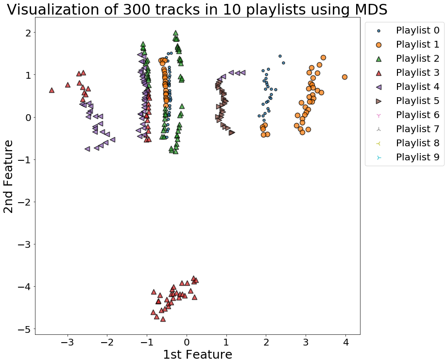

- All detailed codes and data are attached to the submission. For simplicity, we don't include all codes and data here in the website (final report).


## Contents
{:.no_toc}
*  
{: toc}


Using TensorFlow backend.
    


# Preprocessing

## Load data and convert to arrays based on playlists

- Load pre-processed data as a DataFrame. Each row corresponds to a track.


```python
playlists_df = pd.read_pickle('../../Data Scraping/playlists_df_clean.pkl')
```


- Check the data attributes and size:


```python
display(playlists_df.columns)
display(playlists_df.head())
display(playlists_df.describe())
print(f'Shape of playlists_df : {playlists_df.shape}')
```


    Index(['acousticness', 'country', 'danceability', 'disco', 'duration_ms', 'edm', 'electronic', 'emo', 'energy', 'folk',
           ...
           'lyric_language_spanish', 'lyric_language_korean', 'lyric_language_french', 'lyric_language_tagalog', 'lyric_language_german', 'lyric_language_portuguese', 'lyric_language_russian', 'lyric_language_italian', 'track_name_language_english', 'track_name_language_spanish'], dtype='object', length=114)


<div>
<style scoped>
    .dataframe tbody tr th:only-of-type {
        vertical-align: middle;
    }

    .dataframe tbody tr th {
        vertical-align: top;
    }

    .dataframe thead th {
        text-align: right;
    }
</style>
<table border="1" class="dataframe">
  <thead>
    <tr style="text-align: right;">
      <th></th>
      <th>acousticness</th>
      <th>country</th>
      <th>danceability</th>
      <th>disco</th>
      <th>duration_ms</th>
      <th>edm</th>
      <th>electronic</th>
      <th>emo</th>
      <th>energy</th>
      <th>folk</th>
      <th>funk</th>
      <th>gospel</th>
      <th>house</th>
      <th>instrumentalness</th>
      <th>k-pop</th>
      <th>key</th>
      <th>latin</th>
      <th>liveness</th>
      <th>loudness</th>
      <th>metal</th>
      <th>metalcore</th>
      <th>mode</th>
      <th>pid</th>
      <th>pop</th>
      <th>popularity</th>
      <th>pos</th>
      <th>punk</th>
      <th>reggaeton</th>
      <th>related_artist_n</th>
      <th>rock</th>
      <th>rockabilly</th>
      <th>singer-songwriter</th>
      <th>soul</th>
      <th>speechiness</th>
      <th>tempo</th>
      <th>time_signature</th>
      <th>top_track_n</th>
      <th>valence</th>
      <th>year</th>
      <th>is_top_track_0</th>
      <th>is_top_track_1</th>
      <th>is_top_track_2</th>
      <th>is_top_track_3</th>
      <th>is_top_track_4</th>
      <th>is_top_track_5</th>
      <th>is_top_track_6</th>
      <th>is_top_track_7</th>
      <th>is_top_track_8</th>
      <th>is_top_track_9</th>
      <th>track_name_language_reliable</th>
      <th>lyric_language_reliable</th>
      <th>NLP_sentiment</th>
      <th>NLP_personality_extraversion</th>
      <th>NLP_personality_openness</th>
      <th>NLP_personality_agreeableness</th>
      <th>NLP_personality_conscientiousness</th>
      <th>from_genius</th>
      <th>from_lyrics_wiki</th>
      <th>NLP_emotion_anger</th>
      <th>NLP_emotion_fear</th>
      <th>NLP_emotion_joy</th>
      <th>NLP_emotion_sadness</th>
      <th>NLP_emotion_surprise</th>
      <th>trial_0.0</th>
      <th>trial_1.0</th>
      <th>trial_2.0</th>
      <th>trial_3.0</th>
      <th>try_idx_0.0</th>
      <th>try_idx_1.0</th>
      <th>try_idx_2.0</th>
      <th>try_idx_3.0</th>
      <th>try_idx_4.0</th>
      <th>try_idx_5.0</th>
      <th>NLP_topic_poetry</th>
      <th>NLP_topic_music</th>
      <th>NLP_topic_drugs</th>
      <th>NLP_topic_romance</th>
      <th>NLP_topic_parenting</th>
      <th>NLP_topic_running</th>
      <th>NLP_topic_entertainment_news</th>
      <th>NLP_topic_military</th>
      <th>NLP_topic_fashion</th>
      <th>NLP_topic_cricket</th>
      <th>NLP_topic_swimming</th>
      <th>NLP_topic_surfing</th>
      <th>NLP_topic_guns</th>
      <th>NLP_topic_biology</th>
      <th>NLP_topic_personal</th>
      <th>NLP_topic_history</th>
      <th>NLP_topic_books</th>
      <th>NLP_topic_sailing</th>
      <th>NLP_topic_bicycling</th>
      <th>NLP_topic_business</th>
      <th>NLP_topic_film</th>
      <th>NLP_topic_fiction</th>
      <th>NLP_topic_golf</th>
      <th>NLP_topic_christianity</th>
      <th>NLP_topic_comics</th>
      <th>NLP_topic_nostalgia</th>
      <th>NLP_topic_weight_training</th>
      <th>NLP_topic_astronomy</th>
      <th>NLP_topic_art</th>
      <th>NLP_topic_hunting</th>
      <th>lyric_language_english</th>
      <th>lyric_language_spanish</th>
      <th>lyric_language_korean</th>
      <th>lyric_language_french</th>
      <th>lyric_language_tagalog</th>
      <th>lyric_language_german</th>
      <th>lyric_language_portuguese</th>
      <th>lyric_language_russian</th>
      <th>lyric_language_italian</th>
      <th>track_name_language_english</th>
      <th>track_name_language_spanish</th>
    </tr>
  </thead>
  <tbody>
    <tr>
      <th>0</th>
      <td>0.011400</td>
      <td>0.0</td>
      <td>0.775</td>
      <td>0.0</td>
      <td>351640</td>
      <td>0.0</td>
      <td>0.0</td>
      <td>0.0</td>
      <td>0.828</td>
      <td>0.0</td>
      <td>0.0</td>
      <td>0.0</td>
      <td>0.0</td>
      <td>0.367000</td>
      <td>0.0</td>
      <td>11.0</td>
      <td>0.0</td>
      <td>0.2460</td>
      <td>-7.511</td>
      <td>0.0</td>
      <td>0.0</td>
      <td>0.0</td>
      <td>391407</td>
      <td>0.0</td>
      <td>8.0</td>
      <td>0</td>
      <td>0.0</td>
      <td>0.0</td>
      <td>20.0</td>
      <td>0.0</td>
      <td>0.0</td>
      <td>0.0</td>
      <td>0.0</td>
      <td>0.0503</td>
      <td>108.016</td>
      <td>4.0</td>
      <td>7.0</td>
      <td>0.531</td>
      <td>2010.0</td>
      <td>0.0</td>
      <td>0.0</td>
      <td>0.0</td>
      <td>0.0</td>
      <td>0.0</td>
      <td>0.0</td>
      <td>0.0</td>
      <td>0.0</td>
      <td>0.0</td>
      <td>0.0</td>
      <td>1.0</td>
      <td>1.0</td>
      <td>0.921551</td>
      <td>0.545398</td>
      <td>0.455326</td>
      <td>0.594833</td>
      <td>0.475259</td>
      <td>1</td>
      <td>0</td>
      <td>0</td>
      <td>0</td>
      <td>0</td>
      <td>1</td>
      <td>0</td>
      <td>1</td>
      <td>0</td>
      <td>0</td>
      <td>0</td>
      <td>1</td>
      <td>0</td>
      <td>0</td>
      <td>0</td>
      <td>0</td>
      <td>0</td>
      <td>0</td>
      <td>0</td>
      <td>1</td>
      <td>0</td>
      <td>0</td>
      <td>0</td>
      <td>0</td>
      <td>0</td>
      <td>0</td>
      <td>0</td>
      <td>0</td>
      <td>0</td>
      <td>0</td>
      <td>0</td>
      <td>0</td>
      <td>0</td>
      <td>0</td>
      <td>0</td>
      <td>0</td>
      <td>0</td>
      <td>0</td>
      <td>0</td>
      <td>0</td>
      <td>0</td>
      <td>0</td>
      <td>0</td>
      <td>0</td>
      <td>0</td>
      <td>0</td>
      <td>0</td>
      <td>1</td>
      <td>0</td>
      <td>0</td>
      <td>0</td>
      <td>0</td>
      <td>0</td>
      <td>0</td>
      <td>0</td>
      <td>0</td>
      <td>1</td>
      <td>0</td>
    </tr>
    <tr>
      <th>1</th>
      <td>0.094400</td>
      <td>0.0</td>
      <td>0.591</td>
      <td>0.0</td>
      <td>213333</td>
      <td>0.0</td>
      <td>0.0</td>
      <td>0.0</td>
      <td>0.892</td>
      <td>0.0</td>
      <td>0.0</td>
      <td>0.0</td>
      <td>0.0</td>
      <td>0.000000</td>
      <td>0.0</td>
      <td>8.0</td>
      <td>0.0</td>
      <td>0.1130</td>
      <td>-6.114</td>
      <td>0.0</td>
      <td>0.0</td>
      <td>0.0</td>
      <td>391407</td>
      <td>0.0</td>
      <td>47.0</td>
      <td>1</td>
      <td>0.0</td>
      <td>0.0</td>
      <td>20.0</td>
      <td>0.0</td>
      <td>0.0</td>
      <td>0.0</td>
      <td>0.0</td>
      <td>0.2930</td>
      <td>89.849</td>
      <td>4.0</td>
      <td>10.0</td>
      <td>0.712</td>
      <td>2012.0</td>
      <td>0.0</td>
      <td>0.0</td>
      <td>0.0</td>
      <td>0.0</td>
      <td>0.0</td>
      <td>0.0</td>
      <td>0.0</td>
      <td>0.0</td>
      <td>0.0</td>
      <td>0.0</td>
      <td>0.0</td>
      <td>1.0</td>
      <td>0.927271</td>
      <td>0.573924</td>
      <td>0.500366</td>
      <td>0.617451</td>
      <td>0.423998</td>
      <td>1</td>
      <td>0</td>
      <td>0</td>
      <td>0</td>
      <td>0</td>
      <td>1</td>
      <td>0</td>
      <td>1</td>
      <td>0</td>
      <td>0</td>
      <td>0</td>
      <td>1</td>
      <td>0</td>
      <td>0</td>
      <td>0</td>
      <td>0</td>
      <td>0</td>
      <td>0</td>
      <td>1</td>
      <td>0</td>
      <td>0</td>
      <td>0</td>
      <td>0</td>
      <td>0</td>
      <td>0</td>
      <td>0</td>
      <td>0</td>
      <td>0</td>
      <td>0</td>
      <td>0</td>
      <td>0</td>
      <td>0</td>
      <td>0</td>
      <td>0</td>
      <td>0</td>
      <td>0</td>
      <td>0</td>
      <td>0</td>
      <td>0</td>
      <td>0</td>
      <td>0</td>
      <td>0</td>
      <td>0</td>
      <td>0</td>
      <td>0</td>
      <td>0</td>
      <td>0</td>
      <td>1</td>
      <td>0</td>
      <td>0</td>
      <td>0</td>
      <td>0</td>
      <td>0</td>
      <td>0</td>
      <td>0</td>
      <td>0</td>
      <td>0</td>
      <td>0</td>
    </tr>
    <tr>
      <th>2</th>
      <td>0.312000</td>
      <td>0.0</td>
      <td>0.496</td>
      <td>0.0</td>
      <td>309346</td>
      <td>0.0</td>
      <td>0.0</td>
      <td>0.0</td>
      <td>0.531</td>
      <td>0.0</td>
      <td>0.0</td>
      <td>0.0</td>
      <td>0.0</td>
      <td>0.009010</td>
      <td>0.0</td>
      <td>0.0</td>
      <td>0.0</td>
      <td>0.1130</td>
      <td>-9.889</td>
      <td>0.0</td>
      <td>0.0</td>
      <td>0.0</td>
      <td>391407</td>
      <td>0.0</td>
      <td>15.0</td>
      <td>2</td>
      <td>0.0</td>
      <td>0.0</td>
      <td>20.0</td>
      <td>0.0</td>
      <td>0.0</td>
      <td>0.0</td>
      <td>0.0</td>
      <td>0.0325</td>
      <td>119.159</td>
      <td>4.0</td>
      <td>10.0</td>
      <td>0.507</td>
      <td>2011.0</td>
      <td>0.0</td>
      <td>0.0</td>
      <td>0.0</td>
      <td>0.0</td>
      <td>0.0</td>
      <td>0.0</td>
      <td>0.0</td>
      <td>0.0</td>
      <td>0.0</td>
      <td>0.0</td>
      <td>0.0</td>
      <td>1.0</td>
      <td>0.352308</td>
      <td>0.532170</td>
      <td>0.433947</td>
      <td>0.650911</td>
      <td>0.457791</td>
      <td>1</td>
      <td>0</td>
      <td>0</td>
      <td>0</td>
      <td>0</td>
      <td>1</td>
      <td>0</td>
      <td>1</td>
      <td>0</td>
      <td>0</td>
      <td>0</td>
      <td>1</td>
      <td>0</td>
      <td>0</td>
      <td>0</td>
      <td>0</td>
      <td>0</td>
      <td>1</td>
      <td>0</td>
      <td>0</td>
      <td>0</td>
      <td>0</td>
      <td>0</td>
      <td>0</td>
      <td>0</td>
      <td>0</td>
      <td>0</td>
      <td>0</td>
      <td>0</td>
      <td>0</td>
      <td>0</td>
      <td>0</td>
      <td>0</td>
      <td>0</td>
      <td>0</td>
      <td>0</td>
      <td>0</td>
      <td>0</td>
      <td>0</td>
      <td>0</td>
      <td>0</td>
      <td>0</td>
      <td>0</td>
      <td>0</td>
      <td>0</td>
      <td>0</td>
      <td>0</td>
      <td>1</td>
      <td>0</td>
      <td>0</td>
      <td>0</td>
      <td>0</td>
      <td>0</td>
      <td>0</td>
      <td>0</td>
      <td>0</td>
      <td>0</td>
      <td>0</td>
    </tr>
    <tr>
      <th>3</th>
      <td>0.000029</td>
      <td>0.0</td>
      <td>0.420</td>
      <td>0.0</td>
      <td>286466</td>
      <td>0.0</td>
      <td>0.0</td>
      <td>0.0</td>
      <td>0.914</td>
      <td>0.0</td>
      <td>0.0</td>
      <td>0.0</td>
      <td>0.0</td>
      <td>0.028200</td>
      <td>0.0</td>
      <td>6.0</td>
      <td>0.0</td>
      <td>0.2200</td>
      <td>-4.322</td>
      <td>0.0</td>
      <td>0.0</td>
      <td>0.0</td>
      <td>391407</td>
      <td>0.0</td>
      <td>55.0</td>
      <td>3</td>
      <td>0.0</td>
      <td>0.0</td>
      <td>20.0</td>
      <td>1.0</td>
      <td>0.0</td>
      <td>0.0</td>
      <td>0.0</td>
      <td>0.0431</td>
      <td>170.199</td>
      <td>4.0</td>
      <td>10.0</td>
      <td>0.301</td>
      <td>2011.0</td>
      <td>0.0</td>
      <td>0.0</td>
      <td>0.0</td>
      <td>0.0</td>
      <td>0.0</td>
      <td>0.0</td>
      <td>0.0</td>
      <td>0.0</td>
      <td>0.0</td>
      <td>0.0</td>
      <td>1.0</td>
      <td>1.0</td>
      <td>0.975505</td>
      <td>0.522853</td>
      <td>0.438368</td>
      <td>0.676775</td>
      <td>0.484940</td>
      <td>1</td>
      <td>0</td>
      <td>0</td>
      <td>0</td>
      <td>0</td>
      <td>1</td>
      <td>0</td>
      <td>1</td>
      <td>0</td>
      <td>0</td>
      <td>0</td>
      <td>1</td>
      <td>0</td>
      <td>0</td>
      <td>0</td>
      <td>0</td>
      <td>0</td>
      <td>1</td>
      <td>0</td>
      <td>0</td>
      <td>0</td>
      <td>0</td>
      <td>0</td>
      <td>0</td>
      <td>0</td>
      <td>0</td>
      <td>0</td>
      <td>0</td>
      <td>0</td>
      <td>0</td>
      <td>0</td>
      <td>0</td>
      <td>0</td>
      <td>0</td>
      <td>0</td>
      <td>0</td>
      <td>0</td>
      <td>0</td>
      <td>0</td>
      <td>0</td>
      <td>0</td>
      <td>0</td>
      <td>0</td>
      <td>0</td>
      <td>0</td>
      <td>0</td>
      <td>0</td>
      <td>1</td>
      <td>0</td>
      <td>0</td>
      <td>0</td>
      <td>0</td>
      <td>0</td>
      <td>0</td>
      <td>0</td>
      <td>0</td>
      <td>1</td>
      <td>0</td>
    </tr>
    <tr>
      <th>4</th>
      <td>0.024500</td>
      <td>0.0</td>
      <td>0.633</td>
      <td>0.0</td>
      <td>196848</td>
      <td>0.0</td>
      <td>0.0</td>
      <td>0.0</td>
      <td>0.881</td>
      <td>0.0</td>
      <td>0.0</td>
      <td>0.0</td>
      <td>0.0</td>
      <td>0.000147</td>
      <td>0.0</td>
      <td>1.0</td>
      <td>0.0</td>
      <td>0.0474</td>
      <td>-5.570</td>
      <td>0.0</td>
      <td>0.0</td>
      <td>0.0</td>
      <td>391407</td>
      <td>0.0</td>
      <td>54.0</td>
      <td>4</td>
      <td>0.0</td>
      <td>0.0</td>
      <td>20.0</td>
      <td>0.0</td>
      <td>0.0</td>
      <td>0.0</td>
      <td>0.0</td>
      <td>0.1540</td>
      <td>87.920</td>
      <td>4.0</td>
      <td>10.0</td>
      <td>0.622</td>
      <td>2014.0</td>
      <td>1.0</td>
      <td>0.0</td>
      <td>0.0</td>
      <td>0.0</td>
      <td>0.0</td>
      <td>0.0</td>
      <td>0.0</td>
      <td>0.0</td>
      <td>0.0</td>
      <td>0.0</td>
      <td>0.0</td>
      <td>1.0</td>
      <td>0.983508</td>
      <td>0.516442</td>
      <td>0.353284</td>
      <td>0.735746</td>
      <td>0.483784</td>
      <td>1</td>
      <td>0</td>
      <td>1</td>
      <td>0</td>
      <td>0</td>
      <td>0</td>
      <td>0</td>
      <td>1</td>
      <td>0</td>
      <td>0</td>
      <td>0</td>
      <td>1</td>
      <td>0</td>
      <td>0</td>
      <td>0</td>
      <td>0</td>
      <td>0</td>
      <td>1</td>
      <td>0</td>
      <td>0</td>
      <td>0</td>
      <td>0</td>
      <td>0</td>
      <td>0</td>
      <td>0</td>
      <td>0</td>
      <td>0</td>
      <td>0</td>
      <td>0</td>
      <td>0</td>
      <td>0</td>
      <td>0</td>
      <td>0</td>
      <td>0</td>
      <td>0</td>
      <td>0</td>
      <td>0</td>
      <td>0</td>
      <td>0</td>
      <td>0</td>
      <td>0</td>
      <td>0</td>
      <td>0</td>
      <td>0</td>
      <td>0</td>
      <td>0</td>
      <td>0</td>
      <td>1</td>
      <td>0</td>
      <td>0</td>
      <td>0</td>
      <td>0</td>
      <td>0</td>
      <td>0</td>
      <td>0</td>
      <td>0</td>
      <td>0</td>
      <td>0</td>
    </tr>
  </tbody>
</table>
</div>


<div>
<style scoped>
    .dataframe tbody tr th:only-of-type {
        vertical-align: middle;
    }

    .dataframe tbody tr th {
        vertical-align: top;
    }

    .dataframe thead th {
        text-align: right;
    }
</style>
<table border="1" class="dataframe">
  <thead>
    <tr style="text-align: right;">
      <th></th>
      <th>acousticness</th>
      <th>country</th>
      <th>danceability</th>
      <th>disco</th>
      <th>duration_ms</th>
      <th>edm</th>
      <th>electronic</th>
      <th>emo</th>
      <th>energy</th>
      <th>folk</th>
      <th>funk</th>
      <th>gospel</th>
      <th>house</th>
      <th>instrumentalness</th>
      <th>k-pop</th>
      <th>key</th>
      <th>latin</th>
      <th>liveness</th>
      <th>loudness</th>
      <th>metal</th>
      <th>metalcore</th>
      <th>mode</th>
      <th>pid</th>
      <th>pop</th>
      <th>popularity</th>
      <th>pos</th>
      <th>punk</th>
      <th>reggaeton</th>
      <th>related_artist_n</th>
      <th>rock</th>
      <th>rockabilly</th>
      <th>singer-songwriter</th>
      <th>soul</th>
      <th>speechiness</th>
      <th>tempo</th>
      <th>time_signature</th>
      <th>top_track_n</th>
      <th>valence</th>
      <th>year</th>
      <th>is_top_track_0</th>
      <th>is_top_track_1</th>
      <th>is_top_track_2</th>
      <th>is_top_track_3</th>
      <th>is_top_track_4</th>
      <th>is_top_track_5</th>
      <th>is_top_track_6</th>
      <th>is_top_track_7</th>
      <th>is_top_track_8</th>
      <th>is_top_track_9</th>
      <th>track_name_language_reliable</th>
      <th>lyric_language_reliable</th>
      <th>NLP_sentiment</th>
      <th>NLP_personality_extraversion</th>
      <th>NLP_personality_openness</th>
      <th>NLP_personality_agreeableness</th>
      <th>NLP_personality_conscientiousness</th>
      <th>from_genius</th>
      <th>from_lyrics_wiki</th>
      <th>NLP_emotion_anger</th>
      <th>NLP_emotion_fear</th>
      <th>NLP_emotion_joy</th>
      <th>NLP_emotion_sadness</th>
      <th>NLP_emotion_surprise</th>
      <th>trial_0.0</th>
      <th>trial_1.0</th>
      <th>trial_2.0</th>
      <th>trial_3.0</th>
      <th>try_idx_0.0</th>
      <th>try_idx_1.0</th>
      <th>try_idx_2.0</th>
      <th>try_idx_3.0</th>
      <th>try_idx_4.0</th>
      <th>try_idx_5.0</th>
      <th>NLP_topic_poetry</th>
      <th>NLP_topic_music</th>
      <th>NLP_topic_drugs</th>
      <th>NLP_topic_romance</th>
      <th>NLP_topic_parenting</th>
      <th>NLP_topic_running</th>
      <th>NLP_topic_entertainment_news</th>
      <th>NLP_topic_military</th>
      <th>NLP_topic_fashion</th>
      <th>NLP_topic_cricket</th>
      <th>NLP_topic_swimming</th>
      <th>NLP_topic_surfing</th>
      <th>NLP_topic_guns</th>
      <th>NLP_topic_biology</th>
      <th>NLP_topic_personal</th>
      <th>NLP_topic_history</th>
      <th>NLP_topic_books</th>
      <th>NLP_topic_sailing</th>
      <th>NLP_topic_bicycling</th>
      <th>NLP_topic_business</th>
      <th>NLP_topic_film</th>
      <th>NLP_topic_fiction</th>
      <th>NLP_topic_golf</th>
      <th>NLP_topic_christianity</th>
      <th>NLP_topic_comics</th>
      <th>NLP_topic_nostalgia</th>
      <th>NLP_topic_weight_training</th>
      <th>NLP_topic_astronomy</th>
      <th>NLP_topic_art</th>
      <th>NLP_topic_hunting</th>
      <th>lyric_language_english</th>
      <th>lyric_language_spanish</th>
      <th>lyric_language_korean</th>
      <th>lyric_language_french</th>
      <th>lyric_language_tagalog</th>
      <th>lyric_language_german</th>
      <th>lyric_language_portuguese</th>
      <th>lyric_language_russian</th>
      <th>lyric_language_italian</th>
      <th>track_name_language_english</th>
      <th>track_name_language_spanish</th>
    </tr>
  </thead>
  <tbody>
    <tr>
      <th>count</th>
      <td>55000.000000</td>
      <td>55000.000000</td>
      <td>55000.000000</td>
      <td>55000.000000</td>
      <td>5.500000e+04</td>
      <td>55000.000000</td>
      <td>55000.000000</td>
      <td>55000.000000</td>
      <td>55000.000000</td>
      <td>55000.000000</td>
      <td>55000.000000</td>
      <td>55000.000000</td>
      <td>55000.000000</td>
      <td>55000.000000</td>
      <td>55000.000000</td>
      <td>55000.000000</td>
      <td>55000.000000</td>
      <td>55000.000000</td>
      <td>55000.000000</td>
      <td>55000.000000</td>
      <td>55000.000000</td>
      <td>55000.000000</td>
      <td>55000.000000</td>
      <td>55000.000000</td>
      <td>55000.000000</td>
      <td>55000.000000</td>
      <td>55000.000000</td>
      <td>55000.000000</td>
      <td>55000.000000</td>
      <td>55000.000000</td>
      <td>55000.000000</td>
      <td>55000.000000</td>
      <td>55000.000000</td>
      <td>55000.000000</td>
      <td>55000.000000</td>
      <td>55000.000000</td>
      <td>55000.000000</td>
      <td>55000.000000</td>
      <td>55000.000000</td>
      <td>55000.000000</td>
      <td>55000.000000</td>
      <td>55000.000000</td>
      <td>55000.000000</td>
      <td>55000.000000</td>
      <td>55000.000000</td>
      <td>55000.000000</td>
      <td>55000.000000</td>
      <td>55000.000000</td>
      <td>55000.000000</td>
      <td>55000.000000</td>
      <td>55000.000000</td>
      <td>55000.000000</td>
      <td>55000.000000</td>
      <td>55000.000000</td>
      <td>55000.000000</td>
      <td>55000.000000</td>
      <td>55000.000000</td>
      <td>55000.000000</td>
      <td>55000.000000</td>
      <td>55000.000000</td>
      <td>55000.000000</td>
      <td>55000.000000</td>
      <td>55000.000000</td>
      <td>55000.000000</td>
      <td>55000.000000</td>
      <td>55000.000000</td>
      <td>55000.000000</td>
      <td>55000.000000</td>
      <td>55000.000000</td>
      <td>55000.000000</td>
      <td>55000.000000</td>
      <td>55000.000000</td>
      <td>55000.000000</td>
      <td>55000.000000</td>
      <td>55000.000000</td>
      <td>55000.000000</td>
      <td>55000.000000</td>
      <td>55000.000000</td>
      <td>55000.000000</td>
      <td>55000.000000</td>
      <td>55000.000000</td>
      <td>55000.000000</td>
      <td>55000.000000</td>
      <td>55000.000000</td>
      <td>55000.000000</td>
      <td>55000.000000</td>
      <td>55000.000000</td>
      <td>55000.000000</td>
      <td>55000.000000</td>
      <td>55000.000000</td>
      <td>55000.000000</td>
      <td>55000.000000</td>
      <td>55000.000000</td>
      <td>55000.000000</td>
      <td>55000.000000</td>
      <td>55000.000000</td>
      <td>55000.000000</td>
      <td>55000.000000</td>
      <td>55000.000000</td>
      <td>55000.000000</td>
      <td>55000.000000</td>
      <td>55000.000000</td>
      <td>55000.000000</td>
      <td>55000.000000</td>
      <td>55000.000000</td>
      <td>55000.000000</td>
      <td>55000.000000</td>
      <td>55000.000000</td>
      <td>55000.000000</td>
      <td>55000.000000</td>
      <td>55000.000000</td>
      <td>55000.000000</td>
      <td>55000.000000</td>
      <td>55000.000000</td>
    </tr>
    <tr>
      <th>mean</th>
      <td>0.257011</td>
      <td>0.031745</td>
      <td>0.596193</td>
      <td>0.008545</td>
      <td>2.350665e+05</td>
      <td>0.045982</td>
      <td>0.007636</td>
      <td>0.015345</td>
      <td>0.632996</td>
      <td>0.011345</td>
      <td>0.015473</td>
      <td>0.003509</td>
      <td>0.009891</td>
      <td>0.074761</td>
      <td>0.004673</td>
      <td>5.206436</td>
      <td>0.040345</td>
      <td>0.190331</td>
      <td>-7.525920</td>
      <td>0.004564</td>
      <td>0.005182</td>
      <td>0.653818</td>
      <td>497957.939000</td>
      <td>0.291127</td>
      <td>41.108036</td>
      <td>27.000000</td>
      <td>0.007600</td>
      <td>0.020982</td>
      <td>19.883436</td>
      <td>0.076909</td>
      <td>0.004891</td>
      <td>0.013527</td>
      <td>0.015945</td>
      <td>0.091508</td>
      <td>121.494737</td>
      <td>3.930564</td>
      <td>9.851164</td>
      <td>0.483090</td>
      <td>2007.687376</td>
      <td>0.112091</td>
      <td>0.060345</td>
      <td>0.042509</td>
      <td>0.034800</td>
      <td>0.027182</td>
      <td>0.021364</td>
      <td>0.020418</td>
      <td>0.017036</td>
      <td>0.014873</td>
      <td>0.014000</td>
      <td>0.543818</td>
      <td>0.938891</td>
      <td>0.674081</td>
      <td>0.563834</td>
      <td>0.431771</td>
      <td>0.665134</td>
      <td>0.456555</td>
      <td>0.965673</td>
      <td>0.002891</td>
      <td>0.069982</td>
      <td>0.041545</td>
      <td>0.170145</td>
      <td>0.543400</td>
      <td>0.039400</td>
      <td>0.871709</td>
      <td>0.023909</td>
      <td>0.068836</td>
      <td>0.004109</td>
      <td>0.880764</td>
      <td>0.084109</td>
      <td>0.000436</td>
      <td>0.000236</td>
      <td>0.000109</td>
      <td>0.002909</td>
      <td>0.306564</td>
      <td>0.215273</td>
      <td>0.046527</td>
      <td>0.042582</td>
      <td>0.031891</td>
      <td>0.016855</td>
      <td>0.013964</td>
      <td>0.012073</td>
      <td>0.008927</td>
      <td>0.005909</td>
      <td>0.005691</td>
      <td>0.005600</td>
      <td>0.005382</td>
      <td>0.005382</td>
      <td>0.005055</td>
      <td>0.004873</td>
      <td>0.004636</td>
      <td>0.004273</td>
      <td>0.004255</td>
      <td>0.004164</td>
      <td>0.004073</td>
      <td>0.004055</td>
      <td>0.004036</td>
      <td>0.003927</td>
      <td>0.003764</td>
      <td>0.003727</td>
      <td>0.003691</td>
      <td>0.003655</td>
      <td>0.003545</td>
      <td>0.003345</td>
      <td>0.864473</td>
      <td>0.061545</td>
      <td>0.003945</td>
      <td>0.002927</td>
      <td>0.002145</td>
      <td>0.001164</td>
      <td>0.001091</td>
      <td>0.001091</td>
      <td>0.000709</td>
      <td>0.492236</td>
      <td>0.024527</td>
    </tr>
    <tr>
      <th>std</th>
      <td>0.292838</td>
      <td>0.175323</td>
      <td>0.164534</td>
      <td>0.092047</td>
      <td>7.615811e+04</td>
      <td>0.209448</td>
      <td>0.087053</td>
      <td>0.122924</td>
      <td>0.220453</td>
      <td>0.105910</td>
      <td>0.123424</td>
      <td>0.059134</td>
      <td>0.098961</td>
      <td>0.218959</td>
      <td>0.068198</td>
      <td>3.618235</td>
      <td>0.196770</td>
      <td>0.157844</td>
      <td>3.979371</td>
      <td>0.067401</td>
      <td>0.071799</td>
      <td>0.475756</td>
      <td>287955.184373</td>
      <td>0.454286</td>
      <td>22.979668</td>
      <td>15.874652</td>
      <td>0.086847</td>
      <td>0.143325</td>
      <td>1.484048</td>
      <td>0.266450</td>
      <td>0.069764</td>
      <td>0.115519</td>
      <td>0.125266</td>
      <td>0.101790</td>
      <td>29.023314</td>
      <td>0.364217</td>
      <td>1.052467</td>
      <td>0.246394</td>
      <td>11.824337</td>
      <td>0.315481</td>
      <td>0.238128</td>
      <td>0.201749</td>
      <td>0.183275</td>
      <td>0.162614</td>
      <td>0.144595</td>
      <td>0.141427</td>
      <td>0.129408</td>
      <td>0.121045</td>
      <td>0.117491</td>
      <td>0.498081</td>
      <td>0.239532</td>
      <td>0.286014</td>
      <td>0.050207</td>
      <td>0.052616</td>
      <td>0.063702</td>
      <td>0.034055</td>
      <td>0.182070</td>
      <td>0.053690</td>
      <td>0.255119</td>
      <td>0.199550</td>
      <td>0.375764</td>
      <td>0.498117</td>
      <td>0.194546</td>
      <td>0.334416</td>
      <td>0.152767</td>
      <td>0.253178</td>
      <td>0.063971</td>
      <td>0.324069</td>
      <td>0.277554</td>
      <td>0.020885</td>
      <td>0.015372</td>
      <td>0.010444</td>
      <td>0.053858</td>
      <td>0.461071</td>
      <td>0.411015</td>
      <td>0.210626</td>
      <td>0.201914</td>
      <td>0.175711</td>
      <td>0.128728</td>
      <td>0.117341</td>
      <td>0.109212</td>
      <td>0.094062</td>
      <td>0.076644</td>
      <td>0.075224</td>
      <td>0.074624</td>
      <td>0.073164</td>
      <td>0.073164</td>
      <td>0.070916</td>
      <td>0.069635</td>
      <td>0.067933</td>
      <td>0.065227</td>
      <td>0.065089</td>
      <td>0.064392</td>
      <td>0.063688</td>
      <td>0.063547</td>
      <td>0.063405</td>
      <td>0.062545</td>
      <td>0.061233</td>
      <td>0.060938</td>
      <td>0.060641</td>
      <td>0.060343</td>
      <td>0.059439</td>
      <td>0.057744</td>
      <td>0.342289</td>
      <td>0.240330</td>
      <td>0.062689</td>
      <td>0.054026</td>
      <td>0.046270</td>
      <td>0.034093</td>
      <td>0.033011</td>
      <td>0.033011</td>
      <td>0.026620</td>
      <td>0.499944</td>
      <td>0.154681</td>
    </tr>
    <tr>
      <th>min</th>
      <td>0.000000</td>
      <td>0.000000</td>
      <td>0.000000</td>
      <td>0.000000</td>
      <td>2.060000e+02</td>
      <td>0.000000</td>
      <td>0.000000</td>
      <td>0.000000</td>
      <td>0.000000</td>
      <td>0.000000</td>
      <td>0.000000</td>
      <td>0.000000</td>
      <td>0.000000</td>
      <td>0.000000</td>
      <td>0.000000</td>
      <td>0.000000</td>
      <td>0.000000</td>
      <td>0.000000</td>
      <td>-60.000000</td>
      <td>0.000000</td>
      <td>0.000000</td>
      <td>0.000000</td>
      <td>1923.000000</td>
      <td>0.000000</td>
      <td>0.000000</td>
      <td>0.000000</td>
      <td>0.000000</td>
      <td>0.000000</td>
      <td>0.000000</td>
      <td>0.000000</td>
      <td>0.000000</td>
      <td>0.000000</td>
      <td>0.000000</td>
      <td>0.000000</td>
      <td>0.000000</td>
      <td>0.000000</td>
      <td>0.000000</td>
      <td>0.000000</td>
      <td>1900.000000</td>
      <td>0.000000</td>
      <td>0.000000</td>
      <td>0.000000</td>
      <td>0.000000</td>
      <td>0.000000</td>
      <td>0.000000</td>
      <td>0.000000</td>
      <td>0.000000</td>
      <td>0.000000</td>
      <td>0.000000</td>
      <td>0.000000</td>
      <td>0.000000</td>
      <td>0.000117</td>
      <td>0.207326</td>
      <td>0.034042</td>
      <td>0.320512</td>
      <td>0.137565</td>
      <td>0.000000</td>
      <td>0.000000</td>
      <td>0.000000</td>
      <td>0.000000</td>
      <td>0.000000</td>
      <td>0.000000</td>
      <td>0.000000</td>
      <td>0.000000</td>
      <td>0.000000</td>
      <td>0.000000</td>
      <td>0.000000</td>
      <td>0.000000</td>
      <td>0.000000</td>
      <td>0.000000</td>
      <td>0.000000</td>
      <td>0.000000</td>
      <td>0.000000</td>
      <td>0.000000</td>
      <td>0.000000</td>
      <td>0.000000</td>
      <td>0.000000</td>
      <td>0.000000</td>
      <td>0.000000</td>
      <td>0.000000</td>
      <td>0.000000</td>
      <td>0.000000</td>
      <td>0.000000</td>
      <td>0.000000</td>
      <td>0.000000</td>
      <td>0.000000</td>
      <td>0.000000</td>
      <td>0.000000</td>
      <td>0.000000</td>
      <td>0.000000</td>
      <td>0.000000</td>
      <td>0.000000</td>
      <td>0.000000</td>
      <td>0.000000</td>
      <td>0.000000</td>
      <td>0.000000</td>
      <td>0.000000</td>
      <td>0.000000</td>
      <td>0.000000</td>
      <td>0.000000</td>
      <td>0.000000</td>
      <td>0.000000</td>
      <td>0.000000</td>
      <td>0.000000</td>
      <td>0.000000</td>
      <td>0.000000</td>
      <td>0.000000</td>
      <td>0.000000</td>
      <td>0.000000</td>
      <td>0.000000</td>
      <td>0.000000</td>
      <td>0.000000</td>
      <td>0.000000</td>
      <td>0.000000</td>
    </tr>
    <tr>
      <th>25%</th>
      <td>0.022400</td>
      <td>0.000000</td>
      <td>0.489000</td>
      <td>0.000000</td>
      <td>1.968930e+05</td>
      <td>0.000000</td>
      <td>0.000000</td>
      <td>0.000000</td>
      <td>0.486000</td>
      <td>0.000000</td>
      <td>0.000000</td>
      <td>0.000000</td>
      <td>0.000000</td>
      <td>0.000000</td>
      <td>0.000000</td>
      <td>2.000000</td>
      <td>0.000000</td>
      <td>0.094900</td>
      <td>-9.061000</td>
      <td>0.000000</td>
      <td>0.000000</td>
      <td>0.000000</td>
      <td>256333.750000</td>
      <td>0.000000</td>
      <td>23.000000</td>
      <td>13.000000</td>
      <td>0.000000</td>
      <td>0.000000</td>
      <td>20.000000</td>
      <td>0.000000</td>
      <td>0.000000</td>
      <td>0.000000</td>
      <td>0.000000</td>
      <td>0.035500</td>
      <td>98.869000</td>
      <td>4.000000</td>
      <td>10.000000</td>
      <td>0.285000</td>
      <td>2006.000000</td>
      <td>0.000000</td>
      <td>0.000000</td>
      <td>0.000000</td>
      <td>0.000000</td>
      <td>0.000000</td>
      <td>0.000000</td>
      <td>0.000000</td>
      <td>0.000000</td>
      <td>0.000000</td>
      <td>0.000000</td>
      <td>0.000000</td>
      <td>1.000000</td>
      <td>0.488857</td>
      <td>0.537824</td>
      <td>0.401023</td>
      <td>0.627502</td>
      <td>0.439474</td>
      <td>1.000000</td>
      <td>0.000000</td>
      <td>0.000000</td>
      <td>0.000000</td>
      <td>0.000000</td>
      <td>0.000000</td>
      <td>0.000000</td>
      <td>1.000000</td>
      <td>0.000000</td>
      <td>0.000000</td>
      <td>0.000000</td>
      <td>1.000000</td>
      <td>0.000000</td>
      <td>0.000000</td>
      <td>0.000000</td>
      <td>0.000000</td>
      <td>0.000000</td>
      <td>0.000000</td>
      <td>0.000000</td>
      <td>0.000000</td>
      <td>0.000000</td>
      <td>0.000000</td>
      <td>0.000000</td>
      <td>0.000000</td>
      <td>0.000000</td>
      <td>0.000000</td>
      <td>0.000000</td>
      <td>0.000000</td>
      <td>0.000000</td>
      <td>0.000000</td>
      <td>0.000000</td>
      <td>0.000000</td>
      <td>0.000000</td>
      <td>0.000000</td>
      <td>0.000000</td>
      <td>0.000000</td>
      <td>0.000000</td>
      <td>0.000000</td>
      <td>0.000000</td>
      <td>0.000000</td>
      <td>0.000000</td>
      <td>0.000000</td>
      <td>0.000000</td>
      <td>0.000000</td>
      <td>0.000000</td>
      <td>0.000000</td>
      <td>0.000000</td>
      <td>1.000000</td>
      <td>0.000000</td>
      <td>0.000000</td>
      <td>0.000000</td>
      <td>0.000000</td>
      <td>0.000000</td>
      <td>0.000000</td>
      <td>0.000000</td>
      <td>0.000000</td>
      <td>0.000000</td>
      <td>0.000000</td>
    </tr>
    <tr>
      <th>50%</th>
      <td>0.123000</td>
      <td>0.000000</td>
      <td>0.607000</td>
      <td>0.000000</td>
      <td>2.251460e+05</td>
      <td>0.000000</td>
      <td>0.000000</td>
      <td>0.000000</td>
      <td>0.666000</td>
      <td>0.000000</td>
      <td>0.000000</td>
      <td>0.000000</td>
      <td>0.000000</td>
      <td>0.000004</td>
      <td>0.000000</td>
      <td>5.000000</td>
      <td>0.000000</td>
      <td>0.126000</td>
      <td>-6.618500</td>
      <td>0.000000</td>
      <td>0.000000</td>
      <td>1.000000</td>
      <td>495125.000000</td>
      <td>0.000000</td>
      <td>44.000000</td>
      <td>27.000000</td>
      <td>0.000000</td>
      <td>0.000000</td>
      <td>20.000000</td>
      <td>0.000000</td>
      <td>0.000000</td>
      <td>0.000000</td>
      <td>0.000000</td>
      <td>0.049400</td>
      <td>120.095000</td>
      <td>4.000000</td>
      <td>10.000000</td>
      <td>0.473000</td>
      <td>2012.000000</td>
      <td>0.000000</td>
      <td>0.000000</td>
      <td>0.000000</td>
      <td>0.000000</td>
      <td>0.000000</td>
      <td>0.000000</td>
      <td>0.000000</td>
      <td>0.000000</td>
      <td>0.000000</td>
      <td>0.000000</td>
      <td>1.000000</td>
      <td>1.000000</td>
      <td>0.750170</td>
      <td>0.563834</td>
      <td>0.431771</td>
      <td>0.665134</td>
      <td>0.456555</td>
      <td>1.000000</td>
      <td>0.000000</td>
      <td>0.000000</td>
      <td>0.000000</td>
      <td>0.000000</td>
      <td>1.000000</td>
      <td>0.000000</td>
      <td>1.000000</td>
      <td>0.000000</td>
      <td>0.000000</td>
      <td>0.000000</td>
      <td>1.000000</td>
      <td>0.000000</td>
      <td>0.000000</td>
      <td>0.000000</td>
      <td>0.000000</td>
      <td>0.000000</td>
      <td>0.000000</td>
      <td>0.000000</td>
      <td>0.000000</td>
      <td>0.000000</td>
      <td>0.000000</td>
      <td>0.000000</td>
      <td>0.000000</td>
      <td>0.000000</td>
      <td>0.000000</td>
      <td>0.000000</td>
      <td>0.000000</td>
      <td>0.000000</td>
      <td>0.000000</td>
      <td>0.000000</td>
      <td>0.000000</td>
      <td>0.000000</td>
      <td>0.000000</td>
      <td>0.000000</td>
      <td>0.000000</td>
      <td>0.000000</td>
      <td>0.000000</td>
      <td>0.000000</td>
      <td>0.000000</td>
      <td>0.000000</td>
      <td>0.000000</td>
      <td>0.000000</td>
      <td>0.000000</td>
      <td>0.000000</td>
      <td>0.000000</td>
      <td>0.000000</td>
      <td>1.000000</td>
      <td>0.000000</td>
      <td>0.000000</td>
      <td>0.000000</td>
      <td>0.000000</td>
      <td>0.000000</td>
      <td>0.000000</td>
      <td>0.000000</td>
      <td>0.000000</td>
      <td>0.000000</td>
      <td>0.000000</td>
    </tr>
    <tr>
      <th>75%</th>
      <td>0.423250</td>
      <td>0.000000</td>
      <td>0.716000</td>
      <td>0.000000</td>
      <td>2.611548e+05</td>
      <td>0.000000</td>
      <td>0.000000</td>
      <td>0.000000</td>
      <td>0.808000</td>
      <td>0.000000</td>
      <td>0.000000</td>
      <td>0.000000</td>
      <td>0.000000</td>
      <td>0.001330</td>
      <td>0.000000</td>
      <td>8.000000</td>
      <td>0.000000</td>
      <td>0.241000</td>
      <td>-4.945000</td>
      <td>0.000000</td>
      <td>0.000000</td>
      <td>1.000000</td>
      <td>742869.750000</td>
      <td>1.000000</td>
      <td>60.000000</td>
      <td>41.000000</td>
      <td>0.000000</td>
      <td>0.000000</td>
      <td>20.000000</td>
      <td>0.000000</td>
      <td>0.000000</td>
      <td>0.000000</td>
      <td>0.000000</td>
      <td>0.096700</td>
      <td>139.982000</td>
      <td>4.000000</td>
      <td>10.000000</td>
      <td>0.677000</td>
      <td>2015.000000</td>
      <td>0.000000</td>
      <td>0.000000</td>
      <td>0.000000</td>
      <td>0.000000</td>
      <td>0.000000</td>
      <td>0.000000</td>
      <td>0.000000</td>
      <td>0.000000</td>
      <td>0.000000</td>
      <td>0.000000</td>
      <td>1.000000</td>
      <td>1.000000</td>
      <td>0.921535</td>
      <td>0.590494</td>
      <td>0.459350</td>
      <td>0.706880</td>
      <td>0.475042</td>
      <td>1.000000</td>
      <td>0.000000</td>
      <td>0.000000</td>
      <td>0.000000</td>
      <td>0.000000</td>
      <td>1.000000</td>
      <td>0.000000</td>
      <td>1.000000</td>
      <td>0.000000</td>
      <td>0.000000</td>
      <td>0.000000</td>
      <td>1.000000</td>
      <td>0.000000</td>
      <td>0.000000</td>
      <td>0.000000</td>
      <td>0.000000</td>
      <td>0.000000</td>
      <td>1.000000</td>
      <td>0.000000</td>
      <td>0.000000</td>
      <td>0.000000</td>
      <td>0.000000</td>
      <td>0.000000</td>
      <td>0.000000</td>
      <td>0.000000</td>
      <td>0.000000</td>
      <td>0.000000</td>
      <td>0.000000</td>
      <td>0.000000</td>
      <td>0.000000</td>
      <td>0.000000</td>
      <td>0.000000</td>
      <td>0.000000</td>
      <td>0.000000</td>
      <td>0.000000</td>
      <td>0.000000</td>
      <td>0.000000</td>
      <td>0.000000</td>
      <td>0.000000</td>
      <td>0.000000</td>
      <td>0.000000</td>
      <td>0.000000</td>
      <td>0.000000</td>
      <td>0.000000</td>
      <td>0.000000</td>
      <td>0.000000</td>
      <td>0.000000</td>
      <td>1.000000</td>
      <td>0.000000</td>
      <td>0.000000</td>
      <td>0.000000</td>
      <td>0.000000</td>
      <td>0.000000</td>
      <td>0.000000</td>
      <td>0.000000</td>
      <td>0.000000</td>
      <td>1.000000</td>
      <td>0.000000</td>
    </tr>
    <tr>
      <th>max</th>
      <td>0.996000</td>
      <td>1.000000</td>
      <td>0.986000</td>
      <td>1.000000</td>
      <td>4.504400e+06</td>
      <td>1.000000</td>
      <td>1.000000</td>
      <td>1.000000</td>
      <td>0.999000</td>
      <td>1.000000</td>
      <td>1.000000</td>
      <td>1.000000</td>
      <td>1.000000</td>
      <td>0.994000</td>
      <td>1.000000</td>
      <td>11.000000</td>
      <td>1.000000</td>
      <td>0.996000</td>
      <td>1.085000</td>
      <td>1.000000</td>
      <td>1.000000</td>
      <td>1.000000</td>
      <td>997547.000000</td>
      <td>1.000000</td>
      <td>92.000000</td>
      <td>54.000000</td>
      <td>1.000000</td>
      <td>1.000000</td>
      <td>20.000000</td>
      <td>1.000000</td>
      <td>1.000000</td>
      <td>1.000000</td>
      <td>1.000000</td>
      <td>0.964000</td>
      <td>232.690000</td>
      <td>5.000000</td>
      <td>10.000000</td>
      <td>0.995000</td>
      <td>2018.000000</td>
      <td>1.000000</td>
      <td>1.000000</td>
      <td>1.000000</td>
      <td>1.000000</td>
      <td>1.000000</td>
      <td>1.000000</td>
      <td>1.000000</td>
      <td>1.000000</td>
      <td>1.000000</td>
      <td>1.000000</td>
      <td>1.000000</td>
      <td>1.000000</td>
      <td>0.999300</td>
      <td>0.878388</td>
      <td>0.900122</td>
      <td>0.924412</td>
      <td>0.716952</td>
      <td>1.000000</td>
      <td>1.000000</td>
      <td>1.000000</td>
      <td>1.000000</td>
      <td>1.000000</td>
      <td>1.000000</td>
      <td>1.000000</td>
      <td>1.000000</td>
      <td>1.000000</td>
      <td>1.000000</td>
      <td>1.000000</td>
      <td>1.000000</td>
      <td>1.000000</td>
      <td>1.000000</td>
      <td>1.000000</td>
      <td>1.000000</td>
      <td>1.000000</td>
      <td>1.000000</td>
      <td>1.000000</td>
      <td>1.000000</td>
      <td>1.000000</td>
      <td>1.000000</td>
      <td>1.000000</td>
      <td>1.000000</td>
      <td>1.000000</td>
      <td>1.000000</td>
      <td>1.000000</td>
      <td>1.000000</td>
      <td>1.000000</td>
      <td>1.000000</td>
      <td>1.000000</td>
      <td>1.000000</td>
      <td>1.000000</td>
      <td>1.000000</td>
      <td>1.000000</td>
      <td>1.000000</td>
      <td>1.000000</td>
      <td>1.000000</td>
      <td>1.000000</td>
      <td>1.000000</td>
      <td>1.000000</td>
      <td>1.000000</td>
      <td>1.000000</td>
      <td>1.000000</td>
      <td>1.000000</td>
      <td>1.000000</td>
      <td>1.000000</td>
      <td>1.000000</td>
      <td>1.000000</td>
      <td>1.000000</td>
      <td>1.000000</td>
      <td>1.000000</td>
      <td>1.000000</td>
      <td>1.000000</td>
      <td>1.000000</td>
      <td>1.000000</td>
      <td>1.000000</td>
      <td>1.000000</td>
    </tr>
  </tbody>
</table>
</div>


    Shape of playlists_df : (55000, 114)
    


- Convert the DataFrame to the arrays of playlists, of which the size is (#playlists, #tracks per playlist, #features).
- Remove the pid and pos as these may contain information we want to predict.


```python
random.seed(a=99)
np.random.seed(99)

feature_lists = playlists_df.columns[(playlists_df.columns!="pid")]
tracks_per_playlist = 55

pid_list = np.unique(playlists_df['pid'])

for i, pid in enumerate(pid_list):
    pl = playlists_df.loc[playlists_df['pid']==pid]
    pl = pl.sort_values('pos')
    if pl.shape[0] >= tracks_per_playlist:
        pl_array = pl[feature_lists].values[:tracks_per_playlist].reshape([1,tracks_per_playlist,len(feature_lists)])
        if i == 0:
            playlists_array = pl_array
        else:
            playlists_array = np.append(playlists_array, pl_array, axis=0)

print(f'Shape of playlists_array : {playlists_array.shape}')

```


    Shape of playlists_array : (1000, 55, 113)
    


- Split the train-test set. As the number of playlist is big enough and there is no clear metric to stratify, we simply randomly sample playlists from the data base.


```python
test_size = .2

playlist_num = len(playlists_array)
test_idx = random.sample(range(playlist_num),int(playlist_num*test_size))
train_idx = [i for i in range(playlist_num) if i not in test_idx]

pl_train_array = playlists_array[train_idx]
pl_test_array = playlists_array[test_idx]
print(f'Shape of pl_train_array : {pl_train_array.shape}')
print(f'Shape of pl_test_array : {pl_test_array.shape}')
```


    Shape of pl_train_array : (800, 55, 113)
    Shape of pl_test_array : (200, 55, 113)
    


## Standardize the data

- Standardize the data using StandardScaler:


```python
tr_train_df = pd.DataFrame()
tr_test_df = pd.DataFrame()
tr_train_array = pl_train_array.reshape([len(pl_train_array)*tracks_per_playlist,len(feature_lists)])
tr_test_array = pl_test_array.reshape([len(pl_test_array)*tracks_per_playlist,len(feature_lists)])
for i, f in enumerate(feature_lists):
    tr_train_df[f] = tr_train_array[:,i]
    tr_test_df[f] = tr_test_array[:,i]
```


```python
scaler = StandardScaler().fit(tr_train_df)
```


```python
def scale_columns(df_arg, scaler_arg, col_arg: list):
    '''
        input
            df_arg : data_frame
            scaler_arg : StandardScaler object containing the information (min, max) of columns of training set
            col_arg : a list of columns
        output
            scaled_df : standardized data_frame
    '''
    # copy the dataframe in order not to affect to original data frame 
    scaled_df = df_arg.copy()
    scaled_df[col_arg] = scaler_arg.transform(df_arg[col_arg])
    
    return scaled_df
```


```python
scaled_tr_train_df = scale_columns(tr_train_df, scaler, feature_lists)
scaled_tr_test_df = scale_columns(tr_test_df, scaler, feature_lists)
```


- Convert the DataFrame back to arrays of playlists. Check the size and values:


```python
scaled_pl_train_array = scaled_tr_train_df.values.reshape([len(pl_train_array),tracks_per_playlist,len(feature_lists),1])
scaled_pl_test_array = scaled_tr_test_df.values.reshape([len(pl_test_array),tracks_per_playlist,len(feature_lists),1])
print(f'Shape of scaled_pl_train_array : {scaled_pl_train_array.shape}')
print(f'Shape of scaled_pl_test_array : {scaled_pl_test_array.shape}')

```


    Shape of scaled_pl_train_array : (800, 55, 113, 1)
    Shape of scaled_pl_test_array : (200, 55, 113, 1)
    


```python
scaled_tr_train_df.describe()
```


<div>
<style scoped>
    .dataframe tbody tr th:only-of-type {
        vertical-align: middle;
    }

    .dataframe tbody tr th {
        vertical-align: top;
    }

    .dataframe thead th {
        text-align: right;
    }
</style>
<table border="1" class="dataframe">
  <thead>
    <tr style="text-align: right;">
      <th></th>
      <th>acousticness</th>
      <th>country</th>
      <th>danceability</th>
      <th>disco</th>
      <th>duration_ms</th>
      <th>edm</th>
      <th>electronic</th>
      <th>emo</th>
      <th>energy</th>
      <th>folk</th>
      <th>funk</th>
      <th>gospel</th>
      <th>house</th>
      <th>instrumentalness</th>
      <th>k-pop</th>
      <th>key</th>
      <th>latin</th>
      <th>liveness</th>
      <th>loudness</th>
      <th>metal</th>
      <th>metalcore</th>
      <th>mode</th>
      <th>pop</th>
      <th>popularity</th>
      <th>pos</th>
      <th>punk</th>
      <th>reggaeton</th>
      <th>related_artist_n</th>
      <th>rock</th>
      <th>rockabilly</th>
      <th>singer-songwriter</th>
      <th>soul</th>
      <th>speechiness</th>
      <th>tempo</th>
      <th>time_signature</th>
      <th>top_track_n</th>
      <th>valence</th>
      <th>year</th>
      <th>is_top_track_0</th>
      <th>is_top_track_1</th>
      <th>is_top_track_2</th>
      <th>is_top_track_3</th>
      <th>is_top_track_4</th>
      <th>is_top_track_5</th>
      <th>is_top_track_6</th>
      <th>is_top_track_7</th>
      <th>is_top_track_8</th>
      <th>is_top_track_9</th>
      <th>track_name_language_reliable</th>
      <th>lyric_language_reliable</th>
      <th>NLP_sentiment</th>
      <th>NLP_personality_extraversion</th>
      <th>NLP_personality_openness</th>
      <th>NLP_personality_agreeableness</th>
      <th>NLP_personality_conscientiousness</th>
      <th>from_genius</th>
      <th>from_lyrics_wiki</th>
      <th>NLP_emotion_anger</th>
      <th>NLP_emotion_fear</th>
      <th>NLP_emotion_joy</th>
      <th>NLP_emotion_sadness</th>
      <th>NLP_emotion_surprise</th>
      <th>trial_0.0</th>
      <th>trial_1.0</th>
      <th>trial_2.0</th>
      <th>trial_3.0</th>
      <th>try_idx_0.0</th>
      <th>try_idx_1.0</th>
      <th>try_idx_2.0</th>
      <th>try_idx_3.0</th>
      <th>try_idx_4.0</th>
      <th>try_idx_5.0</th>
      <th>NLP_topic_poetry</th>
      <th>NLP_topic_music</th>
      <th>NLP_topic_drugs</th>
      <th>NLP_topic_romance</th>
      <th>NLP_topic_parenting</th>
      <th>NLP_topic_running</th>
      <th>NLP_topic_entertainment_news</th>
      <th>NLP_topic_military</th>
      <th>NLP_topic_fashion</th>
      <th>NLP_topic_cricket</th>
      <th>NLP_topic_swimming</th>
      <th>NLP_topic_surfing</th>
      <th>NLP_topic_guns</th>
      <th>NLP_topic_biology</th>
      <th>NLP_topic_personal</th>
      <th>NLP_topic_history</th>
      <th>NLP_topic_books</th>
      <th>NLP_topic_sailing</th>
      <th>NLP_topic_bicycling</th>
      <th>NLP_topic_business</th>
      <th>NLP_topic_film</th>
      <th>NLP_topic_fiction</th>
      <th>NLP_topic_golf</th>
      <th>NLP_topic_christianity</th>
      <th>NLP_topic_comics</th>
      <th>NLP_topic_nostalgia</th>
      <th>NLP_topic_weight_training</th>
      <th>NLP_topic_astronomy</th>
      <th>NLP_topic_art</th>
      <th>NLP_topic_hunting</th>
      <th>lyric_language_english</th>
      <th>lyric_language_spanish</th>
      <th>lyric_language_korean</th>
      <th>lyric_language_french</th>
      <th>lyric_language_tagalog</th>
      <th>lyric_language_german</th>
      <th>lyric_language_portuguese</th>
      <th>lyric_language_russian</th>
      <th>lyric_language_italian</th>
      <th>track_name_language_english</th>
      <th>track_name_language_spanish</th>
    </tr>
  </thead>
  <tbody>
    <tr>
      <th>count</th>
      <td>4.400000e+04</td>
      <td>4.400000e+04</td>
      <td>4.400000e+04</td>
      <td>4.400000e+04</td>
      <td>4.400000e+04</td>
      <td>4.400000e+04</td>
      <td>4.400000e+04</td>
      <td>4.400000e+04</td>
      <td>4.400000e+04</td>
      <td>4.400000e+04</td>
      <td>4.400000e+04</td>
      <td>4.400000e+04</td>
      <td>4.400000e+04</td>
      <td>4.400000e+04</td>
      <td>4.400000e+04</td>
      <td>4.400000e+04</td>
      <td>4.400000e+04</td>
      <td>4.400000e+04</td>
      <td>4.400000e+04</td>
      <td>4.400000e+04</td>
      <td>4.400000e+04</td>
      <td>4.400000e+04</td>
      <td>4.400000e+04</td>
      <td>4.400000e+04</td>
      <td>4.400000e+04</td>
      <td>4.400000e+04</td>
      <td>4.400000e+04</td>
      <td>4.400000e+04</td>
      <td>4.400000e+04</td>
      <td>4.400000e+04</td>
      <td>4.400000e+04</td>
      <td>4.400000e+04</td>
      <td>4.400000e+04</td>
      <td>4.400000e+04</td>
      <td>4.400000e+04</td>
      <td>4.400000e+04</td>
      <td>4.400000e+04</td>
      <td>4.400000e+04</td>
      <td>4.400000e+04</td>
      <td>4.400000e+04</td>
      <td>4.400000e+04</td>
      <td>4.400000e+04</td>
      <td>4.400000e+04</td>
      <td>4.400000e+04</td>
      <td>4.400000e+04</td>
      <td>4.400000e+04</td>
      <td>4.400000e+04</td>
      <td>4.400000e+04</td>
      <td>4.400000e+04</td>
      <td>4.400000e+04</td>
      <td>4.400000e+04</td>
      <td>4.400000e+04</td>
      <td>4.400000e+04</td>
      <td>4.400000e+04</td>
      <td>4.400000e+04</td>
      <td>4.400000e+04</td>
      <td>4.400000e+04</td>
      <td>4.400000e+04</td>
      <td>4.400000e+04</td>
      <td>4.400000e+04</td>
      <td>4.400000e+04</td>
      <td>4.400000e+04</td>
      <td>4.400000e+04</td>
      <td>4.400000e+04</td>
      <td>4.400000e+04</td>
      <td>4.400000e+04</td>
      <td>4.400000e+04</td>
      <td>4.400000e+04</td>
      <td>4.400000e+04</td>
      <td>4.400000e+04</td>
      <td>4.400000e+04</td>
      <td>4.400000e+04</td>
      <td>4.400000e+04</td>
      <td>4.400000e+04</td>
      <td>4.400000e+04</td>
      <td>4.400000e+04</td>
      <td>4.400000e+04</td>
      <td>4.400000e+04</td>
      <td>4.400000e+04</td>
      <td>4.400000e+04</td>
      <td>4.400000e+04</td>
      <td>4.400000e+04</td>
      <td>4.400000e+04</td>
      <td>4.400000e+04</td>
      <td>4.400000e+04</td>
      <td>4.400000e+04</td>
      <td>4.400000e+04</td>
      <td>4.400000e+04</td>
      <td>4.400000e+04</td>
      <td>4.400000e+04</td>
      <td>4.400000e+04</td>
      <td>4.400000e+04</td>
      <td>4.400000e+04</td>
      <td>4.400000e+04</td>
      <td>4.400000e+04</td>
      <td>4.400000e+04</td>
      <td>4.400000e+04</td>
      <td>4.400000e+04</td>
      <td>4.400000e+04</td>
      <td>4.400000e+04</td>
      <td>4.400000e+04</td>
      <td>4.400000e+04</td>
      <td>4.400000e+04</td>
      <td>4.400000e+04</td>
      <td>4.400000e+04</td>
      <td>4.400000e+04</td>
      <td>4.400000e+04</td>
      <td>4.400000e+04</td>
      <td>4.400000e+04</td>
      <td>4.400000e+04</td>
      <td>4.400000e+04</td>
      <td>4.400000e+04</td>
      <td>4.400000e+04</td>
    </tr>
    <tr>
      <th>mean</th>
      <td>-1.907565e-17</td>
      <td>-1.188013e-14</td>
      <td>-3.502299e-16</td>
      <td>1.735575e-16</td>
      <td>-2.417435e-16</td>
      <td>7.364355e-15</td>
      <td>7.263217e-15</td>
      <td>-1.862287e-15</td>
      <td>1.934311e-17</td>
      <td>-5.019352e-15</td>
      <td>-3.447627e-15</td>
      <td>-9.526039e-15</td>
      <td>-4.401046e-15</td>
      <td>-1.468087e-15</td>
      <td>4.766577e-15</td>
      <td>-2.996896e-16</td>
      <td>8.300430e-15</td>
      <td>1.763047e-17</td>
      <td>-5.705386e-16</td>
      <td>4.926965e-15</td>
      <td>9.837659e-15</td>
      <td>-6.103502e-16</td>
      <td>-5.293806e-15</td>
      <td>4.367617e-16</td>
      <td>-2.018587e-20</td>
      <td>3.549787e-16</td>
      <td>1.934224e-15</td>
      <td>-1.667284e-14</td>
      <td>-5.246054e-15</td>
      <td>-4.638030e-15</td>
      <td>5.493626e-15</td>
      <td>-1.263695e-15</td>
      <td>-1.685470e-16</td>
      <td>-3.052916e-16</td>
      <td>-4.122551e-15</td>
      <td>3.322751e-15</td>
      <td>-8.609780e-17</td>
      <td>-6.192766e-15</td>
      <td>5.529670e-15</td>
      <td>3.614238e-15</td>
      <td>-1.869337e-15</td>
      <td>-7.216298e-16</td>
      <td>-2.573863e-16</td>
      <td>9.239692e-16</td>
      <td>6.259765e-17</td>
      <td>-1.048064e-15</td>
      <td>-2.178812e-15</td>
      <td>5.860596e-16</td>
      <td>-9.666386e-15</td>
      <td>-3.304629e-16</td>
      <td>-3.017534e-16</td>
      <td>1.462475e-15</td>
      <td>1.108732e-16</td>
      <td>-6.542761e-16</td>
      <td>-4.741178e-16</td>
      <td>-1.377807e-15</td>
      <td>-3.152925e-15</td>
      <td>4.174918e-16</td>
      <td>1.546538e-15</td>
      <td>-3.387348e-15</td>
      <td>2.423213e-16</td>
      <td>7.992407e-16</td>
      <td>3.115427e-15</td>
      <td>3.329337e-15</td>
      <td>3.766129e-15</td>
      <td>-4.394402e-15</td>
      <td>-4.327347e-16</td>
      <td>-2.354480e-16</td>
      <td>1.108727e-15</td>
      <td>1.519754e-15</td>
      <td>-2.500676e-16</td>
      <td>-2.522542e-15</td>
      <td>1.652643e-15</td>
      <td>-2.021587e-15</td>
      <td>-7.792566e-15</td>
      <td>-2.380911e-16</td>
      <td>-1.597080e-15</td>
      <td>1.221199e-15</td>
      <td>-3.044737e-15</td>
      <td>-3.588728e-15</td>
      <td>1.336378e-15</td>
      <td>2.163022e-15</td>
      <td>1.217254e-15</td>
      <td>-6.519261e-16</td>
      <td>-2.920416e-16</td>
      <td>-5.771021e-16</td>
      <td>2.796806e-15</td>
      <td>5.314060e-15</td>
      <td>-2.090222e-15</td>
      <td>-3.895041e-16</td>
      <td>7.918085e-16</td>
      <td>-1.539061e-15</td>
      <td>9.249192e-16</td>
      <td>3.427555e-16</td>
      <td>-1.390317e-15</td>
      <td>7.707330e-15</td>
      <td>7.124642e-16</td>
      <td>1.330643e-15</td>
      <td>-2.310305e-16</td>
      <td>2.828585e-15</td>
      <td>2.153139e-17</td>
      <td>-1.411349e-16</td>
      <td>1.018780e-14</td>
      <td>1.370613e-14</td>
      <td>5.874493e-15</td>
      <td>-1.437775e-14</td>
      <td>8.467556e-15</td>
      <td>5.571380e-16</td>
      <td>-3.420556e-15</td>
      <td>2.637000e-15</td>
      <td>9.215250e-16</td>
      <td>-6.135960e-15</td>
      <td>4.676830e-15</td>
    </tr>
    <tr>
      <th>std</th>
      <td>1.000011e+00</td>
      <td>1.000011e+00</td>
      <td>1.000011e+00</td>
      <td>1.000011e+00</td>
      <td>1.000011e+00</td>
      <td>1.000011e+00</td>
      <td>1.000011e+00</td>
      <td>1.000011e+00</td>
      <td>1.000011e+00</td>
      <td>1.000011e+00</td>
      <td>1.000011e+00</td>
      <td>1.000011e+00</td>
      <td>1.000011e+00</td>
      <td>1.000011e+00</td>
      <td>1.000011e+00</td>
      <td>1.000011e+00</td>
      <td>1.000011e+00</td>
      <td>1.000011e+00</td>
      <td>1.000011e+00</td>
      <td>1.000011e+00</td>
      <td>1.000011e+00</td>
      <td>1.000011e+00</td>
      <td>1.000011e+00</td>
      <td>1.000011e+00</td>
      <td>1.000011e+00</td>
      <td>1.000011e+00</td>
      <td>1.000011e+00</td>
      <td>1.000011e+00</td>
      <td>1.000011e+00</td>
      <td>1.000011e+00</td>
      <td>1.000011e+00</td>
      <td>1.000011e+00</td>
      <td>1.000011e+00</td>
      <td>1.000011e+00</td>
      <td>1.000011e+00</td>
      <td>1.000011e+00</td>
      <td>1.000011e+00</td>
      <td>1.000011e+00</td>
      <td>1.000011e+00</td>
      <td>1.000011e+00</td>
      <td>1.000011e+00</td>
      <td>1.000011e+00</td>
      <td>1.000011e+00</td>
      <td>1.000011e+00</td>
      <td>1.000011e+00</td>
      <td>1.000011e+00</td>
      <td>1.000011e+00</td>
      <td>1.000011e+00</td>
      <td>1.000011e+00</td>
      <td>1.000011e+00</td>
      <td>1.000011e+00</td>
      <td>1.000011e+00</td>
      <td>1.000011e+00</td>
      <td>1.000011e+00</td>
      <td>1.000011e+00</td>
      <td>1.000011e+00</td>
      <td>1.000011e+00</td>
      <td>1.000011e+00</td>
      <td>1.000011e+00</td>
      <td>1.000011e+00</td>
      <td>1.000011e+00</td>
      <td>1.000011e+00</td>
      <td>1.000011e+00</td>
      <td>1.000011e+00</td>
      <td>1.000011e+00</td>
      <td>1.000011e+00</td>
      <td>1.000011e+00</td>
      <td>1.000011e+00</td>
      <td>1.000011e+00</td>
      <td>1.000011e+00</td>
      <td>1.000011e+00</td>
      <td>1.000011e+00</td>
      <td>1.000011e+00</td>
      <td>1.000011e+00</td>
      <td>1.000011e+00</td>
      <td>1.000011e+00</td>
      <td>1.000011e+00</td>
      <td>1.000011e+00</td>
      <td>1.000011e+00</td>
      <td>1.000011e+00</td>
      <td>1.000011e+00</td>
      <td>1.000011e+00</td>
      <td>1.000011e+00</td>
      <td>1.000011e+00</td>
      <td>1.000011e+00</td>
      <td>1.000011e+00</td>
      <td>1.000011e+00</td>
      <td>1.000011e+00</td>
      <td>1.000011e+00</td>
      <td>1.000011e+00</td>
      <td>1.000011e+00</td>
      <td>1.000011e+00</td>
      <td>1.000011e+00</td>
      <td>1.000011e+00</td>
      <td>1.000011e+00</td>
      <td>1.000011e+00</td>
      <td>1.000011e+00</td>
      <td>1.000011e+00</td>
      <td>1.000011e+00</td>
      <td>1.000011e+00</td>
      <td>1.000011e+00</td>
      <td>1.000011e+00</td>
      <td>1.000011e+00</td>
      <td>1.000011e+00</td>
      <td>1.000011e+00</td>
      <td>1.000011e+00</td>
      <td>1.000011e+00</td>
      <td>1.000011e+00</td>
      <td>1.000011e+00</td>
      <td>1.000011e+00</td>
      <td>1.000011e+00</td>
      <td>1.000011e+00</td>
      <td>1.000011e+00</td>
    </tr>
    <tr>
      <th>min</th>
      <td>-8.796511e-01</td>
      <td>-1.840078e-01</td>
      <td>-3.654167e+00</td>
      <td>-9.221452e-02</td>
      <td>-3.201114e+00</td>
      <td>-2.255477e-01</td>
      <td>-8.559210e-02</td>
      <td>-1.277912e-01</td>
      <td>-2.865927e+00</td>
      <td>-1.086123e-01</td>
      <td>-1.310588e-01</td>
      <td>-6.282785e-02</td>
      <td>-1.009642e-01</td>
      <td>-3.450281e-01</td>
      <td>-6.480262e-02</td>
      <td>-1.440587e+00</td>
      <td>-2.033982e-01</td>
      <td>-1.212672e+00</td>
      <td>-1.337351e+01</td>
      <td>-6.319141e-02</td>
      <td>-7.201281e-02</td>
      <td>-1.374905e+00</td>
      <td>-6.494503e-01</td>
      <td>-1.779493e+00</td>
      <td>-1.700840e+00</td>
      <td>-9.133311e-02</td>
      <td>-1.507732e-01</td>
      <td>-1.294348e+01</td>
      <td>-2.840004e-01</td>
      <td>-7.040072e-02</td>
      <td>-1.179760e-01</td>
      <td>-1.260347e-01</td>
      <td>-9.414143e-01</td>
      <td>-4.185525e+00</td>
      <td>-1.092765e+01</td>
      <td>-9.371720e+00</td>
      <td>-1.972630e+00</td>
      <td>-9.144640e+00</td>
      <td>-3.559534e-01</td>
      <td>-2.534083e-01</td>
      <td>-2.102098e-01</td>
      <td>-1.912768e-01</td>
      <td>-1.678020e-01</td>
      <td>-1.486308e-01</td>
      <td>-1.456482e-01</td>
      <td>-1.319531e-01</td>
      <td>-1.230233e-01</td>
      <td>-1.185687e-01</td>
      <td>-1.094090e+00</td>
      <td>-3.984675e+00</td>
      <td>-2.360551e+00</td>
      <td>-6.220967e+00</td>
      <td>-7.579957e+00</td>
      <td>-5.239840e+00</td>
      <td>-9.381440e+00</td>
      <td>-5.432603e+00</td>
      <td>-5.185585e-02</td>
      <td>-2.710810e-01</td>
      <td>-2.085540e-01</td>
      <td>-4.562462e-01</td>
      <td>-1.093439e+00</td>
      <td>-2.035799e-01</td>
      <td>-2.611672e+00</td>
      <td>-1.544379e-01</td>
      <td>-2.760718e-01</td>
      <td>-6.060139e-02</td>
      <td>-2.746578e+00</td>
      <td>-3.019298e-01</td>
      <td>-1.846687e-02</td>
      <td>-1.581337e-02</td>
      <td>-1.066064e-02</td>
      <td>-5.207571e-02</td>
      <td>-6.718473e-01</td>
      <td>-5.237282e-01</td>
      <td>-2.185035e-01</td>
      <td>-2.115032e-01</td>
      <td>-1.789300e-01</td>
      <td>-1.313277e-01</td>
      <td>-1.193547e-01</td>
      <td>-1.082905e-01</td>
      <td>-9.638494e-02</td>
      <td>-7.634944e-02</td>
      <td>-7.559289e-02</td>
      <td>-7.513539e-02</td>
      <td>-7.248959e-02</td>
      <td>-7.296332e-02</td>
      <td>-7.056355e-02</td>
      <td>-6.908451e-02</td>
      <td>-6.974566e-02</td>
      <td>-6.689153e-02</td>
      <td>-6.602904e-02</td>
      <td>-6.227858e-02</td>
      <td>-6.355293e-02</td>
      <td>-6.264529e-02</td>
      <td>-6.515534e-02</td>
      <td>-6.337243e-02</td>
      <td>-6.172451e-02</td>
      <td>-6.227858e-02</td>
      <td>-6.041221e-02</td>
      <td>-6.022244e-02</td>
      <td>-6.041221e-02</td>
      <td>-5.848720e-02</td>
      <td>-2.550680e+00</td>
      <td>-2.575975e-01</td>
      <td>-5.907120e-02</td>
      <td>-5.588704e-02</td>
      <td>-3.569803e-02</td>
      <td>-3.270052e-02</td>
      <td>-3.338979e-02</td>
      <td>-3.406517e-02</td>
      <td>-2.861559e-02</td>
      <td>-9.878017e-01</td>
      <td>-1.610217e-01</td>
    </tr>
    <tr>
      <th>25%</th>
      <td>-8.039929e-01</td>
      <td>-1.840078e-01</td>
      <td>-6.575284e-01</td>
      <td>-9.221452e-02</td>
      <td>-5.195737e-01</td>
      <td>-2.255477e-01</td>
      <td>-8.559210e-02</td>
      <td>-1.277912e-01</td>
      <td>-6.701814e-01</td>
      <td>-1.086123e-01</td>
      <td>-1.310588e-01</td>
      <td>-6.282785e-02</td>
      <td>-1.009642e-01</td>
      <td>-3.450281e-01</td>
      <td>-6.480262e-02</td>
      <td>-8.867135e-01</td>
      <td>-2.033982e-01</td>
      <td>-6.051261e-01</td>
      <td>-4.018707e-01</td>
      <td>-6.319141e-02</td>
      <td>-7.201281e-02</td>
      <td>-1.374905e+00</td>
      <td>-6.494503e-01</td>
      <td>-7.823538e-01</td>
      <td>-8.819171e-01</td>
      <td>-9.133311e-02</td>
      <td>-1.507732e-01</td>
      <td>8.146511e-02</td>
      <td>-2.840004e-01</td>
      <td>-7.040072e-02</td>
      <td>-1.179760e-01</td>
      <td>-1.260347e-01</td>
      <td>-5.675787e-01</td>
      <td>-7.780197e-01</td>
      <td>1.932894e-01</td>
      <td>1.404340e-01</td>
      <td>-8.014277e-01</td>
      <td>-1.534340e-01</td>
      <td>-3.559534e-01</td>
      <td>-2.534083e-01</td>
      <td>-2.102098e-01</td>
      <td>-1.912768e-01</td>
      <td>-1.678020e-01</td>
      <td>-1.486308e-01</td>
      <td>-1.456482e-01</td>
      <td>-1.319531e-01</td>
      <td>-1.230233e-01</td>
      <td>-1.185687e-01</td>
      <td>-1.094090e+00</td>
      <td>2.509615e-01</td>
      <td>-6.533195e-01</td>
      <td>-5.196681e-01</td>
      <td>-5.858701e-01</td>
      <td>-5.886845e-01</td>
      <td>-5.046045e-01</td>
      <td>1.840738e-01</td>
      <td>-5.185585e-02</td>
      <td>-2.710810e-01</td>
      <td>-2.085540e-01</td>
      <td>-4.562462e-01</td>
      <td>-1.093439e+00</td>
      <td>-2.035799e-01</td>
      <td>3.828964e-01</td>
      <td>-1.544379e-01</td>
      <td>-2.760718e-01</td>
      <td>-6.060139e-02</td>
      <td>3.640895e-01</td>
      <td>-3.019298e-01</td>
      <td>-1.846687e-02</td>
      <td>-1.581337e-02</td>
      <td>-1.066064e-02</td>
      <td>-5.207571e-02</td>
      <td>-6.718473e-01</td>
      <td>-5.237282e-01</td>
      <td>-2.185035e-01</td>
      <td>-2.115032e-01</td>
      <td>-1.789300e-01</td>
      <td>-1.313277e-01</td>
      <td>-1.193547e-01</td>
      <td>-1.082905e-01</td>
      <td>-9.638494e-02</td>
      <td>-7.634944e-02</td>
      <td>-7.559289e-02</td>
      <td>-7.513539e-02</td>
      <td>-7.248959e-02</td>
      <td>-7.296332e-02</td>
      <td>-7.056355e-02</td>
      <td>-6.908451e-02</td>
      <td>-6.974566e-02</td>
      <td>-6.689153e-02</td>
      <td>-6.602904e-02</td>
      <td>-6.227858e-02</td>
      <td>-6.355293e-02</td>
      <td>-6.264529e-02</td>
      <td>-6.515534e-02</td>
      <td>-6.337243e-02</td>
      <td>-6.172451e-02</td>
      <td>-6.227858e-02</td>
      <td>-6.041221e-02</td>
      <td>-6.022244e-02</td>
      <td>-6.041221e-02</td>
      <td>-5.848720e-02</td>
      <td>3.920522e-01</td>
      <td>-2.575975e-01</td>
      <td>-5.907120e-02</td>
      <td>-5.588704e-02</td>
      <td>-3.569803e-02</td>
      <td>-3.270052e-02</td>
      <td>-3.338979e-02</td>
      <td>-3.406517e-02</td>
      <td>-2.861559e-02</td>
      <td>-9.878017e-01</td>
      <td>-1.610217e-01</td>
    </tr>
    <tr>
      <th>50%</th>
      <td>-4.589511e-01</td>
      <td>-1.840078e-01</td>
      <td>6.558678e-02</td>
      <td>-9.221452e-02</td>
      <td>-1.338106e-01</td>
      <td>-2.255477e-01</td>
      <td>-8.559210e-02</td>
      <td>-1.277912e-01</td>
      <td>1.464183e-01</td>
      <td>-1.086123e-01</td>
      <td>-1.310588e-01</td>
      <td>-6.282785e-02</td>
      <td>-1.009642e-01</td>
      <td>-3.450071e-01</td>
      <td>-6.480262e-02</td>
      <td>-5.590345e-02</td>
      <td>-2.033982e-01</td>
      <td>-4.107371e-01</td>
      <td>2.264232e-01</td>
      <td>-6.319141e-02</td>
      <td>-7.201281e-02</td>
      <td>7.273231e-01</td>
      <td>-6.494503e-01</td>
      <td>1.280771e-01</td>
      <td>0.000000e+00</td>
      <td>-9.133311e-02</td>
      <td>-1.507732e-01</td>
      <td>8.146511e-02</td>
      <td>-2.840004e-01</td>
      <td>-7.040072e-02</td>
      <td>-1.179760e-01</td>
      <td>-1.260347e-01</td>
      <td>-4.207901e-01</td>
      <td>-5.187420e-02</td>
      <td>1.932894e-01</td>
      <td>1.404340e-01</td>
      <td>-4.239039e-02</td>
      <td>3.555022e-01</td>
      <td>-3.559534e-01</td>
      <td>-2.534083e-01</td>
      <td>-2.102098e-01</td>
      <td>-1.912768e-01</td>
      <td>-1.678020e-01</td>
      <td>-1.486308e-01</td>
      <td>-1.456482e-01</td>
      <td>-1.319531e-01</td>
      <td>-1.230233e-01</td>
      <td>-1.185687e-01</td>
      <td>9.140012e-01</td>
      <td>2.509615e-01</td>
      <td>2.716330e-01</td>
      <td>2.169067e-03</td>
      <td>4.496401e-03</td>
      <td>-8.013017e-03</td>
      <td>-1.351179e-03</td>
      <td>1.840738e-01</td>
      <td>-5.185585e-02</td>
      <td>-2.710810e-01</td>
      <td>-2.085540e-01</td>
      <td>-4.562462e-01</td>
      <td>9.145458e-01</td>
      <td>-2.035799e-01</td>
      <td>3.828964e-01</td>
      <td>-1.544379e-01</td>
      <td>-2.760718e-01</td>
      <td>-6.060139e-02</td>
      <td>3.640895e-01</td>
      <td>-3.019298e-01</td>
      <td>-1.846687e-02</td>
      <td>-1.581337e-02</td>
      <td>-1.066064e-02</td>
      <td>-5.207571e-02</td>
      <td>-6.718473e-01</td>
      <td>-5.237282e-01</td>
      <td>-2.185035e-01</td>
      <td>-2.115032e-01</td>
      <td>-1.789300e-01</td>
      <td>-1.313277e-01</td>
      <td>-1.193547e-01</td>
      <td>-1.082905e-01</td>
      <td>-9.638494e-02</td>
      <td>-7.634944e-02</td>
      <td>-7.559289e-02</td>
      <td>-7.513539e-02</td>
      <td>-7.248959e-02</td>
      <td>-7.296332e-02</td>
      <td>-7.056355e-02</td>
      <td>-6.908451e-02</td>
      <td>-6.974566e-02</td>
      <td>-6.689153e-02</td>
      <td>-6.602904e-02</td>
      <td>-6.227858e-02</td>
      <td>-6.355293e-02</td>
      <td>-6.264529e-02</td>
      <td>-6.515534e-02</td>
      <td>-6.337243e-02</td>
      <td>-6.172451e-02</td>
      <td>-6.227858e-02</td>
      <td>-6.041221e-02</td>
      <td>-6.022244e-02</td>
      <td>-6.041221e-02</td>
      <td>-5.848720e-02</td>
      <td>3.920522e-01</td>
      <td>-2.575975e-01</td>
      <td>-5.907120e-02</td>
      <td>-5.588704e-02</td>
      <td>-3.569803e-02</td>
      <td>-3.270052e-02</td>
      <td>-3.338979e-02</td>
      <td>-3.406517e-02</td>
      <td>-2.861559e-02</td>
      <td>-9.878017e-01</td>
      <td>-1.610217e-01</td>
    </tr>
    <tr>
      <th>75%</th>
      <td>5.826205e-01</td>
      <td>-1.840078e-01</td>
      <td>7.335491e-01</td>
      <td>-9.221452e-02</td>
      <td>3.515521e-01</td>
      <td>-2.255477e-01</td>
      <td>-8.559210e-02</td>
      <td>-1.277912e-01</td>
      <td>7.996980e-01</td>
      <td>-1.086123e-01</td>
      <td>-1.310588e-01</td>
      <td>-6.282785e-02</td>
      <td>-1.009642e-01</td>
      <td>-3.386721e-01</td>
      <td>-6.480262e-02</td>
      <td>7.749066e-01</td>
      <td>-2.033982e-01</td>
      <td>3.158159e-01</td>
      <td>6.533956e-01</td>
      <td>-6.319141e-02</td>
      <td>-7.201281e-02</td>
      <td>7.273231e-01</td>
      <td>1.539764e+00</td>
      <td>8.217388e-01</td>
      <td>8.819171e-01</td>
      <td>-9.133311e-02</td>
      <td>-1.507732e-01</td>
      <td>8.146511e-02</td>
      <td>-2.840004e-01</td>
      <td>-7.040072e-02</td>
      <td>-1.179760e-01</td>
      <td>-1.260347e-01</td>
      <td>6.181690e-02</td>
      <td>6.324902e-01</td>
      <td>1.932894e-01</td>
      <td>1.404340e-01</td>
      <td>7.860212e-01</td>
      <td>6.099702e-01</td>
      <td>-3.559534e-01</td>
      <td>-2.534083e-01</td>
      <td>-2.102098e-01</td>
      <td>-1.912768e-01</td>
      <td>-1.678020e-01</td>
      <td>-1.486308e-01</td>
      <td>-1.456482e-01</td>
      <td>-1.319531e-01</td>
      <td>-1.230233e-01</td>
      <td>-1.185687e-01</td>
      <td>9.140012e-01</td>
      <td>2.509615e-01</td>
      <td>8.648802e-01</td>
      <td>5.358964e-01</td>
      <td>5.256670e-01</td>
      <td>6.571939e-01</td>
      <td>5.463121e-01</td>
      <td>1.840738e-01</td>
      <td>-5.185585e-02</td>
      <td>-2.710810e-01</td>
      <td>-2.085540e-01</td>
      <td>-4.562462e-01</td>
      <td>9.145458e-01</td>
      <td>-2.035799e-01</td>
      <td>3.828964e-01</td>
      <td>-1.544379e-01</td>
      <td>-2.760718e-01</td>
      <td>-6.060139e-02</td>
      <td>3.640895e-01</td>
      <td>-3.019298e-01</td>
      <td>-1.846687e-02</td>
      <td>-1.581337e-02</td>
      <td>-1.066064e-02</td>
      <td>-5.207571e-02</td>
      <td>1.488433e+00</td>
      <td>-5.237282e-01</td>
      <td>-2.185035e-01</td>
      <td>-2.115032e-01</td>
      <td>-1.789300e-01</td>
      <td>-1.313277e-01</td>
      <td>-1.193547e-01</td>
      <td>-1.082905e-01</td>
      <td>-9.638494e-02</td>
      <td>-7.634944e-02</td>
      <td>-7.559289e-02</td>
      <td>-7.513539e-02</td>
      <td>-7.248959e-02</td>
      <td>-7.296332e-02</td>
      <td>-7.056355e-02</td>
      <td>-6.908451e-02</td>
      <td>-6.974566e-02</td>
      <td>-6.689153e-02</td>
      <td>-6.602904e-02</td>
      <td>-6.227858e-02</td>
      <td>-6.355293e-02</td>
      <td>-6.264529e-02</td>
      <td>-6.515534e-02</td>
      <td>-6.337243e-02</td>
      <td>-6.172451e-02</td>
      <td>-6.227858e-02</td>
      <td>-6.041221e-02</td>
      <td>-6.022244e-02</td>
      <td>-6.041221e-02</td>
      <td>-5.848720e-02</td>
      <td>3.920522e-01</td>
      <td>-2.575975e-01</td>
      <td>-5.907120e-02</td>
      <td>-5.588704e-02</td>
      <td>-3.569803e-02</td>
      <td>-3.270052e-02</td>
      <td>-3.338979e-02</td>
      <td>-3.406517e-02</td>
      <td>-2.861559e-02</td>
      <td>1.012349e+00</td>
      <td>-1.610217e-01</td>
    </tr>
    <tr>
      <th>max</th>
      <td>2.499519e+00</td>
      <td>5.434552e+00</td>
      <td>2.388135e+00</td>
      <td>1.084428e+01</td>
      <td>5.411417e+01</td>
      <td>4.433653e+00</td>
      <td>1.168332e+01</td>
      <td>7.825266e+00</td>
      <td>1.666201e+00</td>
      <td>9.207061e+00</td>
      <td>7.630163e+00</td>
      <td>1.591651e+01</td>
      <td>9.904499e+00</td>
      <td>4.167718e+00</td>
      <td>1.543148e+01</td>
      <td>1.605717e+00</td>
      <td>4.916465e+00</td>
      <td>5.177145e+00</td>
      <td>2.188305e+00</td>
      <td>1.582494e+01</td>
      <td>1.388642e+01</td>
      <td>7.273231e-01</td>
      <td>1.539764e+00</td>
      <td>2.209062e+00</td>
      <td>1.700840e+00</td>
      <td>1.094893e+01</td>
      <td>6.632479e+00</td>
      <td>8.146511e-02</td>
      <td>3.521121e+00</td>
      <td>1.420440e+01</td>
      <td>8.476301e+00</td>
      <td>7.934323e+00</td>
      <td>9.196501e+00</td>
      <td>3.822761e+00</td>
      <td>2.973523e+00</td>
      <td>1.404340e-01</td>
      <td>2.087811e+00</td>
      <td>8.644383e-01</td>
      <td>2.809356e+00</td>
      <td>3.946201e+00</td>
      <td>4.757153e+00</td>
      <td>5.228026e+00</td>
      <td>5.959406e+00</td>
      <td>6.728082e+00</td>
      <td>6.865861e+00</td>
      <td>7.578452e+00</td>
      <td>8.128541e+00</td>
      <td>8.433928e+00</td>
      <td>9.140012e-01</td>
      <td>2.509615e-01</td>
      <td>1.136270e+00</td>
      <td>5.708589e+00</td>
      <td>8.935654e+00</td>
      <td>4.078968e+00</td>
      <td>7.655803e+00</td>
      <td>1.840738e-01</td>
      <td>1.928423e+01</td>
      <td>3.688934e+00</td>
      <td>4.794922e+00</td>
      <td>2.191799e+00</td>
      <td>9.145458e-01</td>
      <td>4.912077e+00</td>
      <td>3.828964e-01</td>
      <td>6.475093e+00</td>
      <td>3.622246e+00</td>
      <td>1.650127e+01</td>
      <td>3.640895e-01</td>
      <td>3.312028e+00</td>
      <td>5.415102e+01</td>
      <td>6.323765e+01</td>
      <td>9.380299e+01</td>
      <td>1.920281e+01</td>
      <td>1.488433e+00</td>
      <td>1.909388e+00</td>
      <td>4.576586e+00</td>
      <td>4.728061e+00</td>
      <td>5.588777e+00</td>
      <td>7.614541e+00</td>
      <td>8.378390e+00</td>
      <td>9.234420e+00</td>
      <td>1.037507e+01</td>
      <td>1.309767e+01</td>
      <td>1.322876e+01</td>
      <td>1.330931e+01</td>
      <td>1.379508e+01</td>
      <td>1.370552e+01</td>
      <td>1.417162e+01</td>
      <td>1.447502e+01</td>
      <td>1.433781e+01</td>
      <td>1.494958e+01</td>
      <td>1.514485e+01</td>
      <td>1.605688e+01</td>
      <td>1.573492e+01</td>
      <td>1.596289e+01</td>
      <td>1.534794e+01</td>
      <td>1.577973e+01</td>
      <td>1.620102e+01</td>
      <td>1.605688e+01</td>
      <td>1.655295e+01</td>
      <td>1.660511e+01</td>
      <td>1.655295e+01</td>
      <td>1.709776e+01</td>
      <td>3.920522e-01</td>
      <td>3.882026e+00</td>
      <td>1.692872e+01</td>
      <td>1.789324e+01</td>
      <td>2.801275e+01</td>
      <td>3.058055e+01</td>
      <td>2.994928e+01</td>
      <td>2.935550e+01</td>
      <td>3.494599e+01</td>
      <td>1.012349e+00</td>
      <td>6.210342e+00</td>
    </tr>
  </tbody>
</table>
</div>


```python
scaled_tr_test_df.describe()
```


<div>
<style scoped>
    .dataframe tbody tr th:only-of-type {
        vertical-align: middle;
    }

    .dataframe tbody tr th {
        vertical-align: top;
    }

    .dataframe thead th {
        text-align: right;
    }
</style>
<table border="1" class="dataframe">
  <thead>
    <tr style="text-align: right;">
      <th></th>
      <th>acousticness</th>
      <th>country</th>
      <th>danceability</th>
      <th>disco</th>
      <th>duration_ms</th>
      <th>edm</th>
      <th>electronic</th>
      <th>emo</th>
      <th>energy</th>
      <th>folk</th>
      <th>funk</th>
      <th>gospel</th>
      <th>house</th>
      <th>instrumentalness</th>
      <th>k-pop</th>
      <th>key</th>
      <th>latin</th>
      <th>liveness</th>
      <th>loudness</th>
      <th>metal</th>
      <th>metalcore</th>
      <th>mode</th>
      <th>pop</th>
      <th>popularity</th>
      <th>pos</th>
      <th>punk</th>
      <th>reggaeton</th>
      <th>related_artist_n</th>
      <th>rock</th>
      <th>rockabilly</th>
      <th>singer-songwriter</th>
      <th>soul</th>
      <th>speechiness</th>
      <th>tempo</th>
      <th>time_signature</th>
      <th>top_track_n</th>
      <th>valence</th>
      <th>year</th>
      <th>is_top_track_0</th>
      <th>is_top_track_1</th>
      <th>is_top_track_2</th>
      <th>is_top_track_3</th>
      <th>is_top_track_4</th>
      <th>is_top_track_5</th>
      <th>is_top_track_6</th>
      <th>is_top_track_7</th>
      <th>is_top_track_8</th>
      <th>is_top_track_9</th>
      <th>track_name_language_reliable</th>
      <th>lyric_language_reliable</th>
      <th>NLP_sentiment</th>
      <th>NLP_personality_extraversion</th>
      <th>NLP_personality_openness</th>
      <th>NLP_personality_agreeableness</th>
      <th>NLP_personality_conscientiousness</th>
      <th>from_genius</th>
      <th>from_lyrics_wiki</th>
      <th>NLP_emotion_anger</th>
      <th>NLP_emotion_fear</th>
      <th>NLP_emotion_joy</th>
      <th>NLP_emotion_sadness</th>
      <th>NLP_emotion_surprise</th>
      <th>trial_0.0</th>
      <th>trial_1.0</th>
      <th>trial_2.0</th>
      <th>trial_3.0</th>
      <th>try_idx_0.0</th>
      <th>try_idx_1.0</th>
      <th>try_idx_2.0</th>
      <th>try_idx_3.0</th>
      <th>try_idx_4.0</th>
      <th>try_idx_5.0</th>
      <th>NLP_topic_poetry</th>
      <th>NLP_topic_music</th>
      <th>NLP_topic_drugs</th>
      <th>NLP_topic_romance</th>
      <th>NLP_topic_parenting</th>
      <th>NLP_topic_running</th>
      <th>NLP_topic_entertainment_news</th>
      <th>NLP_topic_military</th>
      <th>NLP_topic_fashion</th>
      <th>NLP_topic_cricket</th>
      <th>NLP_topic_swimming</th>
      <th>NLP_topic_surfing</th>
      <th>NLP_topic_guns</th>
      <th>NLP_topic_biology</th>
      <th>NLP_topic_personal</th>
      <th>NLP_topic_history</th>
      <th>NLP_topic_books</th>
      <th>NLP_topic_sailing</th>
      <th>NLP_topic_bicycling</th>
      <th>NLP_topic_business</th>
      <th>NLP_topic_film</th>
      <th>NLP_topic_fiction</th>
      <th>NLP_topic_golf</th>
      <th>NLP_topic_christianity</th>
      <th>NLP_topic_comics</th>
      <th>NLP_topic_nostalgia</th>
      <th>NLP_topic_weight_training</th>
      <th>NLP_topic_astronomy</th>
      <th>NLP_topic_art</th>
      <th>NLP_topic_hunting</th>
      <th>lyric_language_english</th>
      <th>lyric_language_spanish</th>
      <th>lyric_language_korean</th>
      <th>lyric_language_french</th>
      <th>lyric_language_tagalog</th>
      <th>lyric_language_german</th>
      <th>lyric_language_portuguese</th>
      <th>lyric_language_russian</th>
      <th>lyric_language_italian</th>
      <th>track_name_language_english</th>
      <th>track_name_language_spanish</th>
    </tr>
  </thead>
  <tbody>
    <tr>
      <th>count</th>
      <td>11000.000000</td>
      <td>11000.000000</td>
      <td>11000.000000</td>
      <td>11000.000000</td>
      <td>11000.000000</td>
      <td>11000.000000</td>
      <td>11000.000000</td>
      <td>11000.000000</td>
      <td>11000.000000</td>
      <td>11000.000000</td>
      <td>11000.000000</td>
      <td>11000.000000</td>
      <td>11000.000000</td>
      <td>11000.000000</td>
      <td>11000.000000</td>
      <td>11000.000000</td>
      <td>11000.000000</td>
      <td>11000.000000</td>
      <td>11000.000000</td>
      <td>11000.000000</td>
      <td>11000.000000</td>
      <td>11000.000000</td>
      <td>11000.000000</td>
      <td>11000.000000</td>
      <td>1.100000e+04</td>
      <td>11000.000000</td>
      <td>11000.000000</td>
      <td>11000.000000</td>
      <td>11000.000000</td>
      <td>11000.000000</td>
      <td>11000.000000</td>
      <td>11000.000000</td>
      <td>11000.000000</td>
      <td>11000.000000</td>
      <td>11000.000000</td>
      <td>11000.000000</td>
      <td>11000.000000</td>
      <td>11000.000000</td>
      <td>11000.000000</td>
      <td>11000.000000</td>
      <td>11000.000000</td>
      <td>11000.000000</td>
      <td>11000.000000</td>
      <td>11000.000000</td>
      <td>11000.000000</td>
      <td>11000.000000</td>
      <td>11000.000000</td>
      <td>11000.000000</td>
      <td>11000.000000</td>
      <td>11000.000000</td>
      <td>11000.000000</td>
      <td>11000.000000</td>
      <td>11000.000000</td>
      <td>11000.000000</td>
      <td>11000.000000</td>
      <td>11000.000000</td>
      <td>11000.000000</td>
      <td>11000.000000</td>
      <td>11000.000000</td>
      <td>11000.000000</td>
      <td>11000.000000</td>
      <td>11000.000000</td>
      <td>11000.000000</td>
      <td>11000.000000</td>
      <td>11000.000000</td>
      <td>11000.000000</td>
      <td>11000.000000</td>
      <td>11000.000000</td>
      <td>11000.000000</td>
      <td>11000.000000</td>
      <td>11000.000000</td>
      <td>11000.000000</td>
      <td>11000.000000</td>
      <td>11000.000000</td>
      <td>11000.000000</td>
      <td>11000.000000</td>
      <td>11000.000000</td>
      <td>11000.000000</td>
      <td>11000.000000</td>
      <td>11000.000000</td>
      <td>11000.000000</td>
      <td>11000.000000</td>
      <td>11000.000000</td>
      <td>11000.000000</td>
      <td>11000.000000</td>
      <td>11000.000000</td>
      <td>11000.000000</td>
      <td>11000.000000</td>
      <td>11000.000000</td>
      <td>11000.000000</td>
      <td>11000.000000</td>
      <td>11000.000000</td>
      <td>11000.000000</td>
      <td>11000.000000</td>
      <td>11000.000000</td>
      <td>11000.000000</td>
      <td>11000.000000</td>
      <td>11000.000000</td>
      <td>11000.000000</td>
      <td>11000.000000</td>
      <td>11000.000000</td>
      <td>11000.000000</td>
      <td>11000.000000</td>
      <td>11000.000000</td>
      <td>11000.000000</td>
      <td>11000.000000</td>
      <td>11000.000000</td>
      <td>11000.000000</td>
      <td>11000.000000</td>
      <td>11000.000000</td>
      <td>11000.000000</td>
      <td>11000.000000</td>
      <td>11000.000000</td>
    </tr>
    <tr>
      <th>mean</th>
      <td>-0.038390</td>
      <td>-0.028220</td>
      <td>-0.003192</td>
      <td>0.006214</td>
      <td>0.039427</td>
      <td>-0.056546</td>
      <td>0.021398</td>
      <td>-0.028739</td>
      <td>0.028823</td>
      <td>-0.014609</td>
      <td>-0.054858</td>
      <td>-0.033775</td>
      <td>-0.010005</td>
      <td>-0.028073</td>
      <td>0.038036</td>
      <td>0.006332</td>
      <td>0.015825</td>
      <td>0.041966</td>
      <td>-0.026925</td>
      <td>0.046581</td>
      <td>0.001586</td>
      <td>-0.002150</td>
      <td>-0.060552</td>
      <td>0.013497</td>
      <td>-8.074349e-20</td>
      <td>-0.037135</td>
      <td>-0.042241</td>
      <td>0.027767</td>
      <td>0.043240</td>
      <td>-0.002920</td>
      <td>-0.008594</td>
      <td>0.012457</td>
      <td>0.124676</td>
      <td>-0.020741</td>
      <td>0.001201</td>
      <td>-0.005707</td>
      <td>-0.006078</td>
      <td>-0.051531</td>
      <td>-0.005755</td>
      <td>0.000095</td>
      <td>0.004742</td>
      <td>-0.013425</td>
      <td>-0.006266</td>
      <td>-0.008596</td>
      <td>-0.012429</td>
      <td>-0.002979</td>
      <td>-0.001500</td>
      <td>0.005831</td>
      <td>-0.010269</td>
      <td>-0.039372</td>
      <td>-0.009453</td>
      <td>0.010845</td>
      <td>0.022482</td>
      <td>-0.040065</td>
      <td>-0.006756</td>
      <td>-0.043657</td>
      <td>0.020215</td>
      <td>0.030240</td>
      <td>-0.003411</td>
      <td>-0.028466</td>
      <td>-0.011500</td>
      <td>-0.010115</td>
      <td>-0.006397</td>
      <td>0.020341</td>
      <td>-0.038629</td>
      <td>0.037264</td>
      <td>-0.034076</td>
      <td>0.010185</td>
      <td>0.025854</td>
      <td>-0.004313</td>
      <td>-0.002132</td>
      <td>0.019692</td>
      <td>-0.047919</td>
      <td>0.000276</td>
      <td>0.022995</td>
      <td>-0.005838</td>
      <td>0.025037</td>
      <td>-0.003873</td>
      <td>-0.003476</td>
      <td>0.022507</td>
      <td>-0.014517</td>
      <td>0.007485</td>
      <td>0.000605</td>
      <td>-0.000913</td>
      <td>0.010716</td>
      <td>0.005950</td>
      <td>0.007121</td>
      <td>0.008925</td>
      <td>-0.014735</td>
      <td>-0.013651</td>
      <td>-0.006568</td>
      <td>0.024179</td>
      <td>0.003950</td>
      <td>0.011655</td>
      <td>-0.014712</td>
      <td>-0.005761</td>
      <td>-0.002587</td>
      <td>-0.010990</td>
      <td>0.004531</td>
      <td>0.003409</td>
      <td>-0.007552</td>
      <td>-0.005459</td>
      <td>-0.033841</td>
      <td>-0.014112</td>
      <td>0.039767</td>
      <td>-0.016725</td>
      <td>0.122393</td>
      <td>0.014611</td>
      <td>-0.003407</td>
      <td>-0.010019</td>
      <td>-0.019077</td>
      <td>-0.016274</td>
      <td>-0.023748</td>
    </tr>
    <tr>
      <th>std</th>
      <td>0.966572</td>
      <td>0.922555</td>
      <td>1.040753</td>
      <td>1.032894</td>
      <td>1.188626</td>
      <td>0.871161</td>
      <td>1.117060</td>
      <td>0.882056</td>
      <td>1.000285</td>
      <td>0.931101</td>
      <td>0.765284</td>
      <td>0.680772</td>
      <td>0.949680</td>
      <td>0.969654</td>
      <td>1.258248</td>
      <td>1.010054</td>
      <td>1.036548</td>
      <td>1.061059</td>
      <td>1.066815</td>
      <td>1.316126</td>
      <td>1.010941</td>
      <td>1.000739</td>
      <td>0.970829</td>
      <td>0.981068</td>
      <td>1.000045e+00</td>
      <td>0.771669</td>
      <td>0.851168</td>
      <td>0.818412</td>
      <td>1.066868</td>
      <td>0.979188</td>
      <td>0.963419</td>
      <td>1.047479</td>
      <td>1.328542</td>
      <td>0.994162</td>
      <td>1.061544</td>
      <td>1.005587</td>
      <td>1.027166</td>
      <td>1.013727</td>
      <td>0.992944</td>
      <td>1.000222</td>
      <td>1.010757</td>
      <td>0.965549</td>
      <td>0.981710</td>
      <td>0.971316</td>
      <td>0.957288</td>
      <td>0.988887</td>
      <td>0.994021</td>
      <td>1.023987</td>
      <td>1.000917</td>
      <td>1.070308</td>
      <td>1.004742</td>
      <td>0.992806</td>
      <td>1.016492</td>
      <td>1.019893</td>
      <td>1.007012</td>
      <td>1.107854</td>
      <td>1.178346</td>
      <td>1.050020</td>
      <td>0.992185</td>
      <td>0.974613</td>
      <td>1.001008</td>
      <td>0.975888</td>
      <td>1.007130</td>
      <td>1.062193</td>
      <td>0.932378</td>
      <td>1.269412</td>
      <td>1.039289</td>
      <td>1.015208</td>
      <td>1.548894</td>
      <td>0.852871</td>
      <td>0.894478</td>
      <td>1.173398</td>
      <td>0.979112</td>
      <td>1.000237</td>
      <td>1.048706</td>
      <td>0.986756</td>
      <td>1.065328</td>
      <td>0.985440</td>
      <td>0.985578</td>
      <td>1.097729</td>
      <td>0.922306</td>
      <td>1.047622</td>
      <td>1.004015</td>
      <td>0.993988</td>
      <td>1.070999</td>
      <td>1.039795</td>
      <td>1.049030</td>
      <td>1.062353</td>
      <td>0.888603</td>
      <td>0.892590</td>
      <td>0.949208</td>
      <td>1.177400</td>
      <td>1.030523</td>
      <td>1.088709</td>
      <td>0.880344</td>
      <td>0.953680</td>
      <td>0.978940</td>
      <td>0.907837</td>
      <td>1.036727</td>
      <td>1.027854</td>
      <td>0.935670</td>
      <td>0.952386</td>
      <td>1.035376</td>
      <td>0.974032</td>
      <td>1.292062</td>
      <td>0.837525</td>
      <td>2.099910</td>
      <td>1.202601</td>
      <td>0.947704</td>
      <td>0.840350</td>
      <td>0.577534</td>
      <td>0.999713</td>
      <td>0.925125</td>
    </tr>
    <tr>
      <th>min</th>
      <td>-0.879651</td>
      <td>-0.184008</td>
      <td>-3.654167</td>
      <td>-0.092215</td>
      <td>-3.199830</td>
      <td>-0.225548</td>
      <td>-0.085592</td>
      <td>-0.127791</td>
      <td>-2.865927</td>
      <td>-0.108612</td>
      <td>-0.131059</td>
      <td>-0.062828</td>
      <td>-0.100964</td>
      <td>-0.345028</td>
      <td>-0.064803</td>
      <td>-1.440587</td>
      <td>-0.203398</td>
      <td>-1.212672</td>
      <td>-13.373512</td>
      <td>-0.063191</td>
      <td>-0.072013</td>
      <td>-1.374905</td>
      <td>-0.649450</td>
      <td>-1.779493</td>
      <td>-1.700840e+00</td>
      <td>-0.091333</td>
      <td>-0.150773</td>
      <td>-12.943480</td>
      <td>-0.284000</td>
      <td>-0.070401</td>
      <td>-0.117976</td>
      <td>-0.126035</td>
      <td>-0.941414</td>
      <td>-4.185525</td>
      <td>-10.927645</td>
      <td>-9.371720</td>
      <td>-1.972630</td>
      <td>-9.144640</td>
      <td>-0.355953</td>
      <td>-0.253408</td>
      <td>-0.210210</td>
      <td>-0.191277</td>
      <td>-0.167802</td>
      <td>-0.148631</td>
      <td>-0.145648</td>
      <td>-0.131953</td>
      <td>-0.123023</td>
      <td>-0.118569</td>
      <td>-1.094090</td>
      <td>-3.984675</td>
      <td>-2.359440</td>
      <td>-7.088475</td>
      <td>-7.579957</td>
      <td>-5.440263</td>
      <td>-5.891620</td>
      <td>-5.432603</td>
      <td>-0.051856</td>
      <td>-0.271081</td>
      <td>-0.208554</td>
      <td>-0.456246</td>
      <td>-1.093439</td>
      <td>-0.203580</td>
      <td>-2.611672</td>
      <td>-0.154438</td>
      <td>-0.276072</td>
      <td>-0.060601</td>
      <td>-2.746578</td>
      <td>-0.301930</td>
      <td>-0.018467</td>
      <td>-0.015813</td>
      <td>-0.010661</td>
      <td>-0.052076</td>
      <td>-0.671847</td>
      <td>-0.523728</td>
      <td>-0.218503</td>
      <td>-0.211503</td>
      <td>-0.178930</td>
      <td>-0.131328</td>
      <td>-0.119355</td>
      <td>-0.108291</td>
      <td>-0.096385</td>
      <td>-0.076349</td>
      <td>-0.075593</td>
      <td>-0.075135</td>
      <td>-0.072490</td>
      <td>-0.072963</td>
      <td>-0.070564</td>
      <td>-0.069085</td>
      <td>-0.069746</td>
      <td>-0.066892</td>
      <td>-0.066029</td>
      <td>-0.062279</td>
      <td>-0.063553</td>
      <td>-0.062645</td>
      <td>-0.065155</td>
      <td>-0.063372</td>
      <td>-0.061725</td>
      <td>-0.062279</td>
      <td>-0.060412</td>
      <td>-0.060222</td>
      <td>-0.060412</td>
      <td>-0.058487</td>
      <td>-2.550680</td>
      <td>-0.257597</td>
      <td>-0.059071</td>
      <td>-0.055887</td>
      <td>-0.035698</td>
      <td>-0.032701</td>
      <td>-0.033390</td>
      <td>-0.034065</td>
      <td>-0.028616</td>
      <td>-0.987802</td>
      <td>-0.161022</td>
    </tr>
    <tr>
      <th>25%</th>
      <td>-0.802297</td>
      <td>-0.184008</td>
      <td>-0.663656</td>
      <td>-0.092215</td>
      <td>-0.491465</td>
      <td>-0.225548</td>
      <td>-0.085592</td>
      <td>-0.127791</td>
      <td>-0.615741</td>
      <td>-0.108612</td>
      <td>-0.131059</td>
      <td>-0.062828</td>
      <td>-0.100964</td>
      <td>-0.345028</td>
      <td>-0.064803</td>
      <td>-0.886714</td>
      <td>-0.203398</td>
      <td>-0.599513</td>
      <td>-0.372255</td>
      <td>-0.063191</td>
      <td>-0.072013</td>
      <td>-1.374905</td>
      <td>-0.649450</td>
      <td>-0.739000</td>
      <td>-8.819171e-01</td>
      <td>-0.091333</td>
      <td>-0.150773</td>
      <td>0.081465</td>
      <td>-0.284000</td>
      <td>-0.070401</td>
      <td>-0.117976</td>
      <td>-0.126035</td>
      <td>-0.564411</td>
      <td>-0.812840</td>
      <td>0.193289</td>
      <td>0.140434</td>
      <td>-0.854479</td>
      <td>-0.238257</td>
      <td>-0.355953</td>
      <td>-0.253408</td>
      <td>-0.210210</td>
      <td>-0.191277</td>
      <td>-0.167802</td>
      <td>-0.148631</td>
      <td>-0.145648</td>
      <td>-0.131953</td>
      <td>-0.123023</td>
      <td>-0.118569</td>
      <td>-1.094090</td>
      <td>0.250961</td>
      <td>-0.636239</td>
      <td>-0.497510</td>
      <td>-0.560941</td>
      <td>-0.640545</td>
      <td>-0.498129</td>
      <td>0.184074</td>
      <td>-0.051856</td>
      <td>-0.271081</td>
      <td>-0.208554</td>
      <td>-0.456246</td>
      <td>-1.093439</td>
      <td>-0.203580</td>
      <td>0.382896</td>
      <td>-0.154438</td>
      <td>-0.276072</td>
      <td>-0.060601</td>
      <td>0.364089</td>
      <td>-0.301930</td>
      <td>-0.018467</td>
      <td>-0.015813</td>
      <td>-0.010661</td>
      <td>-0.052076</td>
      <td>-0.671847</td>
      <td>-0.523728</td>
      <td>-0.218503</td>
      <td>-0.211503</td>
      <td>-0.178930</td>
      <td>-0.131328</td>
      <td>-0.119355</td>
      <td>-0.108291</td>
      <td>-0.096385</td>
      <td>-0.076349</td>
      <td>-0.075593</td>
      <td>-0.075135</td>
      <td>-0.072490</td>
      <td>-0.072963</td>
      <td>-0.070564</td>
      <td>-0.069085</td>
      <td>-0.069746</td>
      <td>-0.066892</td>
      <td>-0.066029</td>
      <td>-0.062279</td>
      <td>-0.063553</td>
      <td>-0.062645</td>
      <td>-0.065155</td>
      <td>-0.063372</td>
      <td>-0.061725</td>
      <td>-0.062279</td>
      <td>-0.060412</td>
      <td>-0.060222</td>
      <td>-0.060412</td>
      <td>-0.058487</td>
      <td>0.392052</td>
      <td>-0.257597</td>
      <td>-0.059071</td>
      <td>-0.055887</td>
      <td>-0.035698</td>
      <td>-0.032701</td>
      <td>-0.033390</td>
      <td>-0.034065</td>
      <td>-0.028616</td>
      <td>-0.987802</td>
      <td>-0.161022</td>
    </tr>
    <tr>
      <th>50%</th>
      <td>-0.475915</td>
      <td>-0.184008</td>
      <td>0.077843</td>
      <td>-0.092215</td>
      <td>-0.099215</td>
      <td>-0.225548</td>
      <td>-0.085592</td>
      <td>-0.127791</td>
      <td>0.189517</td>
      <td>-0.108612</td>
      <td>-0.131059</td>
      <td>-0.062828</td>
      <td>-0.100964</td>
      <td>-0.345011</td>
      <td>-0.064803</td>
      <td>-0.055903</td>
      <td>-0.203398</td>
      <td>-0.397906</td>
      <td>0.223621</td>
      <td>-0.063191</td>
      <td>-0.072013</td>
      <td>0.727323</td>
      <td>-0.649450</td>
      <td>0.084723</td>
      <td>0.000000e+00</td>
      <td>-0.091333</td>
      <td>-0.150773</td>
      <td>0.081465</td>
      <td>-0.284000</td>
      <td>-0.070401</td>
      <td>-0.117976</td>
      <td>-0.126035</td>
      <td>-0.414454</td>
      <td>-0.053302</td>
      <td>0.193289</td>
      <td>0.140434</td>
      <td>-0.046471</td>
      <td>0.355502</td>
      <td>-0.355953</td>
      <td>-0.253408</td>
      <td>-0.210210</td>
      <td>-0.191277</td>
      <td>-0.167802</td>
      <td>-0.148631</td>
      <td>-0.145648</td>
      <td>-0.131953</td>
      <td>-0.123023</td>
      <td>-0.118569</td>
      <td>0.914001</td>
      <td>0.250961</td>
      <td>0.233941</td>
      <td>0.002169</td>
      <td>0.004496</td>
      <td>-0.008013</td>
      <td>-0.001351</td>
      <td>0.184074</td>
      <td>-0.051856</td>
      <td>-0.271081</td>
      <td>-0.208554</td>
      <td>-0.456246</td>
      <td>0.914546</td>
      <td>-0.203580</td>
      <td>0.382896</td>
      <td>-0.154438</td>
      <td>-0.276072</td>
      <td>-0.060601</td>
      <td>0.364089</td>
      <td>-0.301930</td>
      <td>-0.018467</td>
      <td>-0.015813</td>
      <td>-0.010661</td>
      <td>-0.052076</td>
      <td>-0.671847</td>
      <td>-0.523728</td>
      <td>-0.218503</td>
      <td>-0.211503</td>
      <td>-0.178930</td>
      <td>-0.131328</td>
      <td>-0.119355</td>
      <td>-0.108291</td>
      <td>-0.096385</td>
      <td>-0.076349</td>
      <td>-0.075593</td>
      <td>-0.075135</td>
      <td>-0.072490</td>
      <td>-0.072963</td>
      <td>-0.070564</td>
      <td>-0.069085</td>
      <td>-0.069746</td>
      <td>-0.066892</td>
      <td>-0.066029</td>
      <td>-0.062279</td>
      <td>-0.063553</td>
      <td>-0.062645</td>
      <td>-0.065155</td>
      <td>-0.063372</td>
      <td>-0.061725</td>
      <td>-0.062279</td>
      <td>-0.060412</td>
      <td>-0.060222</td>
      <td>-0.060412</td>
      <td>-0.058487</td>
      <td>0.392052</td>
      <td>-0.257597</td>
      <td>-0.059071</td>
      <td>-0.055887</td>
      <td>-0.035698</td>
      <td>-0.032701</td>
      <td>-0.033390</td>
      <td>-0.034065</td>
      <td>-0.028616</td>
      <td>-0.987802</td>
      <td>-0.161022</td>
    </tr>
    <tr>
      <th>75%</th>
      <td>0.480838</td>
      <td>-0.184008</td>
      <td>0.764190</td>
      <td>-0.092215</td>
      <td>0.416511</td>
      <td>-0.225548</td>
      <td>-0.085592</td>
      <td>-0.127791</td>
      <td>0.817845</td>
      <td>-0.108612</td>
      <td>-0.131059</td>
      <td>-0.062828</td>
      <td>-0.100964</td>
      <td>-0.340216</td>
      <td>-0.064803</td>
      <td>0.774907</td>
      <td>-0.203398</td>
      <td>0.386386</td>
      <td>0.644479</td>
      <td>-0.063191</td>
      <td>-0.072013</td>
      <td>0.727323</td>
      <td>1.539764</td>
      <td>0.821739</td>
      <td>8.819171e-01</td>
      <td>-0.091333</td>
      <td>-0.150773</td>
      <td>0.081465</td>
      <td>-0.284000</td>
      <td>-0.070401</td>
      <td>-0.117976</td>
      <td>-0.126035</td>
      <td>0.177981</td>
      <td>0.629737</td>
      <td>0.193289</td>
      <td>0.140434</td>
      <td>0.810506</td>
      <td>0.609970</td>
      <td>-0.355953</td>
      <td>-0.253408</td>
      <td>-0.210210</td>
      <td>-0.191277</td>
      <td>-0.167802</td>
      <td>-0.148631</td>
      <td>-0.145648</td>
      <td>-0.131953</td>
      <td>-0.123023</td>
      <td>-0.118569</td>
      <td>0.914001</td>
      <td>0.250961</td>
      <td>0.860767</td>
      <td>0.515883</td>
      <td>0.537628</td>
      <td>0.623764</td>
      <td>0.522670</td>
      <td>0.184074</td>
      <td>-0.051856</td>
      <td>-0.271081</td>
      <td>-0.208554</td>
      <td>-0.456246</td>
      <td>0.914546</td>
      <td>-0.203580</td>
      <td>0.382896</td>
      <td>-0.154438</td>
      <td>-0.276072</td>
      <td>-0.060601</td>
      <td>0.364089</td>
      <td>-0.301930</td>
      <td>-0.018467</td>
      <td>-0.015813</td>
      <td>-0.010661</td>
      <td>-0.052076</td>
      <td>1.488433</td>
      <td>-0.523728</td>
      <td>-0.218503</td>
      <td>-0.211503</td>
      <td>-0.178930</td>
      <td>-0.131328</td>
      <td>-0.119355</td>
      <td>-0.108291</td>
      <td>-0.096385</td>
      <td>-0.076349</td>
      <td>-0.075593</td>
      <td>-0.075135</td>
      <td>-0.072490</td>
      <td>-0.072963</td>
      <td>-0.070564</td>
      <td>-0.069085</td>
      <td>-0.069746</td>
      <td>-0.066892</td>
      <td>-0.066029</td>
      <td>-0.062279</td>
      <td>-0.063553</td>
      <td>-0.062645</td>
      <td>-0.065155</td>
      <td>-0.063372</td>
      <td>-0.061725</td>
      <td>-0.062279</td>
      <td>-0.060412</td>
      <td>-0.060222</td>
      <td>-0.060412</td>
      <td>-0.058487</td>
      <td>0.392052</td>
      <td>-0.257597</td>
      <td>-0.059071</td>
      <td>-0.055887</td>
      <td>-0.035698</td>
      <td>-0.032701</td>
      <td>-0.033390</td>
      <td>-0.034065</td>
      <td>-0.028616</td>
      <td>1.012349</td>
      <td>-0.161022</td>
    </tr>
    <tr>
      <th>max</th>
      <td>2.499519</td>
      <td>5.434552</td>
      <td>2.308469</td>
      <td>10.844279</td>
      <td>58.341632</td>
      <td>4.433653</td>
      <td>11.683321</td>
      <td>7.825266</td>
      <td>1.666201</td>
      <td>9.207061</td>
      <td>7.630163</td>
      <td>15.916509</td>
      <td>9.904499</td>
      <td>4.163178</td>
      <td>15.431475</td>
      <td>1.605717</td>
      <td>4.916465</td>
      <td>5.177145</td>
      <td>2.168179</td>
      <td>15.824935</td>
      <td>13.886418</td>
      <td>0.727323</td>
      <td>1.539764</td>
      <td>2.209062</td>
      <td>1.700840e+00</td>
      <td>10.948932</td>
      <td>6.632479</td>
      <td>0.081465</td>
      <td>3.521121</td>
      <td>14.204400</td>
      <td>8.476301</td>
      <td>7.934323</td>
      <td>9.238742</td>
      <td>3.358418</td>
      <td>2.973523</td>
      <td>0.140434</td>
      <td>2.067407</td>
      <td>0.779616</td>
      <td>2.809356</td>
      <td>3.946201</td>
      <td>4.757153</td>
      <td>5.228026</td>
      <td>5.959406</td>
      <td>6.728082</td>
      <td>6.865861</td>
      <td>7.578452</td>
      <td>8.128541</td>
      <td>8.433928</td>
      <td>0.914001</td>
      <td>0.250961</td>
      <td>1.135081</td>
      <td>6.258402</td>
      <td>7.019899</td>
      <td>4.078968</td>
      <td>7.655803</td>
      <td>0.184074</td>
      <td>19.284226</td>
      <td>3.688934</td>
      <td>4.794922</td>
      <td>2.191799</td>
      <td>0.914546</td>
      <td>4.912077</td>
      <td>0.382896</td>
      <td>6.475093</td>
      <td>3.622246</td>
      <td>16.501270</td>
      <td>0.364089</td>
      <td>3.312028</td>
      <td>54.151023</td>
      <td>63.237647</td>
      <td>93.802985</td>
      <td>19.202810</td>
      <td>1.488433</td>
      <td>1.909388</td>
      <td>4.576586</td>
      <td>4.728061</td>
      <td>5.588777</td>
      <td>7.614541</td>
      <td>8.378390</td>
      <td>9.234420</td>
      <td>10.375065</td>
      <td>13.097672</td>
      <td>13.228757</td>
      <td>13.309307</td>
      <td>13.795084</td>
      <td>13.705517</td>
      <td>14.171622</td>
      <td>14.475024</td>
      <td>14.337809</td>
      <td>14.949575</td>
      <td>15.144850</td>
      <td>16.056884</td>
      <td>15.734916</td>
      <td>15.962893</td>
      <td>15.347936</td>
      <td>15.779734</td>
      <td>16.201020</td>
      <td>16.056884</td>
      <td>16.552945</td>
      <td>16.605106</td>
      <td>16.552945</td>
      <td>17.097758</td>
      <td>0.392052</td>
      <td>3.882026</td>
      <td>16.928724</td>
      <td>17.893236</td>
      <td>28.012752</td>
      <td>30.580553</td>
      <td>29.949277</td>
      <td>29.355495</td>
      <td>34.945990</td>
      <td>1.012349</td>
      <td>6.210342</td>
    </tr>
  </tbody>
</table>
</div>


# Autoencoder

## CNN Structure

- We use the autoencoder as a method to extract the information from the playlists.
- The autoencoder has two part: encoder and decoder. Encoder could reduce the dimentionality of the input, while the decoder could decode the encoded layer back to original input. 
- A standard autoencoder is trained by feeding the input and output the same data. For our use of continuing the playlist, we would like to have the input as the given playlist, and the output as the continued playlist.
- The idea is that the encoding part can concentrate the playlist information to less dimentionality, which can be used to "decode" and predict the continued playlist
- We use the CNN structure to train the autoencoder:
    - To capture the relationship between the tracks that are next to each other, the first two convelution layers apply a (5,1) filter, not mixing the information from different features.
    - A maxpooling layer is then connected to reduce the dimentionality.
    - Another two convelution layers with more nodes are apply. This is similar to the structure of CNN for image processing.
    - After maxpooling again, a Flatten layer is used to mixed the features. The Denses layers are connected to scale the dimentionality to the desired length.
    - The structure of the decoder is the inverse of the encoder structure.
    - We use adam as the optimizer.
    - The loss function is the weighted average of mse, where the continued playlist with higher order have higher weight. We think that the higher order the track is in the continued playlist, the more important and similar to the original playlist it is.


```python
# number of tracks for playlist input
input_K = 25
predict_K = tracks_per_playlist-input_K

x_train = scaled_pl_train_array[:,:input_K,:,:]
y_train = scaled_pl_train_array[:,input_K:,:,:]
x_test = scaled_pl_test_array[:,:input_K,:,:]
y_test = scaled_pl_test_array[:,input_K:,:,:]
```


```python
order_w = np.logspace(1.0, 0, num=predict_K)
```


```python
# Encoder
inp = Input(shape=(input_K,len(feature_lists),1))

en_conv1 = Conv2D(32, (5,1), strides=(1,1), padding='same', activation='relu', use_bias=True)(inp)
en_conv1 = Conv2D(32, (5,1), strides=(1,1), padding='same', activation='relu', use_bias=True)(en_conv1)
en_conv1 = MaxPooling2D(pool_size=(5,1), strides=(5,1))(en_conv1)

en_conv2 = Conv2D(64, (5,1), strides=(1,1), padding='same', activation='relu', use_bias=True)(en_conv1)
en_conv2 = Conv2D(64, (5,1), strides=(1,1), padding='same', activation='relu', use_bias=True)(en_conv2)
en_conv2 = MaxPooling2D(pool_size=(5,1), strides=(5,1))(en_conv2)

en_den = Flatten()(en_conv2)
en_den = Dropout(0.1)(en_den)
en_den = Dense(128, activation='relu')(en_den)
en_den = Dropout(0.1)(en_den)
en_den = Dense(64, activation='relu')(en_den)
en_den = Dropout(0.1)(en_den)
en_den = Dense(32, activation='relu')(en_den)
en_den = Dropout(0.1)(en_den)
encoded = Dense(len(feature_lists), activation='linear')(en_den)

Encoder = Model(inputs=inp, output=encoded)

# Decoder
de_den = Dense(32, activation='relu')(encoded)
de_den = Dropout(0.1)(de_den)
de_den = Dense(64, activation='relu')(de_den)
de_den = Dropout(0.1)(de_den)
de_den = Dense(128, activation='relu')(de_den)
de_den = Dropout(0.1)(de_den)
de_den = Dense(len(feature_lists)*64, activation='relu')(de_den)
de_den = Dropout(0.1)(de_den)

de_conv1 = Reshape((1,len(feature_lists),64))(de_den)
de_conv1 = UpSampling2D((5,1))(de_conv1)
de_conv1 = Conv2D(64, (5,1), strides=(1,1), padding='same', activation='relu', use_bias=True)(de_conv1)
de_conv1 = Conv2D(64, (5,1), strides=(1,1), padding='same', activation='relu', use_bias=True)(de_conv1)

de_conv2 = UpSampling2D((6,1))(de_conv1)
de_conv2 = Conv2D(32, (5,1), strides=(1,1), padding='same', activation='relu', use_bias=True)(de_conv2)
de_conv2 = Conv2D(32, (5,1), strides=(1,1), padding='same', activation='relu', use_bias=True)(de_conv2)

decoded = Conv2D(1, (5,1), strides=(1,1), padding='same', activation='relu', use_bias=True)(de_conv2)

Autoencoder = Model(inputs=inp, output=decoded)

encoded_input = Input(shape=(len(feature_lists),))
decoder_layers = Autoencoder.layers[-int(len(Autoencoder.layers)/2):]
Decoder = Model(inputs=encoded_input, output=Sequential(decoder_layers)(encoded_input))
```


    /anaconda3/lib/python3.6/site-packages/ipykernel_launcher.py:22: UserWarning: Update your `Model` call to the Keras 2 API: `Model(inputs=Tensor("in..., outputs=Tensor("de...)`
    /anaconda3/lib/python3.6/site-packages/ipykernel_launcher.py:45: UserWarning: Update your `Model` call to the Keras 2 API: `Model(inputs=Tensor("in..., outputs=Tensor("co...)`
    /anaconda3/lib/python3.6/site-packages/ipykernel_launcher.py:49: UserWarning: Update your `Model` call to the Keras 2 API: `Model(inputs=Tensor("in..., outputs=Tensor("se...)`
    


```python
Autoencoder.summary()
```


    _________________________________________________________________
    Layer (type)                 Output Shape              Param #   
    =================================================================
    input_1 (InputLayer)         (None, 25, 113, 1)        0         
    _________________________________________________________________
    conv2d_1 (Conv2D)            (None, 25, 113, 32)       192       
    _________________________________________________________________
    conv2d_2 (Conv2D)            (None, 25, 113, 32)       5152      
    _________________________________________________________________
    max_pooling2d_1 (MaxPooling2 (None, 5, 113, 32)        0         
    _________________________________________________________________
    conv2d_3 (Conv2D)            (None, 5, 113, 64)        10304     
    _________________________________________________________________
    conv2d_4 (Conv2D)            (None, 5, 113, 64)        20544     
    _________________________________________________________________
    max_pooling2d_2 (MaxPooling2 (None, 1, 113, 64)        0         
    _________________________________________________________________
    flatten_1 (Flatten)          (None, 7232)              0         
    _________________________________________________________________
    dropout_1 (Dropout)          (None, 7232)              0         
    _________________________________________________________________
    dense_1 (Dense)              (None, 128)               925824    
    _________________________________________________________________
    dropout_2 (Dropout)          (None, 128)               0         
    _________________________________________________________________
    dense_2 (Dense)              (None, 64)                8256      
    _________________________________________________________________
    dropout_3 (Dropout)          (None, 64)                0         
    _________________________________________________________________
    dense_3 (Dense)              (None, 32)                2080      
    _________________________________________________________________
    dropout_4 (Dropout)          (None, 32)                0         
    _________________________________________________________________
    dense_4 (Dense)              (None, 113)               3729      
    _________________________________________________________________
    dense_5 (Dense)              (None, 32)                3648      
    _________________________________________________________________
    dropout_5 (Dropout)          (None, 32)                0         
    _________________________________________________________________
    dense_6 (Dense)              (None, 64)                2112      
    _________________________________________________________________
    dropout_6 (Dropout)          (None, 64)                0         
    _________________________________________________________________
    dense_7 (Dense)              (None, 128)               8320      
    _________________________________________________________________
    dropout_7 (Dropout)          (None, 128)               0         
    _________________________________________________________________
    dense_8 (Dense)              (None, 7232)              932928    
    _________________________________________________________________
    dropout_8 (Dropout)          (None, 7232)              0         
    _________________________________________________________________
    reshape_1 (Reshape)          (None, 1, 113, 64)        0         
    _________________________________________________________________
    up_sampling2d_1 (UpSampling2 (None, 5, 113, 64)        0         
    _________________________________________________________________
    conv2d_5 (Conv2D)            (None, 5, 113, 64)        20544     
    _________________________________________________________________
    conv2d_6 (Conv2D)            (None, 5, 113, 64)        20544     
    _________________________________________________________________
    up_sampling2d_2 (UpSampling2 (None, 30, 113, 64)       0         
    _________________________________________________________________
    conv2d_7 (Conv2D)            (None, 30, 113, 32)       10272     
    _________________________________________________________________
    conv2d_8 (Conv2D)            (None, 30, 113, 32)       5152      
    _________________________________________________________________
    conv2d_9 (Conv2D)            (None, 30, 113, 1)        161       
    =================================================================
    Total params: 1,979,762
    Trainable params: 1,979,762
    Non-trainable params: 0
    _________________________________________________________________
    


```python
def WeightedLoss(y_true, y_pred, w=order_w):
    y_pred_shape = y_pred.get_shape().as_list()
    y_true = K.reshape(y_true,[-1,y_pred_shape[1],y_pred_shape[2]])
    y_pred = K.reshape(y_pred,[-1,y_pred_shape[1],y_pred_shape[2]])
    
    w = tf.convert_to_tensor(w.reshape([len(w),1])*np.ones([1,y_pred_shape[2]]),dtype=tf.float32)
    m, _ = tf.map_fn(lambda x: (K.mean(K.square((x[0] - x[1])*w)),x[0]),(y_true, y_pred),dtype=(tf.float32, tf.float32))
    
    return m

```


```python
opt = keras.optimizers.Adam(lr=0.001)
Autoencoder.compile(optimizer=opt, loss=WeightedLoss)
```


```python
Autoencoder_history = Autoencoder.fit(x_train, y_train, batch_size=32, epochs = 100, validation_split=0.2, verbose=1)

```


    Train on 640 samples, validate on 160 samples
    Epoch 1/90
    640/640 [==============================] - 13s 20ms/step - loss: 21.8426 - val_loss: 19.9014
    Epoch 2/90
    640/640 [==============================] - 12s 20ms/step - loss: 21.7321 - val_loss: 19.8893
    Epoch 3/90
    640/640 [==============================] - 14s 22ms/step - loss: 21.7167 - val_loss: 19.8721
    Epoch 4/90
    640/640 [==============================] - 14s 22ms/step - loss: 21.7069 - val_loss: 19.8683
    Epoch 5/90
    640/640 [==============================] - 13s 20ms/step - loss: 21.6594 - val_loss: 19.8632
    Epoch 6/90
    640/640 [==============================] - 14s 22ms/step - loss: 21.6474 - val_loss: 19.8566
    Epoch 7/90
    640/640 [==============================] - 14s 22ms/step - loss: 21.5994 - val_loss: 19.8046
    Epoch 8/90
    640/640 [==============================] - 12s 18ms/step - loss: 21.5826 - val_loss: 19.7733
    Epoch 9/90
    640/640 [==============================] - 13s 20ms/step - loss: 21.5575 - val_loss: 19.7668
    Epoch 10/90
    640/640 [==============================] - 14s 21ms/step - loss: 21.5740 - val_loss: 19.8124
    Epoch 11/90
    640/640 [==============================] - 13s 20ms/step - loss: 21.5151 - val_loss: 19.7601
    Epoch 12/90
    640/640 [==============================] - 13s 20ms/step - loss: 21.4698 - val_loss: 19.7260
    Epoch 13/90
    640/640 [==============================] - 13s 20ms/step - loss: 21.4994 - val_loss: 19.9806
    Epoch 14/90
    640/640 [==============================] - 13s 20ms/step - loss: 21.6352 - val_loss: 19.7710
    Epoch 15/90
    640/640 [==============================] - 12s 18ms/step - loss: 21.5139 - val_loss: 19.7387
    Epoch 16/90
    640/640 [==============================] - 13s 21ms/step - loss: 21.5030 - val_loss: 19.7290
    Epoch 17/90
    640/640 [==============================] - 13s 20ms/step - loss: 21.4519 - val_loss: 19.7489
    Epoch 18/90
    640/640 [==============================] - 13s 20ms/step - loss: 21.3929 - val_loss: 19.6986
    Epoch 19/90
    640/640 [==============================] - 12s 19ms/step - loss: 21.3705 - val_loss: 19.7290
    Epoch 20/90
    640/640 [==============================] - 12s 18ms/step - loss: 21.4133 - val_loss: 19.6544
    Epoch 21/90
    640/640 [==============================] - 12s 19ms/step - loss: 21.3660 - val_loss: 19.6490
    Epoch 22/90
    640/640 [==============================] - 13s 20ms/step - loss: 21.4028 - val_loss: 19.8074
    Epoch 23/90
    640/640 [==============================] - 13s 20ms/step - loss: 21.3815 - val_loss: 19.5991
    Epoch 24/90
    640/640 [==============================] - 12s 19ms/step - loss: 21.3485 - val_loss: 19.6833
    Epoch 25/90
    640/640 [==============================] - 12s 19ms/step - loss: 21.3334 - val_loss: 19.5874
    Epoch 26/90
    640/640 [==============================] - 14s 22ms/step - loss: 21.3386 - val_loss: 19.6227
    Epoch 27/90
    640/640 [==============================] - 13s 20ms/step - loss: 21.3143 - val_loss: 19.5725
    Epoch 28/90
    640/640 [==============================] - 14s 21ms/step - loss: 21.3363 - val_loss: 19.6928
    Epoch 29/90
    640/640 [==============================] - 13s 21ms/step - loss: 21.3013 - val_loss: 19.6134
    Epoch 30/90
    640/640 [==============================] - 14s 22ms/step - loss: 21.2669 - val_loss: 19.5994
    Epoch 31/90
    640/640 [==============================] - 15s 23ms/step - loss: 21.3355 - val_loss: 19.6186
    Epoch 32/90
    640/640 [==============================] - 14s 22ms/step - loss: 21.2165 - val_loss: 19.5632
    Epoch 33/90
    640/640 [==============================] - 14s 22ms/step - loss: 21.1976 - val_loss: 19.6122
    Epoch 34/90
    640/640 [==============================] - 16s 26ms/step - loss: 21.1401 - val_loss: 19.5653
    Epoch 35/90
    640/640 [==============================] - 14s 22ms/step - loss: 21.1296 - val_loss: 19.5158
    Epoch 36/90
    640/640 [==============================] - 15s 23ms/step - loss: 21.1741 - val_loss: 19.4814
    Epoch 37/90
    640/640 [==============================] - 15s 23ms/step - loss: 21.1238 - val_loss: 19.5259
    Epoch 38/90
    640/640 [==============================] - 14s 22ms/step - loss: 21.0957 - val_loss: 19.4593
    Epoch 39/90
    640/640 [==============================] - 15s 23ms/step - loss: 21.0771 - val_loss: 19.5444
    Epoch 40/90
    640/640 [==============================] - 16s 24ms/step - loss: 21.1051 - val_loss: 19.4317
    Epoch 41/90
    640/640 [==============================] - 13s 21ms/step - loss: 21.0410 - val_loss: 19.4523
    Epoch 42/90
    640/640 [==============================] - 14s 21ms/step - loss: 21.1181 - val_loss: 19.4037
    Epoch 43/90
    640/640 [==============================] - 15s 23ms/step - loss: 21.0861 - val_loss: 19.4154
    Epoch 44/90
    640/640 [==============================] - 13s 20ms/step - loss: 21.0355 - val_loss: 19.3933
    Epoch 45/90
    640/640 [==============================] - 13s 20ms/step - loss: 21.0220 - val_loss: 19.4117
    Epoch 46/90
    640/640 [==============================] - 13s 21ms/step - loss: 20.9965 - val_loss: 19.3868
    Epoch 47/90
    640/640 [==============================] - 14s 22ms/step - loss: 20.9811 - val_loss: 19.3286
    Epoch 48/90
    640/640 [==============================] - 14s 21ms/step - loss: 20.9574 - val_loss: 19.3947
    Epoch 49/90
    640/640 [==============================] - 14s 22ms/step - loss: 20.9582 - val_loss: 19.3884
    Epoch 50/90
    640/640 [==============================] - 15s 23ms/step - loss: 20.9922 - val_loss: 19.4824
    Epoch 51/90
    640/640 [==============================] - 14s 22ms/step - loss: 21.0087 - val_loss: 19.5087
    Epoch 52/90
    640/640 [==============================] - 18s 28ms/step - loss: 20.9734 - val_loss: 19.4215
    Epoch 53/90
    640/640 [==============================] - 14s 23ms/step - loss: 20.9589 - val_loss: 19.3563
    Epoch 54/90
    640/640 [==============================] - 13s 21ms/step - loss: 20.9832 - val_loss: 19.5118
    Epoch 55/90
    640/640 [==============================] - 14s 21ms/step - loss: 20.9630 - val_loss: 19.3913
    Epoch 56/90
    640/640 [==============================] - 15s 23ms/step - loss: 20.9186 - val_loss: 19.3424
    Epoch 57/90
    640/640 [==============================] - 15s 23ms/step - loss: 20.9674 - val_loss: 19.3984
    Epoch 58/90
    640/640 [==============================] - 15s 23ms/step - loss: 20.9097 - val_loss: 19.3370
    Epoch 59/90
    640/640 [==============================] - 14s 21ms/step - loss: 20.9148 - val_loss: 19.3793
    Epoch 60/90
    640/640 [==============================] - 15s 23ms/step - loss: 20.9647 - val_loss: 19.3525
    Epoch 61/90
    640/640 [==============================] - 14s 21ms/step - loss: 20.9091 - val_loss: 19.3423
    Epoch 62/90
    640/640 [==============================] - 15s 24ms/step - loss: 20.9108 - val_loss: 19.4388
    Epoch 63/90
    640/640 [==============================] - 17s 27ms/step - loss: 20.8963 - val_loss: 19.4657
    Epoch 64/90
    640/640 [==============================] - 13s 20ms/step - loss: 20.8687 - val_loss: 19.4097
    Epoch 65/90
    640/640 [==============================] - 14s 22ms/step - loss: 20.8838 - val_loss: 19.3963
    Epoch 66/90
    640/640 [==============================] - 14s 22ms/step - loss: 20.8448 - val_loss: 19.4112
    Epoch 67/90
    640/640 [==============================] - 15s 23ms/step - loss: 20.8605 - val_loss: 19.3900
    Epoch 68/90
    640/640 [==============================] - 15s 24ms/step - loss: 20.8759 - val_loss: 19.3518
    Epoch 69/90
    640/640 [==============================] - 13s 20ms/step - loss: 20.8990 - val_loss: 19.4098
    Epoch 70/90
    640/640 [==============================] - 13s 21ms/step - loss: 20.8325 - val_loss: 19.3270
    Epoch 71/90
    640/640 [==============================] - 16s 25ms/step - loss: 20.8238 - val_loss: 19.3027
    Epoch 72/90
    640/640 [==============================] - 14s 21ms/step - loss: 20.8320 - val_loss: 19.4398
    Epoch 73/90
    640/640 [==============================] - 13s 20ms/step - loss: 20.9151 - val_loss: 19.3931
    Epoch 74/90
    640/640 [==============================] - 15s 24ms/step - loss: 20.8669 - val_loss: 19.4096
    Epoch 75/90
    640/640 [==============================] - 13s 20ms/step - loss: 20.8544 - val_loss: 19.3717
    Epoch 76/90
    640/640 [==============================] - 16s 26ms/step - loss: 20.8148 - val_loss: 19.4015
    Epoch 77/90
    640/640 [==============================] - 14s 21ms/step - loss: 20.8542 - val_loss: 19.4504
    Epoch 78/90
    640/640 [==============================] - 13s 21ms/step - loss: 20.8411 - val_loss: 19.4268
    Epoch 79/90
    640/640 [==============================] - 15s 24ms/step - loss: 20.8512 - val_loss: 19.3709
    Epoch 80/90
    640/640 [==============================] - 14s 21ms/step - loss: 20.7717 - val_loss: 19.3538
    Epoch 81/90
    640/640 [==============================] - 13s 21ms/step - loss: 20.8240 - val_loss: 19.4232
    Epoch 82/90
    640/640 [==============================] - 15s 23ms/step - loss: 20.7645 - val_loss: 19.3724
    Epoch 83/90
    640/640 [==============================] - 15s 23ms/step - loss: 20.8125 - val_loss: 19.4159
    Epoch 84/90
    640/640 [==============================] - 14s 23ms/step - loss: 20.8148 - val_loss: 19.3812
    Epoch 85/90
    640/640 [==============================] - 15s 23ms/step - loss: 20.8101 - val_loss: 19.3377
    Epoch 86/90
    640/640 [==============================] - 15s 24ms/step - loss: 20.7664 - val_loss: 19.3803
    Epoch 87/90
    640/640 [==============================] - 13s 20ms/step - loss: 20.7464 - val_loss: 19.4120
    Epoch 88/90
    640/640 [==============================] - 14s 22ms/step - loss: 20.7569 - val_loss: 19.3809
    Epoch 89/90
    640/640 [==============================] - 14s 23ms/step - loss: 20.8220 - val_loss: 19.4052
    Epoch 90/90
    640/640 [==============================] - 15s 23ms/step - loss: 20.7760 - val_loss: 19.4124
    


## Training result and discussion


- Plot the loss and validation loss for each epoch.


```python
plt.plot(Autoencoder_history.history['loss'],label='training loss')
plt.plot(Autoencoder_history.history['val_loss'],label='validation loss')
plt.ylabel('loss')
plt.xlabel('epochs')
plt.legend()
plt.show()
```


- The model may be further tuned and trained to reduce the loss function. However, our gaol is not to reduce the loss function defined, or to directly predict the features of continued playlists.
- Our goal is automatic playlist continuation. That is to say, given a playlist, we should find the best tracks from the existing pool of tracks that can add to the playlist.
- Ideally, we would like to train our Neural Network directly to achieve the task. However, the continuation of the playlists involves in sorting the tracks in the pool, of which the gradient descent does not exist and cannot be used to train the Neural Network.
- Thus, the evaluation metrics and the models for the task are discussed in the next section.

# Prediction model

## Metrics

- To continue the playlist, we compare the tracks from the pool of candidate tracks to the information of playlists, and take the closest tracks as the continued playlist prediction. 
- We use three metrics to evaluate the performance:
    - R-precision: # of matched recommended tracks divided by the number of continued playlist
    - Normalized discounted cumulative gain (NDCG): the ranking quality of the recommended tracks, increasing when matched tracks are placed higher in the list
    - Normalized recommended songs clicks (NRSC): # of refreshed (generate a new list of predict_K*20 tracks) needed before 90% of remaining tracks are recommended divided by the maximum possible # of clicks


```python
tracks_pool_train = scaled_pl_train_array[:,input_K:,:,:].reshape([len(scaled_pl_train_array)*predict_K,len(feature_lists),1])
tracks_pool_test = scaled_pl_test_array[:,input_K:,:,:].reshape([len(scaled_pl_test_array)*predict_K,len(feature_lists),1])

max_d = predict_K+2

d_train = max_d*np.ones([len(tracks_pool_train), len(scaled_pl_train_array)])
for i in range(len(scaled_pl_train_array)):
    d_train[i*predict_K:(i+1)*predict_K,i] = np.arange(predict_K)
    
d_test = max_d*np.ones([len(tracks_pool_test), len(scaled_pl_test_array)])
for i in range(len(scaled_pl_test_array)):
    d_test[i*predict_K:(i+1)*predict_K,i] = np.arange(predict_K)

shuffle_idx = random.sample(range(len(tracks_pool_train)),len(tracks_pool_train))
tracks_pool_train = tracks_pool_train[shuffle_idx]
d_train = d_train[shuffle_idx]

shuffle_idx = random.sample(range(len(tracks_pool_test)),len(tracks_pool_test))
tracks_pool_test = tracks_pool_test[shuffle_idx]
d_test = d_test[shuffle_idx]


print(f'tracks pool shape {tracks_pool_test.shape}')
print(f'd_test shape {d_test.shape}')

```


    tracks pool shape (6000, 113, 1)
    d_test shape (6000, 200)
    


```python
def Rprecision(d_true, d_pred, recommand_length=predict_K*20, max_d=max_d):
    # R-precision: # of matched recommended tracks divided by the number of remaining tracks
    
    if recommand_length > d_true.shape[0]:
        recommand_length = d_true.shape[0]
    
    sorted_idx = np.argsort(d_pred, axis=0)
    recommand_idx = sorted_idx[:recommand_length,:]

    Rp = []
    for pl in range(d_true.shape[1]):
        matched = d_true[recommand_idx[:,pl],pl] < max_d
        matched_num = np.sum(matched)
        total = d_true[:,pl] < max_d
        total_num = np.sum(total)
        total_num = np.max([1,total_num])
        Rp.append(matched_num/total_num)

    return np.array(Rp).mean()

def NDCG(d_true, d_pred, recommand_length=predict_K*20, max_d=max_d):
    # Normalized discounted cumulative gain (NDCG): the ranking quality of the recommended tracks, 
    # increasing when matched tracks are placed higher in the list
                
    if recommand_length > d_true.shape[0]:
        recommand_length = d_true.shape[0]
    
    sorted_idx = np.argsort(d_pred, axis=0)
    recommand_idx = sorted_idx[:recommand_length,:]
    
    ndcg = []
    for pl in range(d_true.shape[1]):
        dcg = d_true[recommand_idx[0,pl],pl] < max_d
        idcg = 1
        for i in range(1,recommand_length):
            dcg = dcg + (d_true[recommand_idx[i,pl],pl] < max_d)/np.log2(i+1)
            idcg = idcg + 1/np.log2(i+1)
        ndcg.append(dcg/idcg)
 
    return np.array(ndcg).mean()

def NormalizedRSC(d_true, d_pred, recommand_length=predict_K*20, max_d=max_d, stop_portion=0.9):
    # Recommended Songs clicks: # of refreshed needed before 90% of remaining tracks are recommended
    
    if recommand_length > d_true.shape[0]:
        recommand_length = d_true.shape[0]
    
    sorted_idx = np.argsort(d_pred, axis=0)
    max_click = int(np.ceil(d_true.shape[0]/recommand_length))
    
    normal_rsc = []
    for pl in range(d_true.shape[1]):
        click_i = 0
        for i in range(1,max_click+1):
            click_i = i-1
            clicked_recommand = i*recommand_length
            clicked_recommand_idx = sorted_idx[:clicked_recommand,pl]
            matched = d_true[clicked_recommand_idx,pl] < max_d
            matched_num = np.sum(matched)
            total = d_true[:,pl] < max_d
            total_num = np.sum(total)
            total_num = np.max([1,total_num])
            if matched_num >= total_num*stop_portion:
                normal_rsc.append(click_i/max_click)
                break
    
    return np.array(normal_rsc).mean()

```


## Models

### Average

- This is a basic model. We directly take the average of the features of a playlist, and compare the mean square distance between the averaged features tracks from the pool. The closest ones are the continued playlist prediction.  


```python
pl_info_mean = np.mean(x_test,axis=1)
```


```python
d_pred = []
for tr in tracks_pool_test.reshape([-1,len(feature_lists)]):
    tr_for_pl = []
    for pl in pl_info_mean.reshape([-1,len(feature_lists)]):
        tr_for_pl.append(np.mean((pl-tr)**2))
    d_pred.append(tr_for_pl)
```


```python
Metrics = pd.DataFrame(
    [('average',Rprecision(d_test, d_pred), NDCG(d_test, d_pred), NormalizedRSC(d_test, d_pred))],
    columns=['Method','R-precision','NDCG','NRSC'])
```


### Track features compared to mean of autoencoder prediction
- Another model we try is to predict the continued playlist with autoencoder, take the mean of its features, and compare to the features of the tracks in the pool. 


```python
pl_info_auto = np.mean(Autoencoder.predict(x_test).reshape([len(x_test),predict_K,len(feature_lists)]),axis=1)
```


```python
d_pred = []
for tr in tracks_pool_test.reshape([-1,len(feature_lists)]):
    tr_for_pl = []
    for pl in pl_info_auto.reshape([-1,len(feature_lists)]):
        tr_for_pl.append(np.sum((pl-tr)**2))
    d_pred.append(tr_for_pl)
```


```python
Metrics = Metrics.append(pd.DataFrame([('autoencoder prediction mean',Rprecision(d_test, d_pred), NDCG(d_test, d_pred), NormalizedRSC(d_test, d_pred))], columns=['Method','R-precision','NDCG','NRSC']))

```


### Prediction from repeated tracks compared to mean of autoencoder prediction
- Since the prediction of the continued playlist has been encoded and decoded, the information may be transformed to a different space. In order to capture the transformation information, we repeat the tracks from the pool (input_K) times and treat it as a new playlist. We then preform a prediction using this playlist of repeated tracks.
- The continued playlist prediction is made based on the difference of the prediction of the repeated track playlists and the predicted of the original playlists.


```python
tr_info_auto = []
for tr in tracks_pool_test.reshape([-1,len(feature_lists)]):
    predicted_tr = Autoencoder.predict(tr.reshape([1,len(feature_lists)]).repeat(input_K,axis=0).reshape([1,input_K,len(feature_lists),1])).reshape([predict_K,len(feature_lists)])
    tr_info_auto.append(np.mean(predicted_tr,axis=0))
    
```


```python
tr_info_auto = np.array(tr_info_auto)
```


```python
d_pred = []
for tr in tr_info_auto.reshape([-1,len(feature_lists)]):
    tr_for_pl = []
    for pl in pl_info_auto.reshape([-1,len(feature_lists)]):
        tr_for_pl.append(np.sum((pl-tr)**2))
    d_pred.append(tr_for_pl)
```


```python
Metrics = Metrics.append(pd.DataFrame([('predicted to predicted',Rprecision(d_test, d_pred), NDCG(d_test, d_pred), NormalizedRSC(d_test, d_pred))], columns=['Method','R-precision','NDCG','NRSC']))

```


### Encoded features compared to Encoded features

- Note that we have an encoded layer in our autoencoder which contains the concentrated information from the original playlists.
- Similar to the previous model, we make a repeated tracks playlist, while this time we extract the information from the encoded layer instead of the prediction. 


```python
tr_info_auto = []
for tr in tracks_pool_test.reshape([-1,len(feature_lists)]):
    predicted_tr = Encoder.predict(tr.reshape([1,len(feature_lists)]).repeat(input_K,axis=0).reshape([1,input_K,len(feature_lists),1]))
    tr_info_auto.append(predicted_tr)
    
```


```python
tr_info_auto = np.array(tr_info_auto).reshape([-1,len(feature_lists)])
```


```python
pl_info_auto = Encoder.predict(x_test).reshape([len(x_test),len(feature_lists)])
```


```python
d_pred = []
for tr in tr_info_auto:
    tr_for_pl = []
    for pl in pl_info_auto:
        tr_for_pl.append(np.sum((pl-tr)**2))
    d_pred.append(tr_for_pl)
```


```python
Metrics = Metrics.append(pd.DataFrame([('Encoded to Encoded',Rprecision(d_test, d_pred), NDCG(d_test, d_pred), NormalizedRSC(d_test, d_pred))], columns=['Method','R-precision','NDCG','NRSC']))

```


## Results

- We found that the average method already achieve a fairly good result. This is not surprising as the tracks in each playlists should be similar in the feature space. 
- While, the predicted and encoded models perform even better, which means that the autoencoder extracts some useful information about the playlist through the process of encoding and decoding.
- Note that when we compare the original features to the predicted features, the performance is the worst. This implies that though we trained the autoencoder model based on the features from the raw playlists data, the decoded information has changed. This can be clearly showned in the visualization.


```python
Metrics
```


<div>
<style scoped>
    .dataframe tbody tr th:only-of-type {
        vertical-align: middle;
    }

    .dataframe tbody tr th {
        vertical-align: top;
    }

    .dataframe thead th {
        text-align: right;
    }
</style>
<table border="1" class="dataframe">
  <thead>
    <tr style="text-align: right;">
      <th></th>
      <th>Method</th>
      <th>R-precision</th>
      <th>NDCG</th>
      <th>NRSC</th>
    </tr>
  </thead>
  <tbody>
    <tr>
      <th>0</th>
      <td>average</td>
      <td>0.319167</td>
      <td>0.024518</td>
      <td>0.6905</td>
    </tr>
    <tr>
      <th>0</th>
      <td>autoencoder prediction mean</td>
      <td>0.168333</td>
      <td>0.010194</td>
      <td>0.7495</td>
    </tr>
    <tr>
      <th>0</th>
      <td>predicted to predicted</td>
      <td>0.424167</td>
      <td>0.025147</td>
      <td>0.5435</td>
    </tr>
    <tr>
      <th>0</th>
      <td>Encoded to Encoded</td>
      <td>0.370500</td>
      <td>0.023055</td>
      <td>0.6060</td>
    </tr>
  </tbody>
</table>
</div>


# Visualization: MDS

- To better understand what is happening in the feature space, we would like to reduce the dimentionality to visualize in a 2D plot. 
- The method we choose is Multi-Dimensional Scaling, which can preserve the distance information between the data points.


```python
plot_n = 10
plot_train_idx = random.sample(range(len(train_idx)),plot_n)
plot_test_idx = random.sample(range(len(test_idx)),plot_n)

y_train = scaled_pl_train_array[plot_train_idx].reshape([plot_n*tracks_per_playlist,len(feature_lists)])
y_test = scaled_pl_test_array[plot_test_idx].reshape([plot_n*tracks_per_playlist,len(feature_lists)])

embedding = MDS(n_components=2, n_jobs = -1)
MDS_pl_train = embedding.fit_transform(y_train)
print('[Result of Multi-Dimensional Scaling (MDS)]')
print(f'Shape of MDS_pl_train : {MDS_pl_train.shape}')
```


    [Result of Multi-Dimensional Scaling (MDS)]
    Shape of MDS_pl_train : (550, 2)
    


```python
def plot_MDS_result(MDS_arg, pl_len, pl_n):
    '''
    Input
        MDS_arg : 2 dimensional feature spaces
        y_train_arg : label of each data point
        class_arg : list of class
    '''
    marker_list = ['.','o','^','^','<','>','1','2','3','4','8','s','p','P','*','+','x','X','D','d']
    
    fig, ax = plt.subplots(1, 1, figsize = (12, 12))
    
    cnt = 0
    for pl in range(pl_n):
        ax.scatter(MDS_arg[pl*pl_len:(pl+1)*pl_len, 0], MDS_arg[pl*pl_len:(pl+1)*pl_len, 1], 
                   s = 100, alpha = 0.75, edgecolors = 'k', linewidth = 1.5, marker = marker_list[cnt], 
                   label = 'Playlist ' + str(pl))
        cnt += 1
    
    # Update ticklabel size
    ax.tick_params(labelsize = 20)
    
    # Make labels
    ax.set_title(f'Visualization of {len(MDS_arg)} tracks in {pl_n} playlists using MDS', fontsize = 30)
    
    ax.set_xlabel('1st Feature', fontsize = 25)
    ax.set_ylabel('2nd Feature', fontsize = 25)
    ax.legend(bbox_to_anchor=(1, 1),loc='upper left', ncol = 1, fontsize = 20)
```


### Train set of original features


```python
plot_MDS_result(MDS_pl_train, tracks_per_playlist, plot_n)
```


### Test set of original features


```python
MDS_pl_test = embedding.fit_transform(y_test)
plot_MDS_result(MDS_pl_test, tracks_per_playlist, plot_n)
```


### Train set after autoencoder transformation


```python
scaled_pl_train_array.shape
```


    (800, 55, 113, 1)


```python
y_train.shape
```


    (550, 113)


```python
y_train = scaled_pl_train_array[plot_train_idx,:input_K].reshape([plot_n*input_K,len(feature_lists)])
y_test = scaled_pl_test_array[plot_test_idx,:input_K].reshape([plot_n*input_K,len(feature_lists)])
y_train = np.float64(Autoencoder.predict(y_train.reshape([plot_n, input_K, len(feature_lists),1])).reshape([plot_n*predict_K,len(feature_lists)]))
y_test = np.float64(Autoencoder.predict(y_test.reshape([plot_n, input_K, len(feature_lists),1])).reshape([plot_n*predict_K,len(feature_lists)]))

embedding = MDS(n_components=2, n_jobs = -1)
MDS_pl_train = embedding.fit_transform(y_train)
print('[Result of Multi-Dimensional Scaling (MDS)]')
print(f'Shape of MDS_pl_train : {MDS_pl_train.shape}')
```


    [Result of Multi-Dimensional Scaling (MDS)]
    Shape of MDS_pl_train : (300, 2)
    


```python
plot_MDS_result(MDS_pl_train, tracks_per_playlist, plot_n)
```


### Test set after autoencoder transformation


```python
MDS_pl_test = embedding.fit_transform(y_test)
plot_MDS_result(MDS_pl_test, tracks_per_playlist, plot_n)
```





## Discussion
- We can see that in the original feature space, the tracks in the same playlist are closer to each other, while each playlist is also close to each other. 
- After the autoencoder transformation, surprisingly the playlists were seperated quite clearly.

