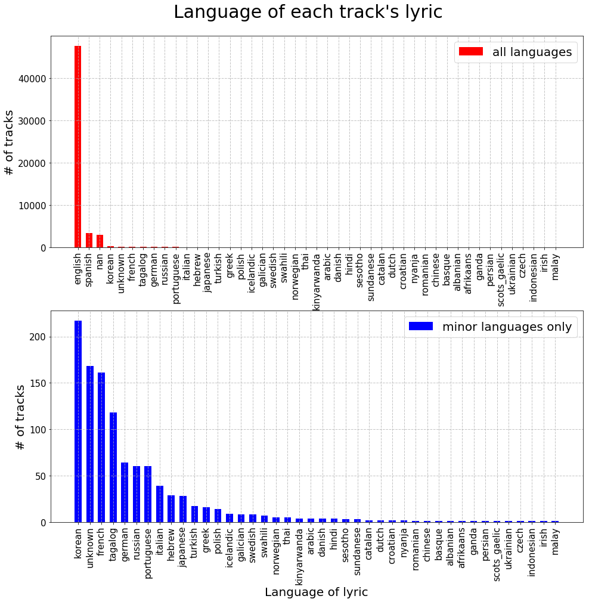
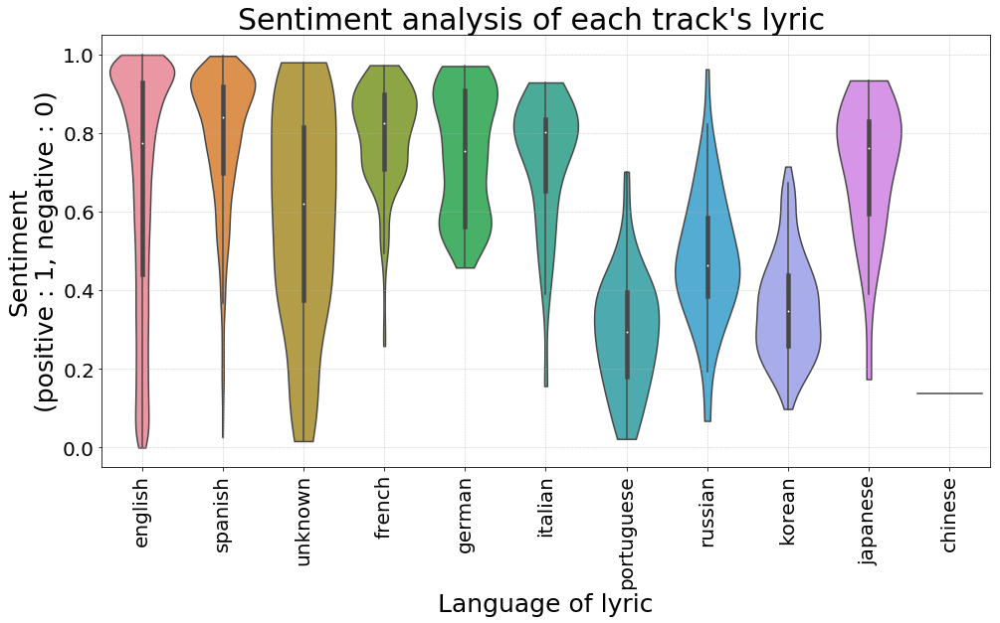
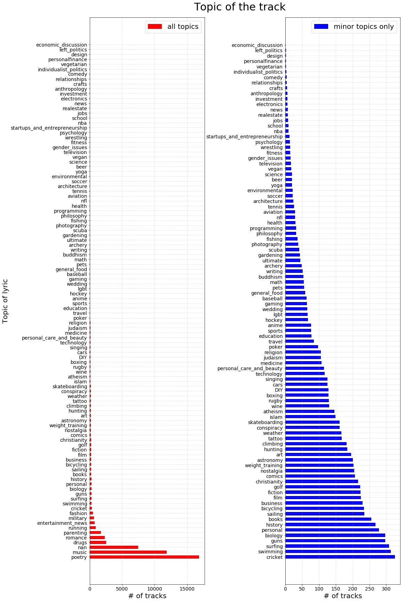
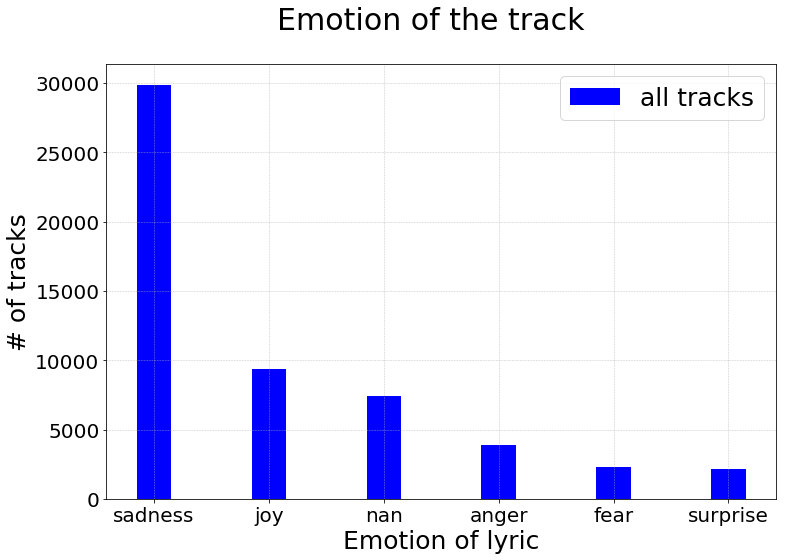
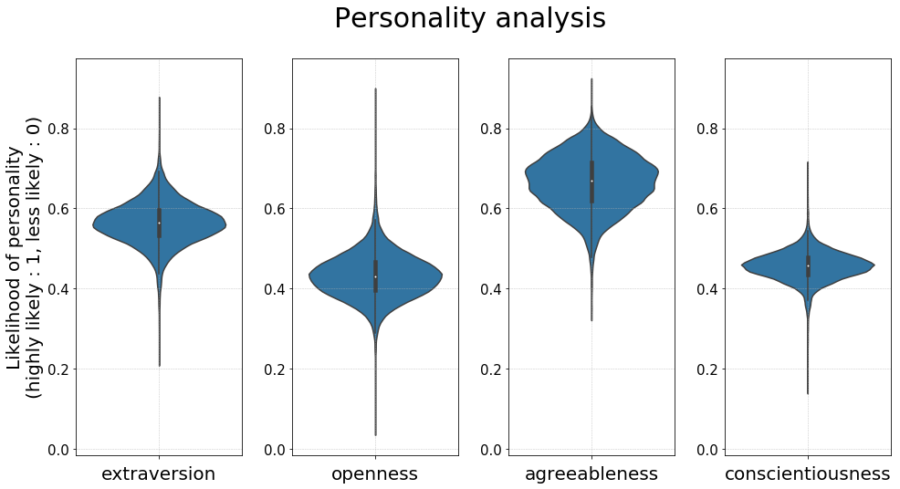

- All detailed codes and data are attached to the submission. For simplicity, we don't include all codes and data here in the website (final report).


## Contents
{:.no_toc}
*  
{: toc}


```python
# load the data from the file

playlists_df = pd.read_pickle('playlists_df_full_part3.pkl')
    
display(playlists_df.head())
print('Shape of dataframe : ', playlists_df.shape)
```


<div>
<style scoped>
    .dataframe tbody tr th:only-of-type {
        vertical-align: middle;
    }

    .dataframe tbody tr th {
        vertical-align: top;
    }

    .dataframe thead th {
        text-align: right;
    }
</style>
<table border="1" class="dataframe">
  <thead>
    <tr style="text-align: right;">
      <th></th>
      <th>acoustic</th>
      <th>acousticness</th>
      <th>afrobeat</th>
      <th>album_name</th>
      <th>album_uri</th>
      <th>alt-rock</th>
      <th>alternative</th>
      <th>ambient</th>
      <th>anime</th>
      <th>artist_name</th>
      <th>artist_uri</th>
      <th>black-metal</th>
      <th>bluegrass</th>
      <th>blues</th>
      <th>bossanova</th>
      <th>brazil</th>
      <th>breakbeat</th>
      <th>british</th>
      <th>cantopop</th>
      <th>chicago-house</th>
      <th>children</th>
      <th>chill</th>
      <th>classical</th>
      <th>club</th>
      <th>collaborative</th>
      <th>comedy</th>
      <th>country</th>
      <th>dance</th>
      <th>danceability</th>
      <th>dancehall</th>
      <th>death-metal</th>
      <th>deep-house</th>
      <th>description</th>
      <th>detroit-techno</th>
      <th>disco</th>
      <th>disney</th>
      <th>drum-and-bass</th>
      <th>dub</th>
      <th>dubstep</th>
      <th>duration_ms</th>
      <th>edm</th>
      <th>electro</th>
      <th>electronic</th>
      <th>emo</th>
      <th>energy</th>
      <th>folk</th>
      <th>forro</th>
      <th>french</th>
      <th>funk</th>
      <th>garage</th>
      <th>german</th>
      <th>gospel</th>
      <th>goth</th>
      <th>grindcore</th>
      <th>groove</th>
      <th>grunge</th>
      <th>guitar</th>
      <th>happy</th>
      <th>hard-rock</th>
      <th>hardcore</th>
      <th>hardstyle</th>
      <th>heavy-metal</th>
      <th>hip-hop</th>
      <th>holidays</th>
      <th>honky-tonk</th>
      <th>house</th>
      <th>idm</th>
      <th>indian</th>
      <th>indie</th>
      <th>indie-pop</th>
      <th>industrial</th>
      <th>instrumentalness</th>
      <th>iranian</th>
      <th>is_genius</th>
      <th>j-dance</th>
      <th>j-idol</th>
      <th>j-pop</th>
      <th>j-rock</th>
      <th>jazz</th>
      <th>k-pop</th>
      <th>key</th>
      <th>kids</th>
      <th>latin</th>
      <th>latino</th>
      <th>liveness</th>
      <th>loudness</th>
      <th>lyric</th>
      <th>malay</th>
      <th>mandopop</th>
      <th>metal</th>
      <th>metal-misc</th>
      <th>metalcore</th>
      <th>minimal-techno</th>
      <th>mode</th>
      <th>modified_at</th>
      <th>movies</th>
      <th>mpb</th>
      <th>name</th>
      <th>new-age</th>
      <th>new-release</th>
      <th>num_albums</th>
      <th>num_artists</th>
      <th>num_edits</th>
      <th>num_followers</th>
      <th>num_tracks</th>
      <th>opera</th>
      <th>pagode</th>
      <th>party</th>
      <th>philippines-opm</th>
      <th>piano</th>
      <th>pid</th>
      <th>playlist_duration_ms</th>
      <th>pop</th>
      <th>pop-film</th>
      <th>popularity</th>
      <th>pos</th>
      <th>post-dubstep</th>
      <th>power-pop</th>
      <th>progressive-house</th>
      <th>psych-rock</th>
      <th>punk</th>
      <th>punk-rock</th>
      <th>r-n-b</th>
      <th>rainy-day</th>
      <th>reggae</th>
      <th>reggaeton</th>
      <th>related_artist_0</th>
      <th>related_artist_1</th>
      <th>related_artist_2</th>
      <th>related_artist_3</th>
      <th>related_artist_4</th>
      <th>related_artist_5</th>
      <th>related_artist_6</th>
      <th>related_artist_7</th>
      <th>related_artist_8</th>
      <th>related_artist_9</th>
      <th>related_artist_n</th>
      <th>road-trip</th>
      <th>rock</th>
      <th>rock-n-roll</th>
      <th>rockabilly</th>
      <th>romance</th>
      <th>sad</th>
      <th>salsa</th>
      <th>samba</th>
      <th>sertanejo</th>
      <th>show-tunes</th>
      <th>singer-songwriter</th>
      <th>ska</th>
      <th>sleep</th>
      <th>songwriter</th>
      <th>soul</th>
      <th>soundtracks</th>
      <th>spanish</th>
      <th>speechiness</th>
      <th>study</th>
      <th>summer</th>
      <th>swedish</th>
      <th>synth-pop</th>
      <th>tango</th>
      <th>techno</th>
      <th>tempo</th>
      <th>time_signature</th>
      <th>top_track_0</th>
      <th>top_track_1</th>
      <th>top_track_2</th>
      <th>top_track_3</th>
      <th>top_track_4</th>
      <th>top_track_5</th>
      <th>top_track_6</th>
      <th>top_track_7</th>
      <th>top_track_8</th>
      <th>top_track_9</th>
      <th>top_track_n</th>
      <th>track_name</th>
      <th>track_uri</th>
      <th>trance</th>
      <th>trial</th>
      <th>trip-hop</th>
      <th>try_idx</th>
      <th>turkish</th>
      <th>valence</th>
      <th>work-out</th>
      <th>world-music</th>
      <th>year</th>
      <th>is_top_track</th>
      <th>is_top_track_0</th>
      <th>is_top_track_1</th>
      <th>is_top_track_2</th>
      <th>is_top_track_3</th>
      <th>is_top_track_4</th>
      <th>is_top_track_5</th>
      <th>is_top_track_6</th>
      <th>is_top_track_7</th>
      <th>is_top_track_8</th>
      <th>is_top_track_9</th>
    </tr>
  </thead>
  <tbody>
    <tr>
      <th>0</th>
      <td>0.0</td>
      <td>0.011400</td>
      <td>0.0</td>
      <td>127 Hours</td>
      <td>spotify:album:70wOJPVD0SKMn0DtddtZP3</td>
      <td>0.0</td>
      <td>0.0</td>
      <td>0.0</td>
      <td>0.0</td>
      <td>Free Blood</td>
      <td>spotify:artist:58cwi0vXDQEihBLREQTBGG</td>
      <td>0.0</td>
      <td>0.0</td>
      <td>0.0</td>
      <td>0.0</td>
      <td>0.0</td>
      <td>0.0</td>
      <td>0.0</td>
      <td>0.0</td>
      <td>0.0</td>
      <td>0.0</td>
      <td>0.0</td>
      <td>0.0</td>
      <td>0.0</td>
      <td>false</td>
      <td>0.0</td>
      <td>0.0</td>
      <td>0.0</td>
      <td>0.775</td>
      <td>0.0</td>
      <td>0.0</td>
      <td>0.0</td>
      <td></td>
      <td>0.0</td>
      <td>0.0</td>
      <td>0.0</td>
      <td>0.0</td>
      <td>0.0</td>
      <td>0.0</td>
      <td>351640</td>
      <td>0.0</td>
      <td>0.0</td>
      <td>0.0</td>
      <td>0.0</td>
      <td>0.828</td>
      <td>0.0</td>
      <td>0.0</td>
      <td>0.0</td>
      <td>0.0</td>
      <td>0.0</td>
      <td>0.0</td>
      <td>0.0</td>
      <td>0.0</td>
      <td>0.0</td>
      <td>0.0</td>
      <td>0.0</td>
      <td>0.0</td>
      <td>0.0</td>
      <td>0.0</td>
      <td>0.0</td>
      <td>0.0</td>
      <td>0.0</td>
      <td>0.0</td>
      <td>0.0</td>
      <td>0.0</td>
      <td>0.0</td>
      <td>0.0</td>
      <td>0.0</td>
      <td>0.0</td>
      <td>0.0</td>
      <td>0.0</td>
      <td>0.367000</td>
      <td>0.0</td>
      <td>True</td>
      <td>0.0</td>
      <td>0.0</td>
      <td>0.0</td>
      <td>0.0</td>
      <td>0.0</td>
      <td>0.0</td>
      <td>11.0</td>
      <td>0.0</td>
      <td>0.0</td>
      <td>0.0</td>
      <td>0.2460</td>
      <td>-7.511</td>
      <td>There must be some fucking chemical (Chemical ...</td>
      <td>0.0</td>
      <td>0.0</td>
      <td>0.0</td>
      <td>0.0</td>
      <td>0.0</td>
      <td>0.0</td>
      <td>0.0</td>
      <td>1492992000</td>
      <td>0.0</td>
      <td>0.0</td>
      <td>BIKING</td>
      <td>0.0</td>
      <td>0.0</td>
      <td>97</td>
      <td>93</td>
      <td>67</td>
      <td>31</td>
      <td>100</td>
      <td>0.0</td>
      <td>0.0</td>
      <td>0.0</td>
      <td>0.0</td>
      <td>0.0</td>
      <td>391407</td>
      <td>24415031</td>
      <td>0.0</td>
      <td>0.0</td>
      <td>8.0</td>
      <td>0</td>
      <td>0.0</td>
      <td>0.0</td>
      <td>0.0</td>
      <td>0.0</td>
      <td>0.0</td>
      <td>0.0</td>
      <td>0.0</td>
      <td>0.0</td>
      <td>0.0</td>
      <td>0.0</td>
      <td>spotify:artist:4zFfG4YHoSp9uxAHAdwv1W</td>
      <td>spotify:artist:5CUQPbbOibUHRBIw9sU2wi</td>
      <td>spotify:artist:5vKYoar0sNGd9XkcwVxX7z</td>
      <td>spotify:artist:7gG6LkU3pCSQmCIPR4aSBt</td>
      <td>spotify:artist:4mQBSbhPqSQ7feJeaJhfWP</td>
      <td>spotify:artist:6e8CEWxyjr08sZdm8rnyHM</td>
      <td>spotify:artist:1YBlUfzrF68OUYOC5Dyvab</td>
      <td>spotify:artist:6baWjwY7WiVPCZcW7pqqhz</td>
      <td>spotify:artist:2MwbiW5alh5hvh64SOOWMh</td>
      <td>spotify:artist:6P4lf0XbkcwHMRlkTI5ACo</td>
      <td>20.0</td>
      <td>0.0</td>
      <td>0.0</td>
      <td>0.0</td>
      <td>0.0</td>
      <td>0.0</td>
      <td>0.0</td>
      <td>0.0</td>
      <td>0.0</td>
      <td>0.0</td>
      <td>0.0</td>
      <td>0.0</td>
      <td>0.0</td>
      <td>0.0</td>
      <td>0.0</td>
      <td>0.0</td>
      <td>0.0</td>
      <td>0.0</td>
      <td>0.0503</td>
      <td>0.0</td>
      <td>0.0</td>
      <td>0.0</td>
      <td>0.0</td>
      <td>0.0</td>
      <td>0.0</td>
      <td>108.016</td>
      <td>4.0</td>
      <td>spotify:track:3ihS3VFJaMoOiGnqNQkofK</td>
      <td>spotify:track:2cAlHfVD1Q2wEU6uwipRvc</td>
      <td>spotify:track:3PVBYmDOolNqNWQcrY85zn</td>
      <td>spotify:track:6eqyr38v77Y13G2EPX2Njl</td>
      <td>spotify:track:09H8bis4vzY3jEsVy5KYfF</td>
      <td>spotify:track:4GRLoSad0HeAkdKuysxZ87</td>
      <td>spotify:track:2C9UMgOxNro5N97v2ytzZu</td>
      <td></td>
      <td></td>
      <td></td>
      <td>7.0</td>
      <td>Never Hear Surf Music Again</td>
      <td>spotify:track:0PxPcrfAXNu0MpKRwdlbuc</td>
      <td>0.0</td>
      <td>0.0</td>
      <td>0.0</td>
      <td>0.0</td>
      <td>0.0</td>
      <td>0.531</td>
      <td>0.0</td>
      <td>0.0</td>
      <td>2010.0</td>
      <td>10.0</td>
      <td>0.0</td>
      <td>0.0</td>
      <td>0.0</td>
      <td>0.0</td>
      <td>0.0</td>
      <td>0.0</td>
      <td>0.0</td>
      <td>0.0</td>
      <td>0.0</td>
      <td>0.0</td>
    </tr>
    <tr>
      <th>1</th>
      <td>0.0</td>
      <td>0.094400</td>
      <td>0.0</td>
      <td>Waves</td>
      <td>spotify:album:2R6wefBXnMzCkRoqD7FdNk</td>
      <td>0.0</td>
      <td>0.0</td>
      <td>0.0</td>
      <td>0.0</td>
      <td>Joey Bada$$</td>
      <td>spotify:artist:2P5sC9cVZDToPxyomzF1UH</td>
      <td>0.0</td>
      <td>0.0</td>
      <td>0.0</td>
      <td>0.0</td>
      <td>0.0</td>
      <td>0.0</td>
      <td>0.0</td>
      <td>0.0</td>
      <td>0.0</td>
      <td>0.0</td>
      <td>0.0</td>
      <td>0.0</td>
      <td>0.0</td>
      <td>false</td>
      <td>0.0</td>
      <td>0.0</td>
      <td>0.0</td>
      <td>0.591</td>
      <td>0.0</td>
      <td>0.0</td>
      <td>0.0</td>
      <td></td>
      <td>0.0</td>
      <td>0.0</td>
      <td>0.0</td>
      <td>0.0</td>
      <td>0.0</td>
      <td>0.0</td>
      <td>213333</td>
      <td>0.0</td>
      <td>0.0</td>
      <td>0.0</td>
      <td>0.0</td>
      <td>0.892</td>
      <td>0.0</td>
      <td>0.0</td>
      <td>0.0</td>
      <td>0.0</td>
      <td>0.0</td>
      <td>0.0</td>
      <td>0.0</td>
      <td>0.0</td>
      <td>0.0</td>
      <td>0.0</td>
      <td>0.0</td>
      <td>0.0</td>
      <td>0.0</td>
      <td>0.0</td>
      <td>0.0</td>
      <td>0.0</td>
      <td>0.0</td>
      <td>0.0</td>
      <td>0.0</td>
      <td>0.0</td>
      <td>0.0</td>
      <td>0.0</td>
      <td>0.0</td>
      <td>0.0</td>
      <td>0.0</td>
      <td>0.0</td>
      <td>0.000000</td>
      <td>0.0</td>
      <td>True</td>
      <td>0.0</td>
      <td>0.0</td>
      <td>0.0</td>
      <td>0.0</td>
      <td>0.0</td>
      <td>0.0</td>
      <td>8.0</td>
      <td>0.0</td>
      <td>0.0</td>
      <td>0.0</td>
      <td>0.1130</td>
      <td>-6.114</td>
      <td>[Intro]\nYeah, you remember back in the days\n...</td>
      <td>0.0</td>
      <td>0.0</td>
      <td>0.0</td>
      <td>0.0</td>
      <td>0.0</td>
      <td>0.0</td>
      <td>0.0</td>
      <td>1492992000</td>
      <td>0.0</td>
      <td>0.0</td>
      <td>BIKING</td>
      <td>0.0</td>
      <td>0.0</td>
      <td>97</td>
      <td>93</td>
      <td>67</td>
      <td>31</td>
      <td>100</td>
      <td>0.0</td>
      <td>0.0</td>
      <td>0.0</td>
      <td>0.0</td>
      <td>0.0</td>
      <td>391407</td>
      <td>24415031</td>
      <td>0.0</td>
      <td>0.0</td>
      <td>47.0</td>
      <td>1</td>
      <td>0.0</td>
      <td>0.0</td>
      <td>0.0</td>
      <td>0.0</td>
      <td>0.0</td>
      <td>0.0</td>
      <td>0.0</td>
      <td>0.0</td>
      <td>0.0</td>
      <td>0.0</td>
      <td>spotify:artist:1dqGS5sT6PE2wEvP1gROZC</td>
      <td>spotify:artist:1GL1GlXfQ7TtZKDH50sXwV</td>
      <td>spotify:artist:0g9vAlRPK9Gt3FKCekk4TW</td>
      <td>spotify:artist:1ZyUXvaBXUsIZ3JD6jYGkt</td>
      <td>spotify:artist:68kEuyFKyqrdQQLLsmiatm</td>
      <td>spotify:artist:51Pn4gGnZuyOMDfIT1Zy3N</td>
      <td>spotify:artist:1FvjvACFvko2Z91IvDljrx</td>
      <td>spotify:artist:6vHBuUxrcpn1do5UaEJ7g6</td>
      <td>spotify:artist:0Y4inQK6OespitzD6ijMwb</td>
      <td>spotify:artist:7BMccF0hQFBpP6417k1OtQ</td>
      <td>20.0</td>
      <td>0.0</td>
      <td>0.0</td>
      <td>0.0</td>
      <td>0.0</td>
      <td>0.0</td>
      <td>0.0</td>
      <td>0.0</td>
      <td>0.0</td>
      <td>0.0</td>
      <td>0.0</td>
      <td>0.0</td>
      <td>0.0</td>
      <td>0.0</td>
      <td>0.0</td>
      <td>0.0</td>
      <td>0.0</td>
      <td>0.0</td>
      <td>0.2930</td>
      <td>0.0</td>
      <td>0.0</td>
      <td>0.0</td>
      <td>0.0</td>
      <td>0.0</td>
      <td>0.0</td>
      <td>89.849</td>
      <td>4.0</td>
      <td>spotify:track:4ntsD33Pgsgk8rUyZLLiUV</td>
      <td>spotify:track:4txpZk7WSjV1dsZAw5WYcT</td>
      <td>spotify:track:7L9g4cPfohScjJ8mGwLQWr</td>
      <td>spotify:track:2ZVRyUFQTI5K99wpJElGrD</td>
      <td>spotify:track:6xz04ypw5JsqiyityCASG1</td>
      <td>spotify:track:6lM1G8kF3xCUW20lIRfoBm</td>
      <td>spotify:track:5URYXSFGks9Q8eYePlgVdL</td>
      <td>spotify:track:7g8rz7xe0G4Go0tTZAXcOx</td>
      <td>spotify:track:2DP3SfAM8g1hKPXKWyDptv</td>
      <td>spotify:track:5csdNgCD64XzhsyoRlhzsa</td>
      <td>10.0</td>
      <td>Waves</td>
      <td>spotify:track:1fb6b2Mas9q2mWxJazzeRI</td>
      <td>0.0</td>
      <td>0.0</td>
      <td>0.0</td>
      <td>0.0</td>
      <td>0.0</td>
      <td>0.712</td>
      <td>0.0</td>
      <td>0.0</td>
      <td>2012.0</td>
      <td>10.0</td>
      <td>0.0</td>
      <td>0.0</td>
      <td>0.0</td>
      <td>0.0</td>
      <td>0.0</td>
      <td>0.0</td>
      <td>0.0</td>
      <td>0.0</td>
      <td>0.0</td>
      <td>0.0</td>
    </tr>
    <tr>
      <th>2</th>
      <td>0.0</td>
      <td>0.312000</td>
      <td>0.0</td>
      <td>Every Kingdom</td>
      <td>spotify:album:2MxcbOGFi99D9JACvj74AH</td>
      <td>0.0</td>
      <td>0.0</td>
      <td>0.0</td>
      <td>0.0</td>
      <td>Ben Howard</td>
      <td>spotify:artist:5schNIzWdI9gJ1QRK8SBnc</td>
      <td>0.0</td>
      <td>0.0</td>
      <td>0.0</td>
      <td>0.0</td>
      <td>0.0</td>
      <td>0.0</td>
      <td>0.0</td>
      <td>0.0</td>
      <td>0.0</td>
      <td>0.0</td>
      <td>0.0</td>
      <td>0.0</td>
      <td>0.0</td>
      <td>false</td>
      <td>0.0</td>
      <td>0.0</td>
      <td>0.0</td>
      <td>0.496</td>
      <td>0.0</td>
      <td>0.0</td>
      <td>0.0</td>
      <td></td>
      <td>0.0</td>
      <td>0.0</td>
      <td>0.0</td>
      <td>0.0</td>
      <td>0.0</td>
      <td>0.0</td>
      <td>309346</td>
      <td>0.0</td>
      <td>0.0</td>
      <td>0.0</td>
      <td>0.0</td>
      <td>0.531</td>
      <td>0.0</td>
      <td>0.0</td>
      <td>0.0</td>
      <td>0.0</td>
      <td>0.0</td>
      <td>0.0</td>
      <td>0.0</td>
      <td>0.0</td>
      <td>0.0</td>
      <td>0.0</td>
      <td>0.0</td>
      <td>0.0</td>
      <td>0.0</td>
      <td>0.0</td>
      <td>0.0</td>
      <td>0.0</td>
      <td>0.0</td>
      <td>0.0</td>
      <td>0.0</td>
      <td>0.0</td>
      <td>0.0</td>
      <td>0.0</td>
      <td>0.0</td>
      <td>0.0</td>
      <td>0.0</td>
      <td>0.0</td>
      <td>0.009010</td>
      <td>0.0</td>
      <td>True</td>
      <td>0.0</td>
      <td>0.0</td>
      <td>0.0</td>
      <td>0.0</td>
      <td>0.0</td>
      <td>0.0</td>
      <td>0.0</td>
      <td>0.0</td>
      <td>0.0</td>
      <td>0.0</td>
      <td>0.1130</td>
      <td>-9.889</td>
      <td>[Refrain]\nOh, oh-oh oh oh, oh\nOh, oh-oh oh o...</td>
      <td>0.0</td>
      <td>0.0</td>
      <td>0.0</td>
      <td>0.0</td>
      <td>0.0</td>
      <td>0.0</td>
      <td>0.0</td>
      <td>1492992000</td>
      <td>0.0</td>
      <td>0.0</td>
      <td>BIKING</td>
      <td>0.0</td>
      <td>0.0</td>
      <td>97</td>
      <td>93</td>
      <td>67</td>
      <td>31</td>
      <td>100</td>
      <td>0.0</td>
      <td>0.0</td>
      <td>0.0</td>
      <td>0.0</td>
      <td>0.0</td>
      <td>391407</td>
      <td>24415031</td>
      <td>0.0</td>
      <td>0.0</td>
      <td>15.0</td>
      <td>2</td>
      <td>0.0</td>
      <td>0.0</td>
      <td>0.0</td>
      <td>0.0</td>
      <td>0.0</td>
      <td>0.0</td>
      <td>0.0</td>
      <td>0.0</td>
      <td>0.0</td>
      <td>0.0</td>
      <td>spotify:artist:7FDlvgcodNfC0IBdWevl4u</td>
      <td>spotify:artist:7D5oTJSXSHf51auG0106CQ</td>
      <td>spotify:artist:0lSENl3bteP8p2NbiSP7RM</td>
      <td>spotify:artist:6xrCU6zdcSTsG2hLrojpmI</td>
      <td>spotify:artist:4tvKz56Tr39bkhcQUTO0Xr</td>
      <td>spotify:artist:5sXaGoRLSpd7VeyZrLkKwt</td>
      <td>spotify:artist:4LEiUm1SRbFMgfqnQTwUbQ</td>
      <td>spotify:artist:6qiGjRyN7TJ1GA2nXF68Hi</td>
      <td>spotify:artist:2BpAc5eK7Rz5GAwSp9UYXa</td>
      <td>spotify:artist:2LSJrlndCuTpdEluvYHc2E</td>
      <td>20.0</td>
      <td>0.0</td>
      <td>0.0</td>
      <td>0.0</td>
      <td>0.0</td>
      <td>0.0</td>
      <td>0.0</td>
      <td>0.0</td>
      <td>0.0</td>
      <td>0.0</td>
      <td>0.0</td>
      <td>0.0</td>
      <td>0.0</td>
      <td>0.0</td>
      <td>0.0</td>
      <td>0.0</td>
      <td>0.0</td>
      <td>0.0</td>
      <td>0.0325</td>
      <td>0.0</td>
      <td>0.0</td>
      <td>0.0</td>
      <td>0.0</td>
      <td>0.0</td>
      <td>0.0</td>
      <td>119.159</td>
      <td>4.0</td>
      <td>spotify:track:2uhEKg8kIzpdvz4gyy6x8W</td>
      <td>spotify:track:3CAX47TnPqTujLIQTw8nwI</td>
      <td>spotify:track:5fpEDGQX0Ah3utGnFYulQZ</td>
      <td>spotify:track:4qyfir5Yr7nfo05g6cyFMT</td>
      <td>spotify:track:7gYwIAHB6VxzLJFSZMMv8i</td>
      <td>spotify:track:5eSH7Aubn6Ol80ynF4MV2L</td>
      <td>spotify:track:2zKoA5gp5Xaw3mrp45XIrR</td>
      <td>spotify:track:5RySo0AAUR0reTHSCvb6HC</td>
      <td>spotify:track:2Viw81MZJPsOjODAz4A5nW</td>
      <td>spotify:track:2Yu0AtCUsskiFKqtLCm0zc</td>
      <td>10.0</td>
      <td>The Wolves</td>
      <td>spotify:track:3gqP2hxwgi6mb8FhtEe4zU</td>
      <td>0.0</td>
      <td>0.0</td>
      <td>0.0</td>
      <td>0.0</td>
      <td>0.0</td>
      <td>0.507</td>
      <td>0.0</td>
      <td>0.0</td>
      <td>2011.0</td>
      <td>10.0</td>
      <td>0.0</td>
      <td>0.0</td>
      <td>0.0</td>
      <td>0.0</td>
      <td>0.0</td>
      <td>0.0</td>
      <td>0.0</td>
      <td>0.0</td>
      <td>0.0</td>
      <td>0.0</td>
    </tr>
    <tr>
      <th>3</th>
      <td>0.0</td>
      <td>0.000029</td>
      <td>0.0</td>
      <td>Wasting Light</td>
      <td>spotify:album:5lnQLEUiVDkLbFJHXHQu9m</td>
      <td>0.0</td>
      <td>0.0</td>
      <td>0.0</td>
      <td>0.0</td>
      <td>Foo Fighters</td>
      <td>spotify:artist:7jy3rLJdDQY21OgRLCZ9sD</td>
      <td>0.0</td>
      <td>0.0</td>
      <td>0.0</td>
      <td>0.0</td>
      <td>0.0</td>
      <td>0.0</td>
      <td>0.0</td>
      <td>0.0</td>
      <td>0.0</td>
      <td>0.0</td>
      <td>0.0</td>
      <td>0.0</td>
      <td>0.0</td>
      <td>false</td>
      <td>0.0</td>
      <td>0.0</td>
      <td>0.0</td>
      <td>0.420</td>
      <td>0.0</td>
      <td>0.0</td>
      <td>0.0</td>
      <td></td>
      <td>0.0</td>
      <td>0.0</td>
      <td>0.0</td>
      <td>0.0</td>
      <td>0.0</td>
      <td>0.0</td>
      <td>286466</td>
      <td>0.0</td>
      <td>0.0</td>
      <td>0.0</td>
      <td>0.0</td>
      <td>0.914</td>
      <td>0.0</td>
      <td>0.0</td>
      <td>0.0</td>
      <td>0.0</td>
      <td>0.0</td>
      <td>0.0</td>
      <td>0.0</td>
      <td>0.0</td>
      <td>0.0</td>
      <td>0.0</td>
      <td>0.0</td>
      <td>0.0</td>
      <td>0.0</td>
      <td>0.0</td>
      <td>0.0</td>
      <td>0.0</td>
      <td>0.0</td>
      <td>0.0</td>
      <td>0.0</td>
      <td>0.0</td>
      <td>0.0</td>
      <td>0.0</td>
      <td>0.0</td>
      <td>0.0</td>
      <td>0.0</td>
      <td>0.0</td>
      <td>0.028200</td>
      <td>0.0</td>
      <td>True</td>
      <td>0.0</td>
      <td>0.0</td>
      <td>0.0</td>
      <td>0.0</td>
      <td>0.0</td>
      <td>0.0</td>
      <td>6.0</td>
      <td>0.0</td>
      <td>0.0</td>
      <td>0.0</td>
      <td>0.2200</td>
      <td>-4.322</td>
      <td>[Intro]\nThese are my famous last words!\nMy n...</td>
      <td>0.0</td>
      <td>0.0</td>
      <td>0.0</td>
      <td>0.0</td>
      <td>0.0</td>
      <td>0.0</td>
      <td>0.0</td>
      <td>1492992000</td>
      <td>0.0</td>
      <td>0.0</td>
      <td>BIKING</td>
      <td>0.0</td>
      <td>0.0</td>
      <td>97</td>
      <td>93</td>
      <td>67</td>
      <td>31</td>
      <td>100</td>
      <td>0.0</td>
      <td>0.0</td>
      <td>0.0</td>
      <td>0.0</td>
      <td>0.0</td>
      <td>391407</td>
      <td>24415031</td>
      <td>0.0</td>
      <td>0.0</td>
      <td>55.0</td>
      <td>3</td>
      <td>0.0</td>
      <td>0.0</td>
      <td>0.0</td>
      <td>0.0</td>
      <td>0.0</td>
      <td>0.0</td>
      <td>0.0</td>
      <td>0.0</td>
      <td>0.0</td>
      <td>0.0</td>
      <td>spotify:artist:78SHxLdtysAXgywQ4vE0Oa</td>
      <td>spotify:artist:2ziB7fzrXBoh1HUPS6sVFn</td>
      <td>spotify:artist:5xUf6j4upBrXZPg6AI4MRK</td>
      <td>spotify:artist:2UazAtjfzqBF0Nho2awK4z</td>
      <td>spotify:artist:40Yq4vzPs9VNUrIBG5Jr2i</td>
      <td>spotify:artist:64tNsm6TnZe2zpcMVMOoHL</td>
      <td>spotify:artist:3YcBF2ttyueytpXtEzn1Za</td>
      <td>spotify:artist:0iHb0mCbqZTYeb4y9Pirrd</td>
      <td>spotify:artist:4iudEcmuPlYNdbP3e1bdn1</td>
      <td>spotify:artist:0XHiH53dHrvbwfjYM7en7I</td>
      <td>20.0</td>
      <td>0.0</td>
      <td>1.0</td>
      <td>0.0</td>
      <td>0.0</td>
      <td>0.0</td>
      <td>0.0</td>
      <td>0.0</td>
      <td>0.0</td>
      <td>0.0</td>
      <td>0.0</td>
      <td>0.0</td>
      <td>0.0</td>
      <td>0.0</td>
      <td>0.0</td>
      <td>0.0</td>
      <td>0.0</td>
      <td>0.0</td>
      <td>0.0431</td>
      <td>0.0</td>
      <td>0.0</td>
      <td>0.0</td>
      <td>0.0</td>
      <td>0.0</td>
      <td>0.0</td>
      <td>170.199</td>
      <td>4.0</td>
      <td>spotify:track:5UWwZ5lm5PKu6eKsHAGxOk</td>
      <td>spotify:track:7x8dCjCr0x6x2lXKujYD34</td>
      <td>spotify:track:5FZxsHWIvUsmSK1IAvm2pp</td>
      <td>spotify:track:5OQsiBsky2k2kDKy2bX2eT</td>
      <td>spotify:track:3kdMzXOcrDIdSWLdONHNK5</td>
      <td>spotify:track:6tsojOQ5wHaIjKqIryLZK6</td>
      <td>spotify:track:3QmesrvdbPjwf7i40nht1D</td>
      <td>spotify:track:4dVbhS6OiYvFikshyaQaCN</td>
      <td>spotify:track:76Je5Wklky23mVoxiRszcN</td>
      <td>spotify:track:1wLQwg0mloy3yXjL0jPE0N</td>
      <td>10.0</td>
      <td>Bridge Burning</td>
      <td>spotify:track:0bHD1nLe7Nhw55ZGJ92332</td>
      <td>0.0</td>
      <td>0.0</td>
      <td>0.0</td>
      <td>0.0</td>
      <td>0.0</td>
      <td>0.301</td>
      <td>0.0</td>
      <td>0.0</td>
      <td>2011.0</td>
      <td>10.0</td>
      <td>0.0</td>
      <td>0.0</td>
      <td>0.0</td>
      <td>0.0</td>
      <td>0.0</td>
      <td>0.0</td>
      <td>0.0</td>
      <td>0.0</td>
      <td>0.0</td>
      <td>0.0</td>
    </tr>
    <tr>
      <th>4</th>
      <td>0.0</td>
      <td>0.024500</td>
      <td>0.0</td>
      <td>Sweet Disarray</td>
      <td>spotify:album:2qg3JERQKBjZXvMBtvKR0y</td>
      <td>0.0</td>
      <td>0.0</td>
      <td>0.0</td>
      <td>0.0</td>
      <td>Dan Croll</td>
      <td>spotify:artist:5Rr15NSbi1Xjno1AEP9u21</td>
      <td>0.0</td>
      <td>0.0</td>
      <td>0.0</td>
      <td>0.0</td>
      <td>0.0</td>
      <td>0.0</td>
      <td>0.0</td>
      <td>0.0</td>
      <td>0.0</td>
      <td>0.0</td>
      <td>0.0</td>
      <td>0.0</td>
      <td>0.0</td>
      <td>false</td>
      <td>0.0</td>
      <td>0.0</td>
      <td>0.0</td>
      <td>0.633</td>
      <td>0.0</td>
      <td>0.0</td>
      <td>0.0</td>
      <td></td>
      <td>0.0</td>
      <td>0.0</td>
      <td>0.0</td>
      <td>0.0</td>
      <td>0.0</td>
      <td>0.0</td>
      <td>196848</td>
      <td>0.0</td>
      <td>0.0</td>
      <td>0.0</td>
      <td>0.0</td>
      <td>0.881</td>
      <td>0.0</td>
      <td>0.0</td>
      <td>0.0</td>
      <td>0.0</td>
      <td>0.0</td>
      <td>0.0</td>
      <td>0.0</td>
      <td>0.0</td>
      <td>0.0</td>
      <td>0.0</td>
      <td>0.0</td>
      <td>0.0</td>
      <td>0.0</td>
      <td>0.0</td>
      <td>0.0</td>
      <td>0.0</td>
      <td>0.0</td>
      <td>0.0</td>
      <td>0.0</td>
      <td>0.0</td>
      <td>0.0</td>
      <td>0.0</td>
      <td>0.0</td>
      <td>0.0</td>
      <td>0.0</td>
      <td>0.0</td>
      <td>0.000147</td>
      <td>0.0</td>
      <td>True</td>
      <td>0.0</td>
      <td>0.0</td>
      <td>0.0</td>
      <td>0.0</td>
      <td>0.0</td>
      <td>0.0</td>
      <td>1.0</td>
      <td>0.0</td>
      <td>0.0</td>
      <td>0.0</td>
      <td>0.0474</td>
      <td>-5.570</td>
      <td>[Verse 1]\nEvery now and then I fall\nEvery no...</td>
      <td>0.0</td>
      <td>0.0</td>
      <td>0.0</td>
      <td>0.0</td>
      <td>0.0</td>
      <td>0.0</td>
      <td>0.0</td>
      <td>1492992000</td>
      <td>0.0</td>
      <td>0.0</td>
      <td>BIKING</td>
      <td>0.0</td>
      <td>0.0</td>
      <td>97</td>
      <td>93</td>
      <td>67</td>
      <td>31</td>
      <td>100</td>
      <td>0.0</td>
      <td>0.0</td>
      <td>0.0</td>
      <td>0.0</td>
      <td>0.0</td>
      <td>391407</td>
      <td>24415031</td>
      <td>0.0</td>
      <td>0.0</td>
      <td>54.0</td>
      <td>4</td>
      <td>0.0</td>
      <td>0.0</td>
      <td>0.0</td>
      <td>0.0</td>
      <td>0.0</td>
      <td>0.0</td>
      <td>0.0</td>
      <td>0.0</td>
      <td>0.0</td>
      <td>0.0</td>
      <td>spotify:artist:3LedjkHgJTjLJfDTM5YgmD</td>
      <td>spotify:artist:0hSgRl2U8kSaJLE2Di325f</td>
      <td>spotify:artist:4rs1K6gDzLY5VnCMSC80o7</td>
      <td>spotify:artist:2OK16hAFRHoJiFZKeZe8A8</td>
      <td>spotify:artist:1ikg4sypcURm8Vy5GP68xb</td>
      <td>spotify:artist:3nUbzTTtP2w4HqvT5y5vkV</td>
      <td>spotify:artist:5WId4o5jdGVhptNU0uqKxu</td>
      <td>spotify:artist:7LAucJAvbQa7ZIA0qP8YI2</td>
      <td>spotify:artist:7sgWBYtJpblXpJl2lU5WVs</td>
      <td>spotify:artist:4wYk01oPJNfaEssVFL46oQ</td>
      <td>20.0</td>
      <td>0.0</td>
      <td>0.0</td>
      <td>0.0</td>
      <td>0.0</td>
      <td>0.0</td>
      <td>0.0</td>
      <td>0.0</td>
      <td>0.0</td>
      <td>0.0</td>
      <td>0.0</td>
      <td>0.0</td>
      <td>0.0</td>
      <td>0.0</td>
      <td>0.0</td>
      <td>0.0</td>
      <td>0.0</td>
      <td>0.0</td>
      <td>0.1540</td>
      <td>0.0</td>
      <td>0.0</td>
      <td>0.0</td>
      <td>0.0</td>
      <td>0.0</td>
      <td>0.0</td>
      <td>87.920</td>
      <td>4.0</td>
      <td>spotify:track:5c9YHjSjEZxaCxsF1Gy5Jt</td>
      <td>spotify:track:0pYIbG6swaHaf4oTvZnRfQ</td>
      <td>spotify:track:2DYlCu6ENt9HzutTsHtYxe</td>
      <td>spotify:track:2D68vwpabaYmUoyphL54ny</td>
      <td>spotify:track:6DNBziEP6Vd7J3OY9Xgp22</td>
      <td>spotify:track:0KGiUCH6bBSkM8SRUjGkTF</td>
      <td>spotify:track:49VLbSKExInHdbdOlnMLb8</td>
      <td>spotify:track:7iinsa3IGXuQL9cpb6n3Hy</td>
      <td>spotify:track:7nNfHmDyY9WlnBzUP2kgaf</td>
      <td>spotify:track:4YybVZDC1aBlNCnOuKygMo</td>
      <td>10.0</td>
      <td>From Nowhere</td>
      <td>spotify:track:5c9YHjSjEZxaCxsF1Gy5Jt</td>
      <td>0.0</td>
      <td>0.0</td>
      <td>0.0</td>
      <td>0.0</td>
      <td>0.0</td>
      <td>0.622</td>
      <td>0.0</td>
      <td>0.0</td>
      <td>2014.0</td>
      <td>0.0</td>
      <td>1.0</td>
      <td>0.0</td>
      <td>0.0</td>
      <td>0.0</td>
      <td>0.0</td>
      <td>0.0</td>
      <td>0.0</td>
      <td>0.0</td>
      <td>0.0</td>
      <td>0.0</td>
    </tr>
  </tbody>
</table>
</div>


    Shape of dataframe :  (55000, 196)
    


## 1) Detect language of lyrics (and title)

**[Notes]**
- Automatically determine the language of a phrase or document. <br>
<br>
- We used cld2 package, which is Google's Compact Language Detector 2. <br>
It probabilistically detects over 80 languages in plain text or HTML. <br>
For mixed-language input, it returns the top three detected languages and their approximate proportion of the total classified text bytes. <br>
<br>
- In the following cell, you can see the example. <br>
The same sentence was written in a different language using 'Google translate'. <br>
As you can see, even though this sentence is pretty short, language detection result is pretty good. <br>

**[Examples]**


```python
res = cld2.detect("This is a sample text.")
print(res.details[0].language_name)
res = cld2.detect("Dies ist ein Beispieltext.")
print(res.details[0].language_name)
res = cld2.detect("Je ne peut pas parler cette language.")
print(res.details[0].language_name)
res = cld2.detect(" هذه هي بعض النصوص العربية")
print(res.details[0].language_name)
res = cld2.detect("这是一些阿拉伯文字") # Chinese?
print(res.details[0].language_name)
res = cld2.detect("これは、いくつかのアラビア語のテキストです")
print(res.details[0].language_name)
print("Supports {} languages.".format(len(cld2.LANGUAGES)))
```


    ENGLISH
    GERMAN
    FRENCH
    ARABIC
    Unknown
    Japanese
    Supports 282 languages.
    


```python
def detect_language(text_arg : str, index_arg : int, df_arg, is_lyric_arg : bool = True, show_log_arg : bool = False):
    '''
    Input
        text_arg : text that we want to detect language
        index_arg : index of the dataframe at which text is located
        df_arg : dataframe containing text
        is_lyric_arg : True if text_arg comes from lyric
        show_log_arg : if True, show the log
    '''
    
    is_valid = True
    
    try:
        if (is_lyric_arg) and (len(text_arg) < 50):
            # 'No lyrics' or Invalid lyrics
            is_valid = False
            if (show_log_arg):
                print(f'playlist_num ({index_arg}) : ', text_arg)
            
        else:
            res = cld2.detect(text_arg)
                
    except TypeError:
        # NaN
        is_valid = False
        if (show_log_arg):
            print(f'playlist_num ({index_arg}) : ', text_arg)
        
    except ValueError:
        # input contains invalid UTF-8        
        printable_str = ''.join(x for x in text_arg if x.isprintable())
        res = cld2.detect(printable_str)
        
        
    if (is_valid):
#         print(res.details[0].language_name)        
        if (is_lyric_arg):
            feature = 'lyric_language'
        else:
            feature = 'track_name_language'
        
        if res.details[0].language_name.lower().strip() == 'chineset':
            # Chinese exception handling
            df_arg.at[index_arg, feature] = 'chinese'
        else:
            df_arg.at[index_arg, feature] = res.details[0].language_name.lower().strip()
        
        if (res.is_reliable):
            df_arg.at[index_arg, feature + '_reliable'] = 1 #True
        else:
            df_arg.at[index_arg, feature + '_reliable'] = 0 #False
            if (is_lyric_arg):
                if (show_log_arg):
                    print(f'playlist_num ({index_arg}) : [Not reliable]') # , text_arg
```


```python
for playlist_num in playlists_df.index:
    detect_language(playlists_df.loc[playlist_num]['track_name'], playlist_num, playlists_df, False)
    detect_language(playlists_df.loc[playlist_num]['lyric'], playlist_num, playlists_df)

display(playlists_df.describe())
# print(np.sum(playlists_df.isna()))
display(playlists_df.head())
```


<div>
<style scoped>
    .dataframe tbody tr th:only-of-type {
        vertical-align: middle;
    }

    .dataframe tbody tr th {
        vertical-align: top;
    }

    .dataframe thead th {
        text-align: right;
    }
</style>
<table border="1" class="dataframe">
  <thead>
    <tr style="text-align: right;">
      <th></th>
      <th>acoustic</th>
      <th>acousticness</th>
      <th>afrobeat</th>
      <th>alt-rock</th>
      <th>alternative</th>
      <th>ambient</th>
      <th>anime</th>
      <th>black-metal</th>
      <th>bluegrass</th>
      <th>blues</th>
      <th>bossanova</th>
      <th>brazil</th>
      <th>breakbeat</th>
      <th>british</th>
      <th>cantopop</th>
      <th>chicago-house</th>
      <th>children</th>
      <th>chill</th>
      <th>classical</th>
      <th>club</th>
      <th>comedy</th>
      <th>country</th>
      <th>dance</th>
      <th>danceability</th>
      <th>dancehall</th>
      <th>death-metal</th>
      <th>deep-house</th>
      <th>detroit-techno</th>
      <th>disco</th>
      <th>disney</th>
      <th>drum-and-bass</th>
      <th>dub</th>
      <th>dubstep</th>
      <th>duration_ms</th>
      <th>edm</th>
      <th>electro</th>
      <th>electronic</th>
      <th>emo</th>
      <th>energy</th>
      <th>folk</th>
      <th>forro</th>
      <th>french</th>
      <th>funk</th>
      <th>garage</th>
      <th>german</th>
      <th>gospel</th>
      <th>goth</th>
      <th>grindcore</th>
      <th>groove</th>
      <th>grunge</th>
      <th>guitar</th>
      <th>happy</th>
      <th>hard-rock</th>
      <th>hardcore</th>
      <th>hardstyle</th>
      <th>heavy-metal</th>
      <th>hip-hop</th>
      <th>holidays</th>
      <th>honky-tonk</th>
      <th>house</th>
      <th>idm</th>
      <th>indian</th>
      <th>indie</th>
      <th>indie-pop</th>
      <th>industrial</th>
      <th>instrumentalness</th>
      <th>iranian</th>
      <th>j-dance</th>
      <th>j-idol</th>
      <th>j-pop</th>
      <th>j-rock</th>
      <th>jazz</th>
      <th>k-pop</th>
      <th>key</th>
      <th>kids</th>
      <th>latin</th>
      <th>latino</th>
      <th>liveness</th>
      <th>loudness</th>
      <th>malay</th>
      <th>mandopop</th>
      <th>metal</th>
      <th>metal-misc</th>
      <th>metalcore</th>
      <th>minimal-techno</th>
      <th>mode</th>
      <th>modified_at</th>
      <th>movies</th>
      <th>mpb</th>
      <th>new-age</th>
      <th>new-release</th>
      <th>num_albums</th>
      <th>num_artists</th>
      <th>num_edits</th>
      <th>num_followers</th>
      <th>num_tracks</th>
      <th>opera</th>
      <th>pagode</th>
      <th>party</th>
      <th>philippines-opm</th>
      <th>piano</th>
      <th>pid</th>
      <th>playlist_duration_ms</th>
      <th>pop</th>
      <th>pop-film</th>
      <th>popularity</th>
      <th>pos</th>
      <th>post-dubstep</th>
      <th>power-pop</th>
      <th>progressive-house</th>
      <th>psych-rock</th>
      <th>punk</th>
      <th>punk-rock</th>
      <th>r-n-b</th>
      <th>rainy-day</th>
      <th>reggae</th>
      <th>reggaeton</th>
      <th>related_artist_n</th>
      <th>road-trip</th>
      <th>rock</th>
      <th>rock-n-roll</th>
      <th>rockabilly</th>
      <th>romance</th>
      <th>sad</th>
      <th>salsa</th>
      <th>samba</th>
      <th>sertanejo</th>
      <th>show-tunes</th>
      <th>singer-songwriter</th>
      <th>ska</th>
      <th>sleep</th>
      <th>songwriter</th>
      <th>soul</th>
      <th>soundtracks</th>
      <th>spanish</th>
      <th>speechiness</th>
      <th>study</th>
      <th>summer</th>
      <th>swedish</th>
      <th>synth-pop</th>
      <th>tango</th>
      <th>techno</th>
      <th>tempo</th>
      <th>time_signature</th>
      <th>top_track_n</th>
      <th>trance</th>
      <th>trial</th>
      <th>trip-hop</th>
      <th>try_idx</th>
      <th>turkish</th>
      <th>valence</th>
      <th>work-out</th>
      <th>world-music</th>
      <th>year</th>
      <th>is_top_track</th>
      <th>is_top_track_0</th>
      <th>is_top_track_1</th>
      <th>is_top_track_2</th>
      <th>is_top_track_3</th>
      <th>is_top_track_4</th>
      <th>is_top_track_5</th>
      <th>is_top_track_6</th>
      <th>is_top_track_7</th>
      <th>is_top_track_8</th>
      <th>is_top_track_9</th>
      <th>track_name_language_reliable</th>
      <th>lyric_language_reliable</th>
    </tr>
  </thead>
  <tbody>
    <tr>
      <th>count</th>
      <td>55000.0</td>
      <td>55000.000000</td>
      <td>55000.000000</td>
      <td>55000.0</td>
      <td>55000.0</td>
      <td>55000.000000</td>
      <td>55000.000000</td>
      <td>55000.0</td>
      <td>55000.000000</td>
      <td>55000.000000</td>
      <td>55000.0</td>
      <td>55000.0</td>
      <td>55000.000000</td>
      <td>55000.0</td>
      <td>55000.0</td>
      <td>55000.0</td>
      <td>55000.0</td>
      <td>55000.0</td>
      <td>55000.000000</td>
      <td>55000.0</td>
      <td>55000.000000</td>
      <td>55000.000000</td>
      <td>55000.0</td>
      <td>55000.000000</td>
      <td>55000.000000</td>
      <td>55000.0</td>
      <td>55000.0</td>
      <td>55000.0</td>
      <td>55000.000000</td>
      <td>55000.000000</td>
      <td>55000.0</td>
      <td>55000.000000</td>
      <td>55000.000000</td>
      <td>5.500000e+04</td>
      <td>55000.000000</td>
      <td>55000.000000</td>
      <td>55000.000000</td>
      <td>55000.000000</td>
      <td>55000.000000</td>
      <td>55000.000000</td>
      <td>55000.000000</td>
      <td>55000.0</td>
      <td>55000.000000</td>
      <td>55000.0</td>
      <td>55000.0</td>
      <td>55000.000000</td>
      <td>55000.0</td>
      <td>55000.0</td>
      <td>55000.0</td>
      <td>55000.000000</td>
      <td>55000.0</td>
      <td>55000.0</td>
      <td>55000.0</td>
      <td>55000.000000</td>
      <td>55000.000000</td>
      <td>55000.0</td>
      <td>55000.0</td>
      <td>55000.0</td>
      <td>55000.0</td>
      <td>55000.000000</td>
      <td>55000.0</td>
      <td>55000.0</td>
      <td>55000.0</td>
      <td>55000.0</td>
      <td>55000.000000</td>
      <td>55000.000000</td>
      <td>55000.0</td>
      <td>55000.000000</td>
      <td>55000.000000</td>
      <td>55000.000000</td>
      <td>55000.000000</td>
      <td>55000.000000</td>
      <td>55000.000000</td>
      <td>55000.000000</td>
      <td>55000.0</td>
      <td>55000.000000</td>
      <td>55000.0</td>
      <td>55000.000000</td>
      <td>55000.000000</td>
      <td>55000.0</td>
      <td>55000.000000</td>
      <td>55000.000000</td>
      <td>55000.0</td>
      <td>55000.000000</td>
      <td>55000.0</td>
      <td>55000.000000</td>
      <td>5.500000e+04</td>
      <td>55000.0</td>
      <td>55000.000000</td>
      <td>55000.0</td>
      <td>55000.0</td>
      <td>55000.000000</td>
      <td>55000.00000</td>
      <td>55000.000000</td>
      <td>55000.000000</td>
      <td>55000.000000</td>
      <td>55000.0</td>
      <td>55000.000000</td>
      <td>55000.0</td>
      <td>55000.0</td>
      <td>55000.0</td>
      <td>55000.000000</td>
      <td>5.500000e+04</td>
      <td>55000.000000</td>
      <td>55000.0</td>
      <td>54999.000000</td>
      <td>55000.000000</td>
      <td>55000.0</td>
      <td>55000.0</td>
      <td>55000.0</td>
      <td>55000.0</td>
      <td>55000.000000</td>
      <td>55000.0</td>
      <td>55000.0</td>
      <td>55000.0</td>
      <td>55000.000000</td>
      <td>55000.000000</td>
      <td>55000.000000</td>
      <td>55000.0</td>
      <td>55000.000000</td>
      <td>55000.0</td>
      <td>55000.000000</td>
      <td>55000.0</td>
      <td>55000.0</td>
      <td>55000.000000</td>
      <td>55000.000000</td>
      <td>55000.000000</td>
      <td>55000.0</td>
      <td>55000.000000</td>
      <td>55000.000000</td>
      <td>55000.000000</td>
      <td>55000.0</td>
      <td>55000.000000</td>
      <td>55000.0</td>
      <td>55000.0</td>
      <td>55000.000000</td>
      <td>55000.0</td>
      <td>55000.0</td>
      <td>55000.0</td>
      <td>55000.0</td>
      <td>55000.000000</td>
      <td>55000.000000</td>
      <td>55000.000000</td>
      <td>55000.000000</td>
      <td>54995.000000</td>
      <td>55000.000000</td>
      <td>55000.000000</td>
      <td>55000.0</td>
      <td>55000.000000</td>
      <td>55000.0</td>
      <td>55000.000000</td>
      <td>55000.0</td>
      <td>55000.0</td>
      <td>54999.000000</td>
      <td>55000.000000</td>
      <td>55000.000000</td>
      <td>55000.000000</td>
      <td>55000.000000</td>
      <td>55000.000000</td>
      <td>55000.000000</td>
      <td>55000.000000</td>
      <td>55000.000000</td>
      <td>55000.000000</td>
      <td>55000.000000</td>
      <td>55000.000000</td>
      <td>55000.000000</td>
      <td>52007.000000</td>
    </tr>
    <tr>
      <th>mean</th>
      <td>0.0</td>
      <td>0.257011</td>
      <td>0.000509</td>
      <td>0.0</td>
      <td>0.0</td>
      <td>0.001945</td>
      <td>0.000836</td>
      <td>0.0</td>
      <td>0.002709</td>
      <td>0.001418</td>
      <td>0.0</td>
      <td>0.0</td>
      <td>0.000418</td>
      <td>0.0</td>
      <td>0.0</td>
      <td>0.0</td>
      <td>0.0</td>
      <td>0.0</td>
      <td>0.000782</td>
      <td>0.0</td>
      <td>0.001236</td>
      <td>0.031745</td>
      <td>0.0</td>
      <td>0.596193</td>
      <td>0.003436</td>
      <td>0.0</td>
      <td>0.0</td>
      <td>0.0</td>
      <td>0.008545</td>
      <td>0.002345</td>
      <td>0.0</td>
      <td>0.000891</td>
      <td>0.000491</td>
      <td>2.350665e+05</td>
      <td>0.045982</td>
      <td>0.001618</td>
      <td>0.007636</td>
      <td>0.015345</td>
      <td>0.632996</td>
      <td>0.011345</td>
      <td>0.000055</td>
      <td>0.0</td>
      <td>0.015473</td>
      <td>0.0</td>
      <td>0.0</td>
      <td>0.003509</td>
      <td>0.0</td>
      <td>0.0</td>
      <td>0.0</td>
      <td>0.002127</td>
      <td>0.0</td>
      <td>0.0</td>
      <td>0.0</td>
      <td>0.000127</td>
      <td>0.000109</td>
      <td>0.0</td>
      <td>0.0</td>
      <td>0.0</td>
      <td>0.0</td>
      <td>0.009891</td>
      <td>0.0</td>
      <td>0.0</td>
      <td>0.0</td>
      <td>0.0</td>
      <td>0.000927</td>
      <td>0.074761</td>
      <td>0.0</td>
      <td>0.000036</td>
      <td>0.000018</td>
      <td>0.000255</td>
      <td>0.000873</td>
      <td>0.001509</td>
      <td>0.004673</td>
      <td>5.206436</td>
      <td>0.0</td>
      <td>0.040345</td>
      <td>0.0</td>
      <td>0.190331</td>
      <td>-7.525920</td>
      <td>0.0</td>
      <td>0.000036</td>
      <td>0.004564</td>
      <td>0.0</td>
      <td>0.005182</td>
      <td>0.0</td>
      <td>0.653818</td>
      <td>1.481653e+09</td>
      <td>0.0</td>
      <td>0.000182</td>
      <td>0.0</td>
      <td>0.0</td>
      <td>88.700000</td>
      <td>64.90000</td>
      <td>38.719000</td>
      <td>471.814000</td>
      <td>126.793000</td>
      <td>0.0</td>
      <td>0.000073</td>
      <td>0.0</td>
      <td>0.0</td>
      <td>0.0</td>
      <td>497957.939000</td>
      <td>2.964576e+07</td>
      <td>0.291127</td>
      <td>0.0</td>
      <td>41.108784</td>
      <td>27.000000</td>
      <td>0.0</td>
      <td>0.0</td>
      <td>0.0</td>
      <td>0.0</td>
      <td>0.007600</td>
      <td>0.0</td>
      <td>0.0</td>
      <td>0.0</td>
      <td>0.001891</td>
      <td>0.020982</td>
      <td>19.883436</td>
      <td>0.0</td>
      <td>0.076909</td>
      <td>0.0</td>
      <td>0.004891</td>
      <td>0.0</td>
      <td>0.0</td>
      <td>0.002255</td>
      <td>0.000073</td>
      <td>0.000055</td>
      <td>0.0</td>
      <td>0.013527</td>
      <td>0.001091</td>
      <td>0.002436</td>
      <td>0.0</td>
      <td>0.015945</td>
      <td>0.0</td>
      <td>0.0</td>
      <td>0.091508</td>
      <td>0.0</td>
      <td>0.0</td>
      <td>0.0</td>
      <td>0.0</td>
      <td>0.000055</td>
      <td>0.000018</td>
      <td>121.494737</td>
      <td>3.930564</td>
      <td>9.852059</td>
      <td>0.001018</td>
      <td>0.142473</td>
      <td>0.0</td>
      <td>0.069236</td>
      <td>0.0</td>
      <td>0.483090</td>
      <td>0.0</td>
      <td>0.0</td>
      <td>2007.687376</td>
      <td>7.305873</td>
      <td>0.112091</td>
      <td>0.060345</td>
      <td>0.042509</td>
      <td>0.034800</td>
      <td>0.027182</td>
      <td>0.021364</td>
      <td>0.020418</td>
      <td>0.017036</td>
      <td>0.014873</td>
      <td>0.014000</td>
      <td>0.543818</td>
      <td>0.992924</td>
    </tr>
    <tr>
      <th>std</th>
      <td>0.0</td>
      <td>0.292838</td>
      <td>0.022558</td>
      <td>0.0</td>
      <td>0.0</td>
      <td>0.044065</td>
      <td>0.028908</td>
      <td>0.0</td>
      <td>0.051979</td>
      <td>0.037632</td>
      <td>0.0</td>
      <td>0.0</td>
      <td>0.020445</td>
      <td>0.0</td>
      <td>0.0</td>
      <td>0.0</td>
      <td>0.0</td>
      <td>0.0</td>
      <td>0.027950</td>
      <td>0.0</td>
      <td>0.035141</td>
      <td>0.175323</td>
      <td>0.0</td>
      <td>0.164534</td>
      <td>0.058520</td>
      <td>0.0</td>
      <td>0.0</td>
      <td>0.0</td>
      <td>0.092047</td>
      <td>0.048374</td>
      <td>0.0</td>
      <td>0.029835</td>
      <td>0.022151</td>
      <td>7.615811e+04</td>
      <td>0.209448</td>
      <td>0.040194</td>
      <td>0.087053</td>
      <td>0.122924</td>
      <td>0.220453</td>
      <td>0.105910</td>
      <td>0.007385</td>
      <td>0.0</td>
      <td>0.123424</td>
      <td>0.0</td>
      <td>0.0</td>
      <td>0.059134</td>
      <td>0.0</td>
      <td>0.0</td>
      <td>0.0</td>
      <td>0.046074</td>
      <td>0.0</td>
      <td>0.0</td>
      <td>0.0</td>
      <td>0.011281</td>
      <td>0.010444</td>
      <td>0.0</td>
      <td>0.0</td>
      <td>0.0</td>
      <td>0.0</td>
      <td>0.098961</td>
      <td>0.0</td>
      <td>0.0</td>
      <td>0.0</td>
      <td>0.0</td>
      <td>0.030437</td>
      <td>0.218959</td>
      <td>0.0</td>
      <td>0.006030</td>
      <td>0.004264</td>
      <td>0.015953</td>
      <td>0.029529</td>
      <td>0.038818</td>
      <td>0.068198</td>
      <td>3.618235</td>
      <td>0.0</td>
      <td>0.196770</td>
      <td>0.0</td>
      <td>0.157844</td>
      <td>3.979371</td>
      <td>0.0</td>
      <td>0.006030</td>
      <td>0.067401</td>
      <td>0.0</td>
      <td>0.071799</td>
      <td>0.0</td>
      <td>0.475756</td>
      <td>3.638871e+07</td>
      <td>0.0</td>
      <td>0.013483</td>
      <td>0.0</td>
      <td>0.0</td>
      <td>46.491755</td>
      <td>37.78886</td>
      <td>32.297601</td>
      <td>2867.397217</td>
      <td>53.436149</td>
      <td>0.0</td>
      <td>0.008528</td>
      <td>0.0</td>
      <td>0.0</td>
      <td>0.0</td>
      <td>287955.184373</td>
      <td>1.318153e+07</td>
      <td>0.454286</td>
      <td>0.0</td>
      <td>22.979208</td>
      <td>15.874652</td>
      <td>0.0</td>
      <td>0.0</td>
      <td>0.0</td>
      <td>0.0</td>
      <td>0.086847</td>
      <td>0.0</td>
      <td>0.0</td>
      <td>0.0</td>
      <td>0.043444</td>
      <td>0.143325</td>
      <td>1.484048</td>
      <td>0.0</td>
      <td>0.266450</td>
      <td>0.0</td>
      <td>0.069764</td>
      <td>0.0</td>
      <td>0.0</td>
      <td>0.047429</td>
      <td>0.008528</td>
      <td>0.007385</td>
      <td>0.0</td>
      <td>0.115519</td>
      <td>0.033011</td>
      <td>0.049300</td>
      <td>0.0</td>
      <td>0.125266</td>
      <td>0.0</td>
      <td>0.0</td>
      <td>0.101790</td>
      <td>0.0</td>
      <td>0.0</td>
      <td>0.0</td>
      <td>0.0</td>
      <td>0.007385</td>
      <td>0.004264</td>
      <td>29.023314</td>
      <td>0.364217</td>
      <td>1.048314</td>
      <td>0.031893</td>
      <td>0.589390</td>
      <td>0.0</td>
      <td>0.434857</td>
      <td>0.0</td>
      <td>0.246394</td>
      <td>0.0</td>
      <td>0.0</td>
      <td>11.824445</td>
      <td>3.915477</td>
      <td>0.315481</td>
      <td>0.238128</td>
      <td>0.201749</td>
      <td>0.183275</td>
      <td>0.162614</td>
      <td>0.144595</td>
      <td>0.141427</td>
      <td>0.129408</td>
      <td>0.121045</td>
      <td>0.117491</td>
      <td>0.498081</td>
      <td>0.083821</td>
    </tr>
    <tr>
      <th>min</th>
      <td>0.0</td>
      <td>0.000000</td>
      <td>0.000000</td>
      <td>0.0</td>
      <td>0.0</td>
      <td>0.000000</td>
      <td>0.000000</td>
      <td>0.0</td>
      <td>0.000000</td>
      <td>0.000000</td>
      <td>0.0</td>
      <td>0.0</td>
      <td>0.000000</td>
      <td>0.0</td>
      <td>0.0</td>
      <td>0.0</td>
      <td>0.0</td>
      <td>0.0</td>
      <td>0.000000</td>
      <td>0.0</td>
      <td>0.000000</td>
      <td>0.000000</td>
      <td>0.0</td>
      <td>0.000000</td>
      <td>0.000000</td>
      <td>0.0</td>
      <td>0.0</td>
      <td>0.0</td>
      <td>0.000000</td>
      <td>0.000000</td>
      <td>0.0</td>
      <td>0.000000</td>
      <td>0.000000</td>
      <td>2.060000e+02</td>
      <td>0.000000</td>
      <td>0.000000</td>
      <td>0.000000</td>
      <td>0.000000</td>
      <td>0.000000</td>
      <td>0.000000</td>
      <td>0.000000</td>
      <td>0.0</td>
      <td>0.000000</td>
      <td>0.0</td>
      <td>0.0</td>
      <td>0.000000</td>
      <td>0.0</td>
      <td>0.0</td>
      <td>0.0</td>
      <td>0.000000</td>
      <td>0.0</td>
      <td>0.0</td>
      <td>0.0</td>
      <td>0.000000</td>
      <td>0.000000</td>
      <td>0.0</td>
      <td>0.0</td>
      <td>0.0</td>
      <td>0.0</td>
      <td>0.000000</td>
      <td>0.0</td>
      <td>0.0</td>
      <td>0.0</td>
      <td>0.0</td>
      <td>0.000000</td>
      <td>0.000000</td>
      <td>0.0</td>
      <td>0.000000</td>
      <td>0.000000</td>
      <td>0.000000</td>
      <td>0.000000</td>
      <td>0.000000</td>
      <td>0.000000</td>
      <td>0.000000</td>
      <td>0.0</td>
      <td>0.000000</td>
      <td>0.0</td>
      <td>0.000000</td>
      <td>-60.000000</td>
      <td>0.0</td>
      <td>0.000000</td>
      <td>0.000000</td>
      <td>0.0</td>
      <td>0.000000</td>
      <td>0.0</td>
      <td>0.000000</td>
      <td>1.298765e+09</td>
      <td>0.0</td>
      <td>0.000000</td>
      <td>0.0</td>
      <td>0.0</td>
      <td>4.000000</td>
      <td>3.00000</td>
      <td>2.000000</td>
      <td>20.000000</td>
      <td>56.000000</td>
      <td>0.0</td>
      <td>0.000000</td>
      <td>0.0</td>
      <td>0.0</td>
      <td>0.0</td>
      <td>1923.000000</td>
      <td>9.243679e+06</td>
      <td>0.000000</td>
      <td>0.0</td>
      <td>0.000000</td>
      <td>0.000000</td>
      <td>0.0</td>
      <td>0.0</td>
      <td>0.0</td>
      <td>0.0</td>
      <td>0.000000</td>
      <td>0.0</td>
      <td>0.0</td>
      <td>0.0</td>
      <td>0.000000</td>
      <td>0.000000</td>
      <td>0.000000</td>
      <td>0.0</td>
      <td>0.000000</td>
      <td>0.0</td>
      <td>0.000000</td>
      <td>0.0</td>
      <td>0.0</td>
      <td>0.000000</td>
      <td>0.000000</td>
      <td>0.000000</td>
      <td>0.0</td>
      <td>0.000000</td>
      <td>0.000000</td>
      <td>0.000000</td>
      <td>0.0</td>
      <td>0.000000</td>
      <td>0.0</td>
      <td>0.0</td>
      <td>0.000000</td>
      <td>0.0</td>
      <td>0.0</td>
      <td>0.0</td>
      <td>0.0</td>
      <td>0.000000</td>
      <td>0.000000</td>
      <td>0.000000</td>
      <td>0.000000</td>
      <td>0.000000</td>
      <td>0.000000</td>
      <td>-1.000000</td>
      <td>0.0</td>
      <td>-1.000000</td>
      <td>0.0</td>
      <td>0.000000</td>
      <td>0.0</td>
      <td>0.0</td>
      <td>1900.000000</td>
      <td>0.000000</td>
      <td>0.000000</td>
      <td>0.000000</td>
      <td>0.000000</td>
      <td>0.000000</td>
      <td>0.000000</td>
      <td>0.000000</td>
      <td>0.000000</td>
      <td>0.000000</td>
      <td>0.000000</td>
      <td>0.000000</td>
      <td>0.000000</td>
      <td>0.000000</td>
    </tr>
    <tr>
      <th>25%</th>
      <td>0.0</td>
      <td>0.022400</td>
      <td>0.000000</td>
      <td>0.0</td>
      <td>0.0</td>
      <td>0.000000</td>
      <td>0.000000</td>
      <td>0.0</td>
      <td>0.000000</td>
      <td>0.000000</td>
      <td>0.0</td>
      <td>0.0</td>
      <td>0.000000</td>
      <td>0.0</td>
      <td>0.0</td>
      <td>0.0</td>
      <td>0.0</td>
      <td>0.0</td>
      <td>0.000000</td>
      <td>0.0</td>
      <td>0.000000</td>
      <td>0.000000</td>
      <td>0.0</td>
      <td>0.489000</td>
      <td>0.000000</td>
      <td>0.0</td>
      <td>0.0</td>
      <td>0.0</td>
      <td>0.000000</td>
      <td>0.000000</td>
      <td>0.0</td>
      <td>0.000000</td>
      <td>0.000000</td>
      <td>1.968930e+05</td>
      <td>0.000000</td>
      <td>0.000000</td>
      <td>0.000000</td>
      <td>0.000000</td>
      <td>0.486000</td>
      <td>0.000000</td>
      <td>0.000000</td>
      <td>0.0</td>
      <td>0.000000</td>
      <td>0.0</td>
      <td>0.0</td>
      <td>0.000000</td>
      <td>0.0</td>
      <td>0.0</td>
      <td>0.0</td>
      <td>0.000000</td>
      <td>0.0</td>
      <td>0.0</td>
      <td>0.0</td>
      <td>0.000000</td>
      <td>0.000000</td>
      <td>0.0</td>
      <td>0.0</td>
      <td>0.0</td>
      <td>0.0</td>
      <td>0.000000</td>
      <td>0.0</td>
      <td>0.0</td>
      <td>0.0</td>
      <td>0.0</td>
      <td>0.000000</td>
      <td>0.000000</td>
      <td>0.0</td>
      <td>0.000000</td>
      <td>0.000000</td>
      <td>0.000000</td>
      <td>0.000000</td>
      <td>0.000000</td>
      <td>0.000000</td>
      <td>2.000000</td>
      <td>0.0</td>
      <td>0.000000</td>
      <td>0.0</td>
      <td>0.094900</td>
      <td>-9.061000</td>
      <td>0.0</td>
      <td>0.000000</td>
      <td>0.000000</td>
      <td>0.0</td>
      <td>0.000000</td>
      <td>0.0</td>
      <td>0.000000</td>
      <td>1.468260e+09</td>
      <td>0.0</td>
      <td>0.000000</td>
      <td>0.0</td>
      <td>0.0</td>
      <td>55.000000</td>
      <td>40.00000</td>
      <td>12.000000</td>
      <td>25.000000</td>
      <td>81.000000</td>
      <td>0.0</td>
      <td>0.000000</td>
      <td>0.0</td>
      <td>0.0</td>
      <td>0.0</td>
      <td>256333.750000</td>
      <td>1.872908e+07</td>
      <td>0.000000</td>
      <td>0.0</td>
      <td>23.000000</td>
      <td>13.000000</td>
      <td>0.0</td>
      <td>0.0</td>
      <td>0.0</td>
      <td>0.0</td>
      <td>0.000000</td>
      <td>0.0</td>
      <td>0.0</td>
      <td>0.0</td>
      <td>0.000000</td>
      <td>0.000000</td>
      <td>20.000000</td>
      <td>0.0</td>
      <td>0.000000</td>
      <td>0.0</td>
      <td>0.000000</td>
      <td>0.0</td>
      <td>0.0</td>
      <td>0.000000</td>
      <td>0.000000</td>
      <td>0.000000</td>
      <td>0.0</td>
      <td>0.000000</td>
      <td>0.000000</td>
      <td>0.000000</td>
      <td>0.0</td>
      <td>0.000000</td>
      <td>0.0</td>
      <td>0.0</td>
      <td>0.035500</td>
      <td>0.0</td>
      <td>0.0</td>
      <td>0.0</td>
      <td>0.0</td>
      <td>0.000000</td>
      <td>0.000000</td>
      <td>98.869000</td>
      <td>4.000000</td>
      <td>10.000000</td>
      <td>0.000000</td>
      <td>0.000000</td>
      <td>0.0</td>
      <td>0.000000</td>
      <td>0.0</td>
      <td>0.285000</td>
      <td>0.0</td>
      <td>0.0</td>
      <td>2006.000000</td>
      <td>4.000000</td>
      <td>0.000000</td>
      <td>0.000000</td>
      <td>0.000000</td>
      <td>0.000000</td>
      <td>0.000000</td>
      <td>0.000000</td>
      <td>0.000000</td>
      <td>0.000000</td>
      <td>0.000000</td>
      <td>0.000000</td>
      <td>0.000000</td>
      <td>1.000000</td>
    </tr>
    <tr>
      <th>50%</th>
      <td>0.0</td>
      <td>0.123000</td>
      <td>0.000000</td>
      <td>0.0</td>
      <td>0.0</td>
      <td>0.000000</td>
      <td>0.000000</td>
      <td>0.0</td>
      <td>0.000000</td>
      <td>0.000000</td>
      <td>0.0</td>
      <td>0.0</td>
      <td>0.000000</td>
      <td>0.0</td>
      <td>0.0</td>
      <td>0.0</td>
      <td>0.0</td>
      <td>0.0</td>
      <td>0.000000</td>
      <td>0.0</td>
      <td>0.000000</td>
      <td>0.000000</td>
      <td>0.0</td>
      <td>0.607000</td>
      <td>0.000000</td>
      <td>0.0</td>
      <td>0.0</td>
      <td>0.0</td>
      <td>0.000000</td>
      <td>0.000000</td>
      <td>0.0</td>
      <td>0.000000</td>
      <td>0.000000</td>
      <td>2.251460e+05</td>
      <td>0.000000</td>
      <td>0.000000</td>
      <td>0.000000</td>
      <td>0.000000</td>
      <td>0.666000</td>
      <td>0.000000</td>
      <td>0.000000</td>
      <td>0.0</td>
      <td>0.000000</td>
      <td>0.0</td>
      <td>0.0</td>
      <td>0.000000</td>
      <td>0.0</td>
      <td>0.0</td>
      <td>0.0</td>
      <td>0.000000</td>
      <td>0.0</td>
      <td>0.0</td>
      <td>0.0</td>
      <td>0.000000</td>
      <td>0.000000</td>
      <td>0.0</td>
      <td>0.0</td>
      <td>0.0</td>
      <td>0.0</td>
      <td>0.000000</td>
      <td>0.0</td>
      <td>0.0</td>
      <td>0.0</td>
      <td>0.0</td>
      <td>0.000000</td>
      <td>0.000004</td>
      <td>0.0</td>
      <td>0.000000</td>
      <td>0.000000</td>
      <td>0.000000</td>
      <td>0.000000</td>
      <td>0.000000</td>
      <td>0.000000</td>
      <td>5.000000</td>
      <td>0.0</td>
      <td>0.000000</td>
      <td>0.0</td>
      <td>0.126000</td>
      <td>-6.618500</td>
      <td>0.0</td>
      <td>0.000000</td>
      <td>0.000000</td>
      <td>0.0</td>
      <td>0.000000</td>
      <td>0.0</td>
      <td>1.000000</td>
      <td>1.498046e+09</td>
      <td>0.0</td>
      <td>0.000000</td>
      <td>0.0</td>
      <td>0.0</td>
      <td>81.000000</td>
      <td>60.00000</td>
      <td>32.000000</td>
      <td>39.000000</td>
      <td>115.500000</td>
      <td>0.0</td>
      <td>0.000000</td>
      <td>0.0</td>
      <td>0.0</td>
      <td>0.0</td>
      <td>495125.000000</td>
      <td>2.681876e+07</td>
      <td>0.000000</td>
      <td>0.0</td>
      <td>44.000000</td>
      <td>27.000000</td>
      <td>0.0</td>
      <td>0.0</td>
      <td>0.0</td>
      <td>0.0</td>
      <td>0.000000</td>
      <td>0.0</td>
      <td>0.0</td>
      <td>0.0</td>
      <td>0.000000</td>
      <td>0.000000</td>
      <td>20.000000</td>
      <td>0.0</td>
      <td>0.000000</td>
      <td>0.0</td>
      <td>0.000000</td>
      <td>0.0</td>
      <td>0.0</td>
      <td>0.000000</td>
      <td>0.000000</td>
      <td>0.000000</td>
      <td>0.0</td>
      <td>0.000000</td>
      <td>0.000000</td>
      <td>0.000000</td>
      <td>0.0</td>
      <td>0.000000</td>
      <td>0.0</td>
      <td>0.0</td>
      <td>0.049400</td>
      <td>0.0</td>
      <td>0.0</td>
      <td>0.0</td>
      <td>0.0</td>
      <td>0.000000</td>
      <td>0.000000</td>
      <td>120.095000</td>
      <td>4.000000</td>
      <td>10.000000</td>
      <td>0.000000</td>
      <td>0.000000</td>
      <td>0.0</td>
      <td>0.000000</td>
      <td>0.0</td>
      <td>0.473000</td>
      <td>0.0</td>
      <td>0.0</td>
      <td>2012.000000</td>
      <td>10.000000</td>
      <td>0.000000</td>
      <td>0.000000</td>
      <td>0.000000</td>
      <td>0.000000</td>
      <td>0.000000</td>
      <td>0.000000</td>
      <td>0.000000</td>
      <td>0.000000</td>
      <td>0.000000</td>
      <td>0.000000</td>
      <td>1.000000</td>
      <td>1.000000</td>
    </tr>
    <tr>
      <th>75%</th>
      <td>0.0</td>
      <td>0.423250</td>
      <td>0.000000</td>
      <td>0.0</td>
      <td>0.0</td>
      <td>0.000000</td>
      <td>0.000000</td>
      <td>0.0</td>
      <td>0.000000</td>
      <td>0.000000</td>
      <td>0.0</td>
      <td>0.0</td>
      <td>0.000000</td>
      <td>0.0</td>
      <td>0.0</td>
      <td>0.0</td>
      <td>0.0</td>
      <td>0.0</td>
      <td>0.000000</td>
      <td>0.0</td>
      <td>0.000000</td>
      <td>0.000000</td>
      <td>0.0</td>
      <td>0.716000</td>
      <td>0.000000</td>
      <td>0.0</td>
      <td>0.0</td>
      <td>0.0</td>
      <td>0.000000</td>
      <td>0.000000</td>
      <td>0.0</td>
      <td>0.000000</td>
      <td>0.000000</td>
      <td>2.611548e+05</td>
      <td>0.000000</td>
      <td>0.000000</td>
      <td>0.000000</td>
      <td>0.000000</td>
      <td>0.808000</td>
      <td>0.000000</td>
      <td>0.000000</td>
      <td>0.0</td>
      <td>0.000000</td>
      <td>0.0</td>
      <td>0.0</td>
      <td>0.000000</td>
      <td>0.0</td>
      <td>0.0</td>
      <td>0.0</td>
      <td>0.000000</td>
      <td>0.0</td>
      <td>0.0</td>
      <td>0.0</td>
      <td>0.000000</td>
      <td>0.000000</td>
      <td>0.0</td>
      <td>0.0</td>
      <td>0.0</td>
      <td>0.0</td>
      <td>0.000000</td>
      <td>0.0</td>
      <td>0.0</td>
      <td>0.0</td>
      <td>0.0</td>
      <td>0.000000</td>
      <td>0.001330</td>
      <td>0.0</td>
      <td>0.000000</td>
      <td>0.000000</td>
      <td>0.000000</td>
      <td>0.000000</td>
      <td>0.000000</td>
      <td>0.000000</td>
      <td>8.000000</td>
      <td>0.0</td>
      <td>0.000000</td>
      <td>0.0</td>
      <td>0.241000</td>
      <td>-4.945000</td>
      <td>0.0</td>
      <td>0.000000</td>
      <td>0.000000</td>
      <td>0.0</td>
      <td>0.000000</td>
      <td>0.0</td>
      <td>1.000000</td>
      <td>1.507615e+09</td>
      <td>0.0</td>
      <td>0.000000</td>
      <td>0.0</td>
      <td>0.0</td>
      <td>117.000000</td>
      <td>86.25000</td>
      <td>54.000000</td>
      <td>104.000000</td>
      <td>166.000000</td>
      <td>0.0</td>
      <td>0.000000</td>
      <td>0.0</td>
      <td>0.0</td>
      <td>0.0</td>
      <td>742869.750000</td>
      <td>3.841217e+07</td>
      <td>1.000000</td>
      <td>0.0</td>
      <td>60.000000</td>
      <td>41.000000</td>
      <td>0.0</td>
      <td>0.0</td>
      <td>0.0</td>
      <td>0.0</td>
      <td>0.000000</td>
      <td>0.0</td>
      <td>0.0</td>
      <td>0.0</td>
      <td>0.000000</td>
      <td>0.000000</td>
      <td>20.000000</td>
      <td>0.0</td>
      <td>0.000000</td>
      <td>0.0</td>
      <td>0.000000</td>
      <td>0.0</td>
      <td>0.0</td>
      <td>0.000000</td>
      <td>0.000000</td>
      <td>0.000000</td>
      <td>0.0</td>
      <td>0.000000</td>
      <td>0.000000</td>
      <td>0.000000</td>
      <td>0.0</td>
      <td>0.000000</td>
      <td>0.0</td>
      <td>0.0</td>
      <td>0.096700</td>
      <td>0.0</td>
      <td>0.0</td>
      <td>0.0</td>
      <td>0.0</td>
      <td>0.000000</td>
      <td>0.000000</td>
      <td>139.982000</td>
      <td>4.000000</td>
      <td>10.000000</td>
      <td>0.000000</td>
      <td>0.000000</td>
      <td>0.0</td>
      <td>0.000000</td>
      <td>0.0</td>
      <td>0.677000</td>
      <td>0.0</td>
      <td>0.0</td>
      <td>2015.000000</td>
      <td>10.000000</td>
      <td>0.000000</td>
      <td>0.000000</td>
      <td>0.000000</td>
      <td>0.000000</td>
      <td>0.000000</td>
      <td>0.000000</td>
      <td>0.000000</td>
      <td>0.000000</td>
      <td>0.000000</td>
      <td>0.000000</td>
      <td>1.000000</td>
      <td>1.000000</td>
    </tr>
    <tr>
      <th>max</th>
      <td>0.0</td>
      <td>0.996000</td>
      <td>1.000000</td>
      <td>0.0</td>
      <td>0.0</td>
      <td>1.000000</td>
      <td>1.000000</td>
      <td>0.0</td>
      <td>1.000000</td>
      <td>1.000000</td>
      <td>0.0</td>
      <td>0.0</td>
      <td>1.000000</td>
      <td>0.0</td>
      <td>0.0</td>
      <td>0.0</td>
      <td>0.0</td>
      <td>0.0</td>
      <td>1.000000</td>
      <td>0.0</td>
      <td>1.000000</td>
      <td>1.000000</td>
      <td>0.0</td>
      <td>0.986000</td>
      <td>1.000000</td>
      <td>0.0</td>
      <td>0.0</td>
      <td>0.0</td>
      <td>1.000000</td>
      <td>1.000000</td>
      <td>0.0</td>
      <td>1.000000</td>
      <td>1.000000</td>
      <td>4.504400e+06</td>
      <td>1.000000</td>
      <td>1.000000</td>
      <td>1.000000</td>
      <td>1.000000</td>
      <td>0.999000</td>
      <td>1.000000</td>
      <td>1.000000</td>
      <td>0.0</td>
      <td>1.000000</td>
      <td>0.0</td>
      <td>0.0</td>
      <td>1.000000</td>
      <td>0.0</td>
      <td>0.0</td>
      <td>0.0</td>
      <td>1.000000</td>
      <td>0.0</td>
      <td>0.0</td>
      <td>0.0</td>
      <td>1.000000</td>
      <td>1.000000</td>
      <td>0.0</td>
      <td>0.0</td>
      <td>0.0</td>
      <td>0.0</td>
      <td>1.000000</td>
      <td>0.0</td>
      <td>0.0</td>
      <td>0.0</td>
      <td>0.0</td>
      <td>1.000000</td>
      <td>0.994000</td>
      <td>0.0</td>
      <td>1.000000</td>
      <td>1.000000</td>
      <td>1.000000</td>
      <td>1.000000</td>
      <td>1.000000</td>
      <td>1.000000</td>
      <td>11.000000</td>
      <td>0.0</td>
      <td>1.000000</td>
      <td>0.0</td>
      <td>0.996000</td>
      <td>1.085000</td>
      <td>0.0</td>
      <td>1.000000</td>
      <td>1.000000</td>
      <td>0.0</td>
      <td>1.000000</td>
      <td>0.0</td>
      <td>1.000000</td>
      <td>1.509494e+09</td>
      <td>0.0</td>
      <td>1.000000</td>
      <td>0.0</td>
      <td>0.0</td>
      <td>234.000000</td>
      <td>194.00000</td>
      <td>179.000000</td>
      <td>53519.000000</td>
      <td>250.000000</td>
      <td>0.0</td>
      <td>1.000000</td>
      <td>0.0</td>
      <td>0.0</td>
      <td>0.0</td>
      <td>997547.000000</td>
      <td>9.654618e+07</td>
      <td>1.000000</td>
      <td>0.0</td>
      <td>92.000000</td>
      <td>54.000000</td>
      <td>0.0</td>
      <td>0.0</td>
      <td>0.0</td>
      <td>0.0</td>
      <td>1.000000</td>
      <td>0.0</td>
      <td>0.0</td>
      <td>0.0</td>
      <td>1.000000</td>
      <td>1.000000</td>
      <td>20.000000</td>
      <td>0.0</td>
      <td>1.000000</td>
      <td>0.0</td>
      <td>1.000000</td>
      <td>0.0</td>
      <td>0.0</td>
      <td>1.000000</td>
      <td>1.000000</td>
      <td>1.000000</td>
      <td>0.0</td>
      <td>1.000000</td>
      <td>1.000000</td>
      <td>1.000000</td>
      <td>0.0</td>
      <td>1.000000</td>
      <td>0.0</td>
      <td>0.0</td>
      <td>0.964000</td>
      <td>0.0</td>
      <td>0.0</td>
      <td>0.0</td>
      <td>0.0</td>
      <td>1.000000</td>
      <td>1.000000</td>
      <td>232.690000</td>
      <td>5.000000</td>
      <td>10.000000</td>
      <td>1.000000</td>
      <td>3.000000</td>
      <td>0.0</td>
      <td>5.000000</td>
      <td>0.0</td>
      <td>0.995000</td>
      <td>0.0</td>
      <td>0.0</td>
      <td>2018.000000</td>
      <td>10.000000</td>
      <td>1.000000</td>
      <td>1.000000</td>
      <td>1.000000</td>
      <td>1.000000</td>
      <td>1.000000</td>
      <td>1.000000</td>
      <td>1.000000</td>
      <td>1.000000</td>
      <td>1.000000</td>
      <td>1.000000</td>
      <td>1.000000</td>
      <td>1.000000</td>
    </tr>
  </tbody>
</table>
</div>


<div>
<style scoped>
    .dataframe tbody tr th:only-of-type {
        vertical-align: middle;
    }

    .dataframe tbody tr th {
        vertical-align: top;
    }

    .dataframe thead th {
        text-align: right;
    }
</style>
<table border="1" class="dataframe">
  <thead>
    <tr style="text-align: right;">
      <th></th>
      <th>acoustic</th>
      <th>acousticness</th>
      <th>afrobeat</th>
      <th>album_name</th>
      <th>album_uri</th>
      <th>alt-rock</th>
      <th>alternative</th>
      <th>ambient</th>
      <th>anime</th>
      <th>artist_name</th>
      <th>artist_uri</th>
      <th>black-metal</th>
      <th>bluegrass</th>
      <th>blues</th>
      <th>bossanova</th>
      <th>brazil</th>
      <th>breakbeat</th>
      <th>british</th>
      <th>cantopop</th>
      <th>chicago-house</th>
      <th>children</th>
      <th>chill</th>
      <th>classical</th>
      <th>club</th>
      <th>collaborative</th>
      <th>comedy</th>
      <th>country</th>
      <th>dance</th>
      <th>danceability</th>
      <th>dancehall</th>
      <th>death-metal</th>
      <th>deep-house</th>
      <th>description</th>
      <th>detroit-techno</th>
      <th>disco</th>
      <th>disney</th>
      <th>drum-and-bass</th>
      <th>dub</th>
      <th>dubstep</th>
      <th>duration_ms</th>
      <th>edm</th>
      <th>electro</th>
      <th>electronic</th>
      <th>emo</th>
      <th>energy</th>
      <th>folk</th>
      <th>forro</th>
      <th>french</th>
      <th>funk</th>
      <th>garage</th>
      <th>german</th>
      <th>gospel</th>
      <th>goth</th>
      <th>grindcore</th>
      <th>groove</th>
      <th>grunge</th>
      <th>guitar</th>
      <th>happy</th>
      <th>hard-rock</th>
      <th>hardcore</th>
      <th>hardstyle</th>
      <th>heavy-metal</th>
      <th>hip-hop</th>
      <th>holidays</th>
      <th>honky-tonk</th>
      <th>house</th>
      <th>idm</th>
      <th>indian</th>
      <th>indie</th>
      <th>indie-pop</th>
      <th>industrial</th>
      <th>instrumentalness</th>
      <th>iranian</th>
      <th>is_genius</th>
      <th>j-dance</th>
      <th>j-idol</th>
      <th>j-pop</th>
      <th>j-rock</th>
      <th>jazz</th>
      <th>k-pop</th>
      <th>key</th>
      <th>kids</th>
      <th>latin</th>
      <th>latino</th>
      <th>liveness</th>
      <th>loudness</th>
      <th>lyric</th>
      <th>malay</th>
      <th>mandopop</th>
      <th>metal</th>
      <th>metal-misc</th>
      <th>metalcore</th>
      <th>minimal-techno</th>
      <th>mode</th>
      <th>modified_at</th>
      <th>movies</th>
      <th>mpb</th>
      <th>name</th>
      <th>new-age</th>
      <th>new-release</th>
      <th>num_albums</th>
      <th>num_artists</th>
      <th>num_edits</th>
      <th>num_followers</th>
      <th>num_tracks</th>
      <th>opera</th>
      <th>pagode</th>
      <th>party</th>
      <th>philippines-opm</th>
      <th>piano</th>
      <th>pid</th>
      <th>playlist_duration_ms</th>
      <th>pop</th>
      <th>pop-film</th>
      <th>popularity</th>
      <th>pos</th>
      <th>post-dubstep</th>
      <th>power-pop</th>
      <th>progressive-house</th>
      <th>psych-rock</th>
      <th>punk</th>
      <th>punk-rock</th>
      <th>r-n-b</th>
      <th>rainy-day</th>
      <th>reggae</th>
      <th>reggaeton</th>
      <th>related_artist_0</th>
      <th>related_artist_1</th>
      <th>related_artist_2</th>
      <th>related_artist_3</th>
      <th>related_artist_4</th>
      <th>related_artist_5</th>
      <th>related_artist_6</th>
      <th>related_artist_7</th>
      <th>related_artist_8</th>
      <th>related_artist_9</th>
      <th>related_artist_n</th>
      <th>road-trip</th>
      <th>rock</th>
      <th>rock-n-roll</th>
      <th>rockabilly</th>
      <th>romance</th>
      <th>sad</th>
      <th>salsa</th>
      <th>samba</th>
      <th>sertanejo</th>
      <th>show-tunes</th>
      <th>singer-songwriter</th>
      <th>ska</th>
      <th>sleep</th>
      <th>songwriter</th>
      <th>soul</th>
      <th>soundtracks</th>
      <th>spanish</th>
      <th>speechiness</th>
      <th>study</th>
      <th>summer</th>
      <th>swedish</th>
      <th>synth-pop</th>
      <th>tango</th>
      <th>techno</th>
      <th>tempo</th>
      <th>time_signature</th>
      <th>top_track_0</th>
      <th>top_track_1</th>
      <th>top_track_2</th>
      <th>top_track_3</th>
      <th>top_track_4</th>
      <th>top_track_5</th>
      <th>top_track_6</th>
      <th>top_track_7</th>
      <th>top_track_8</th>
      <th>top_track_9</th>
      <th>top_track_n</th>
      <th>track_name</th>
      <th>track_uri</th>
      <th>trance</th>
      <th>trial</th>
      <th>trip-hop</th>
      <th>try_idx</th>
      <th>turkish</th>
      <th>valence</th>
      <th>work-out</th>
      <th>world-music</th>
      <th>year</th>
      <th>is_top_track</th>
      <th>is_top_track_0</th>
      <th>is_top_track_1</th>
      <th>is_top_track_2</th>
      <th>is_top_track_3</th>
      <th>is_top_track_4</th>
      <th>is_top_track_5</th>
      <th>is_top_track_6</th>
      <th>is_top_track_7</th>
      <th>is_top_track_8</th>
      <th>is_top_track_9</th>
      <th>track_name_language</th>
      <th>track_name_language_reliable</th>
      <th>lyric_language</th>
      <th>lyric_language_reliable</th>
    </tr>
  </thead>
  <tbody>
    <tr>
      <th>0</th>
      <td>0.0</td>
      <td>0.011400</td>
      <td>0.0</td>
      <td>127 Hours</td>
      <td>spotify:album:70wOJPVD0SKMn0DtddtZP3</td>
      <td>0.0</td>
      <td>0.0</td>
      <td>0.0</td>
      <td>0.0</td>
      <td>Free Blood</td>
      <td>spotify:artist:58cwi0vXDQEihBLREQTBGG</td>
      <td>0.0</td>
      <td>0.0</td>
      <td>0.0</td>
      <td>0.0</td>
      <td>0.0</td>
      <td>0.0</td>
      <td>0.0</td>
      <td>0.0</td>
      <td>0.0</td>
      <td>0.0</td>
      <td>0.0</td>
      <td>0.0</td>
      <td>0.0</td>
      <td>false</td>
      <td>0.0</td>
      <td>0.0</td>
      <td>0.0</td>
      <td>0.775</td>
      <td>0.0</td>
      <td>0.0</td>
      <td>0.0</td>
      <td></td>
      <td>0.0</td>
      <td>0.0</td>
      <td>0.0</td>
      <td>0.0</td>
      <td>0.0</td>
      <td>0.0</td>
      <td>351640</td>
      <td>0.0</td>
      <td>0.0</td>
      <td>0.0</td>
      <td>0.0</td>
      <td>0.828</td>
      <td>0.0</td>
      <td>0.0</td>
      <td>0.0</td>
      <td>0.0</td>
      <td>0.0</td>
      <td>0.0</td>
      <td>0.0</td>
      <td>0.0</td>
      <td>0.0</td>
      <td>0.0</td>
      <td>0.0</td>
      <td>0.0</td>
      <td>0.0</td>
      <td>0.0</td>
      <td>0.0</td>
      <td>0.0</td>
      <td>0.0</td>
      <td>0.0</td>
      <td>0.0</td>
      <td>0.0</td>
      <td>0.0</td>
      <td>0.0</td>
      <td>0.0</td>
      <td>0.0</td>
      <td>0.0</td>
      <td>0.0</td>
      <td>0.367000</td>
      <td>0.0</td>
      <td>True</td>
      <td>0.0</td>
      <td>0.0</td>
      <td>0.0</td>
      <td>0.0</td>
      <td>0.0</td>
      <td>0.0</td>
      <td>11.0</td>
      <td>0.0</td>
      <td>0.0</td>
      <td>0.0</td>
      <td>0.2460</td>
      <td>-7.511</td>
      <td>There must be some fucking chemical (Chemical ...</td>
      <td>0.0</td>
      <td>0.0</td>
      <td>0.0</td>
      <td>0.0</td>
      <td>0.0</td>
      <td>0.0</td>
      <td>0.0</td>
      <td>1492992000</td>
      <td>0.0</td>
      <td>0.0</td>
      <td>BIKING</td>
      <td>0.0</td>
      <td>0.0</td>
      <td>97</td>
      <td>93</td>
      <td>67</td>
      <td>31</td>
      <td>100</td>
      <td>0.0</td>
      <td>0.0</td>
      <td>0.0</td>
      <td>0.0</td>
      <td>0.0</td>
      <td>391407</td>
      <td>24415031</td>
      <td>0.0</td>
      <td>0.0</td>
      <td>8.0</td>
      <td>0</td>
      <td>0.0</td>
      <td>0.0</td>
      <td>0.0</td>
      <td>0.0</td>
      <td>0.0</td>
      <td>0.0</td>
      <td>0.0</td>
      <td>0.0</td>
      <td>0.0</td>
      <td>0.0</td>
      <td>spotify:artist:4zFfG4YHoSp9uxAHAdwv1W</td>
      <td>spotify:artist:5CUQPbbOibUHRBIw9sU2wi</td>
      <td>spotify:artist:5vKYoar0sNGd9XkcwVxX7z</td>
      <td>spotify:artist:7gG6LkU3pCSQmCIPR4aSBt</td>
      <td>spotify:artist:4mQBSbhPqSQ7feJeaJhfWP</td>
      <td>spotify:artist:6e8CEWxyjr08sZdm8rnyHM</td>
      <td>spotify:artist:1YBlUfzrF68OUYOC5Dyvab</td>
      <td>spotify:artist:6baWjwY7WiVPCZcW7pqqhz</td>
      <td>spotify:artist:2MwbiW5alh5hvh64SOOWMh</td>
      <td>spotify:artist:6P4lf0XbkcwHMRlkTI5ACo</td>
      <td>20.0</td>
      <td>0.0</td>
      <td>0.0</td>
      <td>0.0</td>
      <td>0.0</td>
      <td>0.0</td>
      <td>0.0</td>
      <td>0.0</td>
      <td>0.0</td>
      <td>0.0</td>
      <td>0.0</td>
      <td>0.0</td>
      <td>0.0</td>
      <td>0.0</td>
      <td>0.0</td>
      <td>0.0</td>
      <td>0.0</td>
      <td>0.0</td>
      <td>0.0503</td>
      <td>0.0</td>
      <td>0.0</td>
      <td>0.0</td>
      <td>0.0</td>
      <td>0.0</td>
      <td>0.0</td>
      <td>108.016</td>
      <td>4.0</td>
      <td>spotify:track:3ihS3VFJaMoOiGnqNQkofK</td>
      <td>spotify:track:2cAlHfVD1Q2wEU6uwipRvc</td>
      <td>spotify:track:3PVBYmDOolNqNWQcrY85zn</td>
      <td>spotify:track:6eqyr38v77Y13G2EPX2Njl</td>
      <td>spotify:track:09H8bis4vzY3jEsVy5KYfF</td>
      <td>spotify:track:4GRLoSad0HeAkdKuysxZ87</td>
      <td>spotify:track:2C9UMgOxNro5N97v2ytzZu</td>
      <td></td>
      <td></td>
      <td></td>
      <td>7.0</td>
      <td>Never Hear Surf Music Again</td>
      <td>spotify:track:0PxPcrfAXNu0MpKRwdlbuc</td>
      <td>0.0</td>
      <td>0.0</td>
      <td>0.0</td>
      <td>0.0</td>
      <td>0.0</td>
      <td>0.531</td>
      <td>0.0</td>
      <td>0.0</td>
      <td>2010.0</td>
      <td>10.0</td>
      <td>0.0</td>
      <td>0.0</td>
      <td>0.0</td>
      <td>0.0</td>
      <td>0.0</td>
      <td>0.0</td>
      <td>0.0</td>
      <td>0.0</td>
      <td>0.0</td>
      <td>0.0</td>
      <td>english</td>
      <td>1.0</td>
      <td>english</td>
      <td>1.0</td>
    </tr>
    <tr>
      <th>1</th>
      <td>0.0</td>
      <td>0.094400</td>
      <td>0.0</td>
      <td>Waves</td>
      <td>spotify:album:2R6wefBXnMzCkRoqD7FdNk</td>
      <td>0.0</td>
      <td>0.0</td>
      <td>0.0</td>
      <td>0.0</td>
      <td>Joey Bada$$</td>
      <td>spotify:artist:2P5sC9cVZDToPxyomzF1UH</td>
      <td>0.0</td>
      <td>0.0</td>
      <td>0.0</td>
      <td>0.0</td>
      <td>0.0</td>
      <td>0.0</td>
      <td>0.0</td>
      <td>0.0</td>
      <td>0.0</td>
      <td>0.0</td>
      <td>0.0</td>
      <td>0.0</td>
      <td>0.0</td>
      <td>false</td>
      <td>0.0</td>
      <td>0.0</td>
      <td>0.0</td>
      <td>0.591</td>
      <td>0.0</td>
      <td>0.0</td>
      <td>0.0</td>
      <td></td>
      <td>0.0</td>
      <td>0.0</td>
      <td>0.0</td>
      <td>0.0</td>
      <td>0.0</td>
      <td>0.0</td>
      <td>213333</td>
      <td>0.0</td>
      <td>0.0</td>
      <td>0.0</td>
      <td>0.0</td>
      <td>0.892</td>
      <td>0.0</td>
      <td>0.0</td>
      <td>0.0</td>
      <td>0.0</td>
      <td>0.0</td>
      <td>0.0</td>
      <td>0.0</td>
      <td>0.0</td>
      <td>0.0</td>
      <td>0.0</td>
      <td>0.0</td>
      <td>0.0</td>
      <td>0.0</td>
      <td>0.0</td>
      <td>0.0</td>
      <td>0.0</td>
      <td>0.0</td>
      <td>0.0</td>
      <td>0.0</td>
      <td>0.0</td>
      <td>0.0</td>
      <td>0.0</td>
      <td>0.0</td>
      <td>0.0</td>
      <td>0.0</td>
      <td>0.0</td>
      <td>0.000000</td>
      <td>0.0</td>
      <td>True</td>
      <td>0.0</td>
      <td>0.0</td>
      <td>0.0</td>
      <td>0.0</td>
      <td>0.0</td>
      <td>0.0</td>
      <td>8.0</td>
      <td>0.0</td>
      <td>0.0</td>
      <td>0.0</td>
      <td>0.1130</td>
      <td>-6.114</td>
      <td>[Intro]\nYeah, you remember back in the days\n...</td>
      <td>0.0</td>
      <td>0.0</td>
      <td>0.0</td>
      <td>0.0</td>
      <td>0.0</td>
      <td>0.0</td>
      <td>0.0</td>
      <td>1492992000</td>
      <td>0.0</td>
      <td>0.0</td>
      <td>BIKING</td>
      <td>0.0</td>
      <td>0.0</td>
      <td>97</td>
      <td>93</td>
      <td>67</td>
      <td>31</td>
      <td>100</td>
      <td>0.0</td>
      <td>0.0</td>
      <td>0.0</td>
      <td>0.0</td>
      <td>0.0</td>
      <td>391407</td>
      <td>24415031</td>
      <td>0.0</td>
      <td>0.0</td>
      <td>47.0</td>
      <td>1</td>
      <td>0.0</td>
      <td>0.0</td>
      <td>0.0</td>
      <td>0.0</td>
      <td>0.0</td>
      <td>0.0</td>
      <td>0.0</td>
      <td>0.0</td>
      <td>0.0</td>
      <td>0.0</td>
      <td>spotify:artist:1dqGS5sT6PE2wEvP1gROZC</td>
      <td>spotify:artist:1GL1GlXfQ7TtZKDH50sXwV</td>
      <td>spotify:artist:0g9vAlRPK9Gt3FKCekk4TW</td>
      <td>spotify:artist:1ZyUXvaBXUsIZ3JD6jYGkt</td>
      <td>spotify:artist:68kEuyFKyqrdQQLLsmiatm</td>
      <td>spotify:artist:51Pn4gGnZuyOMDfIT1Zy3N</td>
      <td>spotify:artist:1FvjvACFvko2Z91IvDljrx</td>
      <td>spotify:artist:6vHBuUxrcpn1do5UaEJ7g6</td>
      <td>spotify:artist:0Y4inQK6OespitzD6ijMwb</td>
      <td>spotify:artist:7BMccF0hQFBpP6417k1OtQ</td>
      <td>20.0</td>
      <td>0.0</td>
      <td>0.0</td>
      <td>0.0</td>
      <td>0.0</td>
      <td>0.0</td>
      <td>0.0</td>
      <td>0.0</td>
      <td>0.0</td>
      <td>0.0</td>
      <td>0.0</td>
      <td>0.0</td>
      <td>0.0</td>
      <td>0.0</td>
      <td>0.0</td>
      <td>0.0</td>
      <td>0.0</td>
      <td>0.0</td>
      <td>0.2930</td>
      <td>0.0</td>
      <td>0.0</td>
      <td>0.0</td>
      <td>0.0</td>
      <td>0.0</td>
      <td>0.0</td>
      <td>89.849</td>
      <td>4.0</td>
      <td>spotify:track:4ntsD33Pgsgk8rUyZLLiUV</td>
      <td>spotify:track:4txpZk7WSjV1dsZAw5WYcT</td>
      <td>spotify:track:7L9g4cPfohScjJ8mGwLQWr</td>
      <td>spotify:track:2ZVRyUFQTI5K99wpJElGrD</td>
      <td>spotify:track:6xz04ypw5JsqiyityCASG1</td>
      <td>spotify:track:6lM1G8kF3xCUW20lIRfoBm</td>
      <td>spotify:track:5URYXSFGks9Q8eYePlgVdL</td>
      <td>spotify:track:7g8rz7xe0G4Go0tTZAXcOx</td>
      <td>spotify:track:2DP3SfAM8g1hKPXKWyDptv</td>
      <td>spotify:track:5csdNgCD64XzhsyoRlhzsa</td>
      <td>10.0</td>
      <td>Waves</td>
      <td>spotify:track:1fb6b2Mas9q2mWxJazzeRI</td>
      <td>0.0</td>
      <td>0.0</td>
      <td>0.0</td>
      <td>0.0</td>
      <td>0.0</td>
      <td>0.712</td>
      <td>0.0</td>
      <td>0.0</td>
      <td>2012.0</td>
      <td>10.0</td>
      <td>0.0</td>
      <td>0.0</td>
      <td>0.0</td>
      <td>0.0</td>
      <td>0.0</td>
      <td>0.0</td>
      <td>0.0</td>
      <td>0.0</td>
      <td>0.0</td>
      <td>0.0</td>
      <td>unknown</td>
      <td>0.0</td>
      <td>english</td>
      <td>1.0</td>
    </tr>
    <tr>
      <th>2</th>
      <td>0.0</td>
      <td>0.312000</td>
      <td>0.0</td>
      <td>Every Kingdom</td>
      <td>spotify:album:2MxcbOGFi99D9JACvj74AH</td>
      <td>0.0</td>
      <td>0.0</td>
      <td>0.0</td>
      <td>0.0</td>
      <td>Ben Howard</td>
      <td>spotify:artist:5schNIzWdI9gJ1QRK8SBnc</td>
      <td>0.0</td>
      <td>0.0</td>
      <td>0.0</td>
      <td>0.0</td>
      <td>0.0</td>
      <td>0.0</td>
      <td>0.0</td>
      <td>0.0</td>
      <td>0.0</td>
      <td>0.0</td>
      <td>0.0</td>
      <td>0.0</td>
      <td>0.0</td>
      <td>false</td>
      <td>0.0</td>
      <td>0.0</td>
      <td>0.0</td>
      <td>0.496</td>
      <td>0.0</td>
      <td>0.0</td>
      <td>0.0</td>
      <td></td>
      <td>0.0</td>
      <td>0.0</td>
      <td>0.0</td>
      <td>0.0</td>
      <td>0.0</td>
      <td>0.0</td>
      <td>309346</td>
      <td>0.0</td>
      <td>0.0</td>
      <td>0.0</td>
      <td>0.0</td>
      <td>0.531</td>
      <td>0.0</td>
      <td>0.0</td>
      <td>0.0</td>
      <td>0.0</td>
      <td>0.0</td>
      <td>0.0</td>
      <td>0.0</td>
      <td>0.0</td>
      <td>0.0</td>
      <td>0.0</td>
      <td>0.0</td>
      <td>0.0</td>
      <td>0.0</td>
      <td>0.0</td>
      <td>0.0</td>
      <td>0.0</td>
      <td>0.0</td>
      <td>0.0</td>
      <td>0.0</td>
      <td>0.0</td>
      <td>0.0</td>
      <td>0.0</td>
      <td>0.0</td>
      <td>0.0</td>
      <td>0.0</td>
      <td>0.0</td>
      <td>0.009010</td>
      <td>0.0</td>
      <td>True</td>
      <td>0.0</td>
      <td>0.0</td>
      <td>0.0</td>
      <td>0.0</td>
      <td>0.0</td>
      <td>0.0</td>
      <td>0.0</td>
      <td>0.0</td>
      <td>0.0</td>
      <td>0.0</td>
      <td>0.1130</td>
      <td>-9.889</td>
      <td>[Refrain]\nOh, oh-oh oh oh, oh\nOh, oh-oh oh o...</td>
      <td>0.0</td>
      <td>0.0</td>
      <td>0.0</td>
      <td>0.0</td>
      <td>0.0</td>
      <td>0.0</td>
      <td>0.0</td>
      <td>1492992000</td>
      <td>0.0</td>
      <td>0.0</td>
      <td>BIKING</td>
      <td>0.0</td>
      <td>0.0</td>
      <td>97</td>
      <td>93</td>
      <td>67</td>
      <td>31</td>
      <td>100</td>
      <td>0.0</td>
      <td>0.0</td>
      <td>0.0</td>
      <td>0.0</td>
      <td>0.0</td>
      <td>391407</td>
      <td>24415031</td>
      <td>0.0</td>
      <td>0.0</td>
      <td>15.0</td>
      <td>2</td>
      <td>0.0</td>
      <td>0.0</td>
      <td>0.0</td>
      <td>0.0</td>
      <td>0.0</td>
      <td>0.0</td>
      <td>0.0</td>
      <td>0.0</td>
      <td>0.0</td>
      <td>0.0</td>
      <td>spotify:artist:7FDlvgcodNfC0IBdWevl4u</td>
      <td>spotify:artist:7D5oTJSXSHf51auG0106CQ</td>
      <td>spotify:artist:0lSENl3bteP8p2NbiSP7RM</td>
      <td>spotify:artist:6xrCU6zdcSTsG2hLrojpmI</td>
      <td>spotify:artist:4tvKz56Tr39bkhcQUTO0Xr</td>
      <td>spotify:artist:5sXaGoRLSpd7VeyZrLkKwt</td>
      <td>spotify:artist:4LEiUm1SRbFMgfqnQTwUbQ</td>
      <td>spotify:artist:6qiGjRyN7TJ1GA2nXF68Hi</td>
      <td>spotify:artist:2BpAc5eK7Rz5GAwSp9UYXa</td>
      <td>spotify:artist:2LSJrlndCuTpdEluvYHc2E</td>
      <td>20.0</td>
      <td>0.0</td>
      <td>0.0</td>
      <td>0.0</td>
      <td>0.0</td>
      <td>0.0</td>
      <td>0.0</td>
      <td>0.0</td>
      <td>0.0</td>
      <td>0.0</td>
      <td>0.0</td>
      <td>0.0</td>
      <td>0.0</td>
      <td>0.0</td>
      <td>0.0</td>
      <td>0.0</td>
      <td>0.0</td>
      <td>0.0</td>
      <td>0.0325</td>
      <td>0.0</td>
      <td>0.0</td>
      <td>0.0</td>
      <td>0.0</td>
      <td>0.0</td>
      <td>0.0</td>
      <td>119.159</td>
      <td>4.0</td>
      <td>spotify:track:2uhEKg8kIzpdvz4gyy6x8W</td>
      <td>spotify:track:3CAX47TnPqTujLIQTw8nwI</td>
      <td>spotify:track:5fpEDGQX0Ah3utGnFYulQZ</td>
      <td>spotify:track:4qyfir5Yr7nfo05g6cyFMT</td>
      <td>spotify:track:7gYwIAHB6VxzLJFSZMMv8i</td>
      <td>spotify:track:5eSH7Aubn6Ol80ynF4MV2L</td>
      <td>spotify:track:2zKoA5gp5Xaw3mrp45XIrR</td>
      <td>spotify:track:5RySo0AAUR0reTHSCvb6HC</td>
      <td>spotify:track:2Viw81MZJPsOjODAz4A5nW</td>
      <td>spotify:track:2Yu0AtCUsskiFKqtLCm0zc</td>
      <td>10.0</td>
      <td>The Wolves</td>
      <td>spotify:track:3gqP2hxwgi6mb8FhtEe4zU</td>
      <td>0.0</td>
      <td>0.0</td>
      <td>0.0</td>
      <td>0.0</td>
      <td>0.0</td>
      <td>0.507</td>
      <td>0.0</td>
      <td>0.0</td>
      <td>2011.0</td>
      <td>10.0</td>
      <td>0.0</td>
      <td>0.0</td>
      <td>0.0</td>
      <td>0.0</td>
      <td>0.0</td>
      <td>0.0</td>
      <td>0.0</td>
      <td>0.0</td>
      <td>0.0</td>
      <td>0.0</td>
      <td>unknown</td>
      <td>0.0</td>
      <td>english</td>
      <td>1.0</td>
    </tr>
    <tr>
      <th>3</th>
      <td>0.0</td>
      <td>0.000029</td>
      <td>0.0</td>
      <td>Wasting Light</td>
      <td>spotify:album:5lnQLEUiVDkLbFJHXHQu9m</td>
      <td>0.0</td>
      <td>0.0</td>
      <td>0.0</td>
      <td>0.0</td>
      <td>Foo Fighters</td>
      <td>spotify:artist:7jy3rLJdDQY21OgRLCZ9sD</td>
      <td>0.0</td>
      <td>0.0</td>
      <td>0.0</td>
      <td>0.0</td>
      <td>0.0</td>
      <td>0.0</td>
      <td>0.0</td>
      <td>0.0</td>
      <td>0.0</td>
      <td>0.0</td>
      <td>0.0</td>
      <td>0.0</td>
      <td>0.0</td>
      <td>false</td>
      <td>0.0</td>
      <td>0.0</td>
      <td>0.0</td>
      <td>0.420</td>
      <td>0.0</td>
      <td>0.0</td>
      <td>0.0</td>
      <td></td>
      <td>0.0</td>
      <td>0.0</td>
      <td>0.0</td>
      <td>0.0</td>
      <td>0.0</td>
      <td>0.0</td>
      <td>286466</td>
      <td>0.0</td>
      <td>0.0</td>
      <td>0.0</td>
      <td>0.0</td>
      <td>0.914</td>
      <td>0.0</td>
      <td>0.0</td>
      <td>0.0</td>
      <td>0.0</td>
      <td>0.0</td>
      <td>0.0</td>
      <td>0.0</td>
      <td>0.0</td>
      <td>0.0</td>
      <td>0.0</td>
      <td>0.0</td>
      <td>0.0</td>
      <td>0.0</td>
      <td>0.0</td>
      <td>0.0</td>
      <td>0.0</td>
      <td>0.0</td>
      <td>0.0</td>
      <td>0.0</td>
      <td>0.0</td>
      <td>0.0</td>
      <td>0.0</td>
      <td>0.0</td>
      <td>0.0</td>
      <td>0.0</td>
      <td>0.0</td>
      <td>0.028200</td>
      <td>0.0</td>
      <td>True</td>
      <td>0.0</td>
      <td>0.0</td>
      <td>0.0</td>
      <td>0.0</td>
      <td>0.0</td>
      <td>0.0</td>
      <td>6.0</td>
      <td>0.0</td>
      <td>0.0</td>
      <td>0.0</td>
      <td>0.2200</td>
      <td>-4.322</td>
      <td>[Intro]\nThese are my famous last words!\nMy n...</td>
      <td>0.0</td>
      <td>0.0</td>
      <td>0.0</td>
      <td>0.0</td>
      <td>0.0</td>
      <td>0.0</td>
      <td>0.0</td>
      <td>1492992000</td>
      <td>0.0</td>
      <td>0.0</td>
      <td>BIKING</td>
      <td>0.0</td>
      <td>0.0</td>
      <td>97</td>
      <td>93</td>
      <td>67</td>
      <td>31</td>
      <td>100</td>
      <td>0.0</td>
      <td>0.0</td>
      <td>0.0</td>
      <td>0.0</td>
      <td>0.0</td>
      <td>391407</td>
      <td>24415031</td>
      <td>0.0</td>
      <td>0.0</td>
      <td>55.0</td>
      <td>3</td>
      <td>0.0</td>
      <td>0.0</td>
      <td>0.0</td>
      <td>0.0</td>
      <td>0.0</td>
      <td>0.0</td>
      <td>0.0</td>
      <td>0.0</td>
      <td>0.0</td>
      <td>0.0</td>
      <td>spotify:artist:78SHxLdtysAXgywQ4vE0Oa</td>
      <td>spotify:artist:2ziB7fzrXBoh1HUPS6sVFn</td>
      <td>spotify:artist:5xUf6j4upBrXZPg6AI4MRK</td>
      <td>spotify:artist:2UazAtjfzqBF0Nho2awK4z</td>
      <td>spotify:artist:40Yq4vzPs9VNUrIBG5Jr2i</td>
      <td>spotify:artist:64tNsm6TnZe2zpcMVMOoHL</td>
      <td>spotify:artist:3YcBF2ttyueytpXtEzn1Za</td>
      <td>spotify:artist:0iHb0mCbqZTYeb4y9Pirrd</td>
      <td>spotify:artist:4iudEcmuPlYNdbP3e1bdn1</td>
      <td>spotify:artist:0XHiH53dHrvbwfjYM7en7I</td>
      <td>20.0</td>
      <td>0.0</td>
      <td>1.0</td>
      <td>0.0</td>
      <td>0.0</td>
      <td>0.0</td>
      <td>0.0</td>
      <td>0.0</td>
      <td>0.0</td>
      <td>0.0</td>
      <td>0.0</td>
      <td>0.0</td>
      <td>0.0</td>
      <td>0.0</td>
      <td>0.0</td>
      <td>0.0</td>
      <td>0.0</td>
      <td>0.0</td>
      <td>0.0431</td>
      <td>0.0</td>
      <td>0.0</td>
      <td>0.0</td>
      <td>0.0</td>
      <td>0.0</td>
      <td>0.0</td>
      <td>170.199</td>
      <td>4.0</td>
      <td>spotify:track:5UWwZ5lm5PKu6eKsHAGxOk</td>
      <td>spotify:track:7x8dCjCr0x6x2lXKujYD34</td>
      <td>spotify:track:5FZxsHWIvUsmSK1IAvm2pp</td>
      <td>spotify:track:5OQsiBsky2k2kDKy2bX2eT</td>
      <td>spotify:track:3kdMzXOcrDIdSWLdONHNK5</td>
      <td>spotify:track:6tsojOQ5wHaIjKqIryLZK6</td>
      <td>spotify:track:3QmesrvdbPjwf7i40nht1D</td>
      <td>spotify:track:4dVbhS6OiYvFikshyaQaCN</td>
      <td>spotify:track:76Je5Wklky23mVoxiRszcN</td>
      <td>spotify:track:1wLQwg0mloy3yXjL0jPE0N</td>
      <td>10.0</td>
      <td>Bridge Burning</td>
      <td>spotify:track:0bHD1nLe7Nhw55ZGJ92332</td>
      <td>0.0</td>
      <td>0.0</td>
      <td>0.0</td>
      <td>0.0</td>
      <td>0.0</td>
      <td>0.301</td>
      <td>0.0</td>
      <td>0.0</td>
      <td>2011.0</td>
      <td>10.0</td>
      <td>0.0</td>
      <td>0.0</td>
      <td>0.0</td>
      <td>0.0</td>
      <td>0.0</td>
      <td>0.0</td>
      <td>0.0</td>
      <td>0.0</td>
      <td>0.0</td>
      <td>0.0</td>
      <td>english</td>
      <td>1.0</td>
      <td>english</td>
      <td>1.0</td>
    </tr>
    <tr>
      <th>4</th>
      <td>0.0</td>
      <td>0.024500</td>
      <td>0.0</td>
      <td>Sweet Disarray</td>
      <td>spotify:album:2qg3JERQKBjZXvMBtvKR0y</td>
      <td>0.0</td>
      <td>0.0</td>
      <td>0.0</td>
      <td>0.0</td>
      <td>Dan Croll</td>
      <td>spotify:artist:5Rr15NSbi1Xjno1AEP9u21</td>
      <td>0.0</td>
      <td>0.0</td>
      <td>0.0</td>
      <td>0.0</td>
      <td>0.0</td>
      <td>0.0</td>
      <td>0.0</td>
      <td>0.0</td>
      <td>0.0</td>
      <td>0.0</td>
      <td>0.0</td>
      <td>0.0</td>
      <td>0.0</td>
      <td>false</td>
      <td>0.0</td>
      <td>0.0</td>
      <td>0.0</td>
      <td>0.633</td>
      <td>0.0</td>
      <td>0.0</td>
      <td>0.0</td>
      <td></td>
      <td>0.0</td>
      <td>0.0</td>
      <td>0.0</td>
      <td>0.0</td>
      <td>0.0</td>
      <td>0.0</td>
      <td>196848</td>
      <td>0.0</td>
      <td>0.0</td>
      <td>0.0</td>
      <td>0.0</td>
      <td>0.881</td>
      <td>0.0</td>
      <td>0.0</td>
      <td>0.0</td>
      <td>0.0</td>
      <td>0.0</td>
      <td>0.0</td>
      <td>0.0</td>
      <td>0.0</td>
      <td>0.0</td>
      <td>0.0</td>
      <td>0.0</td>
      <td>0.0</td>
      <td>0.0</td>
      <td>0.0</td>
      <td>0.0</td>
      <td>0.0</td>
      <td>0.0</td>
      <td>0.0</td>
      <td>0.0</td>
      <td>0.0</td>
      <td>0.0</td>
      <td>0.0</td>
      <td>0.0</td>
      <td>0.0</td>
      <td>0.0</td>
      <td>0.0</td>
      <td>0.000147</td>
      <td>0.0</td>
      <td>True</td>
      <td>0.0</td>
      <td>0.0</td>
      <td>0.0</td>
      <td>0.0</td>
      <td>0.0</td>
      <td>0.0</td>
      <td>1.0</td>
      <td>0.0</td>
      <td>0.0</td>
      <td>0.0</td>
      <td>0.0474</td>
      <td>-5.570</td>
      <td>[Verse 1]\nEvery now and then I fall\nEvery no...</td>
      <td>0.0</td>
      <td>0.0</td>
      <td>0.0</td>
      <td>0.0</td>
      <td>0.0</td>
      <td>0.0</td>
      <td>0.0</td>
      <td>1492992000</td>
      <td>0.0</td>
      <td>0.0</td>
      <td>BIKING</td>
      <td>0.0</td>
      <td>0.0</td>
      <td>97</td>
      <td>93</td>
      <td>67</td>
      <td>31</td>
      <td>100</td>
      <td>0.0</td>
      <td>0.0</td>
      <td>0.0</td>
      <td>0.0</td>
      <td>0.0</td>
      <td>391407</td>
      <td>24415031</td>
      <td>0.0</td>
      <td>0.0</td>
      <td>54.0</td>
      <td>4</td>
      <td>0.0</td>
      <td>0.0</td>
      <td>0.0</td>
      <td>0.0</td>
      <td>0.0</td>
      <td>0.0</td>
      <td>0.0</td>
      <td>0.0</td>
      <td>0.0</td>
      <td>0.0</td>
      <td>spotify:artist:3LedjkHgJTjLJfDTM5YgmD</td>
      <td>spotify:artist:0hSgRl2U8kSaJLE2Di325f</td>
      <td>spotify:artist:4rs1K6gDzLY5VnCMSC80o7</td>
      <td>spotify:artist:2OK16hAFRHoJiFZKeZe8A8</td>
      <td>spotify:artist:1ikg4sypcURm8Vy5GP68xb</td>
      <td>spotify:artist:3nUbzTTtP2w4HqvT5y5vkV</td>
      <td>spotify:artist:5WId4o5jdGVhptNU0uqKxu</td>
      <td>spotify:artist:7LAucJAvbQa7ZIA0qP8YI2</td>
      <td>spotify:artist:7sgWBYtJpblXpJl2lU5WVs</td>
      <td>spotify:artist:4wYk01oPJNfaEssVFL46oQ</td>
      <td>20.0</td>
      <td>0.0</td>
      <td>0.0</td>
      <td>0.0</td>
      <td>0.0</td>
      <td>0.0</td>
      <td>0.0</td>
      <td>0.0</td>
      <td>0.0</td>
      <td>0.0</td>
      <td>0.0</td>
      <td>0.0</td>
      <td>0.0</td>
      <td>0.0</td>
      <td>0.0</td>
      <td>0.0</td>
      <td>0.0</td>
      <td>0.0</td>
      <td>0.1540</td>
      <td>0.0</td>
      <td>0.0</td>
      <td>0.0</td>
      <td>0.0</td>
      <td>0.0</td>
      <td>0.0</td>
      <td>87.920</td>
      <td>4.0</td>
      <td>spotify:track:5c9YHjSjEZxaCxsF1Gy5Jt</td>
      <td>spotify:track:0pYIbG6swaHaf4oTvZnRfQ</td>
      <td>spotify:track:2DYlCu6ENt9HzutTsHtYxe</td>
      <td>spotify:track:2D68vwpabaYmUoyphL54ny</td>
      <td>spotify:track:6DNBziEP6Vd7J3OY9Xgp22</td>
      <td>spotify:track:0KGiUCH6bBSkM8SRUjGkTF</td>
      <td>spotify:track:49VLbSKExInHdbdOlnMLb8</td>
      <td>spotify:track:7iinsa3IGXuQL9cpb6n3Hy</td>
      <td>spotify:track:7nNfHmDyY9WlnBzUP2kgaf</td>
      <td>spotify:track:4YybVZDC1aBlNCnOuKygMo</td>
      <td>10.0</td>
      <td>From Nowhere</td>
      <td>spotify:track:5c9YHjSjEZxaCxsF1Gy5Jt</td>
      <td>0.0</td>
      <td>0.0</td>
      <td>0.0</td>
      <td>0.0</td>
      <td>0.0</td>
      <td>0.622</td>
      <td>0.0</td>
      <td>0.0</td>
      <td>2014.0</td>
      <td>0.0</td>
      <td>1.0</td>
      <td>0.0</td>
      <td>0.0</td>
      <td>0.0</td>
      <td>0.0</td>
      <td>0.0</td>
      <td>0.0</td>
      <td>0.0</td>
      <td>0.0</td>
      <td>0.0</td>
      <td>unknown</td>
      <td>0.0</td>
      <td>english</td>
      <td>1.0</td>
    </tr>
  </tbody>
</table>
</div>


```python
# print(np.unique(playlists_df['lyric_language'].values.astype('str')))
# print(playlists_df['lyric_language'].value_counts(dropna=False))

display(pd.DataFrame({'# of tracks' : playlists_df['lyric_language'].value_counts(dropna=False).values},
                     index = playlists_df['lyric_language'].value_counts(dropna=False).index))
```


<div>
<style scoped>
    .dataframe tbody tr th:only-of-type {
        vertical-align: middle;
    }

    .dataframe tbody tr th {
        vertical-align: top;
    }

    .dataframe thead th {
        text-align: right;
    }
</style>
<table border="1" class="dataframe">
  <thead>
    <tr style="text-align: right;">
      <th></th>
      <th># of tracks</th>
    </tr>
  </thead>
  <tbody>
    <tr>
      <th>english</th>
      <td>47546</td>
    </tr>
    <tr>
      <th>spanish</th>
      <td>3385</td>
    </tr>
    <tr>
      <th>NaN</th>
      <td>2993</td>
    </tr>
    <tr>
      <th>korean</th>
      <td>217</td>
    </tr>
    <tr>
      <th>unknown</th>
      <td>168</td>
    </tr>
    <tr>
      <th>french</th>
      <td>161</td>
    </tr>
    <tr>
      <th>tagalog</th>
      <td>118</td>
    </tr>
    <tr>
      <th>german</th>
      <td>64</td>
    </tr>
    <tr>
      <th>russian</th>
      <td>60</td>
    </tr>
    <tr>
      <th>portuguese</th>
      <td>60</td>
    </tr>
    <tr>
      <th>italian</th>
      <td>39</td>
    </tr>
    <tr>
      <th>hebrew</th>
      <td>29</td>
    </tr>
    <tr>
      <th>japanese</th>
      <td>28</td>
    </tr>
    <tr>
      <th>turkish</th>
      <td>17</td>
    </tr>
    <tr>
      <th>greek</th>
      <td>16</td>
    </tr>
    <tr>
      <th>polish</th>
      <td>14</td>
    </tr>
    <tr>
      <th>icelandic</th>
      <td>9</td>
    </tr>
    <tr>
      <th>galician</th>
      <td>8</td>
    </tr>
    <tr>
      <th>swedish</th>
      <td>8</td>
    </tr>
    <tr>
      <th>swahili</th>
      <td>7</td>
    </tr>
    <tr>
      <th>norwegian</th>
      <td>5</td>
    </tr>
    <tr>
      <th>thai</th>
      <td>5</td>
    </tr>
    <tr>
      <th>kinyarwanda</th>
      <td>4</td>
    </tr>
    <tr>
      <th>arabic</th>
      <td>4</td>
    </tr>
    <tr>
      <th>danish</th>
      <td>4</td>
    </tr>
    <tr>
      <th>hindi</th>
      <td>4</td>
    </tr>
    <tr>
      <th>sesotho</th>
      <td>3</td>
    </tr>
    <tr>
      <th>sundanese</th>
      <td>3</td>
    </tr>
    <tr>
      <th>catalan</th>
      <td>2</td>
    </tr>
    <tr>
      <th>dutch</th>
      <td>2</td>
    </tr>
    <tr>
      <th>croatian</th>
      <td>2</td>
    </tr>
    <tr>
      <th>nyanja</th>
      <td>2</td>
    </tr>
    <tr>
      <th>romanian</th>
      <td>1</td>
    </tr>
    <tr>
      <th>chinese</th>
      <td>1</td>
    </tr>
    <tr>
      <th>basque</th>
      <td>1</td>
    </tr>
    <tr>
      <th>albanian</th>
      <td>1</td>
    </tr>
    <tr>
      <th>afrikaans</th>
      <td>1</td>
    </tr>
    <tr>
      <th>ganda</th>
      <td>1</td>
    </tr>
    <tr>
      <th>persian</th>
      <td>1</td>
    </tr>
    <tr>
      <th>scots_gaelic</th>
      <td>1</td>
    </tr>
    <tr>
      <th>ukrainian</th>
      <td>1</td>
    </tr>
    <tr>
      <th>czech</th>
      <td>1</td>
    </tr>
    <tr>
      <th>indonesian</th>
      <td>1</td>
    </tr>
    <tr>
      <th>irish</th>
      <td>1</td>
    </tr>
    <tr>
      <th>malay</th>
      <td>1</td>
    </tr>
  </tbody>
</table>
</div>


```python
fig, ax = plt.subplots(2, 1, figsize=(16, 15))

plt.subplots_adjust(hspace = 0.3)
width = 0.6

for idx in range(2):
    ax_temp = ax[idx]
    
    if idx == 0:        
        count_array = playlists_df['lyric_language'].value_counts(dropna=False)
        languages = playlists_df['lyric_language'].value_counts(dropna=False).index
        label_text = 'all languages'
        color_str = 'r'
    else:
        count_array = playlists_df['lyric_language'].value_counts(dropna=False)[3:]
        languages = playlists_df['lyric_language'].value_counts(dropna=False).index[3:]
        label_text = 'minor languages only'
        color_str = 'b'
    
    
    ax_temp.bar(range(len(count_array)), count_array, width, color = color_str, label = label_text)
    
    ax_temp.tick_params(labelsize = 15)
    ax_temp.tick_params(axis='x', rotation = 90)
    ax_temp.set_xticks(range(len(count_array)))
    
    # Make labels
    ax_temp.set_ylabel('# of tracks',fontsize=20)
    if idx == 1:
        ax_temp.set_xlabel('Language of lyric',fontsize=20)
    
    ax_temp.set_xticklabels(languages, fontsize=20)
    
    ax_temp.legend(fontsize=20)
    ax_temp.grid(True, lw = 1.0, ls = '--', alpha = 0.75)

fig.suptitle("Language of each track's lyric", fontsize=30, y = 0.93);
```





## 2) Sentiment analysis

**[Notes]**
- Quickly and efficiently determine if text is positive or negative. <br>
<br>
- The output will return a number between 0 and 1. <br>
This number is a probability representing the likelihood that the analyzed text is positive or negative. <br> 
Values greater than 0.5 indicate positive sentiment, while values less than 0.5 indicate negative sentiment. <br>
<br>
- This analysis will also supports a variety of languages of the input text. <br>
'arabic', 'chinese', 'dutch', 'english', 'french', 'german', 'italian', 'japanese', 'korean', 'portuguese', 'russian', and 'spanish' can be used. <br>
<br>
- In the following cell, you can see the example. <br>
The same sentence was written in a different language using 'Google translate'. <br>
As you can see, positive sentences in any language got high score close to 1. <br>
Neutral sentences in any language got middle score around 0.5. <br>
Negative sentences in any language got low score close to 0. <br>

**[Notes]**
- This function supports a single input and a batch input. <br>
In order to incrase the computation speed, we used batch input. <br>


```python
# number between 0 and 1 (positive : 1, negative : 0)
```


**[Examples]**


```python
languages = ["english", "spanish", "french", "korean", "russian", 
            "german", "portuguese", "italian", "chinese", "japanese"] # "turkish"

language_codes = ["en", "es", "fr", "ko", "ru", "de", "pt", "it", "ch", "ja"] # "tr"

pos_sentences = ["Awesome. I'm pretty satisfied it. Really good.", # English
                 "Increíble. Estoy bastante satisfecho con eso. Realmente bueno.", # Spanish
                 "Impressionnant. Je suis assez satisfait. Très bien.", # French
                 "굉장해. 나는 그것을 꽤 만족스러워한다. 정말 좋다.", # Korean
                 "Потрясающие. Я очень доволен этим. Действительно хорошо.", # Russian
                 "Genial. Ich bin ziemlich zufrieden damit. Wirklich gut.", # German
                 "Impressionante. Estou muito satisfeito. Muito bom.", # Portuguese
                 "Eccezionale. Sono abbastanza soddisfatto. Veramente buono.", # Italian
                 "驚くばかり。私はそれをかなり満足しています。本当に良い。", # Japanese
                 "真棒。我很满意。真的很好。", # Chinese
                ]

neu_sentences = ["I'm a student. You are a teacher.", # English
                 "Soy un estudiante. Usted es un maestro.", # Spanish
                 "Je suis étudiant. Vous êtes un enseignant.", # French
                 "나는 학생입니다. 당신은 선생님 이예요.", # Korean
                 "Я студент. Ты учитель.", # Russian
                 "Ich bin Student. Du bist ein Lehrer.", # German
                 "Eu sou estudante. Você é um professor.", # Portuguese
                 "Sono uno studente. Sei un insegnante.", # Italian
                 "私は学生です。あなたは先生です。", # Japanese
                 "我是学生。你是老师。", # Chinese
                ]

neg_sentences = ["The worst movies I've seen. Unbelievably bad acting!! Poor direction. VERY poor production.", # English
                 "Las peores películas que he visto. Increíblemente mala actuación !! Dirección pobre. Muy mala producción.", # Spanish
                 "Les pires films que j'ai vus. Incroyablement mauvais jeu !! Mauvaise direction. TRES mauvaise production.", # French
                 "내가 본 최악의 영화들. 믿을 수 없을 정도로 나쁜 연기 !! 불쌍한 방향. 아주 가난한 생산.", # Korean
                 "Худшие фильмы, которые я видел. Невероятно плохая игра !! Плохое направление. ОЧЕНЬ плохое производство.", # Russian
                 "Die schlechtesten Filme, die ich gesehen habe. Unglaublich schlechtes Schauspiel !! Schlechte Richtung SEHR schlechte Produktion.", # German
                 "Os piores filmes que eu vi. Incrivelmente má atuação !! Direção ruim. Produção muito pobre.", # Portuguese
                 "I peggiori film che ho visto. Incredibilmente cattiva recitazione !! Cattiva direzione Produzione MOLTO povera.", # Italian
                 "私が見た最悪の映画。信じられないほど悪い演技!!方向性が悪い。非常に貧しい生産。", # Japanese
                 "我见过的最糟糕的电影。令人难以置信的糟糕表演!!方向不好。非常糟糕的生产。", # Chinese
                ]


pos_res = indicoio.sentiment(pos_sentences)
neu_res = indicoio.sentiment(neu_sentences)
neg_res = indicoio.sentiment(neg_sentences)

res_df = pd.DataFrame({'Positive sentences' : pos_res, 'Neutral sentences' : neu_res,
                       'Negative sentences' : neg_res}, index = languages) 
display(res_df)

# # sid = SentimentIntensityAnalyzer()
# for sentence in neg_sentences:    
# #     print(sentence)
# #     print(indicoio.sentiment(sentence))
# #     print(indicoio.sentiment(sentence, language=language_codes[cnt]))
# #     print(indicoio.sentiment_hq(sentence))
#     print(indicoio.sentiment(sentence, language='detect'))
# #     print(indicoio.sentiment(sentence, language=languages[cnt]))
    
# #     ss = sid.polarity_scores(sentence)
# #     print(ss['neg'] + ss['neu'] + ss['pos'])
# #     for k in sorted(ss):
# #         print('{0}: {1}, '.format(k, ss[k]), end='')
# #     print()
```


<div>
<style scoped>
    .dataframe tbody tr th:only-of-type {
        vertical-align: middle;
    }

    .dataframe tbody tr th {
        vertical-align: top;
    }

    .dataframe thead th {
        text-align: right;
    }
</style>
<table border="1" class="dataframe">
  <thead>
    <tr style="text-align: right;">
      <th></th>
      <th>Positive sentences</th>
      <th>Neutral sentences</th>
      <th>Negative sentences</th>
    </tr>
  </thead>
  <tbody>
    <tr>
      <th>english</th>
      <td>0.999979</td>
      <td>0.882534</td>
      <td>2.219526e-07</td>
    </tr>
    <tr>
      <th>spanish</th>
      <td>0.813910</td>
      <td>0.949402</td>
      <td>9.738402e-02</td>
    </tr>
    <tr>
      <th>french</th>
      <td>0.958516</td>
      <td>0.831334</td>
      <td>8.086406e-01</td>
    </tr>
    <tr>
      <th>korean</th>
      <td>0.457810</td>
      <td>0.747714</td>
      <td>8.407334e-02</td>
    </tr>
    <tr>
      <th>russian</th>
      <td>0.761600</td>
      <td>0.286528</td>
      <td>6.635511e-01</td>
    </tr>
    <tr>
      <th>german</th>
      <td>0.427943</td>
      <td>0.349280</td>
      <td>3.164091e-01</td>
    </tr>
    <tr>
      <th>portuguese</th>
      <td>0.964010</td>
      <td>0.670028</td>
      <td>7.298827e-01</td>
    </tr>
    <tr>
      <th>italian</th>
      <td>0.583000</td>
      <td>0.385929</td>
      <td>1.739508e-02</td>
    </tr>
    <tr>
      <th>chinese</th>
      <td>0.636904</td>
      <td>0.548752</td>
      <td>7.947850e-02</td>
    </tr>
    <tr>
      <th>japanese</th>
      <td>0.727869</td>
      <td>0.185074</td>
      <td>3.160064e-01</td>
    </tr>
  </tbody>
</table>
</div>


```python
def detect_sentiment(text_arg : str, language_arg : str, index_arg : int, df_arg, show_log_arg : bool = False):
    '''
    Input
        text_arg : text that we want to detect sentiment
        language_arg : language of the text
        index_arg : index of the dataframe at which text is located
        df_arg : dataframe containing text
        show_log_arg : if True, show the log
    '''
    
    languages = ["english", "spanish", "french", "korean", "russian", 
            "german", "portuguese", "italian", "chinese", "japanese", # "turkish"
            "unknown"] # "chineset"
    
    try:
        if (language_arg.lower().strip() in languages):
            if language_arg.lower().strip() == 'english':
                # English - highly accurate sentiment analysis
                res = indicoio.sentiment_hq(text_arg)
                
            elif language_arg.lower().strip() == 'unknown':
                # if language is not detected, then do not specify the language
                res = indicoio.sentiment(text_arg, language = 'detect')
                
#             elif language_arg.lower().strip() == 'chineset':
#                 # Chinese exception handling
#                 res = indicoio.sentiment(text_arg, language = 'chinese')
                
            else:
                # all other languages
                res = indicoio.sentiment(text_arg, language = language_arg)
            
#             if (show_log_arg):
#                 print(res)
                
            df_arg.at[index_arg, 'sentiment'] = res
            
        else:
            # minor languages
            if (show_log_arg):
                print(f'playlist_num ({index_arg}) [Minor language] : ', language_arg)
            
    except AttributeError:
        # nan
        pass
#         if (show_log_arg):
#             print(f'playlist_num ({index_arg}) [NaN] : ', language_arg)
```


```python
def detect_sentiment_batch(df_arg):
    '''
    Input
        df_arg : dataframe containing text
    '''
    
    languages = ["english", "spanish", "french", "korean", "russian", 
            "german", "portuguese", "italian", "chinese", "japanese", # "turkish"
            "unknown"] # "chineset"
    
    batch_size = 150
    
    for language in languages:
        num_tracks = len(df_arg[df_arg['lyric_language'] == language])        
        num_batch = num_tracks // batch_size + 1
        
        print(f"\n\n[{language}] lyric processing...")
        
        for batch in range(num_batch):
            lyric_batch = list(df_arg[df_arg['lyric_language'] == language]['lyric'].values[batch*batch_size:(batch+1)*batch_size])
            
            if language == 'english':
                # English - highly accurate sentiment analysis
                res = indicoio.sentiment_hq(lyric_batch)
                
            elif language == 'unknown':
                # if language is not detected, then do not specify the language
                res = indicoio.sentiment(lyric_batch, language = 'detect')
                
#             elif language == 'chineset':
#                 # Chinese exception handling
#                 res = indicoio.sentiment(lyric_batch, language = 'chinese')
                
            else:
                # all other languages
                res = indicoio.sentiment(lyric_batch, language = language)
            
            # minor languages & NaN - do not process sentiment analysis
            
            for track in range(batch_size):
                try:
                    idx = df_arg[df_arg['lyric_language'] == language].index.values[batch*batch_size:(batch+1)*batch_size][track]
                except IndexError:
                    # Last batch
                    break
                
                df_arg.at[idx, 'sentiment'] = res[track]
            
            out = (batch+1) * 1. / num_batch * 100
            sys.stdout.write("\r %.1f %%" % out)
            sys.stdout.flush()
```


## 3) Topic analysis

**[Notes]**
- Determine the topics in the phrase or document. <br>
<br>

- This function will return a dictionary with 111 key-value pairs. <br>
These key-value pairs represent the likelihood that the analyzed text is about each of the 111 possible topics. <br>
The keys in the dictionary are strings containing the topic names and the values are the probabilities that the analyzed text is about each topic. <br>
<br>

- Among all the probabilities, we chose a single cateogory with highest likelihood. <br>
<br>

- 111 categories are : anime, anthropology, archery, ... , wrestling, writing, yoga <br>
<br>

- This analysis will only supports English. <br>
<br>

- In the following cell, you can see the example. <br>
We tried two differnet paragraph. <br>
The first one is decribing the arrow and the second one explains the cooking. <br>
Topic is categorized as 'archery' and 'general_food', which are correct. <br>

**[Notes]**
- This function supports a single input and a batch input. <br>
In order to incrase the computation speed, we used batch input. <br>


```python
# # Complete list of tags - 111 key values
# anime, anthropology, archery, architecture, art, astronomy, atheism, aviation, baseball, beer, bicycling, biology, books, boxing, buddhism, business, cars, christianity, climbing, comedy, comics, conspiracy, cooking, crafts, cricket, design, dieting, diy, drugs, economic_discussion, education, electronics, energy, entertainment_news, environmental, fashion, fiction, film, fishing, fitness, gaming, gardening, gender_issues, general_food, golf, guns, health, history, hockey, hunting, individualist_politics, investment, islam, jobs, judaism, left_politics, lgbt, math, medicine, military, music, nba, news, nfl, nostalgia, nutrition, parenting, personal, personal_care_and_beauty, personalfinance, pets, philosophy, photography, poetry, poker, political_discussion, programming, psychology, realestate, relationships, religion, right_politics, romance, rugby, running, sailing, school, science, scuba, singing, skateboarding, soccer, sports, startups_and_entrepreneurship, surfing, swimming, tattoo, technology, television, tennis, travel, ultimate, vegan, vegetarian, weather, wedding, weight_training, wine, wrestling, writing, yoga
```


**[Examples]**


```python
text = ["The most common form of arrow consists of a shaft with an arrowhead attached to the front end and with fletchings and a nock attached to the other end.",
        "Cooking is similar to science. In order to make delicious food, you need to put right amount of ingredient."]
topic_res = indicoio.text_tags(text, top_n = 1)

# # single output
# list(topic_res.keys())[0] 

# batch output
for topic in topic_res:
    print('Topic : ', list(topic.keys())[0])
```


    Topic :  archery
    Topic :  general_food
    


## 4) Emotion analysis (of a text's author)

**[Notes]**
- Predicts the emotion expressed by an author in a sample of text. <br>
<br>

- This function returns a dictionary that maps from 5 emotions (anger, fear, joy, sadness, surprise) to the probability that the author is expressing the respective emotion. <br>
<br>

- Among all the probabilities, we chose a single emotion with highest likelihood. <br>
<br>

- 5 categories are : anger, fear, joy, sadness, surprise <br>
<br>

- This analysis will only supports English. <br>
<br>

- In the following cell, you can see the example. <br>
We tried two differnet paragraph. <br>
The first one is decribing the situation where you are admitted in a graduate school and the second one describes the situation of an unemployed person. <br>
Emotion is categorized as 'joy' and 'sadness', which are correct. <br>

**[Notes]**
- This function supports a single input and a batch input. <br>
In order to incrase the computation speed, we used batch input. <br>


```python
# anger, joy, fear, sadness, surprise - probability
```


**[Examples]**


```python
text = ["I did it. I got into Grad School. Not just any program, but a GREAT program. :-)",
    "Like seriously my life is bleak, I have been unemployed for almost a year."]
emotion_res = indicoio.emotion(text, top_n = 1)

# batch output
for emotion in emotion_res:
    print('Emotion : ', list(emotion.keys())[0])
```


    Emotion :  joy
    Emotion :  sadness
    


## 5) Personality analysis (of a text's author)

**[Notes]**
- Predicts the personality traits of a text's author. <br>
<br>

- This function returns a dictionary that maps the following personality traits to their likelihood of describing the author: extraversion, openness, agreeableness, conscientiousness. <br> 
These values are independent, meaning the probabilities don't effect each other. <br>
For example, somebody could score 0.9 (90%) on extraversion and 0.86 (86%) on openness. <br>
<br>

- Thus, we added 4 features related to personality : extraversion, openness, joy, agreeableness, conscientiousness <br>
<br>

- This analysis will only supports English. <br>
<br>

- In the following cell, you can see the example. <br>
Prediction results make sense. <br>

**[Notes]**
- This function supports a single input and a batch input. <br>
In order to incrase the computation speed, we used batch input. <br>


```python
# extraversion, openness, agreeableness, conscientiousness - independent probability (0 - 1)
```


**[Examples]**


```python
text = ['I love my frineds',
       'Everything is awesome!']

personality_res = indicoio.personality(text)

# batch output
for personality in personality_res:
    print(personality)
#     print(personality['extraversion'])
```


    {'extraversion': 0.6642529535091528, 'openness': 0.4476951639228891, 'agreeableness': 0.6283197047417624, 'conscientiousness': 0.4301604087325348}
    {'extraversion': 0.5596557571473769, 'openness': 0.38964215533755653, 'agreeableness': 0.7437441924162077, 'conscientiousness': 0.5030560495182016}
    


## 6) Analyze Text - Make calls to many APIs in parallel

**[Notes]**
- Make calls to many APIs in parallel. <br>
<br>

- The output is a dictionary where each key maps to the specified models' results. <br>
<br>

- Thus, we used 'analyze text' for the all anlaysis of aforementioned features.<br>
<br>

**[Notes]**
- This function supports a single input and a batch input. <br>
In order to incrase the computation speed, we used batch input. <br>

**[Examples]**


```python
text = ["I did it. I got into Grad School. Not just any program, but a GREAT program. :-)",
    "Like seriously my life is bleak, I have been unemployed for almost a year."]

analyze_res = indicoio.analyze_text(text, apis = ['sentiment_hq','text_tags','emotion','personality'])

for text_num in range(len(analyze_res['sentiment_hq'])):
    print('\nIndex : ', text_num)
    print('Sentiment : ', analyze_res['sentiment_hq'][text_num])
    print('Topic : ', list(analyze_res['text_tags'][text_num].keys())[0])
    print('Emotion : ', list(analyze_res['emotion'][text_num].keys())[0])
    print('Personality : ', analyze_res['personality'][text_num])
```


    
    Index :  0
    Sentiment :  0.99012995
    Topic :  biology
    Emotion :  joy
    Personality :  {'extraversion': 0.5107312634334725, 'openness': 0.4402669484370222, 'agreeableness': 0.5612221328835738, 'conscientiousness': 0.5326214655377399}
    
    Index :  1
    Sentiment :  0.869863
    Topic :  jobs
    Emotion :  sadness
    Personality :  {'extraversion': 0.5175398138620086, 'openness': 0.49865914170987136, 'agreeableness': 0.5332363885745667, 'conscientiousness': 0.4935948793915496}
    


```python
def analyze_text_batch(df_arg):
    '''
    Input
        df_arg : dataframe containing text
    '''
    
    languages = ["english", "spanish", "french", "korean", "russian", 
            "german", "portuguese", "italian", "chinese", "japanese", "unknown"]
    
    pensonalities = ['extraversion', 'openness', 'agreeableness', 'conscientiousness']
    
    batch_size = 100
    
    for language in languages:
        num_tracks = len(df_arg[df_arg['lyric_language'] == language])        
        num_batch = num_tracks // batch_size + 1
        
        print(f"\n[{language}] processing...")
        
        for batch in range(num_batch):
            lyric_batch = list(df_arg[df_arg['lyric_language'] == language]['lyric'].values[batch*batch_size:(batch+1)*batch_size])
            
            if language == 'english':
                # English - highly accurate sentiment analysis & topic anlaysis & emotion analysis & personality analysis
#                 res = indicoio.sentiment_hq(lyric_batch)
                analyze_res = indicoio.analyze_text(lyric_batch, apis = ['sentiment_hq','text_tags','emotion','personality'])
                
            elif language == 'unknown':
                # if language is not detected, then do not specify the language
                res = indicoio.sentiment(lyric_batch, language = 'detect')
                
            else:
                # all other languages
                res = indicoio.sentiment(lyric_batch, language = language)
            
            # minor languages & NaN - do not process sentiment analysis
            
            for track in range(batch_size):
                try:
                    idx = df_arg[df_arg['lyric_language'] == language].index.values[batch*batch_size:(batch+1)*batch_size][track]
                except IndexError:
                    # Last batch
                    break
                
                if language == 'english':
                    # Sentiment analysis 
                    df_arg.at[idx, 'NLP_sentiment'] = analyze_res['sentiment_hq'][track]
                    
                    # Topic analysis
                    df_arg.at[idx, 'NLP_topic'] = list(analyze_res['text_tags'][track].keys())[0]
                    
                    # Emotion analysis
                    df_arg.at[idx, 'NLP_emotion'] = list(analyze_res['emotion'][track].keys())[0]
                    
                    # Personality analysis
                    for personality in pensonalities:
                        df_arg.at[idx, 'NLP_personality_' + personality] = analyze_res['personality'][track][personality]
                    
                else:
                    df_arg.at[idx, 'NLP_sentiment'] = res[track]
            
            out = (batch+1) * 1. / num_batch * 100
            sys.stdout.write("\r %.1f %%" % out)
            sys.stdout.flush()
```


```python
# Analyze text batch result

# # 1. Process whole data once
# analyze_text_batch(playlists_df)

# 2. Process a chunk of it and save
start_file_num = 0
end_file_num = 54

chunk_size = 1000
num_chunk = math.ceil(len(playlists_df)/chunk_size)

for i in range(start_file_num, end_file_num+1): # range(num_chunk):
    playlists_df_temp = playlists_df[i*chunk_size:(i+1)*chunk_size].copy()
    
    print("\n\nFile # : ", i)
    
    analyze_text_batch(playlists_df_temp)
    
    playlists_df_temp.to_pickle('NLP/playlists_df_' + str(i) + '.pkl')
```


## 7) EDA


```python
# load the data from the file

start_file = 0
end_file = 54

playlists_df = pd.DataFrame()

for file_num in range(start_file, end_file+1):
    filename = 'NLP/playlists_df_' + str(file_num) + '.pkl'
    playlists_df = playlists_df.append(pd.read_pickle(filename), sort = False)
    
display(playlists_df.head())
print('Shape of dataframe : ', playlists_df.shape)
```


<div>
<style scoped>
    .dataframe tbody tr th:only-of-type {
        vertical-align: middle;
    }

    .dataframe tbody tr th {
        vertical-align: top;
    }

    .dataframe thead th {
        text-align: right;
    }
</style>
<table border="1" class="dataframe">
  <thead>
    <tr style="text-align: right;">
      <th></th>
      <th>acoustic</th>
      <th>acousticness</th>
      <th>afrobeat</th>
      <th>album_name</th>
      <th>album_uri</th>
      <th>alt-rock</th>
      <th>alternative</th>
      <th>ambient</th>
      <th>anime</th>
      <th>artist_name</th>
      <th>artist_uri</th>
      <th>black-metal</th>
      <th>bluegrass</th>
      <th>blues</th>
      <th>bossanova</th>
      <th>brazil</th>
      <th>breakbeat</th>
      <th>british</th>
      <th>cantopop</th>
      <th>chicago-house</th>
      <th>children</th>
      <th>chill</th>
      <th>classical</th>
      <th>club</th>
      <th>collaborative</th>
      <th>comedy</th>
      <th>country</th>
      <th>dance</th>
      <th>danceability</th>
      <th>dancehall</th>
      <th>death-metal</th>
      <th>deep-house</th>
      <th>description</th>
      <th>detroit-techno</th>
      <th>disco</th>
      <th>disney</th>
      <th>drum-and-bass</th>
      <th>dub</th>
      <th>dubstep</th>
      <th>duration_ms</th>
      <th>edm</th>
      <th>electro</th>
      <th>electronic</th>
      <th>emo</th>
      <th>energy</th>
      <th>folk</th>
      <th>forro</th>
      <th>french</th>
      <th>funk</th>
      <th>garage</th>
      <th>german</th>
      <th>gospel</th>
      <th>goth</th>
      <th>grindcore</th>
      <th>groove</th>
      <th>grunge</th>
      <th>guitar</th>
      <th>happy</th>
      <th>hard-rock</th>
      <th>hardcore</th>
      <th>hardstyle</th>
      <th>heavy-metal</th>
      <th>hip-hop</th>
      <th>holidays</th>
      <th>honky-tonk</th>
      <th>house</th>
      <th>idm</th>
      <th>indian</th>
      <th>indie</th>
      <th>indie-pop</th>
      <th>industrial</th>
      <th>instrumentalness</th>
      <th>iranian</th>
      <th>is_genius</th>
      <th>j-dance</th>
      <th>j-idol</th>
      <th>j-pop</th>
      <th>j-rock</th>
      <th>jazz</th>
      <th>k-pop</th>
      <th>key</th>
      <th>kids</th>
      <th>latin</th>
      <th>latino</th>
      <th>liveness</th>
      <th>loudness</th>
      <th>lyric</th>
      <th>malay</th>
      <th>mandopop</th>
      <th>metal</th>
      <th>metal-misc</th>
      <th>metalcore</th>
      <th>minimal-techno</th>
      <th>mode</th>
      <th>modified_at</th>
      <th>movies</th>
      <th>mpb</th>
      <th>name</th>
      <th>new-age</th>
      <th>new-release</th>
      <th>num_albums</th>
      <th>num_artists</th>
      <th>num_edits</th>
      <th>num_followers</th>
      <th>num_tracks</th>
      <th>opera</th>
      <th>pagode</th>
      <th>party</th>
      <th>philippines-opm</th>
      <th>piano</th>
      <th>pid</th>
      <th>playlist_duration_ms</th>
      <th>pop</th>
      <th>pop-film</th>
      <th>popularity</th>
      <th>pos</th>
      <th>post-dubstep</th>
      <th>power-pop</th>
      <th>progressive-house</th>
      <th>psych-rock</th>
      <th>punk</th>
      <th>punk-rock</th>
      <th>r-n-b</th>
      <th>rainy-day</th>
      <th>reggae</th>
      <th>reggaeton</th>
      <th>related_artist_0</th>
      <th>related_artist_1</th>
      <th>related_artist_2</th>
      <th>related_artist_3</th>
      <th>related_artist_4</th>
      <th>related_artist_5</th>
      <th>related_artist_6</th>
      <th>related_artist_7</th>
      <th>related_artist_8</th>
      <th>related_artist_9</th>
      <th>related_artist_n</th>
      <th>road-trip</th>
      <th>rock</th>
      <th>rock-n-roll</th>
      <th>rockabilly</th>
      <th>romance</th>
      <th>sad</th>
      <th>salsa</th>
      <th>samba</th>
      <th>sertanejo</th>
      <th>show-tunes</th>
      <th>singer-songwriter</th>
      <th>ska</th>
      <th>sleep</th>
      <th>songwriter</th>
      <th>soul</th>
      <th>soundtracks</th>
      <th>spanish</th>
      <th>speechiness</th>
      <th>study</th>
      <th>summer</th>
      <th>swedish</th>
      <th>synth-pop</th>
      <th>tango</th>
      <th>techno</th>
      <th>tempo</th>
      <th>time_signature</th>
      <th>top_track_0</th>
      <th>top_track_1</th>
      <th>top_track_2</th>
      <th>top_track_3</th>
      <th>top_track_4</th>
      <th>top_track_5</th>
      <th>top_track_6</th>
      <th>top_track_7</th>
      <th>top_track_8</th>
      <th>top_track_9</th>
      <th>top_track_n</th>
      <th>track_name</th>
      <th>track_uri</th>
      <th>trance</th>
      <th>trial</th>
      <th>trip-hop</th>
      <th>try_idx</th>
      <th>turkish</th>
      <th>valence</th>
      <th>work-out</th>
      <th>world-music</th>
      <th>year</th>
      <th>is_top_track</th>
      <th>is_top_track_0</th>
      <th>is_top_track_1</th>
      <th>is_top_track_2</th>
      <th>is_top_track_3</th>
      <th>is_top_track_4</th>
      <th>is_top_track_5</th>
      <th>is_top_track_6</th>
      <th>is_top_track_7</th>
      <th>is_top_track_8</th>
      <th>is_top_track_9</th>
      <th>track_name_language</th>
      <th>track_name_language_reliable</th>
      <th>lyric_language</th>
      <th>lyric_language_reliable</th>
      <th>NLP_sentiment</th>
      <th>NLP_topic</th>
      <th>NLP_emotion</th>
      <th>NLP_personality_extraversion</th>
      <th>NLP_personality_openness</th>
      <th>NLP_personality_agreeableness</th>
      <th>NLP_personality_conscientiousness</th>
    </tr>
  </thead>
  <tbody>
    <tr>
      <th>0</th>
      <td>0.0</td>
      <td>0.011400</td>
      <td>0.0</td>
      <td>127 Hours</td>
      <td>spotify:album:70wOJPVD0SKMn0DtddtZP3</td>
      <td>0.0</td>
      <td>0.0</td>
      <td>0.0</td>
      <td>0.0</td>
      <td>Free Blood</td>
      <td>spotify:artist:58cwi0vXDQEihBLREQTBGG</td>
      <td>0.0</td>
      <td>0.0</td>
      <td>0.0</td>
      <td>0.0</td>
      <td>0.0</td>
      <td>0.0</td>
      <td>0.0</td>
      <td>0.0</td>
      <td>0.0</td>
      <td>0.0</td>
      <td>0.0</td>
      <td>0.0</td>
      <td>0.0</td>
      <td>false</td>
      <td>0.0</td>
      <td>0.0</td>
      <td>0.0</td>
      <td>0.775</td>
      <td>0.0</td>
      <td>0.0</td>
      <td>0.0</td>
      <td></td>
      <td>0.0</td>
      <td>0.0</td>
      <td>0.0</td>
      <td>0.0</td>
      <td>0.0</td>
      <td>0.0</td>
      <td>351640</td>
      <td>0.0</td>
      <td>0.0</td>
      <td>0.0</td>
      <td>0.0</td>
      <td>0.828</td>
      <td>0.0</td>
      <td>0.0</td>
      <td>0.0</td>
      <td>0.0</td>
      <td>0.0</td>
      <td>0.0</td>
      <td>0.0</td>
      <td>0.0</td>
      <td>0.0</td>
      <td>0.0</td>
      <td>0.0</td>
      <td>0.0</td>
      <td>0.0</td>
      <td>0.0</td>
      <td>0.0</td>
      <td>0.0</td>
      <td>0.0</td>
      <td>0.0</td>
      <td>0.0</td>
      <td>0.0</td>
      <td>0.0</td>
      <td>0.0</td>
      <td>0.0</td>
      <td>0.0</td>
      <td>0.0</td>
      <td>0.0</td>
      <td>0.367000</td>
      <td>0.0</td>
      <td>True</td>
      <td>0.0</td>
      <td>0.0</td>
      <td>0.0</td>
      <td>0.0</td>
      <td>0.0</td>
      <td>0.0</td>
      <td>11.0</td>
      <td>0.0</td>
      <td>0.0</td>
      <td>0.0</td>
      <td>0.2460</td>
      <td>-7.511</td>
      <td>There must be some fucking chemical (Chemical ...</td>
      <td>0.0</td>
      <td>0.0</td>
      <td>0.0</td>
      <td>0.0</td>
      <td>0.0</td>
      <td>0.0</td>
      <td>0.0</td>
      <td>1492992000</td>
      <td>0.0</td>
      <td>0.0</td>
      <td>BIKING</td>
      <td>0.0</td>
      <td>0.0</td>
      <td>97</td>
      <td>93</td>
      <td>67</td>
      <td>31</td>
      <td>100</td>
      <td>0.0</td>
      <td>0.0</td>
      <td>0.0</td>
      <td>0.0</td>
      <td>0.0</td>
      <td>391407</td>
      <td>24415031</td>
      <td>0.0</td>
      <td>0.0</td>
      <td>8.0</td>
      <td>0</td>
      <td>0.0</td>
      <td>0.0</td>
      <td>0.0</td>
      <td>0.0</td>
      <td>0.0</td>
      <td>0.0</td>
      <td>0.0</td>
      <td>0.0</td>
      <td>0.0</td>
      <td>0.0</td>
      <td>spotify:artist:4zFfG4YHoSp9uxAHAdwv1W</td>
      <td>spotify:artist:5CUQPbbOibUHRBIw9sU2wi</td>
      <td>spotify:artist:5vKYoar0sNGd9XkcwVxX7z</td>
      <td>spotify:artist:7gG6LkU3pCSQmCIPR4aSBt</td>
      <td>spotify:artist:4mQBSbhPqSQ7feJeaJhfWP</td>
      <td>spotify:artist:6e8CEWxyjr08sZdm8rnyHM</td>
      <td>spotify:artist:1YBlUfzrF68OUYOC5Dyvab</td>
      <td>spotify:artist:6baWjwY7WiVPCZcW7pqqhz</td>
      <td>spotify:artist:2MwbiW5alh5hvh64SOOWMh</td>
      <td>spotify:artist:6P4lf0XbkcwHMRlkTI5ACo</td>
      <td>20.0</td>
      <td>0.0</td>
      <td>0.0</td>
      <td>0.0</td>
      <td>0.0</td>
      <td>0.0</td>
      <td>0.0</td>
      <td>0.0</td>
      <td>0.0</td>
      <td>0.0</td>
      <td>0.0</td>
      <td>0.0</td>
      <td>0.0</td>
      <td>0.0</td>
      <td>0.0</td>
      <td>0.0</td>
      <td>0.0</td>
      <td>0.0</td>
      <td>0.0503</td>
      <td>0.0</td>
      <td>0.0</td>
      <td>0.0</td>
      <td>0.0</td>
      <td>0.0</td>
      <td>0.0</td>
      <td>108.016</td>
      <td>4.0</td>
      <td>spotify:track:3ihS3VFJaMoOiGnqNQkofK</td>
      <td>spotify:track:2cAlHfVD1Q2wEU6uwipRvc</td>
      <td>spotify:track:3PVBYmDOolNqNWQcrY85zn</td>
      <td>spotify:track:6eqyr38v77Y13G2EPX2Njl</td>
      <td>spotify:track:09H8bis4vzY3jEsVy5KYfF</td>
      <td>spotify:track:4GRLoSad0HeAkdKuysxZ87</td>
      <td>spotify:track:2C9UMgOxNro5N97v2ytzZu</td>
      <td></td>
      <td></td>
      <td></td>
      <td>7.0</td>
      <td>Never Hear Surf Music Again</td>
      <td>spotify:track:0PxPcrfAXNu0MpKRwdlbuc</td>
      <td>0.0</td>
      <td>0.0</td>
      <td>0.0</td>
      <td>0.0</td>
      <td>0.0</td>
      <td>0.531</td>
      <td>0.0</td>
      <td>0.0</td>
      <td>2010.0</td>
      <td>10.0</td>
      <td>0.0</td>
      <td>0.0</td>
      <td>0.0</td>
      <td>0.0</td>
      <td>0.0</td>
      <td>0.0</td>
      <td>0.0</td>
      <td>0.0</td>
      <td>0.0</td>
      <td>0.0</td>
      <td>english</td>
      <td>1.0</td>
      <td>english</td>
      <td>1.0</td>
      <td>0.921551</td>
      <td>drugs</td>
      <td>sadness</td>
      <td>0.545398</td>
      <td>0.455326</td>
      <td>0.594833</td>
      <td>0.475259</td>
    </tr>
    <tr>
      <th>1</th>
      <td>0.0</td>
      <td>0.094400</td>
      <td>0.0</td>
      <td>Waves</td>
      <td>spotify:album:2R6wefBXnMzCkRoqD7FdNk</td>
      <td>0.0</td>
      <td>0.0</td>
      <td>0.0</td>
      <td>0.0</td>
      <td>Joey Bada$$</td>
      <td>spotify:artist:2P5sC9cVZDToPxyomzF1UH</td>
      <td>0.0</td>
      <td>0.0</td>
      <td>0.0</td>
      <td>0.0</td>
      <td>0.0</td>
      <td>0.0</td>
      <td>0.0</td>
      <td>0.0</td>
      <td>0.0</td>
      <td>0.0</td>
      <td>0.0</td>
      <td>0.0</td>
      <td>0.0</td>
      <td>false</td>
      <td>0.0</td>
      <td>0.0</td>
      <td>0.0</td>
      <td>0.591</td>
      <td>0.0</td>
      <td>0.0</td>
      <td>0.0</td>
      <td></td>
      <td>0.0</td>
      <td>0.0</td>
      <td>0.0</td>
      <td>0.0</td>
      <td>0.0</td>
      <td>0.0</td>
      <td>213333</td>
      <td>0.0</td>
      <td>0.0</td>
      <td>0.0</td>
      <td>0.0</td>
      <td>0.892</td>
      <td>0.0</td>
      <td>0.0</td>
      <td>0.0</td>
      <td>0.0</td>
      <td>0.0</td>
      <td>0.0</td>
      <td>0.0</td>
      <td>0.0</td>
      <td>0.0</td>
      <td>0.0</td>
      <td>0.0</td>
      <td>0.0</td>
      <td>0.0</td>
      <td>0.0</td>
      <td>0.0</td>
      <td>0.0</td>
      <td>0.0</td>
      <td>0.0</td>
      <td>0.0</td>
      <td>0.0</td>
      <td>0.0</td>
      <td>0.0</td>
      <td>0.0</td>
      <td>0.0</td>
      <td>0.0</td>
      <td>0.0</td>
      <td>0.000000</td>
      <td>0.0</td>
      <td>True</td>
      <td>0.0</td>
      <td>0.0</td>
      <td>0.0</td>
      <td>0.0</td>
      <td>0.0</td>
      <td>0.0</td>
      <td>8.0</td>
      <td>0.0</td>
      <td>0.0</td>
      <td>0.0</td>
      <td>0.1130</td>
      <td>-6.114</td>
      <td>[Intro]\nYeah, you remember back in the days\n...</td>
      <td>0.0</td>
      <td>0.0</td>
      <td>0.0</td>
      <td>0.0</td>
      <td>0.0</td>
      <td>0.0</td>
      <td>0.0</td>
      <td>1492992000</td>
      <td>0.0</td>
      <td>0.0</td>
      <td>BIKING</td>
      <td>0.0</td>
      <td>0.0</td>
      <td>97</td>
      <td>93</td>
      <td>67</td>
      <td>31</td>
      <td>100</td>
      <td>0.0</td>
      <td>0.0</td>
      <td>0.0</td>
      <td>0.0</td>
      <td>0.0</td>
      <td>391407</td>
      <td>24415031</td>
      <td>0.0</td>
      <td>0.0</td>
      <td>47.0</td>
      <td>1</td>
      <td>0.0</td>
      <td>0.0</td>
      <td>0.0</td>
      <td>0.0</td>
      <td>0.0</td>
      <td>0.0</td>
      <td>0.0</td>
      <td>0.0</td>
      <td>0.0</td>
      <td>0.0</td>
      <td>spotify:artist:1dqGS5sT6PE2wEvP1gROZC</td>
      <td>spotify:artist:1GL1GlXfQ7TtZKDH50sXwV</td>
      <td>spotify:artist:0g9vAlRPK9Gt3FKCekk4TW</td>
      <td>spotify:artist:1ZyUXvaBXUsIZ3JD6jYGkt</td>
      <td>spotify:artist:68kEuyFKyqrdQQLLsmiatm</td>
      <td>spotify:artist:51Pn4gGnZuyOMDfIT1Zy3N</td>
      <td>spotify:artist:1FvjvACFvko2Z91IvDljrx</td>
      <td>spotify:artist:6vHBuUxrcpn1do5UaEJ7g6</td>
      <td>spotify:artist:0Y4inQK6OespitzD6ijMwb</td>
      <td>spotify:artist:7BMccF0hQFBpP6417k1OtQ</td>
      <td>20.0</td>
      <td>0.0</td>
      <td>0.0</td>
      <td>0.0</td>
      <td>0.0</td>
      <td>0.0</td>
      <td>0.0</td>
      <td>0.0</td>
      <td>0.0</td>
      <td>0.0</td>
      <td>0.0</td>
      <td>0.0</td>
      <td>0.0</td>
      <td>0.0</td>
      <td>0.0</td>
      <td>0.0</td>
      <td>0.0</td>
      <td>0.0</td>
      <td>0.2930</td>
      <td>0.0</td>
      <td>0.0</td>
      <td>0.0</td>
      <td>0.0</td>
      <td>0.0</td>
      <td>0.0</td>
      <td>89.849</td>
      <td>4.0</td>
      <td>spotify:track:4ntsD33Pgsgk8rUyZLLiUV</td>
      <td>spotify:track:4txpZk7WSjV1dsZAw5WYcT</td>
      <td>spotify:track:7L9g4cPfohScjJ8mGwLQWr</td>
      <td>spotify:track:2ZVRyUFQTI5K99wpJElGrD</td>
      <td>spotify:track:6xz04ypw5JsqiyityCASG1</td>
      <td>spotify:track:6lM1G8kF3xCUW20lIRfoBm</td>
      <td>spotify:track:5URYXSFGks9Q8eYePlgVdL</td>
      <td>spotify:track:7g8rz7xe0G4Go0tTZAXcOx</td>
      <td>spotify:track:2DP3SfAM8g1hKPXKWyDptv</td>
      <td>spotify:track:5csdNgCD64XzhsyoRlhzsa</td>
      <td>10.0</td>
      <td>Waves</td>
      <td>spotify:track:1fb6b2Mas9q2mWxJazzeRI</td>
      <td>0.0</td>
      <td>0.0</td>
      <td>0.0</td>
      <td>0.0</td>
      <td>0.0</td>
      <td>0.712</td>
      <td>0.0</td>
      <td>0.0</td>
      <td>2012.0</td>
      <td>10.0</td>
      <td>0.0</td>
      <td>0.0</td>
      <td>0.0</td>
      <td>0.0</td>
      <td>0.0</td>
      <td>0.0</td>
      <td>0.0</td>
      <td>0.0</td>
      <td>0.0</td>
      <td>0.0</td>
      <td>unknown</td>
      <td>0.0</td>
      <td>english</td>
      <td>1.0</td>
      <td>0.927271</td>
      <td>music</td>
      <td>sadness</td>
      <td>0.573924</td>
      <td>0.500366</td>
      <td>0.617451</td>
      <td>0.423998</td>
    </tr>
    <tr>
      <th>2</th>
      <td>0.0</td>
      <td>0.312000</td>
      <td>0.0</td>
      <td>Every Kingdom</td>
      <td>spotify:album:2MxcbOGFi99D9JACvj74AH</td>
      <td>0.0</td>
      <td>0.0</td>
      <td>0.0</td>
      <td>0.0</td>
      <td>Ben Howard</td>
      <td>spotify:artist:5schNIzWdI9gJ1QRK8SBnc</td>
      <td>0.0</td>
      <td>0.0</td>
      <td>0.0</td>
      <td>0.0</td>
      <td>0.0</td>
      <td>0.0</td>
      <td>0.0</td>
      <td>0.0</td>
      <td>0.0</td>
      <td>0.0</td>
      <td>0.0</td>
      <td>0.0</td>
      <td>0.0</td>
      <td>false</td>
      <td>0.0</td>
      <td>0.0</td>
      <td>0.0</td>
      <td>0.496</td>
      <td>0.0</td>
      <td>0.0</td>
      <td>0.0</td>
      <td></td>
      <td>0.0</td>
      <td>0.0</td>
      <td>0.0</td>
      <td>0.0</td>
      <td>0.0</td>
      <td>0.0</td>
      <td>309346</td>
      <td>0.0</td>
      <td>0.0</td>
      <td>0.0</td>
      <td>0.0</td>
      <td>0.531</td>
      <td>0.0</td>
      <td>0.0</td>
      <td>0.0</td>
      <td>0.0</td>
      <td>0.0</td>
      <td>0.0</td>
      <td>0.0</td>
      <td>0.0</td>
      <td>0.0</td>
      <td>0.0</td>
      <td>0.0</td>
      <td>0.0</td>
      <td>0.0</td>
      <td>0.0</td>
      <td>0.0</td>
      <td>0.0</td>
      <td>0.0</td>
      <td>0.0</td>
      <td>0.0</td>
      <td>0.0</td>
      <td>0.0</td>
      <td>0.0</td>
      <td>0.0</td>
      <td>0.0</td>
      <td>0.0</td>
      <td>0.0</td>
      <td>0.009010</td>
      <td>0.0</td>
      <td>True</td>
      <td>0.0</td>
      <td>0.0</td>
      <td>0.0</td>
      <td>0.0</td>
      <td>0.0</td>
      <td>0.0</td>
      <td>0.0</td>
      <td>0.0</td>
      <td>0.0</td>
      <td>0.0</td>
      <td>0.1130</td>
      <td>-9.889</td>
      <td>[Refrain]\nOh, oh-oh oh oh, oh\nOh, oh-oh oh o...</td>
      <td>0.0</td>
      <td>0.0</td>
      <td>0.0</td>
      <td>0.0</td>
      <td>0.0</td>
      <td>0.0</td>
      <td>0.0</td>
      <td>1492992000</td>
      <td>0.0</td>
      <td>0.0</td>
      <td>BIKING</td>
      <td>0.0</td>
      <td>0.0</td>
      <td>97</td>
      <td>93</td>
      <td>67</td>
      <td>31</td>
      <td>100</td>
      <td>0.0</td>
      <td>0.0</td>
      <td>0.0</td>
      <td>0.0</td>
      <td>0.0</td>
      <td>391407</td>
      <td>24415031</td>
      <td>0.0</td>
      <td>0.0</td>
      <td>15.0</td>
      <td>2</td>
      <td>0.0</td>
      <td>0.0</td>
      <td>0.0</td>
      <td>0.0</td>
      <td>0.0</td>
      <td>0.0</td>
      <td>0.0</td>
      <td>0.0</td>
      <td>0.0</td>
      <td>0.0</td>
      <td>spotify:artist:7FDlvgcodNfC0IBdWevl4u</td>
      <td>spotify:artist:7D5oTJSXSHf51auG0106CQ</td>
      <td>spotify:artist:0lSENl3bteP8p2NbiSP7RM</td>
      <td>spotify:artist:6xrCU6zdcSTsG2hLrojpmI</td>
      <td>spotify:artist:4tvKz56Tr39bkhcQUTO0Xr</td>
      <td>spotify:artist:5sXaGoRLSpd7VeyZrLkKwt</td>
      <td>spotify:artist:4LEiUm1SRbFMgfqnQTwUbQ</td>
      <td>spotify:artist:6qiGjRyN7TJ1GA2nXF68Hi</td>
      <td>spotify:artist:2BpAc5eK7Rz5GAwSp9UYXa</td>
      <td>spotify:artist:2LSJrlndCuTpdEluvYHc2E</td>
      <td>20.0</td>
      <td>0.0</td>
      <td>0.0</td>
      <td>0.0</td>
      <td>0.0</td>
      <td>0.0</td>
      <td>0.0</td>
      <td>0.0</td>
      <td>0.0</td>
      <td>0.0</td>
      <td>0.0</td>
      <td>0.0</td>
      <td>0.0</td>
      <td>0.0</td>
      <td>0.0</td>
      <td>0.0</td>
      <td>0.0</td>
      <td>0.0</td>
      <td>0.0325</td>
      <td>0.0</td>
      <td>0.0</td>
      <td>0.0</td>
      <td>0.0</td>
      <td>0.0</td>
      <td>0.0</td>
      <td>119.159</td>
      <td>4.0</td>
      <td>spotify:track:2uhEKg8kIzpdvz4gyy6x8W</td>
      <td>spotify:track:3CAX47TnPqTujLIQTw8nwI</td>
      <td>spotify:track:5fpEDGQX0Ah3utGnFYulQZ</td>
      <td>spotify:track:4qyfir5Yr7nfo05g6cyFMT</td>
      <td>spotify:track:7gYwIAHB6VxzLJFSZMMv8i</td>
      <td>spotify:track:5eSH7Aubn6Ol80ynF4MV2L</td>
      <td>spotify:track:2zKoA5gp5Xaw3mrp45XIrR</td>
      <td>spotify:track:5RySo0AAUR0reTHSCvb6HC</td>
      <td>spotify:track:2Viw81MZJPsOjODAz4A5nW</td>
      <td>spotify:track:2Yu0AtCUsskiFKqtLCm0zc</td>
      <td>10.0</td>
      <td>The Wolves</td>
      <td>spotify:track:3gqP2hxwgi6mb8FhtEe4zU</td>
      <td>0.0</td>
      <td>0.0</td>
      <td>0.0</td>
      <td>0.0</td>
      <td>0.0</td>
      <td>0.507</td>
      <td>0.0</td>
      <td>0.0</td>
      <td>2011.0</td>
      <td>10.0</td>
      <td>0.0</td>
      <td>0.0</td>
      <td>0.0</td>
      <td>0.0</td>
      <td>0.0</td>
      <td>0.0</td>
      <td>0.0</td>
      <td>0.0</td>
      <td>0.0</td>
      <td>0.0</td>
      <td>unknown</td>
      <td>0.0</td>
      <td>english</td>
      <td>1.0</td>
      <td>0.352308</td>
      <td>poetry</td>
      <td>sadness</td>
      <td>0.532170</td>
      <td>0.433947</td>
      <td>0.650911</td>
      <td>0.457791</td>
    </tr>
    <tr>
      <th>3</th>
      <td>0.0</td>
      <td>0.000029</td>
      <td>0.0</td>
      <td>Wasting Light</td>
      <td>spotify:album:5lnQLEUiVDkLbFJHXHQu9m</td>
      <td>0.0</td>
      <td>0.0</td>
      <td>0.0</td>
      <td>0.0</td>
      <td>Foo Fighters</td>
      <td>spotify:artist:7jy3rLJdDQY21OgRLCZ9sD</td>
      <td>0.0</td>
      <td>0.0</td>
      <td>0.0</td>
      <td>0.0</td>
      <td>0.0</td>
      <td>0.0</td>
      <td>0.0</td>
      <td>0.0</td>
      <td>0.0</td>
      <td>0.0</td>
      <td>0.0</td>
      <td>0.0</td>
      <td>0.0</td>
      <td>false</td>
      <td>0.0</td>
      <td>0.0</td>
      <td>0.0</td>
      <td>0.420</td>
      <td>0.0</td>
      <td>0.0</td>
      <td>0.0</td>
      <td></td>
      <td>0.0</td>
      <td>0.0</td>
      <td>0.0</td>
      <td>0.0</td>
      <td>0.0</td>
      <td>0.0</td>
      <td>286466</td>
      <td>0.0</td>
      <td>0.0</td>
      <td>0.0</td>
      <td>0.0</td>
      <td>0.914</td>
      <td>0.0</td>
      <td>0.0</td>
      <td>0.0</td>
      <td>0.0</td>
      <td>0.0</td>
      <td>0.0</td>
      <td>0.0</td>
      <td>0.0</td>
      <td>0.0</td>
      <td>0.0</td>
      <td>0.0</td>
      <td>0.0</td>
      <td>0.0</td>
      <td>0.0</td>
      <td>0.0</td>
      <td>0.0</td>
      <td>0.0</td>
      <td>0.0</td>
      <td>0.0</td>
      <td>0.0</td>
      <td>0.0</td>
      <td>0.0</td>
      <td>0.0</td>
      <td>0.0</td>
      <td>0.0</td>
      <td>0.0</td>
      <td>0.028200</td>
      <td>0.0</td>
      <td>True</td>
      <td>0.0</td>
      <td>0.0</td>
      <td>0.0</td>
      <td>0.0</td>
      <td>0.0</td>
      <td>0.0</td>
      <td>6.0</td>
      <td>0.0</td>
      <td>0.0</td>
      <td>0.0</td>
      <td>0.2200</td>
      <td>-4.322</td>
      <td>[Intro]\nThese are my famous last words!\nMy n...</td>
      <td>0.0</td>
      <td>0.0</td>
      <td>0.0</td>
      <td>0.0</td>
      <td>0.0</td>
      <td>0.0</td>
      <td>0.0</td>
      <td>1492992000</td>
      <td>0.0</td>
      <td>0.0</td>
      <td>BIKING</td>
      <td>0.0</td>
      <td>0.0</td>
      <td>97</td>
      <td>93</td>
      <td>67</td>
      <td>31</td>
      <td>100</td>
      <td>0.0</td>
      <td>0.0</td>
      <td>0.0</td>
      <td>0.0</td>
      <td>0.0</td>
      <td>391407</td>
      <td>24415031</td>
      <td>0.0</td>
      <td>0.0</td>
      <td>55.0</td>
      <td>3</td>
      <td>0.0</td>
      <td>0.0</td>
      <td>0.0</td>
      <td>0.0</td>
      <td>0.0</td>
      <td>0.0</td>
      <td>0.0</td>
      <td>0.0</td>
      <td>0.0</td>
      <td>0.0</td>
      <td>spotify:artist:78SHxLdtysAXgywQ4vE0Oa</td>
      <td>spotify:artist:2ziB7fzrXBoh1HUPS6sVFn</td>
      <td>spotify:artist:5xUf6j4upBrXZPg6AI4MRK</td>
      <td>spotify:artist:2UazAtjfzqBF0Nho2awK4z</td>
      <td>spotify:artist:40Yq4vzPs9VNUrIBG5Jr2i</td>
      <td>spotify:artist:64tNsm6TnZe2zpcMVMOoHL</td>
      <td>spotify:artist:3YcBF2ttyueytpXtEzn1Za</td>
      <td>spotify:artist:0iHb0mCbqZTYeb4y9Pirrd</td>
      <td>spotify:artist:4iudEcmuPlYNdbP3e1bdn1</td>
      <td>spotify:artist:0XHiH53dHrvbwfjYM7en7I</td>
      <td>20.0</td>
      <td>0.0</td>
      <td>1.0</td>
      <td>0.0</td>
      <td>0.0</td>
      <td>0.0</td>
      <td>0.0</td>
      <td>0.0</td>
      <td>0.0</td>
      <td>0.0</td>
      <td>0.0</td>
      <td>0.0</td>
      <td>0.0</td>
      <td>0.0</td>
      <td>0.0</td>
      <td>0.0</td>
      <td>0.0</td>
      <td>0.0</td>
      <td>0.0431</td>
      <td>0.0</td>
      <td>0.0</td>
      <td>0.0</td>
      <td>0.0</td>
      <td>0.0</td>
      <td>0.0</td>
      <td>170.199</td>
      <td>4.0</td>
      <td>spotify:track:5UWwZ5lm5PKu6eKsHAGxOk</td>
      <td>spotify:track:7x8dCjCr0x6x2lXKujYD34</td>
      <td>spotify:track:5FZxsHWIvUsmSK1IAvm2pp</td>
      <td>spotify:track:5OQsiBsky2k2kDKy2bX2eT</td>
      <td>spotify:track:3kdMzXOcrDIdSWLdONHNK5</td>
      <td>spotify:track:6tsojOQ5wHaIjKqIryLZK6</td>
      <td>spotify:track:3QmesrvdbPjwf7i40nht1D</td>
      <td>spotify:track:4dVbhS6OiYvFikshyaQaCN</td>
      <td>spotify:track:76Je5Wklky23mVoxiRszcN</td>
      <td>spotify:track:1wLQwg0mloy3yXjL0jPE0N</td>
      <td>10.0</td>
      <td>Bridge Burning</td>
      <td>spotify:track:0bHD1nLe7Nhw55ZGJ92332</td>
      <td>0.0</td>
      <td>0.0</td>
      <td>0.0</td>
      <td>0.0</td>
      <td>0.0</td>
      <td>0.301</td>
      <td>0.0</td>
      <td>0.0</td>
      <td>2011.0</td>
      <td>10.0</td>
      <td>0.0</td>
      <td>0.0</td>
      <td>0.0</td>
      <td>0.0</td>
      <td>0.0</td>
      <td>0.0</td>
      <td>0.0</td>
      <td>0.0</td>
      <td>0.0</td>
      <td>0.0</td>
      <td>english</td>
      <td>1.0</td>
      <td>english</td>
      <td>1.0</td>
      <td>0.975505</td>
      <td>poetry</td>
      <td>sadness</td>
      <td>0.522853</td>
      <td>0.438368</td>
      <td>0.676775</td>
      <td>0.484940</td>
    </tr>
    <tr>
      <th>4</th>
      <td>0.0</td>
      <td>0.024500</td>
      <td>0.0</td>
      <td>Sweet Disarray</td>
      <td>spotify:album:2qg3JERQKBjZXvMBtvKR0y</td>
      <td>0.0</td>
      <td>0.0</td>
      <td>0.0</td>
      <td>0.0</td>
      <td>Dan Croll</td>
      <td>spotify:artist:5Rr15NSbi1Xjno1AEP9u21</td>
      <td>0.0</td>
      <td>0.0</td>
      <td>0.0</td>
      <td>0.0</td>
      <td>0.0</td>
      <td>0.0</td>
      <td>0.0</td>
      <td>0.0</td>
      <td>0.0</td>
      <td>0.0</td>
      <td>0.0</td>
      <td>0.0</td>
      <td>0.0</td>
      <td>false</td>
      <td>0.0</td>
      <td>0.0</td>
      <td>0.0</td>
      <td>0.633</td>
      <td>0.0</td>
      <td>0.0</td>
      <td>0.0</td>
      <td></td>
      <td>0.0</td>
      <td>0.0</td>
      <td>0.0</td>
      <td>0.0</td>
      <td>0.0</td>
      <td>0.0</td>
      <td>196848</td>
      <td>0.0</td>
      <td>0.0</td>
      <td>0.0</td>
      <td>0.0</td>
      <td>0.881</td>
      <td>0.0</td>
      <td>0.0</td>
      <td>0.0</td>
      <td>0.0</td>
      <td>0.0</td>
      <td>0.0</td>
      <td>0.0</td>
      <td>0.0</td>
      <td>0.0</td>
      <td>0.0</td>
      <td>0.0</td>
      <td>0.0</td>
      <td>0.0</td>
      <td>0.0</td>
      <td>0.0</td>
      <td>0.0</td>
      <td>0.0</td>
      <td>0.0</td>
      <td>0.0</td>
      <td>0.0</td>
      <td>0.0</td>
      <td>0.0</td>
      <td>0.0</td>
      <td>0.0</td>
      <td>0.0</td>
      <td>0.0</td>
      <td>0.000147</td>
      <td>0.0</td>
      <td>True</td>
      <td>0.0</td>
      <td>0.0</td>
      <td>0.0</td>
      <td>0.0</td>
      <td>0.0</td>
      <td>0.0</td>
      <td>1.0</td>
      <td>0.0</td>
      <td>0.0</td>
      <td>0.0</td>
      <td>0.0474</td>
      <td>-5.570</td>
      <td>[Verse 1]\nEvery now and then I fall\nEvery no...</td>
      <td>0.0</td>
      <td>0.0</td>
      <td>0.0</td>
      <td>0.0</td>
      <td>0.0</td>
      <td>0.0</td>
      <td>0.0</td>
      <td>1492992000</td>
      <td>0.0</td>
      <td>0.0</td>
      <td>BIKING</td>
      <td>0.0</td>
      <td>0.0</td>
      <td>97</td>
      <td>93</td>
      <td>67</td>
      <td>31</td>
      <td>100</td>
      <td>0.0</td>
      <td>0.0</td>
      <td>0.0</td>
      <td>0.0</td>
      <td>0.0</td>
      <td>391407</td>
      <td>24415031</td>
      <td>0.0</td>
      <td>0.0</td>
      <td>54.0</td>
      <td>4</td>
      <td>0.0</td>
      <td>0.0</td>
      <td>0.0</td>
      <td>0.0</td>
      <td>0.0</td>
      <td>0.0</td>
      <td>0.0</td>
      <td>0.0</td>
      <td>0.0</td>
      <td>0.0</td>
      <td>spotify:artist:3LedjkHgJTjLJfDTM5YgmD</td>
      <td>spotify:artist:0hSgRl2U8kSaJLE2Di325f</td>
      <td>spotify:artist:4rs1K6gDzLY5VnCMSC80o7</td>
      <td>spotify:artist:2OK16hAFRHoJiFZKeZe8A8</td>
      <td>spotify:artist:1ikg4sypcURm8Vy5GP68xb</td>
      <td>spotify:artist:3nUbzTTtP2w4HqvT5y5vkV</td>
      <td>spotify:artist:5WId4o5jdGVhptNU0uqKxu</td>
      <td>spotify:artist:7LAucJAvbQa7ZIA0qP8YI2</td>
      <td>spotify:artist:7sgWBYtJpblXpJl2lU5WVs</td>
      <td>spotify:artist:4wYk01oPJNfaEssVFL46oQ</td>
      <td>20.0</td>
      <td>0.0</td>
      <td>0.0</td>
      <td>0.0</td>
      <td>0.0</td>
      <td>0.0</td>
      <td>0.0</td>
      <td>0.0</td>
      <td>0.0</td>
      <td>0.0</td>
      <td>0.0</td>
      <td>0.0</td>
      <td>0.0</td>
      <td>0.0</td>
      <td>0.0</td>
      <td>0.0</td>
      <td>0.0</td>
      <td>0.0</td>
      <td>0.1540</td>
      <td>0.0</td>
      <td>0.0</td>
      <td>0.0</td>
      <td>0.0</td>
      <td>0.0</td>
      <td>0.0</td>
      <td>87.920</td>
      <td>4.0</td>
      <td>spotify:track:5c9YHjSjEZxaCxsF1Gy5Jt</td>
      <td>spotify:track:0pYIbG6swaHaf4oTvZnRfQ</td>
      <td>spotify:track:2DYlCu6ENt9HzutTsHtYxe</td>
      <td>spotify:track:2D68vwpabaYmUoyphL54ny</td>
      <td>spotify:track:6DNBziEP6Vd7J3OY9Xgp22</td>
      <td>spotify:track:0KGiUCH6bBSkM8SRUjGkTF</td>
      <td>spotify:track:49VLbSKExInHdbdOlnMLb8</td>
      <td>spotify:track:7iinsa3IGXuQL9cpb6n3Hy</td>
      <td>spotify:track:7nNfHmDyY9WlnBzUP2kgaf</td>
      <td>spotify:track:4YybVZDC1aBlNCnOuKygMo</td>
      <td>10.0</td>
      <td>From Nowhere</td>
      <td>spotify:track:5c9YHjSjEZxaCxsF1Gy5Jt</td>
      <td>0.0</td>
      <td>0.0</td>
      <td>0.0</td>
      <td>0.0</td>
      <td>0.0</td>
      <td>0.622</td>
      <td>0.0</td>
      <td>0.0</td>
      <td>2014.0</td>
      <td>0.0</td>
      <td>1.0</td>
      <td>0.0</td>
      <td>0.0</td>
      <td>0.0</td>
      <td>0.0</td>
      <td>0.0</td>
      <td>0.0</td>
      <td>0.0</td>
      <td>0.0</td>
      <td>0.0</td>
      <td>unknown</td>
      <td>0.0</td>
      <td>english</td>
      <td>1.0</td>
      <td>0.983508</td>
      <td>poetry</td>
      <td>anger</td>
      <td>0.516442</td>
      <td>0.353284</td>
      <td>0.735746</td>
      <td>0.483784</td>
    </tr>
  </tbody>
</table>
</div>


    Shape of dataframe :  (55000, 207)
    


```python
playlists_df.to_pickle('NLP/playlists_df_all.pkl')
```


### [1] Sentiment


```python
threshold_cnt = 10

# idx = playlists_df['lyric_language'].value_counts() > threshold_cnt
# languages = playlists_df['lyric_language'].value_counts()[idx].index

languages = ["english", "spanish", "french", "korean", "russian", 
            "german", "portuguese", "italian", "chinese", "japanese", "unknown"]

select_idx = None

for language in languages:
    temp = (playlists_df['lyric_language'] == language).values
    select_idx = np.logical_or(select_idx, temp)


fig, ax = plt.subplots(1, 1, figsize=(16, 8))
# sns.violinplot(x = "lyric_language", y = "NLP_sentiment", data = playlists_df[select_idx], ax = ax)
sns.violinplot(x = "lyric_language", y = "NLP_sentiment", 
               data = playlists_df[select_idx], scale = 'width', cut = 0, ax = ax)


ax.tick_params(labelsize = 20)
ax.tick_params(axis='x', rotation = 90)

# Make labels
ax.set_ylabel(f'Sentiment\n(positive : 1, negative : 0)', fontsize=25)
ax.set_xlabel('Language of lyric', fontsize=25)

# ax.legend(fontsize=20)
ax.grid(True, lw =  0.5, ls = '--', alpha = 0.75)

fig.suptitle("Sentiment analysis of each track's lyric", fontsize=30, y = 0.93);
```


    /Users/jinsookim/anaconda3/lib/python3.6/site-packages/scipy/stats/stats.py:1713: FutureWarning: Using a non-tuple sequence for multidimensional indexing is deprecated; use `arr[tuple(seq)]` instead of `arr[seq]`. In the future this will be interpreted as an array index, `arr[np.array(seq)]`, which will result either in an error or a different result.
      return np.add.reduce(sorted[indexer] * weights, axis=axis) / sumval
    





### [2] Topic


```python
fig, ax = plt.subplots(1, 2, figsize=(16, 30))

plt.subplots_adjust(wspace = 0.7)
width = 0.6

for idx in range(2):
    ax_temp = ax[idx]

    

    if idx == 0:        
        count_array = playlists_df['NLP_topic'].value_counts(dropna=False)
        topics = playlists_df['NLP_topic'].value_counts(dropna=False).index
        label_text = 'all topics'
        color_str = 'r'
    else:
        count_array = playlists_df['NLP_topic'].value_counts(dropna=False)[10:]
        topics = playlists_df['NLP_topic'].value_counts(dropna=False).index[10:]
        label_text = 'minor topics only'
        color_str = 'b'

    ax_temp.barh(range(len(count_array)), count_array, width, color = color_str, label = label_text)

    ax_temp.tick_params(labelsize = 14)
#     ax_temp.tick_params(axis='y', rotation = 45)
    ax_temp.set_yticks(range(len(count_array)))

    # Make labels
    ax_temp.set_xlabel('# of tracks',fontsize=20)
    if idx == 0: 
        ax_temp.set_ylabel('Topic of lyric',fontsize=20)

    ax_temp.set_yticklabels(topics, fontsize=20)

    ax_temp.legend(fontsize=20)
    ax_temp.grid(True, lw =  0.5, ls = '--', alpha = 0.75)

fig.suptitle("Topic of the track", fontsize=30, y = 0.9);
```





### [3] Emotion


```python
fig, ax = plt.subplots(1, 1, figsize=(12, 8))

width = 0.3

count_array = playlists_df['NLP_emotion'].value_counts(dropna=False)
emotions = playlists_df['NLP_emotion'].value_counts(dropna=False).index
label_text = 'all tracks'
color_str = 'b'


ax.bar(range(len(count_array)), count_array, width, color = color_str, label = label_text)

ax.tick_params(labelsize = 20)
# ax.tick_params(axis='x', rotation = 90)
ax.set_xticks(range(len(count_array)))

# Make labels
ax.set_ylabel('# of tracks',fontsize=25)
ax.set_xlabel('Emotion of lyric',fontsize=25)

ax.set_xticklabels(emotions, fontsize=20)

ax.legend(fontsize=25)
ax.grid(True, lw =  0.5, ls = '--', alpha = 0.75)

fig.suptitle("Emotion of the track", fontsize=30, y = 0.98);
```





### [4] Personality


```python
pensonalities = ['extraversion', 'openness', 'agreeableness', 'conscientiousness']
col_pensonalities = ["NLP_personality_" + personality for personality in pensonalities]

ymax = playlists_df[col_pensonalities].max().values.max() + 0.05
ymin = playlists_df[col_pensonalities].min().values.min() - 0.05

fig, ax = plt.subplots(1, len(pensonalities), figsize=(16, 8))
plt.subplots_adjust(wspace = 0.3)

for idx in range(len(pensonalities)):
    ax_temp = ax[idx]
    
    sns.violinplot(y = col_pensonalities[idx], data = playlists_df, cut = 0, ax = ax_temp)

    ax_temp.tick_params(labelsize = 15)
#     ax_temp.tick_params(axis='x', rotation = 90)

    # Make labels
    if idx == 0:
        ax_temp.set_ylabel(f'Likelihood of personality\n(highly likely : 1, less likely : 0)', fontsize=20)
    else:
        ax_temp.set_ylabel('', fontsize=20)
    
    # ylim
    ax_temp.set_ylim(ymin, ymax)
    
    ax_temp.set_xlabel(pensonalities[idx], fontsize=20)

    # ax_temp.legend(fontsize=20)
    ax_temp.grid(True, lw =  0.5, ls = '--', alpha = 0.75)

fig.suptitle("Personality analysis", fontsize=30, y = 0.98);
```


    /Users/jinsookim/anaconda3/lib/python3.6/site-packages/scipy/stats/stats.py:1713: FutureWarning: Using a non-tuple sequence for multidimensional indexing is deprecated; use `arr[tuple(seq)]` instead of `arr[seq]`. In the future this will be interpreted as an array index, `arr[np.array(seq)]`, which will result either in an error or a different result.
      return np.add.reduce(sorted[indexer] * weights, axis=axis) / sumval
    





```python

```

